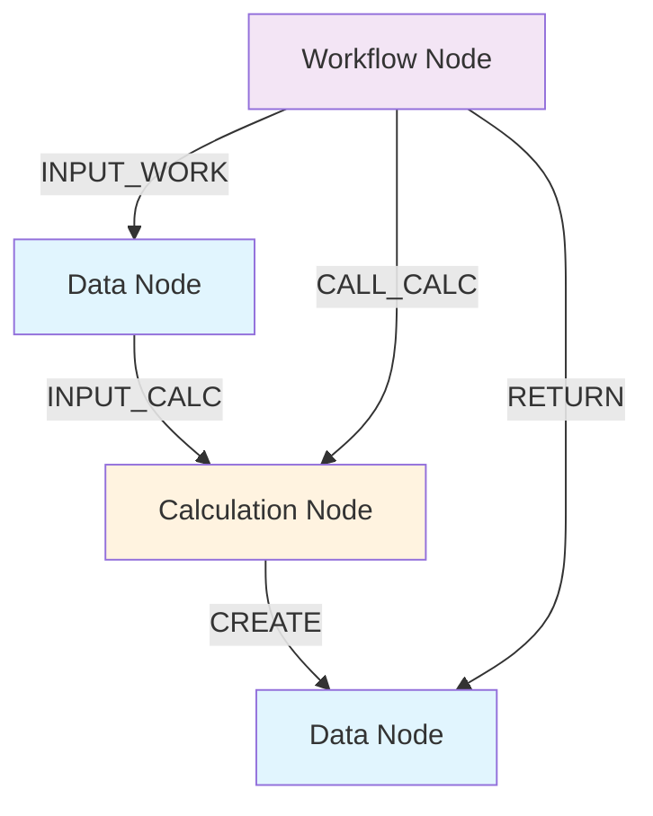
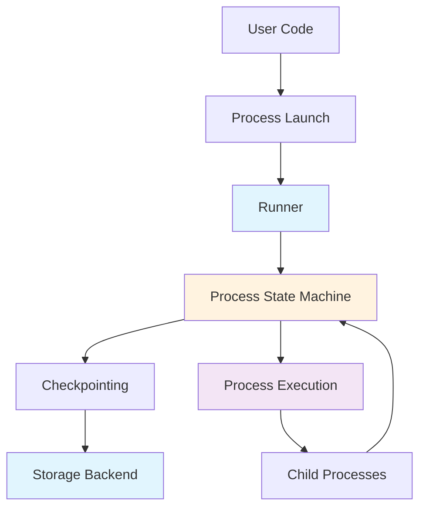

# AGENTS.md

This file provides guidance for AI coding agents working on the **AiiDA** repository.

## Project Overview

AiiDA is a workflow manager for computational science with a strong focus on provenance, performance, and extensibility. It enables researchers to:

- Write complex, auto-documenting workflows in Python
- Track data provenance automatically for full reproducibility
- Interface with HPC schedulers (SLURM, PBS Pro, torque, SGE, LSF)
- Extend functionality through a robust plugin system
- Export and share provenance graphs

**Key Characteristics:**
- Language: Python 3.9+
- License: MIT
- Primary Domains: Computational materials science, chemistry, physics
- Architecture: Event-based workflow engine with pluggable storage backends

## Core Concepts

### Provenance Model

The provenance graph consists of **nodes** and **links**:

- **Data Nodes**: Represent pieces of data (integers, floats, dictionaries, crystal structures, folders of files)
- **Process Nodes**: Represent operations on data
  - **Calculations**: Create new data (e.g., external simulation codes)
  - **Workflows**: Orchestrate other processes, cannot create new data, only return existing data

#### Link Types

| Link Type | Source → Target | Purpose |
|-----------|-----------------|---------|
| `input` | Data → Process | Process used this data as input |
| `create` | Calculation → Data | Calculation created this data |
| `return` | Workflow → Data | Workflow returned this data |
| `call` | Workflow → Process | Workflow called this process |

**Critical Rule:** Workflows cannot create data - they can only return data that already exists in the database. This separation is fundamental to AiiDA's provenance guarantees.

#### Data Provenance vs. Logical Provenance

- **Data Provenance**: Data + Calculation nodes connected by `input` and `create` links. Forms a **Directed Acyclic Graph (DAG)**. Records the complete history of data generation.
- **Logical Provenance**: Workflow + Data nodes connected by `input`, `return`, and `call` links. May contain cycles. Records the reasoning behind calculations.

### Workflow Types

1. **Work Functions** (`@workfunction`)
   - Simple Python functions transformed into processes
   - Ideal for non-computationally intensive orchestration
   - Can return existing data (including inputs)
   - Useful for filtering and selection operations

2. **Work Chains** (`WorkChain`)
   - Class-based workflows with explicit state management
   - Support complex logic, branching, and error handling
   - Can call sub-workflows and calculations
   - Provide step-by-step execution and restart capabilities

3. **Calculation Functions** (`@calcfunction`)
   - Create new data from inputs
   - Used for in-memory calculations that need provenance tracking
   - Cannot return existing data

4. **Calculation Jobs** (`CalcJob`)
   - Interface to external simulation codes
   - Run on local or remote computers via schedulers
   - Handle input file generation, job submission, and output parsing

### Plugin Architecture

AiiDA uses Python entry points for extensibility. Plugins are organized into groups:

```python
# Example entry point groups from pyproject.toml
'aiida.calculations'      # Calculation job implementations
'aiida.data'               # Custom data types
'aiida.parsers'            # Output parsers for calculations
'aiida.schedulers'         # Scheduler implementations
'aiida.transports'         # Transport protocols (SSH, local)
'aiida.storage'            # Storage backend implementations
'aiida.tools.calculations' # Tools for calculations
```

**Entry Point Naming Convention:** `aiida.<group>:<name>`

## Repository Structure

```
pyproject.toml          # Project configuration and dependencies
tox.ini                 # Tox test environment configuration

src/aiida/              # Main source code
├── __init__.py         # Package init with version and exports
├── engine/             # Workflow engine
│   ├── processes/       # Process implementations
│   │   ├── process.py  # Base Process class
│   │   ├── workchains/ # WorkChain implementation
│   │   ├── calcjobs/   # CalcJob implementation
│   │   └── functions.py # WorkFunction and CalcFunction decorators
│   ├── launch.py       # Process launching utilities
│   ├── runners.py      # Runner for process execution
│   └── daemon/        # Daemon components
├── orm/                # Object-relational mapping
│   ├── nodes/          # Node classes
│   │   ├── node.py     # Base Node class
│   │   ├── data/       # Data node types
│   │   └── process/   # Process node types
│   ├── querybuilder.py  # Query builder API
│   ├── computers.py     # Computer management
│   ├── users.py        # User management
│   └── groups.py       # Group management
├── storage/            # Storage backends
│   ├── psql_dos/       # PostgreSQL + Disk ObjectStore
│   ├── sqlite_dos/     # SQLite + Disk ObjectStore
│   ├── sqlite_zip/     # SQLite + ZIP archive
│   └── sqlite_temp/   # In-memory SQLite
├── plugins/            # Plugin loading system
│   ├── entry_point.py   # Entry point management
│   └── factories.py    # Factory functions
├── calculations/       # Built-in calculations
│   ├── arithmetic/     # Arithmetic calculations
│   └── templatereplacer/ # Template-based calculations
├── workflows/          # Built-in workflows
│   └── arithmetic/     # Arithmetic workflows
├── parsers/            # Built-in parsers
├── schedulers/         # Scheduler implementations
│   └── plugins/       # SLURM, PBS, torque, SGE, LSF
├── transports/         # Transport implementations
│   └── plugins/       # SSH, local
├── tools/              # Utility tools
├── cmdline/            # CLI commands
└── restapi/            # REST API

tests/                  # Test suite
├── conftest.py         # Shared pytest fixtures
├── engine/             # Workflow engine tests
├── orm/                # ORM tests
├── storage/            # Storage backend tests
├── calculations/       # Calculation tests
├── workflows/          # Workflow tests
└── tools/              # Tools tests

docs/                   # Documentation source
├── source/             # Sphinx documentation
│   ├── topics/         # In-depth topics
│   ├── howto/          # How-to guides
│   └── reference/      # API reference
```

## Development Commands

### Testing

```bash
# Run all tests
pytest

# Run a specific test file
pytest tests/engine/test_run.py

# Run a specific test function
pytest tests/engine/test_run.py::test_function_name

# Run with coverage
pytest --cov=aiida

# Run tests for specific storage backend
pytest --profile aiida_profile_sqlite_dos

# Run tests with specific markers
pytest -m "requires_rmq and not slow"
```

### Code Quality

```bash
# Linting with ruff
ruff check src/

# Auto-fix linting issues
ruff check --fix src/

# Format with ruff
ruff format src/

# Type checking with mypy
mypy src/

# Run pre-commit hooks
pre-commit run --all-files
```

### Documentation

```bash
# Build documentation
cd docs
make html

# Clean and rebuild
make clean && make html

# Build specific documentation
make latexpdf
```

### AiiDA CLI

```bash
# Start daemon
verdi daemon start

# Stop daemon
verdi daemon stop

# Check daemon status
verdi daemon status

# List processes
verdi process list

# View process details
verdi process show <PK>

# Kill a process
verdi process kill <PK>
```

## Code Style Guidelines

- **Formatter/Linter**: Ruff (configured in `pyproject.toml`)
- **Type Checking**: Mypy (configured in `pyproject.toml`)
- **Pre-commit**: Use pre-commit hooks for consistent code style
- **Docstrings**: Google-style docstrings with type hints in signatures

### Best Practices

- **Type annotations**: Use complete type annotations for all function signatures
- **Docstrings**: Use Google-style docstrings (`Args:`, `Returns:`, `Raises:`). Types are not required in docstrings as they should be in type hints.
- **Function signatures**: Use `/` and `*` to enforce positional-only and keyword-only arguments where appropriate
- **Error handling**: Use AiiDA's exception hierarchy from `aiida.common.exceptions`
- **Logging**: Use `aiida.common.log.AIIDA_LOGGER` for logging
- **Testing**: Write tests for all new functionality

### Docstring Example

```python
def validate_link(
    source: Node,
    target: Node,
    link_type: LinkType,
    link_label: str,
    backend: StorageBackend,
) -> None:
    """Validate a link between two nodes.

    Args:
        source: The source node.
        target: The target node.
        link_type: The type of link.
        link_label: The label for the link.
        backend: The storage backend.

    Raises:
        TypeError: If the link type is invalid.
        ValueError: If the link would violate provenance rules.
    """
    ...
```

## Testing Guidelines

### Test Structure

- Tests use `pytest` with fixtures from `tests/conftest.py`
- ORM tests are in `tests/orm/`
- Engine tests are in `tests/engine/`
- Storage tests are in `tests/storage/`

### Writing Tests

1. Use `aiida_profile_clean` fixture for isolated tests
2. Use `aiida_profile` fixture for tests with existing data
3. Write descriptive test names that describe what is being tested
4. Use `pytest.mark.parametrize` for multiple test scenarios

### Test Fixtures

```python
import pytest
from aiida import orm

@pytest.fixture
def sample_data(aiida_profile_clean):
    """Create sample data for testing."""
    return orm.Int(5)

def test_example(sample_data):
    """Test that sample data is correct."""
    assert sample_data.value == 5
```

### Test Best Practices

- **Test coverage**: Write tests for all new functionality and bug fixes
- **Isolation**: Each test should be independent and not rely on state from other tests
- **Descriptive names**: Test function names should describe what is being tested
- **Provenance verification**: Verify that correct links are created in tests
- **Process lifecycle**: Test normal execution, error handling, pausing, and killing

## Architecture Overview

### Provenance Graph Flow



### Workflow Engine Flow



### Key Components

#### Process ([`src/aiida/engine/processes/process.py`](src/aiida/engine/processes/process.py:72))

Base class for all processes. Inherits from `PlumpyProcess` and implements:
- Process state management
- Checkpointing and persistence
- Input/output validation
- Link creation

#### WorkChain ([`src/aiida/engine/processes/workchains/workchain.py`](src/aiida/engine/processes/workchains/workchain.py:100))

Class-based workflow with:
- Step-by-step execution
- Stepper pattern for control flow
- Restart capabilities
- Error handling with exit codes

#### CalcJob ([`src/aiida/engine/processes/calcjobs/calcjob.py`](src/aiida/engine/processes/calcjobs/calcjob.py:1))

External code calculation with:
- Input file generation
- Job submission to schedulers
- Output parsing
- File transfer via transports

#### Node ([`src/aiida/orm/nodes/node.py`](src/aiida/orm/nodes/node.py:1))

Base class for all nodes with:
- Attribute storage (immutable)
- Extra storage (mutable)
- Repository for files
- Link management

#### QueryBuilder ([`src/aiida/orm/querybuilder.py`](src/aiida/orm/querybuilder.py:1))

Fluent API for querying:
- Provenance graph queries
- Joins and filters
- Projections
- Batch processing

## Common Patterns

### Creating a WorkFunction

```python
from aiida import orm
from aiida.engine import workfunction

@workfunction
def add_numbers(a: orm.Int, b: orm.Int) -> orm.Int:
    """Add two numbers."""
    return orm.Int(a.value + b.value)

# Usage
result = add_numbers(orm.Int(1), orm.Int(2))
```

### Creating a WorkChain

```python
from aiida.engine import WorkChain, calcfunction
from aiida import orm

class AddMultiplyWorkChain(WorkChain):
    """WorkChain to add and multiply numbers."""

    @classmethod
    def define(cls, spec):
        super().define(spec)
        spec.input('x', valid_type=orm.Int)
        spec.input('y', valid_type=orm.Int)
        spec.output('result', valid_type=orm.Int)

    def run(self):
        result = self.add(self.inputs.x, self.inputs.y)
        self.out('result', result)

    @calcfunction
    def add(self, a, b):
        return orm.Int(a.value + b.value)
```

### Creating a CalcJob

```python
from aiida.engine import CalcJob
from aiida.orm import Dict

class MyCalculation(CalcJob):
    """Custom calculation job."""

    @classmethod
    def define(cls, spec):
        super().define(spec)
        spec.input('parameters', valid_type=Dict)
        spec.input('code', valid_type=orm.Code)
        spec.output('output_parameters', valid_type=Dict)

    def prepare_for_submission(self, folder):
        # Write input files
        with open(folder.get_abs_path('input.txt'), 'w') as f:
            f.write('input data')

        # Create submit script
        submit_script = self._get_submit_script()
        with open(folder.get_abs_path('_aiidasubmit.sh'), 'w') as f:
            f.write(submit_script)
```

### Creating a Data Type

```python
from aiida.orm import Data

class MyData(Data):
    """Custom data type."""

    def __init__(self, value=None, **kwargs):
        super().__init__(**kwargs)
        if value is not None:
            self.value = value

    @property
    def value(self):
        return self.base.attributes.get('value')

    @value.setter
    def value(self, value):
        self.base.attributes.set('value', value)
```

### Querying the Provenance Graph

```python
from aiida.orm import QueryBuilder, Node, WorkChainNode

# Find all calculations that used a specific data node
qb = QueryBuilder()
qb.append(Node, filters={'id': data_node.pk}, tag='data')
qb.append(WorkChainNode, with_incoming='data', tag='workchain')
results = qb.all()

# Find all data created by a specific calculation
qb = QueryBuilder()
qb.append(WorkChainNode, filters={'id': workchain.pk}, tag='workchain')
qb.append(Node, with_incoming='workchain', tag='data')
results = qb.all()
```

## Anti-Patterns to Avoid

### Provenance Violations

❌ **Don't:** Make a workflow create data
```python
@workfunction
def bad_workflow():
    # This will fail - workflows cannot create data
    return orm.Int(5)
```

✅ **Do:** Return existing data or use a calcfunction
```python
@calcfunction
def create_data():
    # This is correct - calcfunctions can create data
    return orm.Int(5)

@workfunction
def good_workflow():
    # Workflows can return data created by calculations
    return create_data()
```

### Direct Database Access

❌ **Don't:** Query the database directly
```python
# Bad: Direct SQL access
cursor.execute("SELECT * FROM db_dbnode")
```

✅ **Do:** Use the ORM or Query Builder
```python
# Good: Use Query Builder
from aiida.orm import QueryBuilder
qb = QueryBuilder()
qb.append(Node)
nodes = qb.all()
```

### Blocking Operations in Workflows

❌ **Don't:** Block the workflow engine
```python
@workfunction
def blocking_workflow():
    # Bad: Blocks the engine
    import time
    time.sleep(3600)
```

✅ **Do:** Use async patterns or calcjobs
```python
# Good: Use a CalcJob for long-running operations
class LongRunningCalcJob(CalcJob):
    # This runs in the background
    pass
```

### Ignoring Entry Points

❌ **Don't:** Hardcode plugin references
```python
# Bad: Hardcoded import
from my_plugin import MyPlugin
```

✅ **Do:** Use entry points
```python
# Good: Load via entry point
from aiida.plugins import CalculationFactory
MyPlugin = CalculationFactory('my_plugin')
```

## Key Files

- `src/aiida/__init__.py` - Package init with version and exports
- `src/aiida/engine/processes/process.py` - Base Process class
- `src/aiida/engine/processes/workchains/workchain.py` - WorkChain implementation
- `src/aiida/engine/processes/calcjobs/calcjob.py` - CalcJob implementation
- `src/aiida/engine/processes/functions.py` - WorkFunction and CalcFunction decorators
- `src/aiida/orm/nodes/node.py` - Base Node class
- `src/aiida/orm/querybuilder.py` - QueryBuilder API
- `src/aiida/plugins/entry_point.py` - Entry point management
- `src/aiida/plugins/factories.py` - Factory functions
- `src/aiida/storage/psql_dos/backend.py` - PostgreSQL storage backend
- `src/aiida/common/links.py` - Link types and validation
- `tests/conftest.py` - Shared pytest fixtures

## Debugging

- Use `verdi process show <PK>` to view process details
- Use `verdi process report <PK>` to view process report
- Use `verdi daemon log` to view daemon logs
- Set `AIIDA_PROFILE` environment variable to specify profile
- Use `pytest -v --tb=long` for verbose test output with full tracebacks
- Use `verdi devel check-timezone` to check timezone configuration

## Reference Documentation

- [AiiDA Documentation](https://aiida-core.readthedocs.io/)
- [AiiDA Discourse](https://aiida.discourse.group/)
- [AiiDA GitHub](https://github.com/aiidateam/aiida-core)
- [Plumpy Documentation](https://plumpy.readthedocs.io/)
- [KiwiPy Documentation](https://kiwipy.readthedocs.io/)
