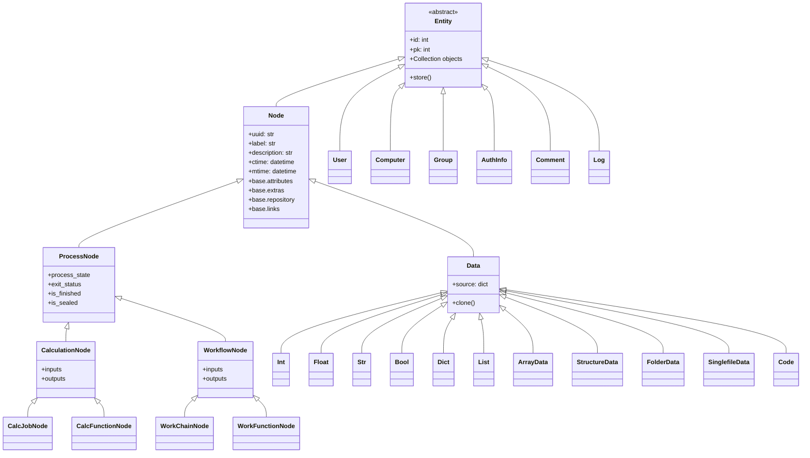
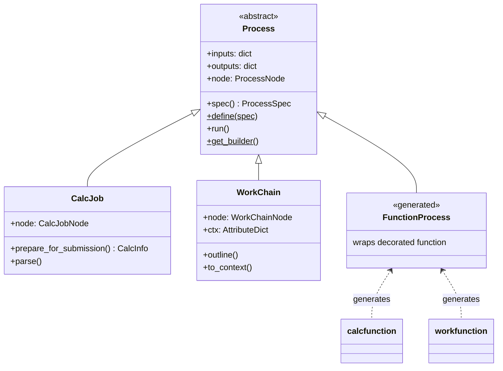
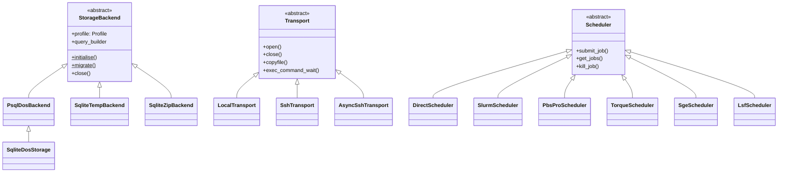

# AGENTS.md - AI Coding Assistant Guide for AiiDA Core

This file provides context for AI coding assistants (Claude Code, GitHub Copilot, etc.) working on the `aiida-core` codebase.

## Project overview

AiiDA is a workflow manager for computational science with a strong focus on provenance, performance, and extensibility.
It is written in Python (3.9–3.13) and uses PostgreSQL/SQLite as a database, a `disk-objectstore` (content-addressed storage, CAS) for file storage and RabbitMQ as a message broker.

- **Repository:** https://github.com/aiidateam/aiida-core
- **Documentation:** https://aiida.readthedocs.io/projects/aiida-core/en/stable/
- **License:** MIT
- **Build system:** Flit (`flit_core.buildapi`)

## Architecture

### Source layout

The source code lives under `src/aiida/` with these main packages:

| Package | Purpose |
|---------|---------|
| `brokers/` | Message broker interface (RabbitMQ via `kiwipy`) |
| `calculations/` | Built-in calculations |
| `cmdline/` | CLI (`verdi` command) built with `click` |
| `common/` | Shared utilities, exceptions, warnings, constants |
| `engine/` | Workflow engine: process runner, daemon, persistence, transport tasks (with `plumpy` dependency) |
| `manage/` | Configuration management, manager singleton |
| `orm/` | Object-relational mapping: nodes, groups, users, computers, querybuilder |
| `parsers/` | Built-in parser plugins |
| `plugins/` | Plugin entry point system |
| `repository/` | File repository abstraction layer |
| `restapi/` | Flask-based REST API (soon to be replaced by `aiida-restapi`) |
| `schedulers/` | Built-in HPC scheduler plugins (SLURM, PBS, SGE, LSF, etc.) |
| `storage/` | Storage backends (primarily `psql_dos` (`sqlite_dos`) for PostgreSQL (SQLite) + disk-objectstore) |
| `tools/` | Utility tools (graph visualization, archive operations, data dumping, etc.) |
| `transports/` | Built-in Transport plugins (SSH, local) |
| `workflows/` | Built-in workflows |

### Key design concepts

- **Provenance graph:** all data and computations are tracked as nodes in a directed acyclic graph (DAG). Nodes are immutable once stored.
- **Process/Node duality:** processes (`CalcJob`, `WorkChain`, `calcfunction`, `workfunction`) define *how* to run; process nodes record *that* something ran.
- **Plugin system:** entry points (`pyproject.toml` `[project.entry-points]`) allow extending AiiDA with new calculation types, data types, schedulers, transports, and storage backends.
- **Public API:** anything importable from a second-level package (e.g., `from aiida.orm import ...`, `from aiida.engine import ...`) is considered public API with deprecation guarantees.
- **Data compatibility:** data created with older AiiDA versions is guaranteed to work with newer versions. Database migrations are applied automatically when needed.

### Database

- **ORM:** SQLAlchemy
- **Migrations:** Alembic (under `src/aiida/storage/psql_dos/migrations/`)
- **High-performance storage backend:** `psql_dos` (PostgreSQL + disk-objectstore)
- **Lightweight storage backend:** `sqlite_dos` (SQLite + disk-objectstore)

### Abstract base classes (ABCs)

AiiDA defines ABCs for extensible components. To create a plugin, implement the corresponding ABC and register it as an entry point.

**Plugin extension points:**

| ABC | Location | Purpose | Entry point |
|-----|----------|---------|-------------|
| `Transport` | `aiida.transports.transport` | File transfer and remote command execution | `aiida.transports` |
| `Scheduler` | `aiida.schedulers.scheduler` | HPC job scheduler interface | `aiida.schedulers` |
| `Parser` | `aiida.parsers.parser` | Parse calculation outputs | `aiida.parsers` |
| `StorageBackend` | `aiida.orm.implementation.storage_backend` | Database and file storage | `aiida.storage` |
| `AbstractCode` | `aiida.orm.nodes.data.code.abstract` | Code/executable representation | `aiida.data` |
| `CalcJobImporter` | `aiida.engine.processes.calcjobs.importer` | Import existing calculation results | `aiida.calculations.importers` |

**Internal ABCs (infrastructure):**

| ABC | Location | Purpose |
|-----|----------|---------|
| `Entity` | `aiida.orm.entities` | Base for all ORM entities |
| `Collection` | `aiida.orm.entities` | Entity collection interface |
| `BackendEntity` | `aiida.orm.implementation.entities` | Backend entity implementation |
| `BackendQueryBuilder` | `aiida.orm.implementation.querybuilder` | Query builder backend |
| `AbstractRepositoryBackend` | `aiida.repository.backend.abstract` | File repository storage |
| `ArchiveFormatAbstract` | `aiida.tools.archive.abstract` | Archive format handler |

### Class hierarchies

#### ORM: Entity and Node hierarchy

All persistent objects inherit from `Entity`. Nodes form the provenance graph.



#### Engine: Process hierarchy

Processes define *how* computations run. They create corresponding process nodes.



#### Process / Node duality

Each process class has a corresponding node class that records its execution:

| Process class | Node class | Link types |
|--------------|------------|------------|
| `CalcJob` | `CalcJobNode` | INPUT_CALC → CREATE |
| `WorkChain` | `WorkChainNode` | INPUT_WORK → RETURN/CALL |
| `@calcfunction` | `CalcFunctionNode` | INPUT_CALC → CREATE |
| `@workfunction` | `WorkFunctionNode` | INPUT_WORK → RETURN/CALL |

#### Storage, Transport, and Scheduler



## Development conventions

### Code style

- PEP 8 with Sphinx-style (reST) docstrings
- Pre-commit hooks enforce:
  - `ruff` for linting and formatting
  - `mypy` for type checking
  - `uv-lock` for lockfile validation
  - Various other checks (YAML, merge conflicts, imports)
- Use f-strings (not `.format()` or `%`)
- Use `pathlib` (not `os.path`)
- Add type hints to new code
- In `cmdline/`: delay `aiida` imports to function level (keeps `verdi` CLI responsive)

### Testing

- Framework: `pytest`
- Install and run: `uv sync && uv run pytest`
- Quick subset (no PostgreSQL/RabbitMQ): `uv run pytest -m presto`
- Parallel execution: `uv run pytest -n auto` (via `pytest-xdist` plugin)
- Tests in `tests/` mirror the source structure
- Use `AIIDA_TEST_PROFILE=<profile>` to run against a specific test profile
- Test markers:
  - `presto` - fast tests without external services
  - `requires_rmq` - requires RabbitMQ
  - `requires_psql` - requires PostgreSQL
  - `nightly` - long-running tests (CI only)
- Transport tests require passwordless SSH to localhost
- Many reusable fixtures are available in `tests/conftest.py`

Test philosophy:
- **Prefer real objects over mocks**: Use fixtures to create real nodes, processes, etc. Mocks should only be used for truly external dependencies (e.g., network calls, SSH connections).
- **Don't chase coverage with shallow tests**: A test that mocks everything tests nothing. Tests should exercise actual behavior.
- **Test the contract, not the implementation**: Don't assert internal method calls; assert observable outcomes.

Test types:
| Type | Location | Description |
|------|----------|-------------|
| Unit/Integration | `tests/` | Main test suite, runs on every PR |
| Benchmark | `tests/benchmark/` | Performance tests, runs on `main`, results tracked via `gh-pages` |
| System | `.github/system_tests/` | Infrastructure tests (daemon, remote) |

### Branching and versioning

- All development happens on `main` through pull requests
- Branch naming recommendations: `<prefix>/<issue>/<short_description>`
  - Prefixes: `feature/`, `fix/`, `docs/`, `ci/`, `refactor/`
  - Example: `fix/1234/querybuilder_improvements`
- The `main` branch uses a `.post0` version suffix to indicate development after the last release (e.g., `2.6.0.post0` = development after `2.6.0`)
- Versioning follows [SemVer](https://semver.org/) (major.minor.patch)

### Commit style

Follow the **50/72 rule** (not strictly enforced):
- Subject line: max 50 characters, imperative mood, capitalized, no period
- Body: wrap at 72 characters, explain *what* and *why*
- Merged PRs (via squash) append the PR number: `Fix bug in QueryBuilder (#1234)`

```
Short summary in imperative mood (50 chars)

More detailed explanation wrapped at 72 characters. Focus on
why the change was made, not how (the code shows that).
```

Guidelines:
- One issue per commit, self-contained changes
- Emojis are welcome (e.g., `🐛 Fix...`, `✨ Add...`, `📚 Docs:...`)
- Link GitHub issues via PR description (use GitHub web UI for proper linking, not commit messages)

### Best practices

- **Type annotations**: Add type hints to all new function signatures
- **Docstrings**: Use Sphinx-style docstrings (`:param:`, `:return:`, `:raises:`). Types are not required in docstrings as they should be in type hints.
- **Pure functions**: Where possible, write pure functions without side effects
- **Error handling**: Use `aiida.common.exceptions` for AiiDA-specific exceptions. Use `aiida.common.warnings` for warnings.
- **Testing**: Write tests for all new functionality. Tests should mirror the source structure.

### Deprecations

When deprecating Python API:

```python
import warnings
from aiida.common.warnings import AiidaDeprecationWarning

warnings.warn('Use new_function() instead', AiidaDeprecationWarning)
```

For CLI commands, use `@decorators.deprecated_command()` from `aiida.cmdline.utils.decorators`.

Add `.. deprecated:: vX.Y.Z` notes in docstrings with replacement guidance.

### Docstring example

```python
def get_node_by_label(
    label: str,
    *,
    node_type: type[Node] | None = None,
) -> Node:
    """Retrieve a node by its label.

    :param label: The label of the node to retrieve.
    :param node_type: Optional node type to filter by.
    :return: The node with the given label.
    :raises NotExistent: If no node with the given label exists.
    :raises MultipleObjectsError: If multiple nodes with the given label exist.
    """
    ...
```

### Development commands

```bash
# Install development dependencies (uses uv.lock)
uv sync

# Run all tests
uv run pytest

# Run quick tests only (no RabbitMQ/PostgreSQL required)
uv run pytest -m presto

# Run tests for a specific module
uv run pytest tests/orm/

# Run a specific test
uv run pytest tests/orm/test_nodes.py::test_node_label

# Run with coverage
uv run pytest --cov aiida

# Run tests in parallel
uv run pytest -n auto

# Pre-commit: staged files only
uv run pre-commit run

# Pre-commit: run specific hook (e.g., mypy, ruff)
uv run pre-commit run mypy
uv run pre-commit run ruff

# Pre-commit: all changes since branching off main
uv run pre-commit run --from-ref main --to-ref HEAD

# Pre-commit: all files (rarely needed)
uv run pre-commit run --all-files

# Build documentation
uv run sphinx-build -b html docs/source docs/build/html
```

### Pull request requirements

When submitting changes:

1. **Description**: Include a meaningful description explaining the change and link to related issues
2. **Tests**: Include test cases for new functionality or bug fixes
3. **Documentation**: Update docs if behavior changes or new features are added
4. **Code quality**: Ensure `uv run pre-commit` passes

PR etiquette:
- Open PR only when ready for review (each push triggers CI)
- Aim for reasonable number of LOC changed per PR for effective review

Merging (maintainers):
- **Squash and merge**: Single-issue PRs → one clean commit
- **Rebase and merge**: Multi-commit PRs with individually significant commits

## Project configuration

- `pyproject.toml` - Project configuration, dependencies, and entry points
- `uv.lock` - Locked dependencies (managed by `uv`)
- `.pre-commit-config.yaml` - Pre-commit hooks configuration
- `.readthedocs.yml` - Documentation build configuration
- `.github/workflows/` - CI workflow definitions
- `.docker/` - Docker and Docker Compose configurations

## Useful `verdi` commands

```bash
# Interactive shell with AiiDA environment
verdi shell

# Service management
verdi status                    # Check status of services (daemon, PostgreSQL, RabbitMQ)
verdi daemon start/stop/restart # Manage the daemon
verdi daemon logshow            # Tail daemon logs in real-time

# Process inspection
verdi process list              # List running/recent processes
verdi process show <PK>         # Show process details
verdi process status <PK>       # Show process status
verdi process report <PK>       # Show process logs

# Process management
verdi process pause/play <PK>   # Pause/resume processes
verdi process kill <PK>         # Kill running processes
verdi process repair            # Fix stuck processes (e.g., after daemon crash)

# Node inspection
verdi node show <PK>            # Inspect node attributes and extras
verdi node graph generate <PK>  # Generate provenance graph

# Development/debugging
verdi devel run-sql "<SQL>"       # Run raw SQL queries
verdi devel launch-add            # Launch test ArithmeticAddCalculation
verdi devel launch-multiply-add   # Launch test MultiplyAddWorkChain
verdi devel check-load-time       # Check for import slowdowns
```

Set `AIIDA_WARN_v3=1` to surface deprecation warnings.

## Common patterns

> **Note:** New data types, calculations, parsers, and other plugins are typically developed in **external plugin packages** rather than in `aiida-core` itself. Use the [aiida-plugin-cutter](https://github.com/aiidateam/aiida-plugin-cutter) cookiecutter template to quickly scaffold a new plugin package with best practices, testing setup, and CI configuration. The patterns below apply to both external plugins and core contributions.

### Adding a new Node type

1. Create a new class inheriting from appropriate base (e.g., `Data`, `ArrayData`)
2. Register as entry point in `pyproject.toml` under `[project.entry-points."aiida.data"]`
3. Add tests
4. Document

### Adding a new CalcJob plugin

1. Create class inheriting from `CalcJob`
2. Implement `define()` method with inputs/outputs spec
3. Implement `prepare_for_submission()` method
4. Register as entry point under `[project.entry-points."aiida.calculations"]`
5. Add corresponding parser if needed
6. Add tests and documentation

### Adding a CLI command (aiida-core only)

1. Create command in `src/aiida/cmdline/commands/`
2. Use Click decorators and AiiDA's custom decorators from `aiida.cmdline.utils.decorators`
3. Register in the appropriate command group
4. Add tests in `tests/cmdline/commands/`

## AI assistant guidelines

When working on this codebase:

- **Read before writing**: Always read existing code and understand patterns before proposing changes. Don't guess how AiiDA works.
- **Match existing style**: Follow patterns you see in surrounding code, even if you'd do it differently.
- **Don't modify code you weren't asked to change**: If fixing a bug in function A, don't also "improve" functions B and C nearby.
- **Don't add docstrings/type hints to unchanged code**: Only add to code you're actively modifying.

### AiiDA-specific gotchas

- **Node immutability**: Once a node is stored (`node.store()`), its attributes cannot be changed. Only extras can be modified post-storage.
- **CREATE vs RETURN links**: Calculations *create* new data nodes; workflows *return* existing data nodes. Workflows orchestrate but don't create data themselves.
- **Don't break provenance**: Never circumvent the link system or modify stored nodes in ways that would break the directed acyclic graph.

## Reference documentation

- [AiiDA Documentation](https://aiida.readthedocs.io/projects/aiida-core/)
- [AiiDA Plugin Registry](https://aiidateam.github.io/aiida-registry/)
- [Plumpy Documentation](https://plumpy.readthedocs.io/)
- [Kiwipy Documentation](https://kiwipy.readthedocs.io/)
- [disk-objectstore Documentation](https://disk-objectstore.readthedocs.io/)
