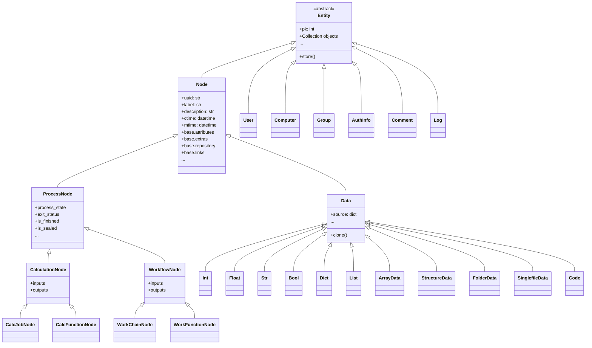
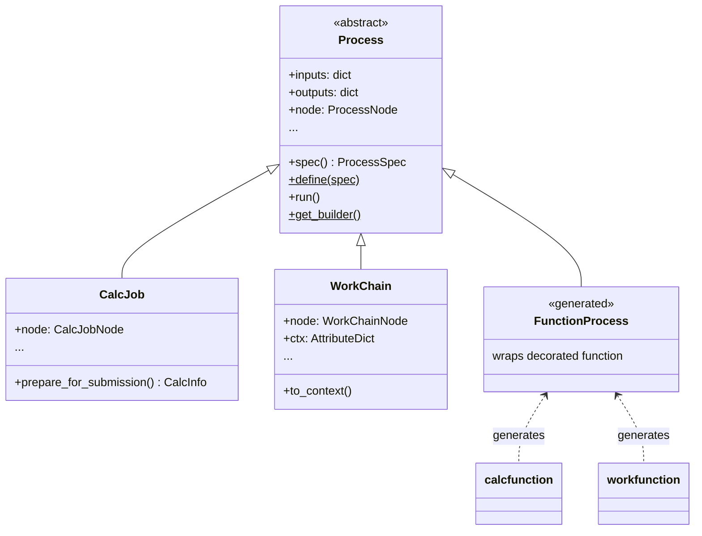
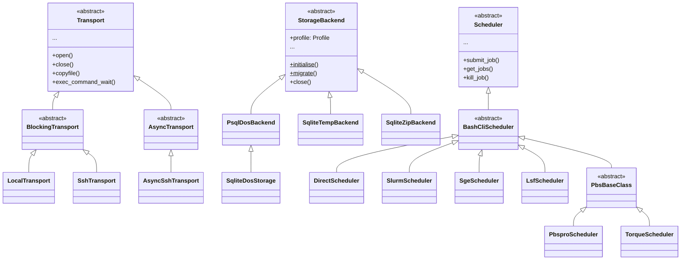

# AGENTS.md - AI Coding Assistant Guide for AiiDA Core

This file provides context for AI coding assistants (Claude Code, GitHub Copilot, etc.) working on the `aiida-core` codebase.

## Project overview

AiiDA is a workflow manager for computational science with a strong focus on provenance, performance, and extensibility.
It is written in Python (3.9–3.14) and uses PostgreSQL/SQLite for metadata storage, [`disk-objectstore`](https://github.com/aiidateam/disk-objectstore) for file storage, and RabbitMQ as a message broker.

- **Repository:** https://github.com/aiidateam/aiida-core
- **Documentation:** https://aiida.readthedocs.io/projects/aiida-core/en/stable/
- **License:** MIT
- **Build system:** Flit (`flit_core.buildapi`)

## Architecture

### Source layout

The source code lives under `src/aiida/` with these main packages:

| Package | Purpose |
|---------|---------|
| `brokers/` | Message broker interface (RabbitMQ via [`kiwipy`](https://github.com/aiidateam/kiwipy)) |
| `calculations/` | Built-in calculations |
| `cmdline/` | CLI (`verdi` command) built with `click` |
| `common/` | Shared utilities, exceptions, warnings, constants |
| `engine/` | Workflow engine: process runner, daemon, persistence, transport tasks (with [`plumpy`](https://github.com/aiidateam/plumpy) dependency) |
| `manage/` | Configuration management, manager singleton |
| `orm/` | Object-relational mapping: nodes, groups, users, computers, querybuilder |
| `parsers/` | Built-in parser plugins |
| `plugins/` | Plugin entry point system |
| `repository/` | File repository abstraction layer |
| `restapi/` | Flask-based REST API (soon to be replaced by `aiida-restapi`) |
| `schedulers/` | Built-in HPC scheduler plugins (SLURM, PBS, SGE, LSF, etc.) |
| `storage/` | Storage backends (primarily `psql_dos` (`sqlite_dos`) for PostgreSQL (SQLite) + disk-objectstore) |
| `tools/` | Utility tools (graph visualization, archive operations, data dumping, etc.) |
| `transports/` | Built-in Transport plugins (SSH, local) |
| `workflows/` | Built-in workflows |

### Key entry points

When navigating the codebase, these are the most important files to navigate:

| Area | Key file(s) | Purpose |
|------|------------|---------|
| Broker ABC | `src/aiida/brokers/broker.py` | `Broker`—message broker interface |
| CalcJob | `src/aiida/engine/processes/calcjobs/calcjob.py` | `CalcJob` implementation |
| CalcJob file ops | `src/aiida/engine/daemon/execmanager.py` | File copying, job submission, retrieval implementation |
| CalcJob lifecycle | `src/aiida/engine/processes/calcjobs/tasks.py` | Upload, submit, retrieve, stash, kill tasks |
| CLI entry point | `src/aiida/cmdline/groups/verdi.py` | `VerdiCommandGroup`—top-level `verdi` command group |
| Computer | `src/aiida/orm/computers.py` | `Computer` entity (represents a computational resource) |
| Configuration | `src/aiida/manage/configuration/config.py` | `Config`—global AiiDA configuration |
| Daemon | `src/aiida/engine/daemon/client.py` | `DaemonClient`—daemon communication |
| Engine core | `src/aiida/engine/processes/process.py` | Base `Process` class |
| Manager | `src/aiida/manage/manager.py` | Global singleton managing profiles, backends, runners |
| ORM entities | `src/aiida/orm/entities.py` | Base `Entity` and `Collection` classes |
| ORM node | `src/aiida/orm/nodes/node.py` | Base `Node` class, all nodes inherit from this |
| Plugin entry points | `src/aiida/plugins/entry_point.py` | Entry point loading and discovery |
| Plugin factories | `src/aiida/plugins/factories.py` | `DataFactory`, `CalculationFactory`, etc. |
| Process builder | `src/aiida/engine/processes/builder.py` | `ProcessBuilder` used to construct process inputs |
| Process runner | `src/aiida/engine/runners.py` | `Runner` executes and submits processes |
| Profile | `src/aiida/manage/configuration/profile.py` | `Profile`—configuration for a single profile |
| psql_dos backend | `src/aiida/storage/psql_dos/backend.py` | PostgreSQL + disk-objectstore implementation |
| QueryBuilder | `src/aiida/orm/querybuilder.py` | Query interface for the provenance graph |
| RabbitMQ broker | `src/aiida/brokers/rabbitmq/broker.py` | `RabbitmqBroker` implementation |
| Repository | `src/aiida/repository/repository.py` | `Repository`—file storage interface per node |
| Repository backend | `src/aiida/repository/backend/abstract.py` | `AbstractRepositoryBackend` ABC |
| Scheduler ABC | `src/aiida/schedulers/scheduler.py` | `Scheduler` base class |
| Scheduler data | `src/aiida/schedulers/datastructures.py` | `JobTemplate`, `JobInfo`, `JobResource` |
| Storage ABC | `src/aiida/orm/implementation/storage_backend.py` | `StorageBackend` abstract base class |
| Transport ABC | `src/aiida/transports/transport.py` | `Transport`, `BlockingTransport`, `AsyncTransport` |
| WorkChain | `src/aiida/engine/processes/workchains/workchain.py` | `WorkChain` implementation |

### Key design concepts

- **Provenance:** all data and computations are tracked as nodes in a directed acyclic graph (DAG).
  Nodes are immutable once stored.
- **Process/Node duality:** processes (`CalcJob`, `WorkChain`, `calcfunction`, `workfunction`) define *how* to run; process nodes record *that* something ran.
- **Plugin system:** entry points (`pyproject.toml` `[project.entry-points]`) allow extending AiiDA with new calculation types, data types, schedulers, transports, and storage backends.
- **Public API:** anything importable from a second-level package (e.g., `from aiida.orm import ...`, `from aiida.engine import ...`) is considered public API with deprecation guarantees.
  In practice, what constitutes "public API" is not strictly enforced and depends on the user type: workflow users interact mainly with the CLI and high-level ORM, workflow developers use the engine and process APIs, and plugin developers rely on ABCs and entry point interfaces.
  Deeper internal modules may change without deprecation notices.
- **Data compatibility:** data created with older AiiDA versions is guaranteed to work with newer versions.
  Database migrations are applied automatically when needed.

### Database and file storage

- **ORM:** SQLAlchemy (for node metadata, attributes, links, etc.)
- **File storage:** disk-objectstore (for file contents associated with nodes)
- **Migrations:** Alembic (under `src/aiida/storage/psql_dos/migrations/`)
- **High-performance storage backend:** `psql_dos` (PostgreSQL + disk-objectstore)
- **Lightweight storage backend:** `sqlite_dos` (SQLite + disk-objectstore)

### Abstract base classes (ABCs)

AiiDA defines ABCs for extensible components.
To create a plugin, implement the corresponding ABC and register it as an entry point.

**Plugin extension points:**

| ABC | Location | Purpose | Entry point |
|-----|----------|---------|-------------|
| `Transport` | `aiida.transports.transport` | File transfer and remote command execution | `aiida.transports` |
| `Scheduler` | `aiida.schedulers.scheduler` | HPC job scheduler interface | `aiida.schedulers` |
| `Parser` | `aiida.parsers.parser` | Parse calculation outputs | `aiida.parsers` |
| `StorageBackend` | `aiida.orm.implementation.storage_backend` | Database and file storage | `aiida.storage` |
| `AbstractCode` | `aiida.orm.nodes.data.code.abstract` | Code/executable representation | `aiida.data` |
| `CalcJobImporter` | `aiida.engine.processes.calcjobs.importer` | Import existing calculation results | `aiida.calculations.importers` |

**Internal ABCs (infrastructure):**

| ABC | Location | Purpose |
|-----|----------|---------|
| `Entity` | `aiida.orm.entities` | Base for all ORM entities |
| `Collection` | `aiida.orm.entities` | Entity collection interface |
| `BackendEntity` | `aiida.orm.implementation.entities` | Backend entity implementation |
| `BackendQueryBuilder` | `aiida.orm.implementation.querybuilder` | Query builder backend |
| `AbstractRepositoryBackend` | `aiida.repository.backend.abstract` | File repository storage |
| `ArchiveFormatAbstract` | `aiida.tools.archive.abstract` | Archive format handler |

### Class hierarchies

#### ORM: Entity and Node hierarchy

All persistent objects inherit from `Entity`.
Nodes form the provenance graph.


```mermaid
classDiagram
    class Entity {
        <<abstract>>
        +pk: int
        +store()
        +Collection objects
        ...
    }

    class Node {
        +uuid: str
        +label: str
        +description: str
        +ctime: datetime
        +mtime: datetime
        +base.attributes
        +base.extras
        +base.repository
        +base.links
        ...
    }

    class Data {
        +source: dict
        +clone()
        ...
    }

    class ProcessNode {
        +process_state
        +exit_status
        +is_finished
        +is_sealed
        ...
    }

    class CalculationNode {
        +inputs
        +outputs
    }

    class WorkflowNode {
        +inputs
        +outputs
    }

    Entity <|-- User
    Entity <|-- Computer
    Entity <|-- Group
    Entity <|-- AuthInfo
    Entity <|-- Comment
    Entity <|-- Log
    Entity <|-- Node

    Node <|-- Data
    Node <|-- ProcessNode

    Data <|-- Int
    Data <|-- Float
    Data <|-- Str
    Data <|-- Bool
    Data <|-- Dict
    Data <|-- List
    Data <|-- ArrayData
    Data <|-- StructureData
    Data <|-- FolderData
    Data <|-- SinglefileData
    Data <|-- Code

    ProcessNode <|-- CalculationNode
    ProcessNode <|-- WorkflowNode

    CalculationNode <|-- CalcJobNode
    CalculationNode <|-- CalcFunctionNode

    WorkflowNode <|-- WorkChainNode
    WorkflowNode <|-- WorkFunctionNode
```

#### Engine: Process hierarchy

Processes define *how* computations run.
They create corresponding process nodes.


```mermaid
classDiagram
    class Process {
        <<abstract>>
        +spec() ProcessSpec
        +define(spec)$
        +inputs: dict
        +outputs: dict
        +node: ProcessNode
        +run()
        +get_builder()$
        ...
    }

    class CalcJob {
        +node: CalcJobNode
        +prepare_for_submission() CalcInfo
        ...
    }

    class WorkChain {
        +node: WorkChainNode
        +ctx: AttributeDict
        +to_context()
        ...
    }

    class FunctionProcess {
        <<generated>>
        wraps decorated function
    }

    Process <|-- CalcJob
    Process <|-- WorkChain
    Process <|-- FunctionProcess

    FunctionProcess <.. calcfunction : generates
    FunctionProcess <.. workfunction : generates
```

#### Process / Node duality

Each process class has a corresponding node class that records its execution:

| Process class | Node class | Link types |
|--------------|------------|------------|
| `CalcJob` | `CalcJobNode` | INPUT_CALC → CREATE |
| `WorkChain` | `WorkChainNode` | INPUT_WORK → RETURN/CALL |
| `@calcfunction` | `CalcFunctionNode` | INPUT_CALC → CREATE |
| `@workfunction` | `WorkFunctionNode` | INPUT_WORK → RETURN/CALL |

#### Storage, Transport, and Scheduler


```mermaid
classDiagram
    class StorageBackend {
        <<abstract>>
        +profile: Profile
        +initialise()$
        +migrate()$
        +close()
        ...
    }

    class Transport {
        <<abstract>>
        +open()
        +close()
        +copyfile()
        +exec_command_wait()
        ...
    }

    class BlockingTransport {
        <<abstract>>
    }

    class AsyncTransport {
        <<abstract>>
    }

    class Scheduler {
        <<abstract>>
        +submit_job()
        +get_jobs()
        +kill_job()
        ...
    }

    class BashCliScheduler {
        <<abstract>>
    }

    class PbsBaseClass {
        <<abstract>>
    }

    StorageBackend <|-- PsqlDosBackend
    PsqlDosBackend <|-- SqliteDosStorage
    StorageBackend <|-- SqliteTempBackend
    StorageBackend <|-- SqliteZipBackend

    Transport <|-- BlockingTransport
    Transport <|-- AsyncTransport
    BlockingTransport <|-- LocalTransport
    BlockingTransport <|-- SshTransport
    AsyncTransport <|-- AsyncSshTransport

    Scheduler <|-- BashCliScheduler
    BashCliScheduler <|-- DirectScheduler
    BashCliScheduler <|-- SlurmScheduler
    BashCliScheduler <|-- SgeScheduler
    BashCliScheduler <|-- LsfScheduler
    BashCliScheduler <|-- PbsBaseClass
    PbsBaseClass <|-- PbsproScheduler
    PbsBaseClass <|-- TorqueScheduler
```

### Project configuration

- `pyproject.toml` - Project configuration, dependencies, and entry points
- `uv.lock` - Locked dependencies (managed by `uv`)
- `.pre-commit-config.yaml` - Pre-commit hooks configuration
- `.readthedocs.yml` - Documentation build configuration
- `.github/workflows/` - CI workflow definitions
- `.docker/` - Docker and Docker Compose configurations

## Development conventions

### Code style

All code style is enforced via **pre-commit hooks** (configured in `.pre-commit-config.yaml`).
Run `uv run pre-commit run` to check staged files, or `uv run pre-commit run --all-files` to check everything.

**Formatting and linting** (`ruff`):

- Auto-formatted by `ruff format` (single quotes, PEP 8 compliance)
- Enabled lint rule sets (see `[tool.ruff.lint]` in `pyproject.toml`):
  `E`/`W` (pycodestyle), `F` (pyflakes), `I` (isort), `N` (pep8-naming),
  `PLC`/`PLE`/`PLR`/`PLW` (pylint), `RUF` (ruff-specific), `FLY` (f-string enforcement), `NPY201` (NumPy 2.0 compatibility)
- Prefer `pathlib` over `os.path`—not currently enforced; legacy `os.path` usage exists throughout the codebase

**Type checking** (`mypy`):

- Add type hints to new code—checked by `mypy` in pre-commit (CI runs the same pre-commit hooks, so it catches anything missed locally)
- Enables static analysis, IDE autocompletion, and serves as machine-verified documentation

**Docstrings**:

- Sphinx-style (reST) docstrings (`:param:`, `:return:`, `:raises:`)
- Not currently auto-enforced; follow existing patterns in codebase

Example:

```python
def put_object_from_filelike(self, handle: BinaryIO) -> str:
    """Store the byte contents of a file in the repository.

    :param handle: filelike object with the byte content to be stored.
    :return: the generated fully qualified identifier for the object within the repository.
    :raises TypeError: if the handle is not a byte stream.
    """
```

**Source file headers**:

New source files should include the copyright header:

```python
###########################################################################
# Copyright (c), The AiiDA team. All rights reserved.                     #
# This file is part of the AiiDA code.                                    #
#                                                                         #
# The code is hosted on GitHub at https://github.com/aiidateam/aiida_core #
# For further information on the license, see the LICENSE.txt file        #
# For further information please visit http://www.aiida.net               #
###########################################################################
```

**Other pre-commit hooks**:

- `uv-lock`—validates lockfile consistency
- `check-yaml`, `check-merge-conflict`—basic file checks
- `pretty-format-toml`, `pretty-format-yaml`—auto-format TOML/YAML files
- `nbstripout`—strips output from Jupyter notebooks
- `imports`—auto-generates `__all__` imports for `src/aiida/`
- `generate-conda-environment`, `validate-conda-environment`—keeps `environment.yml` in sync with `pyproject.toml`
- `verdi-autodocs`—auto-generates verdi CLI documentation

**Special cases**:

- In `cmdline/`: delay `aiida` imports to function level (keeps `verdi` CLI responsive—top-level imports would slow down every invocation, even `verdi --help`).
  Enforced in CI via `verdi devel check-load-time`, which fails if unexpected `aiida.*` modules (outside `aiida.brokers`, `aiida.cmdline`, `aiida.common`, `aiida.manage`, `aiida.plugins`, `aiida.restapi`) are imported at startup.

**Documentation style** (when writing/editing `.md` or `.rst` files in `docs/`):

- Write **one sentence per line** (no manual line wrapping)—makes diffs easy to review
- File/directory names: alphanumeric, lowercase, underscores as separators
- Headers in **sentence case** (e.g., "Entry points")
- Documentation follows the [Divio documentation system](https://www.divio.com/blog/documentation/): tutorials (learning-oriented), how-to guides (goal-oriented), topics (understanding-oriented), reference (information-oriented)

### Testing

- Framework: `pytest`
- Install and run: `uv sync && uv run pytest`
- Quick subset (no PostgreSQL/RabbitMQ): `uv run pytest -m presto`
- Parallel execution: `uv run pytest -n auto` (via `pytest-xdist` plugin)
- Tests in `tests/` mirror the source structure
- Use `AIIDA_TEST_PROFILE=<profile>` to run against a specific test profile
- Test markers:
  - `presto` - fast tests without external services
  - `requires_rmq` - requires RabbitMQ
  - `requires_psql` - requires PostgreSQL
  - `nightly` - long-running tests (CI only)
- Transport tests require passwordless SSH to localhost
- Many reusable fixtures are available in `tests/conftest.py`

Test philosophy:

- **Prefer real objects over mocks**: Use fixtures to create real nodes, processes, etc.
  Mocks should only be used for truly external dependencies (e.g., network calls, SSH connections), cases where setup would be too complex, or where it is otherwise difficult to get the desired behavior (e.g., mocking to enforce exceptions being raised that would not appear naturally).
- **Don't chase coverage with shallow tests**: A test that mocks everything tests nothing.
  Tests should exercise actual behavior.
- **Test the contract, not the implementation**: Don't assert internal method calls; assert observable outcomes.
- **Make assertions as strong as possible**: Use the most specific assertion available.
  For example, use `assert result == expected_value` instead of `assert result is not None` or `assert result`.
  Check exact values, types, and lengths rather than just truthiness.
  Weak assertions can let bugs slip through by passing even when the result is wrong.
- **Test isolation**: Each test must be independent—never rely on execution order or state left by other tests.
- **One behavior per test**: A test should verify a single logical behavior.
  If a test name needs "and", it's likely testing too much.
- **Regression tests for bugs**: When fixing a bug, first write a test that reproduces it, then fix the code.
  This prevents regressions.
- **Use `pytest.mark.parametrize` for variations**: Instead of duplicating test logic for different inputs, parametrize.
  Keeps tests DRY and makes coverage of edge cases explicit.
- **Test edge cases and failure paths**: Don't just test the happy path.
  Test boundary values, empty inputs, invalid arguments, and expected exceptions.
- **Use existing fixtures**: Check `tests/conftest.py` for reusable fixtures before writing ad-hoc setup.
  Duplicated setup is a maintenance burden.
- **Deterministic tests**: Tests must not depend on timing, randomness, or external state.
  Flaky tests erode trust in the suite.
- **Don't test framework behavior**: Don't write tests that just verify that Python, SQLAlchemy, or Click work correctly.
  Only test your own logic.

Test types:
| Type | Location | Description |
|------|----------|-------------|
| Unit/Integration | `tests/` | Main test suite, runs on every PR |
| Benchmark | `tests/benchmark/` | Performance tests, runs on `main`, results tracked via `gh-pages` |
| System | `.github/system_tests/` | Infrastructure tests (daemon, remote) |

### Development commands

```bash
# Install development dependencies (uses uv.lock)
uv sync

# Run all tests
uv run pytest

# Run quick tests only (no RabbitMQ/PostgreSQL required)
uv run pytest -m presto

# Run tests for a specific module
uv run pytest tests/orm/

# Run a specific test
uv run pytest tests/orm/test_nodes.py::test_node_label

# Run with coverage
uv run pytest --cov aiida

# Run tests in parallel
uv run pytest -n auto

# Pre-commit: staged files only
uv run pre-commit run

# Pre-commit: run specific hook (e.g., mypy, ruff)
uv run pre-commit run mypy
uv run pre-commit run ruff

# Pre-commit: all changes since branching off main
uv run pre-commit run --from-ref main --to-ref HEAD

# Pre-commit: all files (rarely needed)
uv run pre-commit run --all-files

# Build documentation
uv run sphinx-build -b html docs/source docs/build/html

# Interactive shell with AiiDA environment
verdi shell

# Service management
verdi status                    # Check status of services (daemon, PostgreSQL, RabbitMQ)
verdi daemon start/stop/restart # Manage the daemon

# Launch test processes (useful for smoke-testing)
verdi devel launch-add            # Launch test ArithmeticAddCalculation
verdi devel launch-multiply-add   # Launch test MultiplyAddWorkChain

# Check for import slowdowns
verdi devel check-load-time

# Jump to a CalcJob's remote working directory on the HPC
verdi calcjob gotocomputer <PK>

# Dump AiiDA data to human-readable directory structures
# (mirrors AiiDA's internal machine-readable data organization into a more natural format)
verdi process dump <PK>           # Dump a single process and its provenance
verdi group dump <GROUP>          # Dump all processes in a group
verdi profile dump                # Dump an entire profile
```

Set `AIIDA_WARN_v3=1` to surface deprecation warnings.

### Branching and versioning

- All development happens on `main` through pull requests
- Recommended branch naming convention: `<prefix>/<issue>/<short_description>`
  - Prefixes: `feature/`, `fix/`, `docs/`, `ci/`, `refactor/`
  - Example: `fix/1234/querybuilder_improvements`
- The `main` branch uses a `.post0` version suffix to indicate development after the last release (e.g., `2.6.0.post0` = development after `2.6.0`)
- Versioning follows [SemVer](https://semver.org/) (major.minor.patch)

### Commit style (not enforced)

Follow the **50/72 rule**:

- Subject line: max 50 characters, imperative mood ("Add feature", not "Added feature"), capitalized, no period—50 chars keeps `git log --oneline` output readable without truncation; imperative mood reads as an instruction applied to the codebase ("if applied, this commit will…")
- Body: wrap at 72 characters, explain *what* and *why* (the code shows *how*)—72 chars matches the traditional terminal width for `git log` output
- Merged PRs (via squash) append the PR number: `Fix bug in QueryBuilder (#1234)`
- Some contributors use emoji prefixes as a semantic type indicator (see [Up for discussion](#up-for-discussion) for details)

```
Short summary in imperative mood (50 chars)

More detailed explanation wrapped at 72 characters. Focus on
why the change was made, not how (the code shows that).
```

Guidelines:

- One issue per commit, self-contained changes—makes bisecting and reverting safe
- Link GitHub issues via PR description (use GitHub web UI for proper linking, not commit messages)

### Best practices (not enforced)

The following are encouraged practices but not automatically enforced.
They improve code quality and are checked in code review.

**Code quality:**

- **Type annotations**: Add type hints to new function signatures—unannotated public API is harder to use correctly and harder to refactor safely.
  Note: `mypy` runs in pre-commit/CI but many files are currently excluded.
- **Docstrings**: Use Sphinx-style docstrings (`:param:`, `:return:`, `:raises:`).
  Types are not required in docstrings as they should be in type hints—keeping them only in annotations avoids duplication that goes stale.
- **Pure functions**: Where possible, write pure functions without side effects—they are easier to test in isolation, reason about, and parallelize.
- **Error handling**: Use `aiida.common.exceptions` for AiiDA-specific exceptions so callers can catch predictable, typed errors.
  Use `aiida.common.warnings` for non-fatal issues so users can selectively filter them.
  Assign exception messages to a local variable before raising—this keeps `raise` statements short and avoids duplicating the message string in the traceback:
  ```python
  msg = f'WorkGraph process<{workgraph.process.pk}> already created. Use submit() instead.'
  raise ValueError(msg)
  ```
- **Testing**: Write tests for all new functionality.
  Tests should mirror the source structure so it is easy to find the test for any given module.

**API design:**

- Prefer explicit keyword arguments over positional arguments, especially when a function takes multiple parameters of the same type—`node.set_attribute(key='x', value=1)` is unambiguous at the call site; `node.set_attribute('x', 1)` requires the reader to check the signature.
  Keyword-only arguments (after a bare `*`) also protect callers from silent breakage if parameter order ever changes.
- Minimize use of `*args` and `**kwargs` where possible—explicit parameters allow static type checkers to validate arguments, improve IDE autocompletion, and make the function contract readable without opening the implementation.

**Adding dependencies:**

Before adding a new dependency to `pyproject.toml`, ensure it:

- Fills a non-trivial feature gap not easily resolved otherwise
- Supports all Python versions supported by aiida-core
- Is available on both [PyPI](https://pypi.org/) and [conda-forge](https://conda-forge.org/)
- Uses an MIT-compatible license (MIT, BSD, Apache, LGPLmdash&**not** GPL)

**Git tooling:**

- The `.git-blame-ignore-revs` file lists commits that should be ignored by `git blame` (e.g., bulk reformatting or whitespace-only changes).
  Configure your local git to use it automatically:
  ```bash
  git config blame.ignoreRevsFile .git-blame-ignore-revs
  ```
  When landing a large-scale formatting-only commit, add its SHA to `.git-blame-ignore-revs` so that future `git blame` output stays meaningful.

### Up for discussion

The following practices are used by some contributors but not consistently adopted.
They may be formalized or dropped in the future.

- **Emoji prefixes in commit messages**: Some contributors use emojis as a one-character semantic type prefix.
  The emoji *is* the type indicator, so the message after it should be just the description: write `🐛 QueryBuilder crashes on empty filter`, not `🐛 Fix: QueryBuilder crashes on empty filter`.
  Emoji selection follows the conventions from [MyST-Parser](https://github.com/executablebooks/MyST-Parser/blob/master/AGENTS.md#commit-message-format):

  | Emoji | Meaning | Branch Prefix |
  |-------|---------|---------------|
  | `✨` | New feature | `feature/` |
  | `🐛` | Bug fix | `fix/` |
  | `🚑` | Hotfix (urgent production fix) | `hotfix/` |
  | `👌` | Improvement (no breaking changes) | `improve/` |
  | `‼️` | Breaking change | `breaking/` |
  | `📚` | Documentation | `docs/` |
  | `🔧` | Maintenance (typos, etc.) | `chore/` |
  | `🧪` | Tests or CI changes only | `test/` |
  | `♻️` | Refactoring | `refactor/` |
  | `⬆️` | Dependency upgrade | `deps/` |
  | `🔖` | Release | `release/` |

### Pull request requirements

When submitting changes:

1. **Description**: Include a meaningful description explaining the change and link to related issues
1. **Tests**: Include test cases for new functionality or bug fixes
1. **Documentation**: Update docs if behavior changes or new features are added
1. **Code quality**: Ensure `uv run pre-commit` passes

PR etiquette:

- Open PR only when ready for review (each push triggers CI)
- Aim for reasonable number of LOC changed per PR for effective review

Merging (maintainers):

- **Squash and merge**: Single-issue PRs → one clean commit
- **Rebase and merge**: Multi-commit PRs with individually significant commits

## Debugging

### Diagnosing process failures

```bash
# Check if a process failed and why
verdi process status <PK>       # Shows the call stack and where it stopped
verdi process report <PK>       # Shows log messages emitted during execution

# Inspect what a process produced
verdi process show <PK>         # Shows inputs, outputs, exit code
verdi node show <PK>            # Shows node attributes and extras
```

### Diagnosing daemon issues

```bash
verdi status                    # Check if daemon, PostgreSQL, and RabbitMQ are running
verdi daemon logshow            # Tail daemon logs in real-time
verdi process repair            # Fix processes stuck after a daemon crash
```

### Database inspection

```bash
verdi devel run-sql "SELECT ..."  # Run raw SQL against the profile database
verdi shell                       # Interactive IPython shell with AiiDA loaded
```

In the `verdi shell`, useful patterns:

```python
from aiida.orm import QueryBuilder, Node
# Find nodes by type
qb = QueryBuilder().append(Node, filters={'node_type': {'like': 'data.core.dict.%'}})

# Inspect a node's attributes
node = load_node(<PK>)
node.base.attributes.all
node.base.extras.all
node.base.repository.list_object_names()
```

### Common issues

- **Process stuck in `waiting`**: Usually means the daemon lost track of it.
  Run `verdi process repair` to requeue.
- **Import errors on `verdi` startup**: Check for circular imports or missing dependencies.
  Run `verdi devel check-load-time` to identify slow imports.
- **Test failures with `presto` marker**: These tests use `SqliteTempBackend` (in-memory, no external services).
  If they fail, the issue is in the code, not in service configuration.

## Common patterns

> **Note:** New data types, calculations, parsers, and other plugins are typically developed in **external plugin packages** rather than in `aiida-core` itself.
> Use the [aiida-plugin-cutter](https://github.com/aiidateam/aiida-plugin-cutter) cookiecutter template to quickly scaffold a new plugin package with best practices, testing setup, and CI configuration.
> The patterns below apply to both external plugins and core contributions.

### Adding a new Node type

1. Create a new class inheriting from appropriate base (e.g., `Data`, `ArrayData`)
1. Register as entry point in `pyproject.toml` under `[project.entry-points."aiida.data"]`
1. Add tests
1. Document

### Adding a new CalcJob plugin

1. Create class inheriting from `CalcJob`
1. Implement `define()` method with inputs/outputs spec
1. Implement `prepare_for_submission()` method
1. Register as entry point under `[project.entry-points."aiida.calculations"]`
1. Add corresponding parser if needed
1. Add tests and documentation

### Adding a new WorkChain plugin

1. Create class inheriting from `WorkChain`
1. Implement `define()` method with inputs/outputs spec and the `outline`
1. Implement outline step methods (each step can submit calculations, inspect results, and return to context)
1. Register as entry point under `[project.entry-points."aiida.workflows"]`
1. Add tests and documentation

### Adding a CLI command (aiida-core only)

1. Create command in `src/aiida/cmdline/commands/`
1. Use Click decorators and AiiDA's custom decorators from `aiida.cmdline.utils.decorators`
1. Register in the appropriate command group
1. Add tests in `tests/cmdline/commands/`

### Deprecations

When deprecating Python API:

```python
import warnings
from aiida.common.warnings import AiidaDeprecationWarning

warnings.warn('Use new_function() instead', AiidaDeprecationWarning)
```

For CLI commands, use `@decorators.deprecated_command()` from `aiida.cmdline.utils.decorators`.

Add `.. deprecated:: vX.Y.Z` notes in docstrings with replacement guidance.

## AI assistant guidelines

When working on this codebase:

- **Read before writing**: Always read existing code and understand patterns before proposing changes.
  Don't guess how AiiDA works.
- **Match existing style**: Follow patterns you see in surrounding code, even if you'd do it differently.
- **Don't modify code you weren't asked to change**: If fixing a bug in function A, don't also "improve" functions B and C nearby.
- **Don't add docstrings/type hints to unchanged code**: Only add to code you're actively modifying.

### AiiDA-specific gotchas

- **Node immutability**: Once a node is stored (`node.store()`), its attributes cannot be changed.
  Only extras can be modified post-storage.
- **CREATE vs RETURN links**: Calculations *create* new data nodes; workflows *return* existing data nodes.
  Workflows orchestrate but don't create data themselves.
- **Don't break provenance**: Never circumvent the link system or modify stored nodes in ways that would break the directed acyclic graph.
- **Daemon signal handling**: The daemon captures `SIGINT`/`SIGTERM` for graceful shutdown.
  When creating subprocesses in daemon code, pass `start_new_session=True` to prevent the subprocess from being killed when the daemon receives a signal.
- **Code review norms**: Technical facts overrule personal preferences. Prefix optional style suggestions with "Nit:". A PR should be approved if it improves code health overall, even if not perfect.

## Reference documentation

- [AiiDA Documentation](https://aiida.readthedocs.io/projects/aiida-core/)
- [AiiDA Plugin Registry](https://aiidateam.github.io/aiida-registry/)
- [Plumpy Documentation](https://plumpy.readthedocs.io/)
- [Kiwipy Documentation](https://kiwipy.readthedocs.io/)
- [disk-objectstore Documentation](https://disk-objectstore.readthedocs.io/)
