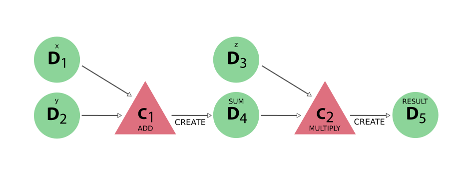

.. _concepts_calculations:

*******
Concept
*******

A calculation is a process (see the :ref:`process section<concepts_processes>` for details) that *creates* new data.
Currently, there are two ways of implementing a calculation process:

 * :ref:`calculation function<concepts_calcfunctions>`
 * :ref:`calculation job<concepts_calcjobs>`

The first one is the simplest of the two and is basically a python function that is magically transformed into a process.
This is ideal for calculations that are not very computationally intensive and can be easily implemented in a python function.
For more taxing calculations, typically performed by external codes that are optionally run on remote computing clusters, the calculation job is the better alternative.

In the following sections, both concepts will be explained but without going too much into detail on how to implement or run them.
For a more detailed exposé, please refer to the respective advanced sections on :ref:`calculation functions<working_calcfunctions>` and :ref:`calculation jobs<working_calcjobs>`.

.. _concepts_calcfunctions:

Calculation functions
=====================

Consider the following computational task at hand:

.. highlights::
    Given three integers, add the first two and then multiply the sum by the third.

In plain python code, the solution would look something like the following:

.. include:: include/snippets/calculations/calcfunctions/add_multiply_plain_python.py
    :code: python

This simple code snippet will achieve the goal of getting the desired result, however, the provenance is lost.
There is no connection between the output of the functions and their inputs.
The remedy to this problem is the :py:func:`~aiida.engine.processes.functions.calcfunction`.
The ``calcfunction`` in AiiDA is a `function decorator <https://docs.python.org/3/glossary.html#term-decorator>`_ that transforms a regular python function in a calculation process, which automatically stores the provenance of its output in the :ref:`provenance graph<concepts_provenance>` when executed.
Updating the previous snippet with ``calcfunction`` decorators yields:

.. include:: include/snippets/calculations/calcfunctions/add_multiply_calcfunction_decorator.py
    :code: python

The only thing we had to do to decorate the two functions was to add the line ``@calcfunction`` just before the function definition.
Adding the decorator tells AiiDA that the provenance for this function should be stored in the provenance graph when it is executed.
This means linking up the inputs and the outputs for a calculation node, which represents the function that was executed.
The final change that has to be performed to make this possible, is to make the inputs and the outputs storable.
In the previous snippet, the inputs are plain python integer types, which cannot be automatically stored in the provenance graph as nodes.
To solve this, one only has to wrap them in the :py:class:`~aiida.orm.nodes.data.int.Int` node sub class, which makes them storable in the database:

.. include:: include/snippets/calculations/calcfunctions/add_multiply_calcfunction_data_types.py
    :code: python

The only difference with the previous snippet is that all inputs have been wrapped in the :py:class:`~aiida.orm.nodes.data.int.Int` class.
The result that is returned by the function, is now also an :py:class:`~aiida.orm.nodes.data.int.Int` node that can be stored in the provenance graph, and contains the result of the computation.

.. note::

    Since ``x`` and ``y`` inside the ``add`` and ``multiply`` functions are already :py:class:`~aiida.orm.nodes.data.int.Int` instances the sum will also be one.
    This is true because all arithmetic operators also work on the base AiiDA classes (``Int``, ``Float``, etc.) as they would on the equivalent python types.
    It is important to realize though that only :py:class:`~aiida.orm.nodes.node.Node` instances, or sub classes thereof can be stored.
    For more information on how to return results from process functions, refer to the :ref:`advanced section<working_calcfunctions>`.

With these trivial changes, the full provenance of the result produced by running the function is maintained and looks like the following:

.. _fig_calculation_functions_provenance_add_multiply:

    The provenance generated by the calcfunction example

The example above already shows how a calcfunction can be run: simply by calling it.
The value that is returned is the result returned by the definition of the function.
However, sometimes one would also like to have a reference to the calculation node that represents the execution of the function in the provenance graph.
The following example shows two additional launch functions that will return a tuple, which in addition to the results, also return the ``pk`` or the node associated with the process

.. include:: include/snippets/calculations/calcfunctions/add_multiply_calcfunction_run.py
    :code: python

This was a very short and limited description of calculation functions.
For a more detailed description of launching them, please refer to the section on :ref:`launching processes<working_processes_launching>`.
If you want more details on implementing calculation functions and best practices, refer to the section on :ref:`working with calculation functions<working_calcfunctions>`.

.. _concepts_calcjobs:

Calculation jobs
================

In the previous section on :ref:`calculation functions<concepts_calcfunctions>`, we showed how a simple python function can be transformed into a process, such that when it is launched, its execution is recorded automatically in the provenance graph.
However, not all computations are well suited to be implemented as a python function, but rather are implemented as a separate code, external to AiiDA.
To interface an external code with the engine of AiiDA, the :py:class:`~aiida.engine.processes.calcjobs.calcjob.CalcJob` process class was introduced.
A detailed explanation of how to implement it, the interface and best practices, can be found in a :ref:`later section<working_calcjobs>`.
Here, instead, we will focus on the big picture and explain in broad lines how a calculation job models the execution of an external code and what tasks it performs when launched.

To illustrate how a calculation job operates, we need an external code.
Let's imagine an external code that consists of a bash script that reads an input file containing two integers, sums them and prints the result in the standard output using ``echo``, for example:

.. code:: bash

    #!/bin/bash
    # Read two integers from file 'aiida.in' and echo their sum
    x=$(cat aiida.in | awk '{print $1}')
    y=$(cat aiida.in | awk '{print $2}')
    echo $(( $x + $y ))

When run, this script reads the contents of a file called ``aiida.in`` and expects that it contains two integers.
It will parse these into the variables ``x`` and ``y`` and then print their sum.
When you want to run this 'code' through AiiDA, you need to tell *how* AiiDA should run it.
The :py:class:`~aiida.calculations.plugins.arithmetic.add.ArithmeticAddCalculation` is a calculation job implementation that forms an interface to accomplish exactly that for the example bash script.
A ``CalcJob`` implementation for a specific code, often referred to as a calculation plugin, essentially instructs the engine how it should be run.
This includes how the necessary input files should be created based on the inputs that it receives, how the code executable should be called and what files should be retrieved when the calculation is complete.
Note the files should be 'retrieved' because calculation jobs can be run not just on the localhost, but on any :ref:`computer that is configured in AiiDA<setup_computer>`, including remote machines accessible over for example SSH.

Since a ``CalcJob`` is a process just like the :ref:`calculation functions<concepts_calcfunctions>` described before, they can be run in an identical way.

.. include:: include/snippets/calculations/calcjobs/arithmetic_add_run.py
    :code: python

the provenance generated by running the calculation job will look something like this:

.. _fig_calculation_jobs_provenance_arithmetic_add:
.. figure:: include/images/arithmetic_add.png

    The provenance generated by the calculation job example

The execution of the calculation job is represented in the provenance graph by a process node, i.e. the pink square labeled `C\ :sub:`1`` in :numref:`fig_calculation_jobs_provenance_arithmetic_add`.
The integer data nodes ``x`` and ``y`` that were passed as inputs are linked to the calculation job as such, as well as the third input ``code``.
This input is required for *all* calculation jobs as it represents the external code that is actually executed.
These code nodes are instances of the :py:class:`~aiida.orm.nodes.data.code.Code` class, which is a sub-class of :py:class:`~aiida.orm.nodes.data.data.Data`.
This means that code instances are a sort of data node.
Its function is to record the path to the executable and some other code related attributes defined during the :ref:`code setup<setup_code>`.

The calculation job produced two outputs, an integer node, containing the sum of ``x`` and ``y`` and a :py:class:`~aiida.orm.nodes.data.folder.FolderData` node, containing the output files that were retrieved.
Note that all outputs of calculation jobs (except for the ``retrieved`` node) are technically not created by the calculation job itself, but rather by an implementation of the :py:class:`~aiida.parsers.parser.Parser` class.
In principle, this step is optional, and so a calculation job is therefore not required to produce any outputs, except for the ``retrieved`` folder data node, which will always be there.
How the parser fits into the concept of calculation jobs will be addressed in :ref:`this section<concepts_calcjobs_parsers>`.

.. _concepts_calcjobs_transport_tasks:

Transport tasks
---------------

To arrive at the provenance graph shown above in :numref:`fig_calculation_jobs_provenance_arithmetic_add`, the engine performed quite some tasks.
When a calculation job is launched, the engine will take it roughly through the following steps:

 * **Upload**: the calculation job implementation is used to transform the input nodes into the required input files, which are uploaded to a 'working' directory on the target machine
 * **Submit**: to execute the calculation, a job is submitted to the scheduler of the computer on which the input `code` is configured.
 * **Update**: the engine will query the scheduler to check for the status of the calculation job
 * **Retrieve**: once the job has finished, the engine will retrieve the output files, specified by the calculation plugin and store them in a node attached as an output node to the calculation

All of these tasks require the engine to interact with the computer, or machine, that will actually run the external code.
Since the :py:class:`~aiida.orm.nodes.data.code.Code` that is used as an input for the calculation job, which is configured for a specific :py:class:`~aiida.orm.computers.Computer`, the engine knows exactly how to execute all these tasks.
The ``CalcJob`` implementation itself then is completely independent of the machine the code will be run on.
To run the calculation job on a different machine, all you have to do is change the ``code`` input to one that is configured for that machine.
If the machine is *not* the localhost, the engine will need a way to connect to the remote machine in order to perform each of the four tasks listed above.
The mechanism that allows the engine to connect to the remote machine is called a *transport* and therefore the tasks it performs using this transport are called *transport tasks*.

.. _concepts_calcjobs_exponential_backoff:

Exponential backoff mechanism
-----------------------------

In the case of calculation jobs being executed on a remote machine, the engine will have to connect to the machine for each of the transport tasks.
In connecting to the remote, a whole host of potential problems may occur that would cause the calculation job to fail.
For example, the remote machine may be down and as a result unreachable, or the engine itself may lose its internet connection.
However, these problems are often temporary.
To prevent the calculation job from excepting and it being lost forever, an *exponential backoff mechanism* has been implemented.
Whenever the engine performs a transport task but encounters an exception, instead of letting the calculation job fail, it will reschedule the same task to be executed again at a later time.
The task will be automatically rescheduled until it finishes successfully, where the interval between tries increases exponentially.
If after 5 consecutive tries, the task still fails, instead of rescheduling it, the engine will simply pause the calculation job.
The output of ``verdi process list`` will give more information on why the task failed:

.. code-block:: bash

      PK  Created     State           Process label                 Process status
    ----  ----------  ------------    --------------------------    ---------------------------------------------------------------------------------------
     151  1h ago      ⏸ Waiting       ArithmeticAddCalculation      Pausing after failed transport task: retrieve_calculation failed 5 times consecutively

    Total results: 1

When there are calculation jobs that have been paused because the transport tasks have failed multiple times, the user has the time to investigate the problem.
If the problem is determined to be temporary and it has been resolved, one can use ``verdi process play`` to resume the paused processes.
The engine will then automatically reschedule the task that failed last and the calculation job will continue where it left off.

This exponential backoff mechanism makes the engine very robust with respect to calculation jobs, reducing the loss of computational resources due to temporary problems to an absolute minimum.

.. note::

    The parameters, such as the delays between retries and the maximum number of retries, are currently not configurable, but they might be in the future.

.. _concepts_calcjobs_parsers:

Parsers
-------
The previous section explained how the ``CalcJob`` class functions as an interface between AiiDA's engine and an external piece of code.
The calculation job plugin will instruct the engine how the :ref:`transport tasks<concepts_calcjobs_transport_tasks>` should be accomplished.
However, as mentioned before, those tasks stop after the output files have been retrieved, which the engine will attach as a :py:class:`~aiida.orm.nodes.data.folder.FolderData` node with the label ``'retrieved'`` to the calculation job node.
As far as the calculation job goes that is all that is absolutely required.
However, often one wants to parse those output files into some specific outputs that should be represented as individual nodes in the provenance graph.
This can be accomplished by implementing the :py:class:`~aiida.parsers.parser.Parser` class and specifying it in the inputs of the calculation job.
In that case, the engine will call the parser after the output files created by the job have been successfully retrieved.
In the parser implementation, the retrieved files can then be parsed and converted into output nodes.
For technical details on how to implement a parser for a calculation job and how to specify it in the inputs, please refer to the :ref:`detailed parser section<working_calcjobs_parsers>`,
