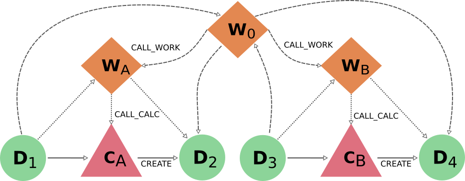

.. _delete_export:

******************
Delete and Export
******************

Basic Summary
=============

When you ask AiiDA to delete or export a node, the program will not only
delete or export the requested node but will also include in the process
any other nodes that are required to keep a consistent provenance.
We will now shortly list all the rules for each case and in the following
sections provide more illustrative graphics and examples, as well as the
rationale for having chosen them.

======================================  ======================  ===============================================
Node linked to target data node         If deleting node        If exporting node
======================================  ======================  ===============================================
Incoming calculation (create)           Will always delete      Will export by default (create_reversed = True)
Incoming workflow (return)              Will always delete      Will leave by default (return_reversed = False)
Outgoing calculation (input_calc)       Will always delete      Will leave by default (input_forward = False)
Outgoing workflow (input_work)          Will always delete      Will leave by default (input_forward = False)
======================================  ======================  ===============================================

======================================  ==============================================  =============================================
Node linked to target calculation node  If deleting node                                If exporting node
======================================  ==============================================  =============================================
Incoming workflow (call_calc)           Will always delete                              Will leave by default (call_reversed = False)
Incoming data (input_calc)              Will always keep                                Will always export
Outgoing data (create)                  Will delete by default (forward_create = True)  Will always export
======================================  ==============================================  =============================================

=======================================  ============================================  =============================================
Node linked to target workflow node      If deleting node                              If exporting node
=======================================  ============================================  =============================================
Incoming workflow (call_work)            Will always delete                            Will leave by default (call_reversed = False)
Incoming data (input_work)               Will always keep                              Will always export
Outgoing workflow (call_work)            Will keep by default (forward_works = False)  Will always export
Outgoing data (return)                   Will always keep                              Will always export
Outgoing calculation (call_calc)         Will keep by default (forward_calls = False)  Will always export
=======================================  ============================================  =============================================

Details of the Features
=======================

Data Nodes
----------

When deleting data nodes, all incoming and outgoing calculations and workflows
will be deleted as well.
It should be easy to see how having calculation and workflow nodes without
the complete information of the inputs used can be dangerous, but having
missing information about the outputs that were produced by the process can
also easily lead to confusion when exploring the provenance.

On the other hand, exporting data nodes should be fairly independent since
data pieces contains information that can stand on its own.
By default, AiiDA will also export any calculations that produce the data
node, but this can be disabled setting **create_reversed** to False.
To enable the inclusion of any workflows that return the data you can set
**return_reversed** to True (notice that by default AiiDA will export the
calculations that create the data but not the workflows that return it,
giving a soft priority to the data provenance over the logical).
You can also enable the automatic inclusion of all outgoing calls to
processes (any calculation or workflow node that uses the data as input)
by setting **input_forward** to True.

Process Nodes
-------------

Regarding the data provenance, when deleting calculation nodes AiiDA will
keep inputs and delete outputs by default.
However, since as previously said data can always stand on its own, it is
possible to delete a calculation without deleting the outputs by setting
**forward_create** to False.
In the case of workflows, inputs and outputs are always kept.

Regarding the logical provenance, anything that is upstream will be deleted:
so, if deleting either a calculation node or workflow node, any workflow
node that would call the targeted node will be deleted as well since its
procedures will no longer be complete.
When deleting a workflow, by default none of the nodes that are called by it
will be deleted.
You may enable inclusion of called workflow nodes by setting **forward_works**
to True, which will still keep any called calculations node.
To include these last ones as well, you have to set **forward_calcs** to True.

When exporting any process node, all input and output data nodes will be
included in the export as well (this is the reciprocal of the deletion of
data nodes explained before: taking processes with incomplete information
of how they were run or what were the results is dangerous).
If the target node is a workflow, all called processes will be exported
as well (since they are part of its procedures) but not necessarily the
workflows that have called it.
This last part is true for calculation nodes as well: any workflow node
that might have called it will be left behind.
In order to enable the automatic incorporation of all workflows that call
the targeted process node, you can set **call_reversed** to True.

Behaviour and Examples
----------------------

In the previous sections we have described the basic rules which AiiDA uses
when deciding which nodes should also be included when you give it an initial
list of nodes to delete or export.
But the initial list is not the only one to which these rules apply: as new
nodes are included in the deletion list, these have to be check for the rules
as well.
In this sense, the deletion and export processes are said to be recursive,
and so the total consequences of deleting or exporting a given node may not
always be so straightforward.

The first thing to notice is that if you delete a data or calculation node,
AiiDA will also delete any outgoing calculation or data node by default,
and since this is recursive it will end up deleting all the downwards data
provenance that the initial node was part of.
This can be stopped by setting **forward_create** to False, in which case
the chain will break at the first non explicitly targeted data node: so
if you targeted a data node it will delete it and any calculations that
use it as an input, but will not go on to delete the outputs of those
calculations.
The reciprocal is true for export and upwards data provenance, which will
be copied as well by default: in this case to avoid it you would have to
set **create_reversed** to False (so if you export a calculation, it will
take the input nodes with it but not any calculation node that created
those inputs).

We need to be more careful when analizing the behaviour for the logical
provenance.
Here, it can be instantly seen that deleting a process will produce the
deletion of all upwardly linked workflows (since all of them would have
lost part of the information on the procedures encompassed), whereas it
will leave intact any process that was called by it.
It is important to notice that this automatically protects not only the
nodes that are immediately below a controlling workflow, but also any
other *independent* processes that are controlled by the outermost
workflow that connects to the targetted one.
Enabling the optional keywords may override this and have unexpected
results.
For example, consider the following graph:

.. _delete_example01:

If you were to target node |C_B|, it would automatically delete |D_4| (by default,
but could be prevented), |W_B| and |W_0|, but would leave |W_A| (and everything
under it) and |C_A| as they are.
If you target |W_B|, it would just delete |W_B| and |W_0|, now keeping not only the
whole |W_A| block, but |C_B| and |D_4| as well.
If you wanted to delete |C_B| when targetting |W_B| (for example, if |W_B| actually
had many calls to calculations like |C_B| and you wanted all gone), then you
would have to turn **forward_calcs** to True.
This alone would do as expected and delete not only |W_0| and |W_B|, but |C_B| (and
consequently |D_4|) as well.

In a more general case, |W_B| may have not only calls to calculations but maybe
to other workflows as well, so if you wanted to delete everything called by
|W_B| you would have to set **forward_works** to True as well.
The problem now is that **forward_works** will also apply when including |W_0|,
and thus will end up deleting not only all the calls made by |W_B|, but all the
calls made by |W_0| as well: in this case, |W_A| (and recursively), |C_A| and |D_2|.
So targetting the |W_B| workflow with **forward_works** with the intention of
deleting internal workflows ends up deleting independent workflow |W_A|.
Deleting sub-sections of a more complex workflow is still posible but must
be done with some extra care.
In cases such as this, the user would have to first delete |W_0| (with the default
**forward_works** set to False, thus removing the link between |W_A| and |W_B|)
and then delete |W_B| with **forward_works** set to True.

So having both **forward_works** and **forward_calls** set to False when
deleting will let you keep any downwards processes, while setting both
to True will basically go to the highest encompassing workflow and delete
all procedures performed by it (also deleting outputs but default, but this
can be disabled independently with the **forward_create** keyword).
As seen before, enabling only **forward_calls** has some limited use in some
cases such as this particular example, where it has enabled us to just delete
the direct calculation calls made by workflow |W_B| while keeping the workflow
|W_A| and its content intact.
Still, this usage is rather limited, since it won't have been useful if we
wanted to apply the same idea to an alternative workflow |W_B| with calls to
other workflows
Basically it will remove any other calculation that is called directly from
any workflow upstream of the targeted node.
On the other hand, enabling only **forward_works** is a configuration that
does present a particular usefulness since it allows to completely remove
the logical provenance (the workflow design), keeping just the calculation
and data nodes, just by targetting any of the involved workflow nodes.
This allows to "clean" the database in a way that keeps everything that is
necessary to ensure reproducibility of results but removes all design and
organizational structures that some users may want to keep private.

Notice that this last description (deleting the logical provenance but
protecting the data provenance) is the default behaviour when exporting
a data or calculation node.
All upstream chains of data and calculation nodes will be exported as
well, but upstream link to workflows are ignored by default: so in the
example above, if you exported |C_B| you would just get |D_3|, |C_B| and |D_4|.
Notice that for export, both upwards calls to calculations and upward
calls to workflows are included when setting **call_reversed** to True.
So if you exported |C_B| with this last configuration, you would not only
also be exporting |W_B| and all 'brother calculations' of |C_B|, you would
be exporting |W_0| and therefore everything encopased by it: in this case,
|W_A|, |C_A|, |D_1| and |D_3|.
When **call_reversed** is enabled, AiiDA will export not only what is
necessary to keep a consistent provenance but actually everything that
is performed by the outermost workflow of which the target node is part
of.
If you just wanted everything performed by sub-workflow |W_B| instead, the
solution is the obvious one: you need to actually target |W_B| with the export
command instead of trying to do it through |C_B| (and then you don't even need
to specify any optional keywords, as the defaults will do exactly this).

.. |W_0| replace:: C\ :sub:`0`
.. |W_A| replace:: C\ :sub:`A`
.. |W_B| replace:: C\ :sub:`B`
.. |C_A| replace:: C\ :sub:`A`
.. |C_B| replace:: C\ :sub:`B`
.. |D_1| replace:: C\ :sub:`1`
.. |D_2| replace:: C\ :sub:`2`
.. |D_3| replace:: C\ :sub:`3`
.. |D_4| replace:: C\ :sub:`4`

