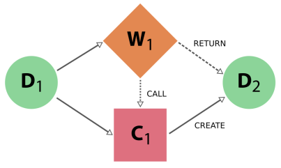
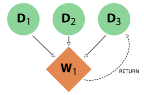
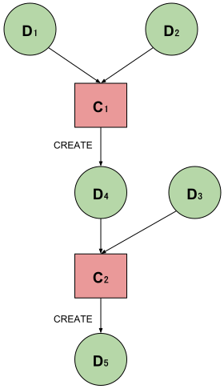
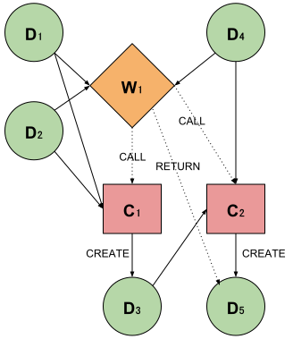

.. _provenance:

**********
Provenance
**********

The AiiDA provenance graph
##########################

The AiiDA graph: nodes and links
================================

One basic **entity** in AiiDA is **data**, representing a data object (a list of parameters, an array, or more high-level data types like a crystal structure, a band structure, ...).

Moreover, in AiiDA we define a second type of entity that represents “actions” on data: these are called **processes**, they get data as input and can have data as output.
In particular, we define two different type of processes:

* **Calculations** are processes that are able to **create** new data. This is the typical case, for instance, for externals simulation codes, that generate new data
* **Workflows** are processes that **orchestrate** other workflows and calculations (i.e., they manage the logical flow, being able to **call** calculations that will generated the data, or subworkflows). Workflows have data inputs, but cannot generate new data. They can only return data that is already in the database (one typical case is to return data created by a calculation they called).

Data and processes (that in AiiDA are collectively called **nodes**) are the two main entities composing the AiiDA graph.
The graph edges, or AiiDA **links**, can be

* **input** links (data to processes, either workflows or calculations)
* **create** links (calculation to data) or **return** links (workflow to data), that we collectively call **output** links
* **call** links (workflows to other processes, either workflows or calculations).

Data provenance and logical provenance
======================================

AiiDA automatically stores entities in its database and links them forming a **directed graph**.
This directed graph automatically tracks the **provenance** of all data produced by calculations or returned by workflows.
By tracking the provenance in this way, one can always fully retrace how a particular piece of data came into existence, thus ensuring its reproducibility.

In particular, we define two types of provenance:

* The **data provenance**, consisting in that part of the graph that ONLY consists of data and calculations (i.e. without considering workflows), and only **input links to calculations** and **output create links**. The data provenance records the full history of how data has been generated. Due to the causality principle, the data provenance part of the graph is a **directed acyclic graph** (DAG), i.e. its nodes are connected by directed edges and it is loop-free.
* The **logical provenance**, consisting of calculations and workflows, and **input links to workflows**, **output return links**, and **call links**. The logical provenance is *not* acyclic (e.g., a workflow that acts as a filter can return one of its inputs).

The data provenance is substantially a log of which calculation generated the data and with which inputs.
The data provenance alone already guarantees reproducibility (one could run again one by one the calculations with the provided input and would obtain the same outputs).
The logical provenance gives additional information on why a specific calculation was run.
Imagine the case in which you start from 100 structures, you have a filter operation that picks one, and then you run a simulation on it.
The data provenance only shows the simulation you run on the structure that was picked, while the logical provenance can also show that the specific structure was not picked at random but via a specific workflow logic.

Other AiiDA entities
====================

Beside nodes (data and processes), AiiDA defines a few more entities, like **computers** (representing a computer, supercomputer or computer cluster where simulations can run or data is stored), **groups** (that group together nodes) and **users** (to keep track of the user who first generated a given node, computer or group).

In the following section we describe in more detail how the general provenance concepts above are actually implemented in AiiDA, with specific reference to the python classes that implement them and the class-inheritance relationships.

AiiDA provenance implementation
###############################

Graph nodes
===========

The **nodes** of the AiiDA provenance graph can be grouped into two main **entity types**: **process nodes** (``ProcessNode``), that represent the execution of calculations or workflows, and **data nodes** (``Data``), that represent specific data types with their respective content.

In particular, **process nodes** are divided into two sub categories:

    - **calculation nodes** (``CalculationNode``): Represent code execution that create new data objects. These are further subdivided in two subclasses:

        - ``CalcJobNode``: Represents the execution of a calculation external to AiiDA, typically via a job batch scheduler (i.e. the execution of a simulation code on some computer).
        - ``CalcFunctionNode``: Represents the execution of a python function (wrapped with a ``@calcfunction`` decorator) that takes AiiDA data nodes as input and returns AiiDA data nodes as output (see the description of :ref:`calcfunctions <calculations>`), e.g. when manipulating and processing data objects in the python interpreter or inside a workflow, without the need to run an external code.

    - **workflow nodes** (``WorkflowNode``): Represent python code that orchestrates the execution of other (sub)workflows or of calculations. Will return the data created by calculations. These are further subdivided in two subclasses:

        - ``WorkChainNode``: Represents the execution of a python class instance with built-in checkpoints, such that the process may be paused/stopped/resumed.
        - ``WorkFunctionNode``: Represents the execution of a python function (wrapped with a ``@wf`` decorator).

The class hierarchy of the process nodes is shown in the figure below.

.. figure:: include/images/class_hierarchy.png

    The hierarchy of the ORM classes for the process nodes. Only objects of the lowest level of classes should actually enter the provenance graph (see section on :ref:`processes <processes>`).

For what concerns data nodes, the base class (``Data``) is subclassed to provide functionalities specific to the data type and python methods to operate on it.
Often, the name of the subclass contains the word “Data” appended to it, but this is not a requirement. A few examples:

* **Float, Int, Bool, Str, List**, ...
* **ParameterData**: represents a dictionary of key-value pairs - these are parameters of a general nature that do not need to belong to more specific data sub-classes
* **StructureData**: represents crystal structure data (containing chemical symbols, atomic positions of the atoms, periodic cell for periodic structures, …)
* **ArrayData**: represents generic numerical arrays of data (python numpy arrays)

For more detailed information see :ref:`AiiDA data types <DataTypes>`.

In the next section we introduce the links between nodes, creating the AiiDA graph, and then we show some examples to clarify what we introduced up to now.

Graph links
===========

Process nodes are connected to their input and output data nodes through directed links.
Calculation processes can CREATE data, while workflow processes can CALL calculations and RETURN their outputs.

    Simple provenance graph for a workflow (W\ :sub:`1`) *calling* a calculation (C\ :sub:`1`). The workflow takes a single **data node** (D\ :sub:`1`\) as input, and passes it to the calculation when *calling* it. The calculation *creates* a new **data node** (D\ :sub:`2`\) that is also *returned* by the **workflow node**.

Notice that the different names here are intentional, because it was the calculation that *created* the new data, whereas the workflow merely *returned* it.
This subtle distinction has big consequences.
By allowing workflow processes to *return* data, it can also *return* data that was among its inputs.

    Provenance graph example of a **workflow node** that receives three **data nodes** as input and *returns* one of those inputs. The input link from D\ :sub:`3` to W\ :sub:`1` and the return link from W\ :sub:`1` to D\ :sub:`3` introduce a cycle in the graph.

A scenario like this, represented in the figure above, would create a cycle in the provenance graph, breaking the “acyclicity” of the DAG.
To restore the directed acyclic graph, we separate the entire provenance graph into two planes: the **creation provenance** and the **logical provenance**.
All calculation processes inhabit the creation plane and can only have CREATE links to the data they produce, whereas the workflow processes in the logical plane can only have RETURN links to data.
With this provision, the acyclicity of the graph is restored in the creation plane.

An additional benefit of thinking of the provenance graph in these two layers, is that it allows you to inspect it with different layers of granularity.
Imagine a high level workflow that calls a large number of calculations and sub-workflows, that each may also call more sub-processes, to finally produce and return one or more data nodes as its result.

Graph examples
==============

Here we show some examples of simple graphs.
We represent **data nodes** with circles, **calculation nodes** with squares and **workflow nodes** with diamond shapes.

In the following figure we show a provenance graph example for computing (a+b)*c.
We have two simple calculations: C\ :sub:`1` is the sum and C\ :sub:`2` is the multiplication.
The two data nodes D\ :sub:`1` and D\ :sub:`2` are the inputs of C\ :sub:`1`, which *creates* the data node D\ :sub:`4`\.
D\ :sub:`3` and D\ :sub:`4` are input into C\ :sub:`2` which *creates* the data node D\ :sub:`5`, the final result of the calculation.

    A provenance graph example for computing (a+b)*c.

The same calculation (a+b)*c can be performed using a workflow. Here below we show the corresponding graph.
In this case the data nodes D\ :sub:`1`, D\ :sub:`2` and D\ :sub:`3` are the inputs of the workflow W\ :sub:`1`, which *calls* the calculation C\ :sub:`1` with inputs D\ :sub:`1` and D\ :sub:`2`, and then *calls* the calculation C\ :sub:`2` using as inputs D\ :sub:`3` and D\ :sub:`4` (*created* by C\ :sub:`2`\).
C\ :sub:`2` *creates* the data node D\ :sub:`5`, which is *returned* by the workflow W\ :sub:`1`\.

    A provenance graph example for computing (a+b)*c using a workflow.
