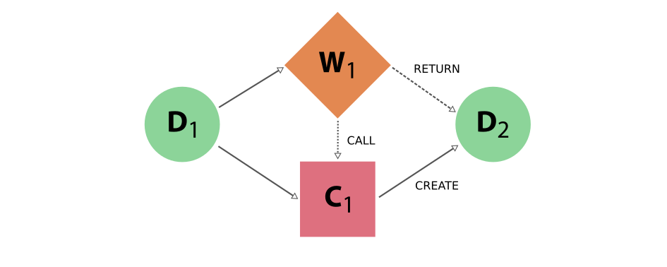

.. _provenance:

**********
Provenance
**********

The graph concept
#################

Nodes and links
===============

The two most important concepts in AiiDA are **data** and **processes**.
The former are pieces of data, such as a simple integer or float, all the way to more complex data concepts such as a dictionary of parameters, a folder of files or a crystal structure.
Processes operate on this data in order to produce new data.

Processes come in two different forms:

* **Calculations** are processes that are able to **create** new data. This is the case, for instance, for externals simulation codes, that generate new data
* **Workflows** are processes that **orchestrate** other workflows and calculations (i.e., they manage the logical flow, being able to **call** calculations that will generate the data, or subworkflows). Workflows have data inputs, but cannot generate new data. They can only return data that is already in the database (one typical case is to return data created by a calculation they called).

Data and processes are represented in the AiiDA provenance graph as the **nodes** of that graph.
The graph edges are referred to as **links** and come in different forms:

* **input** links: connect data nodes to the process nodes that used them as input, both calculations and workflows
* **create** links: connect calculation nodes to the data nodes that they created
* **return** links: connect workflow nodes to the data nodes that they returned
* **call** links: connecting workflow nodes to the process nodes that they directly called, be it calculations or workflows

Note that the **create** and **return** links are often collectively referred to as **output** links.

Data provenance and logical provenance
======================================

AiiDA automatically stores entities in its database and links them forming a **directed graph**.
This directed graph automatically tracks the **provenance** of all data produced by calculations or returned by workflows.
By tracking the provenance in this way, one can always fully retrace how a particular piece of data came into existence, thus ensuring its reproducibility.

In particular, we define two types of provenance:

* The **data provenance**, consisting in that part of the graph that ONLY consists of data and calculations (i.e. without considering workflows), and only **input links to calculations** and **output create links**. The data provenance records the full history of how data has been generated. Due to the causality principle, the data provenance part of the graph is a **directed acyclic graph** (DAG), i.e. its nodes are connected by directed edges and it does not contain any cycles.
* The **logical provenance**, consisting of calculations and workflows, and **input links to workflows**, **output return links**, and **call links**. The logical provenance is *not* acyclic (e.g., a workflow that acts as a filter can return one of its inputs).

The data provenance is substantially a log of which calculation generated the data and with which inputs.
The data provenance alone already guarantees reproducibility (one could run again one by one the calculations with the provided input and would obtain the same outputs).
The logical provenance gives additional information on why a specific calculation was run.
Imagine the case in which you start from 100 structures, you have a filter operation that picks one, and then you run a simulation on it.
The data provenance only shows the simulation you run on the structure that was picked, while the logical provenance can also show that the specific structure was not picked at random but via a specific workflow logic.

Other entities
==============

Beside nodes (data and processes), AiiDA defines a few more entities, like **computers** (representing a computer, supercomputer or computer cluster where calculations are run or data is stored), **groups** (that group together nodes for organizational purposes) and **users** (to keep track of the user who first generated a given node, computer or group).

In the following section we describe in more detail how the general provenance concepts above are actually implemented in AiiDA, with specific reference to the python classes that implement them and the class-inheritance relationships.

The implementation
##################

Graph nodes
===========

The **nodes** of the AiiDA provenance graph can be grouped into two main **types**: **process nodes** (``ProcessNode``), that represent the execution of calculations or workflows, and **data nodes** (``Data``), that represent pieces of data.

In particular, **process nodes** are divided into two sub categories:

    - **calculation nodes** (``CalculationNode``): Represent code execution that creates new data. These are further subdivided in two subclasses:

        - ``CalcJobNode``: Represents the execution of a calculation external to AiiDA, typically via a job batch scheduler (i.e. the execution of a simulation code on some computer).
        - ``CalcFunctionNode``: Represents the execution of a python function (wrapped with the ``@calcfunction`` decorator) that takes AiiDA data nodes as input and creates AiiDA data nodes as output (see the description of :ref:`calcfunctions <calculations>`), e.g. when manipulating and processing data objects in the python interpreter or inside a workflow, without the need to run an external code.

    - **workflow nodes** (``WorkflowNode``): Represent python code that orchestrates the execution of other (sub)workflows or of calculations and that optionally return the data created by the calculations they called. These are further subdivided in two subclasses:

        - ``WorkChainNode``: Represents the execution of a python class instance with built-in checkpoints, such that the process may be paused/stopped/resumed.
        - ``WorkFunctionNode``: Represents the execution of a python function (wrapped with the ``@workfunction`` decorator).

The class hierarchy of the process nodes is shown in the figure below.

.. figure:: include/images/class_hierarchy.png

    Figure 1: The hierarchy of the ORM classes for the process nodes. Only instances of the lowest level of classes will actually enter into the provenance graph. The two upper levels have a mostly taxonomical purpose as they allow us to refer to multiple classes at once when reasoning about the graph as well as a place to define common functionality (see section on :ref:`processes <processes>`).

For what concerns data nodes, the base class (``Data``) is subclassed to provide functionalities specific to the data type and python methods to operate on it.
Often, the name of the subclass contains the word “Data” appended to it, but this is not a requirement. A few examples:

* **Float, Int, Bool, Str, List**, ...
* **Dict**: represents a dictionary of key-value pairs - these are parameters of a general nature that do not need to belong to more specific data sub-classes
* **StructureData**: represents crystal structure data (containing chemical symbols, atomic positions of the atoms, periodic cell for periodic structures, …)
* **ArrayData**: represents generic numerical arrays of data (python numpy arrays)

For more detailed information see :ref:`AiiDA data types <DataTypes>`.

In the next section we introduce the links between nodes, creating the AiiDA graph, and then we show some examples to clarify what we introduced up to now.

Graph links
===========

Process nodes are connected to their input and output data nodes through directed links.
Calculation processes can *create* data, while workflow processes can *call* calculations and *return* their outputs.
Consider the following graph example, where we represent **data nodes** with circles, **calculation nodes** with squares and **workflow nodes** with diamond shapes.

    Figure 2: Simple provenance graph for a workflow (W\ :sub:`1`) *calling* a calculation (C\ :sub:`1`). The workflow takes a single **data node** (D\ :sub:`1`\) as input, and passes it to the calculation when *calling* it. The calculation *creates* a new **data node** (D\ :sub:`2`\) that is also *returned* by the **workflow node**.

Notice that the different style and names for the two links coming into D\ :sub:`2`\ is intentional, because it was the calculation that *created* the new data, whereas the workflow merely *returned* it.
This subtle distinction has big consequences.
By allowing workflow processes to *return* data, it can also *return* data that was among its inputs.

.. figure:: include/images/schematic_provenance_02_cycle.png

    Figure 3: Provenance graph example of a **workflow node** that receives three **data nodes** as input and *returns* one of those inputs. The input link from D\ :sub:`3` to W\ :sub:`1` and the return link from W\ :sub:`1` to D\ :sub:`3` introduce a cycle in the graph.

A scenario like this, represented in Figure 3, would create a cycle in the provenance graph, breaking the “acyclicity” of the DAG.
To restore the directed acyclic graph, we separate the entire provenance graph into two planes: the **creation provenance** and the **logical provenance**.
All calculation processes inhabit the creation plane and can only have *create* links to the data they produce, whereas the workflow processes in the logical plane can only have *return* links to data.
With this provision, the acyclicity of the graph is restored in the creation plane.

An additional benefit of thinking of the provenance graph in these two layers, is that it allows you to inspect it with different layers of granularity.
Imagine a high level workflow that calls a large number of calculations and sub-workflows, that each may also call more sub-processes, to finally produce and return one or more data nodes as its result.

Graph examples
==============

With these basic definitions of AiiDA’s provenance graph in place, let’s take a look at some more interesting.
Consider the sequence of computations that adds two number `a` and `b` and multiplies the result with a third number `c`.
This sequence as represented in the provenance graph would look something like is shown in Figure 4.

.. figure:: include/images/schematic_provenance_03_data_add_multiply.png

    Figure 4: The DAG for computing `(a+b)*c`. We have two simple calculations: C\ :sub:`1` represents the sum and C\ :sub:`2` the multiplication. The two data nodes D\ :sub:`1` and D\ :sub:`2` are the inputs of C\ :sub:`1`, which *creates* the data node D\ :sub:`4`\. Together with D\ :sub:`3`, D\ :sub:`4` then forms the input of C\ :sub:`2` which multiplies their values in order to *creates* the product, represented by D\ :sub:`5`.

In this simple example, there was no external process that controlled the exact sequence of these operations.
When introducing a workflow, that calls the two calculations in succession, we get a graph as is shown in Figure 5.

.. figure:: include/images/schematic_provenance_04_call_workflow.png

    Figure 5: The same calculation `(a+b)*c` is performed using a workflow. Here the data nodes D\ :sub:`1`, D\ :sub:`2` and D\ :sub:`3` are the inputs of the workflow W\ :sub:`1`, which *calls* calculation C\ :sub:`1` with inputs D\ :sub:`1` and D\ :sub:`2`, and then *calls* calculation C\ :sub:`2`, using as inputs D\ :sub:`3` and D\ :sub:`4` (which was *created* by C\ :sub:`2`\). Calculation C\ :sub:`2` *creates* data node D\ :sub:`5`, which is finally *returned* by workflow W\ :sub:`1`\.

Notice that if we were to omit the workflow nodes and all its links from the provenance graph in Figure 5, one would end up with the exact same graph as shown in Figure 4.