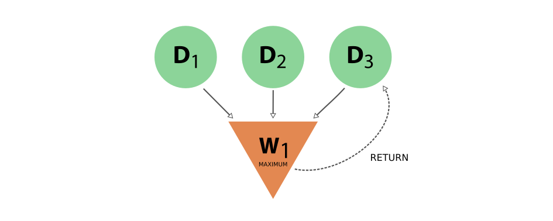

.. _concepts_provenance:

**********
Provenance
**********

Graph concept
=============

Nodes and links
---------------

The two most important concepts in AiiDA are **data** and **processes**.
The former are pieces of data, such as a simple integer or float, all the way to more complex data concepts such as a dictionary of parameters, a folder of files or a crystal structure.
Processes operate on this data in order to produce new data.

Processes come in two different forms:

* **Calculations** are processes that are able to **create** new data. This is the case, for instance, for externals simulation codes, that generate new data
* **Workflows** are processes that **orchestrate** other workflows and calculations, i.e. they manage the logical flow, being able to **call** other processes. Workflows have data inputs, but cannot generate new data. They can only return data that is already in the database (one typical case is to return data created by a calculation they called).

Data and processes are represented in the AiiDA provenance graph as the **nodes** of that graph.
The graph edges are referred to as **links** and come in different forms:

* **input** links: connect data nodes to the process nodes that used them as input, both calculations and workflows
* **create** links: connect calculation nodes to the data nodes that they created
* **return** links: connect workflow nodes to the data nodes that they returned
* **call** links: connecting workflow nodes to the process nodes that they directly called, be it calculations or workflows

Note that the **create** and **return** links are often collectively referred to as **output** links.

Data provenance and logical provenance
--------------------------------------

AiiDA automatically stores entities in its database and links them forming a **directed graph**.
This directed graph automatically tracks the **provenance** of all data produced by calculations or returned by workflows.
By tracking the provenance in this way, one can always fully retrace how a particular piece of data came into existence, thus ensuring its reproducibility.

In particular, we define two types of provenance:

* The **data provenance**, consisting of the part of the graph that *only* consists of data and calculations (i.e. without considering workflows), and only the **input** and **create** links that connect them. The data provenance records the full history of how data has been generated. Due to the causality principle, the data provenance part of the graph is a **directed acyclic graph** (DAG), i.e. its nodes are connected by directed edges and it does not contain any cycles.
* The **logical provenance** which consists of workflow and data nodes, together with the **input**, **return** and **call** links that connect them. The logical provenance is *not* acyclic, e.g. a workflow that acts as a filter can return one of its own inputs, directly introducing a cycle.

The data provenance is essentially a log of which calculation generated what data using certain inputs.
The data provenance alone already guarantees reproducibility (one could run again one by one the calculations with the provided input and would obtain the same outputs).
The logical provenance gives additional information on why a specific calculation was run.
Imagine the case in which you start from 100 structures, you have a filter operation that picks one, and then you run a simulation on it.
The data provenance only shows the simulation you run on the structure that was picked, while the logical provenance can also show that the specific structure was not picked at random but via a specific workflow logic.

Other entities
--------------

Beside nodes (data and processes), AiiDA defines a few more entities, like a :py:class:`~aiida.orm.computers.Computer` (representing a computer, supercomputer or computer cluster where calculations are run or data is stored), a :py:class:`~aiida.orm.groups.Group` (that group nodes together for organizational purposes) and the :py:class:`~aiida.orm.users.User` (to keep track of the user who first generated a given node, computer or group).

In the following section we describe in more detail how the general provenance concepts above are actually implemented in AiiDA, with specific reference to the python classes that implement them and the class-inheritance relationships.

.. _concepts_provenance_implementation:

Implementation
==============

Graph nodes
-----------

The **nodes** of the AiiDA provenance graph can be grouped into two main **types**: **process nodes** (``ProcessNode``), that represent the execution of calculations or workflows, and **data nodes** (``Data``), that represent pieces of data.

In particular, **process nodes** are divided into two sub categories:

    - **calculation nodes** (``CalculationNode``): Represent code execution that creates new data. These are further subdivided in two subclasses:

        - :py:class:`~aiida.orm.nodes.process.calculation.calcjob.CalcJobNode`: Represents the execution of a calculation external to AiiDA, typically via a job batch scheduler (see the concept of :ref:`calculation jobs<concepts_calcjobs>`).
        - :py:class:`~aiida.orm.nodes.process.calculation.calcfunction.CalcFunctionNode`: Represents the execution of a python function (see the concept of :ref:`calculation functions<concepts_calcfunctions>`).

    - **workflow nodes** (``WorkflowNode``): Represent python code that orchestrates the execution of other workflows and calculations, that optionally return the data created by the processes they called. These are further subdivided in two subclasses:

        - :py:class:`~aiida.orm.nodes.process.workflow.workchain.WorkChainNode`: Represents the execution of a python class instance with built-in checkpoints, such that the process may be paused/stopped/resumed (see the concept of :ref:`work chains<concepts_workchains>`).
        - :py:class:`~aiida.orm.nodes.process.workflow.workfunction.WorkFunctionNode`: Represents the execution of a python function calling other processes (see the concept of :ref:`work functions<concepts_workfunctions>`).

The class hierarchy of the process nodes is shown in the figure below.

.. _fig_provenance_class_hierarchy:
.. figure:: include/images/class_hierarchy.png

    The hierarchy of the ORM classes for the process nodes. Only instances of the lowest level of classes will actually enter into the provenance graph. The two upper levels have a mostly taxonomical purpose as they allow us to refer to multiple classes at once when reasoning about the graph as well as a place to define common functionality (see section on :ref:`processes <concepts_processes>`).

For what concerns data nodes, the base class (``Data``) is subclassed to provide functionalities specific to the data type and python methods to operate on it.
Often, the name of the subclass contains the word “Data” appended to it, but this is not a requirement. A few examples:

* :py:class:`~aiida.orm.nodes.data.float.Float`, :py:class:`~aiida.orm.nodes.data.int.Int`, :py:class:`~aiida.orm.nodes.data.bool.Bool`, :py:class:`~aiida.orm.nodes.data.str.Str`, :py:class:`~aiida.orm.nodes.data.list.List`, ...
* :py:class:`~aiida.orm.nodes.data.dict.Dict`: represents a dictionary of key-value pairs - these are parameters of a general nature that do not need to belong to more specific data sub-classes
* :py:class:`~aiida.orm.nodes.data.structure.StructureData`: represents crystal structure data (containing chemical symbols, atomic positions of the atoms, periodic cell for periodic structures, …)
* :py:class:`~aiida.orm.nodes.data.array.array.ArrayData`: represents generic numerical arrays of data (python numpy arrays)
* :py:class:`~aiida.orm.nodes.data.array.kpoints.KpointsData`: represents a numerical array of k-points data, is a sub-class of ``ArrayData``

For more detailed information see :ref:`AiiDA data types <DataTypes>`.

In the next section we introduce the links between nodes, creating the AiiDA graph, and then we show some examples to clarify what we introduced up to now.

Graph links
-----------

Process nodes are connected to their input and output data nodes through directed links.
Calculation processes can *create* data, while workflow processes can *call* calculations and *return* their outputs.
Consider the following graph example, where we represent **data nodes** with circles, **calculation nodes** with squares and **workflow nodes** with diamond shapes.

.. _fig_provenance_simple_workflow:
.. figure:: include/images/schematic_provenance_01_simple_workflow.png

    Simple provenance graph for a workflow (W\ :sub:`1`) *calling* a calculation (C\ :sub:`1`). The workflow takes a single **data node** (D\ :sub:`1`\) as input, and passes it to the calculation when *calling* it. The calculation *creates* a new **data node** (D\ :sub:`2`\) that is also *returned* by the **workflow node**.

Notice that the different style and names for the two links coming into D\ :sub:`2` is intentional, because it was the calculation that *created* the new data, whereas the workflow merely *returned* it.
This subtle distinction has big consequences.
By allowing workflow processes to *return* data, it can also *return* data that was among its inputs.

.. _fig_provenance_cycle:

    Provenance graph example of a **workflow node** that receives three **data nodes** as input and *returns* one of those inputs. The input link from D\ :sub:`3` to W\ :sub:`1` and the return link from W\ :sub:`1` to D\ :sub:`3` introduce a cycle in the graph.

A scenario like this, represented in :numref:`fig_provenance_cycle`, would create a cycle in the provenance graph, breaking the “acyclicity” of the DAG.
To restore the directed acyclic graph, we separate the entire provenance graph into two planes as described above: the **data provenance** and the **logical provenance**.
With this division, the acyclicity of the graph is restored in the data provenance plane.

An additional benefit of thinking of the provenance graph in these two planes, is that it allows you to inspect it with different layers of granularity.
Imagine a high level workflow that calls a large number of calculations and sub-workflows, that each may also call more sub-processes, to finally produce and return one or more data nodes as its result.

Graph examples
--------------

With these basic definitions of AiiDA’s provenance graph in place, let’s take a look at some examples.
Consider the sequence of computations that adds two numbers `x` and `y`, and then multiplies the result with a third number `z`.
This sequence as represented in the provenance graph would look something like what is shown in :numref:`fig_provenance_add_multiply_data`.

.. _fig_provenance_add_multiply_data:
.. figure:: include/images/add_multiply_calcfunction_data.png

    The DAG for computing `(x+y)*z`. We have two simple calculations: C\ :sub:`1` represents the addition and C\ :sub:`2` the multiplication.
    The two data nodes D\ :sub:`1` and D\ :sub:`2` are the inputs of C\ :sub:`1`, which *creates* the data node D\ :sub:`4`\.
    Together with D\ :sub:`3`, D\ :sub:`4` then forms the input of C\ :sub:`2`, which multiplies their values that *creates* the product, represented by D\ :sub:`5`.

In this simple example, there was no external process that controlled the exact sequence of these operations.
This may be imagined however, by adding a workflow that calls the two calculations in succession, as shown in :numref:`fig_provenance_add_multiply_full`.

.. _fig_provenance_add_multiply_full:
.. figure:: include/images/add_multiply_calcfunction_full.png

    The same calculation `(x+y)*z` is performed using a workflow. Here the data nodes D\ :sub:`1`, D\ :sub:`2`, and D\ :sub:`3` are the inputs of the workflow W\ :sub:`1`, which *calls* calculation C\ :sub:`1` with inputs D\ :sub:`1` and D\ :sub:`2`.
    It then *calls* calculation C\ :sub:`2`, using as inputs D\ :sub:`3` and D\ :sub:`4` (which was *created* by C\ :sub:`2`\).
    Calculation C\ :sub:`2` *creates* data node D\ :sub:`5`, which is finally *returned* by workflow W\ :sub:`1`\.

Notice that if we were to omit the workflow nodes and all its links from the provenance graph in :numref:`fig_provenance_add_multiply_full`, one would end up with the exact same graph as shown in :numref:`fig_provenance_add_multiply_data` (the **data provenance** graph).

.. _consistency:

Consistency
===========

Because of the very nature of scientific research, it becomes indispensable to be able to both delete parts of a database (e.g., if errors are made, inputs are misspelled, or useless calculations are performed) or export it (for collaboration or publication purposes).
Both these features, which are provided by AiiDA, have one aspect in common: they can easily lead to a provenance graph with incomplete information.
To better understand why, let's take a look at the following basic provenance graph:

.. _delexp_example01a:

Even in this simple case, if we were to export only the calculation node and the output data node (or, equivalently, delete just the input data node), then we would have lost part of the critical information needed to run the calculation (the |D_1| node), thus losing the reproducibility of the calculation |C_1|.
In this simple case, therefore, in order to have a consistent provenance, whenever you export a calculation node you must also import *all* of its input nodes (or, symmetrically, whenever you delete a data node you must also delete all calculations that used it as an input).

This is just one of the many rules that must be considered when trying to manually edit a provenance database.
The key message to remember is that AiiDA will not only delete or export the nodes explicitly targeted by the user, but will also include any other nodes that are needed for keeping a consistent provenance in the resulting database.

It is also worth noting that if you do successive exports of partial information, AiiDA will be able to reconstruct links that might have been broken when dividing the data for export.
So if you first where to export the previous graph, and then you exported the next section of your full database:

.. _delexp_example01b:
.. figure:: include/images/delexp_example01b.png

Then AiiDA will be able to automatically identfy the shared node |D_2| and connect both sections back together during the import process.
For this kind of recognition it doesn't matter which subgraph was exported first.

In the following section we will explain in more detail the criteria for including other nodes and the corresponding traversal rules.

Traversal Rules
---------------

When you run ``verdi node delete [NODE_IDS]`` or ``verdi export create -N [NODE_IDS]``, AiiDA will look at the links incoming or outgoing from the nodes that you specified and decide if there are other nodes that are critical to keep.

For this decision, it is not only important to consider the type of link, but also if we are following it along its direction (we will call this ``forward`` direction) or in the reversed direction (``backward`` direction).
To clarify this, in the example above, when deleting data node |D_1|, AiiDA will follow the ``input_calc`` link in the ``forward`` direction (in this case, it will decide that the linked node (|C_1|) must then also be deleted).
If the initial target node was, instead, |C_1| the ``input_calc`` link would be followed in the ``backward`` direction (and in this case the node |D_1| will not be deleted, as we will explain below).

This process will be repeated recursively for every node that has just been included for deletion or export, until no more nodes need to be added.
The rules defining whether a linked node should be added or not to the delete/export list (based on the kind and direction of the link) are called *traversal rules*.
In the following section we will describe these rules both for the export and delete procedures.

The tables below are grouped according to the type of nodes and links involved.
We also provide illustrations of the cases considered, where the encircled node is the one being targeted, and the other node (to which the red arrow is pointing) is the one that is being considered for addition into the delete/export list.

Data and Calculation Nodes
..........................

The first example above already discusses the case of deleting an input node: in this case, it is necessary to also delete any calculation that uses it as an input.

In AiiDA, we apply the same criterion also when deleting an output: in this case, we follow the ``create`` link in the ``backward`` direction and we mark for deletion also the calculation that created it.
The reason for this is that a calculation with missing outputs could be misleading. For instance, some calculations produce optional outputs depending on the combination of input flags that are used.
A missing output might be interpreted as if that piece of information was not computed by the calculation.
In the case of export, the rules are typically the reverse of those used for deletion.
Therefore, in this case, the folowing rule applies: when exporting a calculation node, all its input data nodes and created output nodes must be exported as well.

On the other hand, when exporting a data node, users typically do not need to also export all the calculations that used it as an input.
These may represent further work that, by default, does not need to be exported as well (unless explicitly specified by the user in the list of nodes).
Equivalently, when deleting a calculation, one typically wants to keep its inputs, as they might be used by other unrelated calculations.

What should happen instead for the outputs of a calculation to be deleted?
Often, one might want to delete (recursively) all the outputs generated by it.
However, we leave the option to users to just delete the calculation, keeping its outputs in the database.
While we emphasize that this operation removes all provenance information for the output nodes, there are cases in which this is useful or even needed (removal of inputs that are protected by copyright, or creating a smaller export file to transfer to collaborators who want to work with the output data).

+-----------------------------------------------+-------------------------+-----------------------------------------------------+----------------------------------------------------+
| Illustrative diagram (explicitly targeted     | Name of Rule            | Behavior when exporting target node                 | Behavior when deleting target node                 |
| node is encircled)                            |                         |                                                     |                                                    |
+===============================================+=========================+=====================================================+====================================================+
| .. image:: include/images/delexp_caseDC1.png  | ``input_calc_forward``  | - Default Value: ``False``                          | - Fixed Value: ``True``                            |
|    :scale: 60%                                |                         | - Linked node **won't** be exported **by default**. | - Linked node **will always** be deleted.          |
+-----------------------------------------------+-------------------------+-----------------------------------------------------+----------------------------------------------------+
| .. image:: include/images/delexp_caseDC2.png  | ``input_calc_backward`` | - Fixed Value: ``True``                             | - Fixed Value: ``False`` [#f01]_                   |
|    :scale: 60%                                |                         | - Linked node **will always** be exported.          | - Linked node **will never** be deleted.           |
+-----------------------------------------------+-------------------------+-----------------------------------------------------+----------------------------------------------------+
| .. image:: include/images/delexp_caseCD1.png  | ``create_forward``      | - Fixed Value: ``True``                             | - Default Value: ``True``                          |
|    :scale: 60%                                |                         | - Linked node **will always** be exported.          | - Linked node **will** be deleted **by default**.  |
+-----------------------------------------------+-------------------------+-----------------------------------------------------+----------------------------------------------------+
| .. image:: include/images/delexp_caseCD2.png  | ``create_backward``     | - Default Value: ``True``.                          | - Fixed Value: ``True``                            |
|    :scale: 60%                                |                         | - Linked node **will** be exported **by default**.  | - Linked node **will always** be deleted.          |
+-----------------------------------------------+-------------------------+-----------------------------------------------------+----------------------------------------------------+

.. [#f01]
   Although we provide the option to automatically export all calculations that use as input any targeted data node (by specifying ``input_calc_forward=True``) we *currently* do not provide the reciprocal option to delete all the data node inputs when targetting calculation nodes.
   This is mainly for the potential danger that would imply automatically enabling upwards traversal of the data provenance when deleting, which would make it extremely hard to predict or control the nodes that will be ultimately affected.

Data and Workflow Nodes
.......................

The behavior when considering ``input_work`` links is exactly the same as when considering ``input_calc`` links for the same reasons.
The case for ``return`` links is partially similar to the one for ``create`` one.
Indeed, it isn't desirable to have a resulting database with missing outputs, so when exporting a workflow the returned data nodes will also be included (and when deleting a data node, the returning workflow will also be removed).
However, when exporting a returned node, the default behavior is *not* to include the logical provenance of the workflows that returned it (equivalently, when targeting a workflow node for deletion, the algorithm will not traverse the ``return`` links to include also the returned data nodes - actually, this goal can be achieved in a different way following instead ``call`` and ``create`` links, as explained below).

+-----------------------------------------------+-------------------------+-----------------------------------------------------+----------------------------------------------------+
| Illustrative diagram (explicitly targeted     | Name of Rule            | Behavior when exporting target node                 | Behavior when deleting target node                 |
| node is encircled)                            |                         |                                                     |                                                    |
+===============================================+=========================+=====================================================+====================================================+
| .. image:: include/images/delexp_caseDW1.png  | ``input_work_forward``  | - Default Value: ``False``                          | - Fixed Value: ``True``                            |
|    :scale: 60%                                |                         | - Linked node **won't** be exported **by default**. | - Linked node **will always** be deleted.          |
+-----------------------------------------------+-------------------------+-----------------------------------------------------+----------------------------------------------------+
| .. image:: include/images/delexp_caseDW2.png  | ``input_work_backward`` | - Fixed Value: ``True``                             | - Fixed Value: ``False``                           |
|    :scale: 60%                                |                         | - Linked node **will always** be exported.          | - Linked node **will never** be deleted.           |
+-----------------------------------------------+-------------------------+-----------------------------------------------------+----------------------------------------------------+
| .. image:: include/images/delexp_caseWD1.png  | ``return_forward``      | - Fixed Value: ``True``                             | - Fixed Value: ``False`` [#f02]_                   |
|    :scale: 60%                                |                         | - Linked node **will always** be exported.          | - Linked node **will never** be deleted.           |
+-----------------------------------------------+-------------------------+-----------------------------------------------------+----------------------------------------------------+
| .. image:: include/images/delexp_caseWD2.png  | ``return_backward``     | - Default Value: ``False``.                         | - Fixed Value: ``True``                            |
|    :scale: 60%                                |                         | - Linked node **won't** be exported **by default**. | - Linked node **will always** be deleted.          |
+-----------------------------------------------+-------------------------+-----------------------------------------------------+----------------------------------------------------+

.. [#f02]
   The reason to prevent the deletion of returned data nodes is that, since the logical provenance can be cyclical, this might end up deleting inputs and thus propagating the deletion process to other unrelated parts of the database.
   In most cases where you will want to delete a returned data node, you will be able to do so by setting ``call_calc_forward=True`` (see below) and ``create_forward=True`` (which is the default value).

Workflows and Calculation Nodes
...............................

Finally, we will consider the possible (call) links between processes.
The results of a parent workflow depend critically on the subworkflows or calculations launched by it; therefore, in AiiDA when exporting a Workflow node we always traverse its ``forward`` ``call`` links (both ``call_calc`` and ``call_work``).
Analogously, when deleting a process, the parent workflow that has called it (if present) will be deleted as well (by traversing a ``backward`` ``call_calc`` or ``call_work`` link).
Since the traversal rules are applied recursively, this means that also the caller of the caller of the process will be deleted, and so on.

The possibility to follow ``call`` links in the other direction is available to the users,but disabled by default, i.e., when you export a process you will not necessarily export the logical provenance of the workflows calling it, and when deleting a workflow you won't necessarily delete all its subworkflows and called calculations.

+-----------------------------------------------+-------------------------+-----------------------------------------------------+----------------------------------------------------+
| Illustrative diagram (explicitly targeted     | Name of Rule            | Behavior when exporting target node                 | Behavior when deleting target node                 |
| node is encircled)                            |                         |                                                     |                                                    |
+===============================================+=========================+=====================================================+====================================================+
| .. image:: include/images/delexp_caseWC1.png  | ``call_calc_forward``   | - Fixed Value: ``True``                             | - Default Value: ``False`` [#f03]_                 |
|    :scale: 60%                                |                         | - Linked node **will always** be exported.          | - Linked node **won't** be deleted **by default**. |
+-----------------------------------------------+-------------------------+-----------------------------------------------------+----------------------------------------------------+
| .. image:: include/images/delexp_caseWC2.png  | ``call_calc_backward``  | - Default Value: ``False``                          | - Fixed Value: ``True``                            |
|    :scale: 60%                                |                         | - Linked node **won't** be exported **by default**. | - Linked node **will always** be deleted.          |
+-----------------------------------------------+-------------------------+-----------------------------------------------------+----------------------------------------------------+
| .. image:: include/images/delexp_caseWW1.png  | ``call_work_forward``   | - Fixed Value: ``True``                             | - Default Value: ``False``  [#f03]_                |
|    :scale: 60%                                |                         | - Linked node **will always** be exported.          | - Linked node **won't** be deleted **by default**. |
+-----------------------------------------------+-------------------------+-----------------------------------------------------+----------------------------------------------------+
| .. image:: include/images/delexp_caseWW2.png  | ``call_work_backward``  | - Default Value: ``False``.                         | - Fixed Value: ``True``                            |
|    :scale: 60%                                |                         | - Linked node **won't** be exported **by default**. | - Linked node **will always** be deleted.          |
+-----------------------------------------------+-------------------------+-----------------------------------------------------+----------------------------------------------------+

.. [#f03]
   One should be extremely careful when enabling these options since this will not only enable the deletion of the subprocesses of the targeted workflow, but it will also delete all processes called by any of the parent processes of the targeted workflow.
   We will further illustrate this behavior below.

Cascading rules: an example
---------------------------

In the previous sections we have described the basic rules used by AiiDA to decide which nodes should also be included from an initial list of nodes to delete or export.
These rules are applied recursively: as new nodes are included in the deletion (or export)list, the rules are applied to them as well until no new nodes are included.
Therefore, the consequence of using these features on a given set of nodes may not always be straightforward, and the final set might include more nodes than naively expected.

Let us first focus on the data provenance only (i.e., only ``input_calc`` and ``create`` links). The following two rules apply when going in the ``forward`` direction:

* If you delete a data node, any calculation that uses it as input will *always* be deleted as well (``input_calc_forward=True``).
* If you delete a calculation node, any output data node will be deleted *by default* (``create_forward=True``).

The consequence of these two together is a "chain reaction" in which every node that can be traced back through the data provenance to any of the initial targeted nodes will end up being deleted as well.
The reciprocal is true for the export: the default behavior is that every ancestor will also be exported by default (because ``create_backward`` is ``True`` by default and ``input_calc_backward`` is always ``True``).

On the other hand, when considering the connection between data provenance and logical provenance, it is important to notice that, by default, AiiDA will always prioritize the former over the latter.
Thus, it will protect data nodes and calculation nodes when deleting workflow nodes, and it will leave behind workflow nodes when exporting data nodes or calculation nodes.

Enabling the optional rules in these cases overrides this default behavior.
To better illustrate this, we consider the following graph and we focus on the deletion feature only (similar considerations apply when exporting):

.. _delexp_example02:

As you can see, |W_1| and |W_2| describe two similar but independent procedures (e.g., two tests run for the same research project), but launched by a single parent workflow |W_0|. It might be the case, therefore, that one would like to delete information from one of them without affecting the other (e.g., if one of the tests was later deemed unnecessary).
In this particular case, just targeting |C_1| with the default behavior gives the following result, that is probably the desired final state of the database (in the following figures, the dash-circled node is the targeted one, and nodes highlighted in red are those that are eventually deleted):

.. _delexp_example02a:
.. image:: include/images/delexp_example02-a00.png
   :scale: 80%

Notice that we arrived at this result through the following traversal rules (illustrated by the red arrows in the figure):

* |D_3| will be deleted because |C_1| is being deleted (``create_forward=True``).
* |W_1| will be deleted because |C_1| is being deleted (``call_calc_backward=True``).
* |W_0| will be deleted because |W_1| is being deleted (``call_work_backward=True``)

But what if there are more calculation called by |W_1|?
These won't be deleted by the default behavior, because ``call_calc_forward=False``.
This can be illustrated by considering what would happen if we targeted the workflow node |W_1| instead (which might be the most natural thing to do for what we intend to achieve):

.. _delexp_example02b:
.. image:: include/images/delexp_example02-b00.png
   :scale: 80%

As you see, only |W_0| and |W_1| have been deleted, but |C_1| is still in the database.
In this case in particular, to achieve the same result as above, it would suffice to enable ``call_calc_forward=True`` to traverse the ``call_calc`` link from |W_1| to |C_1| and then recover our desired result, starting from a different target (|W_1| here, instead of |C_1| above).
The second workflow |W_2| would still be unaffected because there was no need to forward traverse any ``call_work`` link so far.

.. _delexp_example02c:
.. image:: include/images/delexp_example02-c00.png
   :scale: 80%

But what if some of the child processes of |W_1| are workflows instead of calculations?
The naive answer would be to enable ``call_work_forward=True`` as well. However, this will delete much more that you might want! In fact, since we are also deleting |W_0|, this last rule would also imply going through the ``call_work`` link between |W_0| and |W_2|, thus producing the following final undesired result, where most nodes have been deleted:

.. _delexp_example02d:

So what can you do in the general case where you want to delete all processes (calculations and workflows) contained under |W_1| without affecting |W_2|?
First you would need to get rid of the connection between these two nodes by targetting the node |W_0| (with the default keywords, and in particular ``call_work_forward=False``).
This will delete only |W_0| and no other node.

Only then you can target |W_1| by activating the keywords to include all call links to its subprocesses (``call_work_forward=True`` and ``call_calc_forward=True``).
After this two-step procedure, you will get the desired result for this more general case:

.. _delexp_example02e:
.. image:: include/images/delexp_example02-e00.png
   :scale: 80%

The number of possible scenarios and desired outcomes is impossible to cover entirely, but hopefully this example helped to show how you need to analyze the outcome of applying the delete or export procedures in your own cases of interest, especially when not using the default rules.

.. |W_0| replace:: W\ :sub:`0`
.. |W_1| replace:: W\ :sub:`1`
.. |W_2| replace:: W\ :sub:`2`
.. |C_1| replace:: C\ :sub:`1`
.. |C_2| replace:: C\ :sub:`2`
.. |D_1| replace:: D\ :sub:`1`
.. |D_2| replace:: D\ :sub:`2`
.. |D_3| replace:: D\ :sub:`3`
.. |D_4| replace:: D\ :sub:`4`
