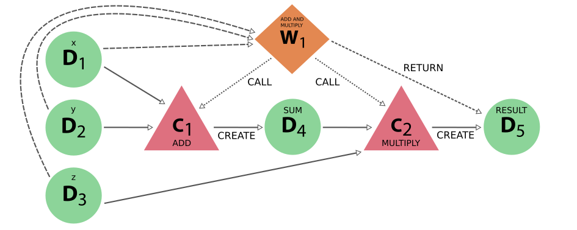
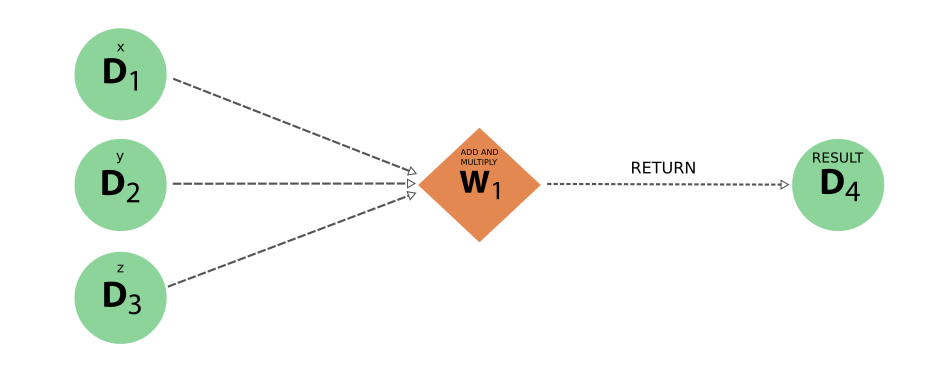

.. _concepts_workflows:

*******
Concept
*******

A workflow in AiiDA is a process (see the :ref:`process section<concepts_processes>` for details) that calls other workflows and calculations and optionally *returns* data and as such can encode the logic of a typical scientific workflow.
Currently, there are two ways of implementing a workflow process:

 * :ref:`work functions<concepts_workfunctions>`
 * :ref:`work chains<concepts_workchains>`

The first one is the simplest of the two and is basically a python function that is magically transformed into a process.
This is ideal for workflows that are not very computationally intensive and can be easily implemented in a python function.
For more complex workflows, the work chain is a better alternative.
By chaining work chains and work functions together, that each can run other sub processes, we can define a workflow.
For simplicity, from here on out, we will use the terms, workflows, work chains, and work functions interchangeably, as a *pars pro toto* and *totum pro parte*.

In the following sections, both concepts will be explained but without going too much into detail on how to implement or run them.
For a more detailed exposé, please refer to the respective advanced sections on :ref:`work functions<working_workfunctions>` and :ref:`work chains<working_workchains>`.

.. _concepts_workfunctions:

Work functions
==============

A work function is implemented just as a :ref:`calculation function<concepts_calcfunctions>`, however, they have very distinct use cases.
Since the work function is a 'workflow-like' process, it can only *return* existing data, whereas the calculation function creates a 'calculation-like' process which can only *create* new data.
This difference is addressed in greater detail in the :ref:`process<concepts_process_types>` section and it is very important that one understands this distinction.

To explain the use of the ``@workfunction``, we will continue with the example of the :ref:`calculation functions<concepts_calcfunctions>`, so before continuing, read that section first.
The example showed how the ``@calcfunction`` decorator can be used to create two functions that, for three given integers, computes the sum of the first two, which is then multiplied with the third, all the while keeping the provenance.
Even though the calculation functions ensured that the provenance of the data was kept, the logic of *who* called these functions was not explicitly kept.
From the provenance graph generated by the calculation functions, it is impossible to deduce whether the functions were called straight after another in a single script, or whether first the ``add`` function was called and a long time later, the output was used as an input for the ``multiply`` function.
Capturing this logical provenance of the *sequence of calls* of processes is exactly what workflow-like processes, such as the ``workfunction`` are designed for.

Consider the following example, where we implement a function called ``add_and_multiply`` that we decorate with the ``@workfunction`` decorator.

.. include:: include/snippets/workflows/workfunctions/add_multiply_workfunction_orchestrate.py
    :code: python

Instead of calling the calculation functions directly in the script, we call the work function, which then consecutively calls the calculation functions, passing the intermediate result from the first to the second.
If we look at the provenance graph generated by this example, we would see something like the following:

.. _fig_work_functions_provenance_add_multiply_full:
.. figure:: include/images/add_multiply_calcfunction_full.png

    The full provenance generated by the work function example

It is clear that this provenance graph contains a lot more information than the one for the calculation function example.
Whether this information is actually necessary or useful depends on the situation and is entirely up to the user, but there is a big advantage.
The strict separation between calculation-like and workflow-like processes and the different allowed links between them, as codified in the :ref:`provenance graph implementation<concepts_provenance_implementation>`, may seem a bit excessive at a first glance and to new users.
However, the addition of this parallel yet distinct workflow layer that represents the logical provenance, allows one to ignore all the details of the computation.
This is demonstrated by the provenance graph below, which is the exact same as the one before, except only data and workflow nodes are shown:

.. _fig_work_functions_provenance_add_multiply_logical:
.. figure:: include/images/add_multiply_calcfunction_logical.png

    The 'logical' provenance generated by the work function example, where only the workflow and data nodes, with their links, are shown

With this reduced representation, the big picture of how the original inputs led to the final result becomes immediately clear.
Conversely, none of the actual data provenance is lost.
In the figure below, all the workflow nodes are omitted and what we end up with is the exact same provenance graph as in :numref:`fig_calculation_functions_provenance_add_multiply` of the :ref:`original example<concepts_calcfunctions>` that only used calculation functions.

.. _fig_work_functions_provenance_add_multiply_data:
.. figure:: include/images/add_multiply_calcfunction_data.png

    The 'data' provenance generated by the work function example, where only the calculation and data nodes, with their links, are shown

In this simple example, the power of being able to select what part of the provenance graph one is interested in is obviously limited.
But workflows can quickly become complex and deeply nested, at which point the ability to group parts of the provenance graph together under a single node and effectively 'hide' its internal parts in a transparent way, becomes invaluable.

In addition to the orchestration role that the work function can fullfill, it can also be used as a filter or selection function.
Imagine that you want to write a process function that takes a set of input integer nodes and returns the one with the highest value.
We cannot employ the ``calcfunction`` for this, because it would have to return one of its input nodes, which is explicitly forbidden.
However, for the ``workfunction``, returning existing nodes, even one of its inputs, is perfectly fine.
An example implementation might look like the following:

.. include:: include/snippets/workflows/workfunctions/add_multiply_workfunction_select.py
    :code: python

The work function above will return the input node ``x`` as one of its outputs as it has the highest value.
The provenance of the execution of this select work function will look like the following:

.. _fig_work_functions_provenance_select:
.. figure:: include/images/select_workfunction.png

    The provenance generated by the work function that selects one of its input nodes

.. warning::
    It is important to realize once again that in the work function examples given above, all the nodes returned by the work functions are *already stored*.
    That is to say, they were either created by a calculation function called by the work function or were passed in as one of the inputs.
    This is no accident, as the work function **can** only return stored nodes.
    Trying to return a node that was created by the work function itself, will raise an exception.
    You can find a more detailed explanation for the reasoning behind this design choice in the documentation on the various :ref:`process types<concepts_process_types>` present in AiiDA and the :ref:`implementation of the provenance graph<concepts_provenance_implementation>`.

.. _concepts_workchains:

Work chains
===========

Why?
----

Now that we have demonstrated how easily ``workfunctions`` can be used to write your workflow that automatically keeps the provenance, it is time to confess that work functions are not perfect and have their shortcomings.
In the simple example of adding and multiplying numbers, the time to execute the functions is very short, but imagine that you are performing a more costly calculation, e.g. you want to run an actual ``CalcJob`` that will be submitted to the scheduler and may run for a long time.
If anywhere during the chain, the workflow is interrupted, for whatever reason, all progress is lost.
There are no 'checkpoints', so to speak, by simply chaining work functions together.

But fret not!
To tackle this problem, AiiDA defines the concept of the work chain.
As the name suggests, this construct is a way to chain multiple logical steps of a workflow together in a way that allows to save the progress between those steps as soon as they are successfully completed.
The work chain is therefore the preferred solution for parts of the workflow that involve more expensive and complex calculations.
To define a work chain, AiiDA provides the :py:class:`~aiida.engine.processes.workchains.workchain.WorkChain` class.

Implementation
--------------

If we were to reimplement our work function solution of the simple example problem of the previous section, but this time using a work chain, it would look something like the following:

.. include:: include/snippets/workflows/workchains/add_multiply_workchain_external_computation.py
    :code: python

Don't be intimidated by all the code in this snippet.
The point of this example is not to explain the exact syntax, which will be done in greater detail in the :ref:`advanced workflows<working_workchains>` section, but to merely introduce the concept of the work chain.
The core attributes of a work chain are defined by its :ref:`process specification<working_processes_spec>` which is setup in the :py:meth:`~aiida.engine.processes.process.Process.define` method.
The only thing you need to notice here, is that it defines the *inputs* that the work chain takes, its logical *outline* and the *outputs* that it will produce.
The steps of the outline are implemented as class methods of the work chain.
The ``add`` step will add the first two integers by calling the ``add`` calculation function, and store the sum temporarily in the :ref:`context<working_workchains_context>`.
The next step in the outline, ``multiply``, will take the sum stored in the context that was computed in the first outline step and call the ``multiply`` calculation function with the third input integer.
Finally, the ``result`` step will take the product produced by the previous step and record it as an output of the work chain.
The resulting provenance when we run this work chain looks like the following:

.. _fig_work_chains_provenance_add_multiply_workchain_full:

    The provenance generated by the work chain example calling calculation functions to perform the addition and multiplication.

As you can see, the produced provenance graph is identical to that of :numref:`fig_work_functions_provenance_add_multiply_full` that was produced by the work function solution, except that the workflow node is a work chain instead of a work function node.
Full data provenance is kept as the calculation of the sum and the product through the work chain are represented explicitly by the calculation nodes of the ``add`` and ``multiply`` calculation functions that are called.

.. warning::

    The usage of calculation functions for the computation of the sum and the product is not an accident, but a concious design choice.
    Since work chains are workflow-like processes and as such cannot *create* data, performing the calculations directly in the work chain outline steps itself, would result in a loss in the data provenance.

To illustrate what it means for worklow processes not being able to *create* new data and how doing so causes a loss of data provenance, let's change the previous implementation to perform the sum and product in the work chain outline steps itself, instead of calling the calculation functions.

.. include:: include/snippets/workflows/workchains/add_multiply_workchain_outline_computation.py
    :code: python

The resulting provenance would look like the following:

.. _fig_work_chains_provenance_add_multiply_workchain_logical:

    The provenance generated by the work chain example that computes the sum and product directly in its outline steps, instead of delegating it to calculation functions

Note how, in contrast with the provenance of the previous correct solution from :numref:`fig_work_chains_provenance_add_multiply_workchain_full`, there are no explicit calculation nodes representing the computation of the sum and the product.
Instead, all that computation is abstracted and represented by the single workflow node that represents the execution of the work chain.
The logic inside of those outline steps is then 'hidden' or 'encapsulated' in the provenance graph by a single workflow node.
Additionally, the output node representing the final product, only has a ``return`` link, even though it was *created* by the work chain.
This is because :ref:`workflow processes do not have the capacity to create new nodes<working_workfunctions_returning_data>`, and therefore in this example, the data provenance is lost.

An important thing to remember is that *any computation* that happens in the body of outline steps of a work chain, will not be explicitly represented, but will be encapsulated by a single node in the graph that represents that work chain execution.
Whether that loss of data provenance is relevant depends on the use case and is left to the developer of the workflow to determine.
These two examples demonstrate that AiiDA does not force any particular method, but allows the user to choose exactly what level of granularity they would like to maintain in the provenance.
However, the rule of thumb is that if you want to reduce the loss, or 'hiding' of provenance to a minimum, one should keep real computation within the body of work functions and work chains to a minimum and delegate that to calculations.
For any real computational work that is relevant to the data provenance, it is better to implement it in explicit calculation processes, usually a separate calculation function.

Advantages
----------
The work chain solution to the add-multiply problem requires significantly more code, compared to the work function solution presented in the beginning of this section.
Why should one then bother using the work chain?
The advantages for this trivial example may be difficult to see, but imagine the logic of the workflow becomes more complicated and the calculations become more intensive.
The process specification of the work chain provides a central way of defining the inputs and outputs, making it easy to see at a glance how the work chain operates.
In addition, the ``outline`` can give a succinct summary of the logical steps that the work chain will perform, all of which a work function does not have.
The outline in this example was trivially simple, but the :ref:`advanced work chain development section<working_workchains>` will show how complex logic can be implemented directly in the process specification.
The process specification also makes it easy to 'wrap' existing work chains into more complex work chains through the :ref:`expose functionality<working_workchains_expose_inputs_outputs>`.

Finally, as mentioned before, the work chain provides the possibility of checkpoints, i.e. to save progress at certain points from which the computation can be continued after it had been interrupted.
The state of the work chain is saved after each outline step.
If expensive calculation jobs are performed in an individual outline step, they will be saved as soon as they finish.
This is impossible for work functions, and if it were to be interrupted before *all* the computations had been completed, all intermediate progress would be lost.
The rule of thumb therefore is, as soon as the worfklow becomes only slightly complex or computationally intensive, preference should be given to :ref:`work chains<concepts_workchains>` and :ref:`calculation jobs<concepts_calcjobs>`.

This was a very quick overview of the intended use of work chains and how they work, but of course they have a lot more features.
To learn how to write work chains for real life problems, continue reading at the :ref:`work chain development<working_workchains>` section, but before you do, read the following part on when to use a work function and when it is better to use a work chain.

When to use which
=================
Now that we know how the two workflow components, work functions and work chains, work in AiiDA, you might wonder: when should I use which one?
For simple operations that do not take long, the simplicity of the work function may be all you need, so by all means use it.
However, a good rule of thumb is that as soon as the code is expected to take longer, for example when you want to launch a :ref:`calculation job<concepts_calcjobs>` or another complex workflow, it is always best to go for the work chain.
The automatic checkpointing, which guarantees that work between steps is saved, becomes very important.
But the work chain offers a lot more features than just checkpointing that may make it more preferable over the work function, which you can read about in the advanced :ref:`work chain development <working_workchains>` section.
