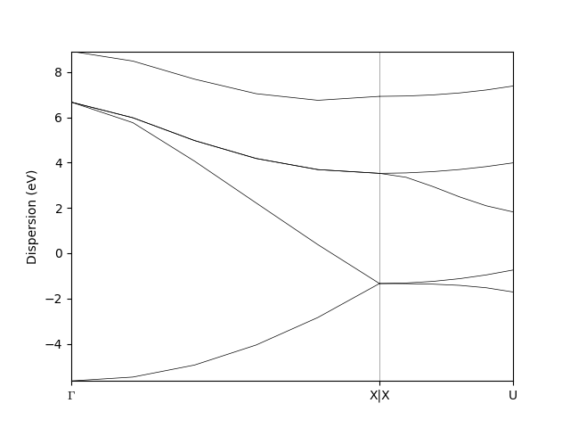

.. _bands:

BandsData
=========

``BandsData`` object is dedicated to store bands object of different types
(electronic bands, phonons). In this section we describe the usage of the
``BandsData`` to store the  electronic band structure of silicon
and some logic behind its methods.

To start working with ``BandsData`` we should import it using the
``DataFactory`` and create an object of type ``BandsData``::

    from aiida.plugins import DataFactory
    BandsData = DataFactory('array.bands')
    bs = BandsData()

To import the bands we need to make sure to have two arrays: one
containing kpoints and another containing bands. The shape of the kpoints object
should be ``nkpoints * 3``, while the shape of the bands should be
``nkpoints * nstates``. Let's assume the number of kpoints is 12, and the number
of states is 5. So the kpoints and the bands array will look as follows::

    import numpy as np
    kpoints = np.array(
           [[0.    , 0.    , 0.    ], # array shape is 12 * 3
           [0.1   , 0.    , 0.1   ],
           [0.2   , 0.    , 0.2   ],
           [0.3   , 0.    , 0.3   ],
           [0.4   , 0.    , 0.4   ],
           [0.5   , 0.    , 0.5   ],
           [0.5   , 0.    , 0.5   ],
           [0.525 , 0.05  , 0.525 ],
           [0.55  , 0.1   , 0.55  ],
           [0.575 , 0.15  , 0.575 ],
           [0.6   , 0.2   , 0.6   ],
           [0.625 , 0.25  , 0.625 ]])

    bands = np.array(
       [[-5.64024889,  6.66929678,  6.66929678,  6.66929678,  8.91047649], # array shape is 12 * 5, where 12 is the size of the kpoints mesh
       [-5.46976726,  5.76113772,  5.97844699,  5.97844699,  8.48186734],  # and 5 is the numbe of states
       [-4.93870761,  4.06179965,  4.97235487,  4.97235488,  7.68276008],
       [-4.05318686,  2.21579935,  4.18048674,  4.18048675,  7.04145185],
       [-2.83974972,  0.37738276,  3.69024464,  3.69024465,  6.75053465],
       [-1.34041116, -1.34041115,  3.52500177,  3.52500178,  6.92381041],
       [-1.34041116, -1.34041115,  3.52500177,  3.52500178,  6.92381041],
       [-1.34599146, -1.31663872,  3.34867603,  3.54390139,  6.93928289],
       [-1.36769345, -1.24523403,  2.94149041,  3.6004033 ,  6.98809593],
       [-1.42050683, -1.12604118,  2.48497007,  3.69389815,  7.07537154],
       [-1.52788845, -0.95900776,  2.09104321,  3.82330632,  7.20537566],
       [-1.71354964, -0.74425095,  1.82242466,  3.98697455,  7.37979746]])

To insert kpoints and bands in the ``bs`` object we should employ
``set_kpoints()`` and ``set_bands()`` methods::

    bs.set_kpoints(kpoints)
    bs.set_bands(bands, units='eV')

    bs.show_mpl() # to visualize the bands

From now the band structure can be visualized. Last thing that we may want to
add is the array of kpoint labels::

    labels = [(0, 'GAMMA'),
              (5, 'X'),
              (6, 'X'),
              (11, 'U')]

    bs.labels = labels
    bs.show_mpl() # to visualize the bands

The resulting band structure will look as follows

.. warning:: Once the ``bs`` object is stored (``bs.store()``) -- it won't
  accept any modifications.

Plotting the band structure
++++++++++++++++++++++++++++

You may notice that depending on how you assign the kpoints labels the output
of the ``show_mpl()`` method looks different. Please compare::

    bs.labels = [(0, 'GAMMA'),
              (5, 'X'),
              (6, 'Y'),
              (11, 'U')]
    bs.show_mpl()

    bs.labels = [(0, 'GAMMA'),
              (5, 'X'),
              (7, 'Y'),
              (11, 'U')]
    bs.show_mpl()

In the first case two neighboring kpoints with ``X`` and ``Y`` labels will look like
``X|Y``, while in the second case they will be separated by a certain distance.
The logic behind such a difference is the following. In the first case the
plotting method discovers the two neighboring kpoints and assumes them to be a
discontinuity point in the band structure (e.g. Gamma-X|Y-U). In the second case the
kpoints labelled ``X`` and ``Y`` are not neighbors anymore, so they are
plotted with a certain distance between them. The intervals between the kpoints on the X axis are
proportional to the cartesian distance between them.

Dealing with spins
++++++++++++++++++

The ``BandsData`` object can also deal with the results of spin-polarized calculations. Two
provide different bands for two different spins you should just merge them in
one array and import them again using the ``set_bands()`` method::

    bands_spins = [bands, bands-0.3] # to distinguish the bands of different spins we substitute 0.3 from the second band structure
    bs.set_bands(bands_spins, units='eV')
    bs.show_mpl()

Now the shape of the bands array becomes ``nspins * nkpoints * nstates``
