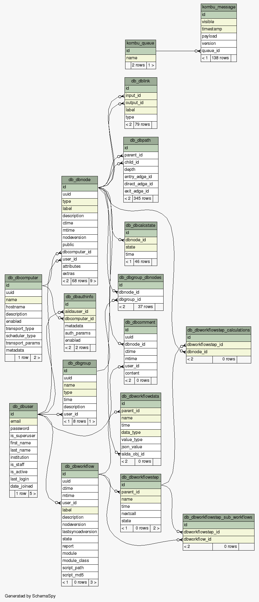

Database schema
+++++++++++++++

In this section we will give an overview of the database schema and more
specifically, we will focus on the SQLAlchemy specific schema.

In the following image you can see the tables of a fairly empty and new
AiiDA database.

The database table names are marked at the top of every table (in deep green),
the names of the the columns are below. The primary key of every table is
highlighted with light green and the columns that participate to an index
(apart from the index of the primary key) are highlighted with yellow color.

We will now briefly describe some of the database tables.

db_dbnode
---------
This table contains the information about all the Node instances stored in
AiiDA. Since the Node class has various sub-classes, there is a column (named
``type``) at the ``db_dbnode`` table that indicates the type of the node.

Other columns are the ``ctime`` and ``mtime`` that correspond to the creation
time and the modification time of the node. There are foreign keys that link
this table with the ``db_dbcomputer`` and the ``db_dbuser`` tables.

It is also worth noting the ``attributes`` and ``extras`` columns that are of
type JSONB. This type allows to store directly JSON snippets in such columns
while they can be indexed for fast searching.

db_dbuser
---------
The ``db_dbuser`` table contains user related information.  It is worth noting that
the stored password column contained hashed information.

db_dblink
---------
The AiiDA nodes are connected with links and form a graph. The links are stored
in the ``db_dblink`` table. The columns of that table contain the name of the
link, the id of the input & output nodes and the type of the node.

db_dbgroup & db_dbgroup_dbnodes
-------------------------------
The nodes can be grouped into groups. In the ``db_dbgroup`` table contains
information about the group like the name, the type and the description of the
group. The nodes that are contained in the group are stored in
``db_dbgroup_dbnodes`` table.

db_dbcomment
------------
In the ``db_dbcomment`` table comments made by users to specific nodes are
stored.
