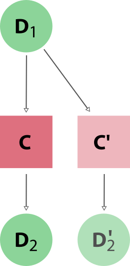

.. _how-to:run-codes:

*************************
How to run external codes
*************************

This how-to walks you through the steps of setting up a (possibly remote) compute resource, setting up a code on that computer and submitting a calculation through AiiDA (similar to the :ref:`introductory tutorial <tutorial:basic:calcjob>`, but in more detail).

To run an external code with AiiDA, you need an appropriate :ref:`calculation plugin <topics:plugins>`.
In the following, we assume that a plugin for your code is already available from the `aiida plugin registry <https://aiidateam.github.io/aiida-registry/>`_ and installed on your machine, e.g. using ``pip install aiida-quantumespresso``.
If a plugin for your code is not yet available, see :ref:`how-to:plugin-codes`.

Throughout the process you will be prompted for information on the computer and code.
In these prompts:

 * Type ``?`` followed by ``<enter>`` to get help on what is being asked at any prompt.
 * Press ``<CTRL>+C`` at any moment to abort the setup process.
   Your AiiDA database will remain unmodified.

.. note::

    The ``verdi`` commands use ``readline`` extensions to provide default answers, which require an advanced terminal.
    Use a standard terminal -- terminals embedded in some text editors (such as ``emacs``) have been known to cause problems.

.. _how-to:run-codes:computer:

How to set up a computer
========================

A |Computer| in AiiDA denotes a computational resource on which you will run your calculations.
It can either be:

 1. the machine where AiiDA is installed or
 2. any machine that is accessible via `SSH <https://en.wikipedia.org/wiki/Secure_Shell>`_ from the machine where AiiDA is installed (possibly :ref:`via a proxy server<how-to:ssh:proxy>`).

The second option allows managing multiple remote compute resources (including HPC clusters and cloud services) from the same AiiDA installation and moving computational jobs between them.

.. note::

    The second option requires access through an SSH keypair.
    If your compute resource demands two-factor authentication, you may need to install AiiDA directly on the compute resource instead.

Computer requirements
---------------------

Each computer must satisfy the following requirements:

* It runs a Unix-like operating system (Linux distros and MacOS should work fine)
* It has ``bash`` installed
* (optional) It has batch scheduler installed (see the :ref:`list of supported schedulers <topics:schedulers>`)

If you are configuring a remote computer, start by :ref:`configuring password-less SSH access <how-to:ssh>` to it.

.. note::

    AiiDA will use ``bash`` on the remote computer, regardless of the default shell.
    Please ensure that your remote ``bash`` configuration does not load a different shell.

.. _how-to:run-codes:computer:setup:

Computer setup
--------------

The configuration of computers happens in two steps: setting up the public metadata associated with the |Computer| in AiiDA provenance graphs, and configuring private connection details.

Start by creating a new computer instance in the database:

.. code-block:: console

    $ verdi computer setup

At the end, the command will open your default editor on a file containing a summary of the configuration up to this point.
You can add ``bash`` commands that will be executed

 * *before* the actual execution of the job (under 'Pre-execution script'), and
 * *after* the script submission (under 'Post execution script').

Use these additional lines to perform any further set up of the environment on the computer, for example loading modules or exporting environment variables:

.. code-block:: bash

    export NEWVAR=1
    source some/file

.. note::

    Don't specify settings here that are specific to a code or calculation: you can set further pre-execution commands at the ``Code`` and even ``CalcJob`` level.

When you are done editing, save and quit.
The computer has now been created in the database but you still need to *configure* access to it using your credentials.

.. tip::
    In order to avoid having to retype the setup information the next time around, you can provide some (or all) of the information via a configuration file:

    .. code-block:: console

       $ verdi computer setup --config computer.yml

    where ``computer.yml`` is a configuration file in the `YAML format <https://en.wikipedia.org/wiki/YAML#Syntax>`__.
    This file contains the information in a series of key-value pairs:

    .. code-block:: yaml

       ---
       label: "localhost"
       hostname: "localhost"
       transport: local
       scheduler: "direct"
       work_dir: "/home/max/.aiida_run"
       mpirun_command: "mpirun -np {tot_num_mpiprocs}"
       mpiprocs_per_machine: "2"
       prepend_text: |
          module load mymodule
          export NEWVAR=1

   The list of the keys for the ``yaml`` file is given by the options of the ``computer setup`` command:

   .. code-block:: console

      $ verdi computer setup --help

    Note: remove the ``--`` prefix and replace ``-`` within the keys with an underscore ``_``.

.. _how-to:run-codes:computer:configuration:

Computer connection configuration
---------------------------------

The second step configures private connection details using:

.. code-block:: console

    $ verdi computer configure TRANSPORTTYPE COMPUTERLABEL

Replace ``COMPUTERLABEL`` with the computer label chosen during the setup and replace ``TRANSPORTTYPE`` with the name of chosen transport type, i.e., ``local`` for the localhost computer and ``ssh`` for any remote computer.

After the setup and configuration have been completed, let's check that everything is working properly:

.. code-block:: console

    $ verdi computer test COMPUTERNAME

This command will perform various tests to make sure that AiiDA can connect to the computer, create new files in the scratch directory, retrieve files and query the job scheduler.

.. _how-to:run-codes:computer:connection:

Mitigating connection overloads
----------------------------------

Some compute resources, particularly large supercomputing centres, may not tolerate submitting too many jobs at once, executing scheduler commands too frequently or opening too many SSH connections.

  * Limit the number of jobs in the queue.

    Set a limit for the maximum number of workflows to submit, and only submit new ones once previous workflows start to complete.
    The supported number of jobs depends on the supercomputer configuration which may be documented as part of the center's user documentation.
    The supercomputer administrators may also find the information found on `this page <https://github.com/aiidateam/aiida-core/wiki/Optimising-the-SLURM-scheduler-configuration-(for-cluster-administrators)>`_ useful.

  * Increase the time interval between polling the job queue.

    The time interval (in seconds) can be set through the Python API by loading the corresponding |Computer| node, e.g. in the ``verdi shell``:

    .. code-block:: python

        load_computer('fidis').set_minimum_job_poll_interval(30.0)

  * Increase the connection cooldown time.

    This is the minimum time (in seconds) to wait between opening a new connection.
    Modify it for an existing computer using:

    .. code-block:: bash

      verdi computer configure ssh --non-interactive --safe-interval <SECONDS> <COMPUTER_NAME>

.. important::

    The two intervals apply *per daemon worker*, i.e. doubling the number of workers may end up putting twice the load on the remote computer.

Managing your computers
-----------------------

Fully configured computers can be listed with:

.. code-block:: console

    $ verdi computer list

To get detailed information on the specific computer named ``COMPUTERLABEL``:

.. code-block:: console

    $ verdi computer show COMPUTERLABEL

To rename a computer or remove it from the database:

.. code-block:: console

    $ verdi computer rename OLDCOMPUTERLABEL NEWCOMPUTERLABEL
    $ verdi computer delete COMPUTERLABEL

.. note::

    Before deleting a |Computer|, you will need to delete *all* nodes linked to it (e.g. any ``CalcJob`` and ``RemoteData`` nodes).
    Otherwise, AiiDA will prevent you from doing so in order to preserve provenance.

If a remote machine is under maintenance (or no longer operational), you may want to **disable** the corresponding |Computer|.
Doing so will prevent AiiDA from connecting to the given computer to check the state of calculations or to submit new calculations.

.. code-block:: console

    $ verdi computer disable COMPUTERLABEL
    $ verdi computer enable COMPUTERLABEL

.. _how-to:run-codes:code:

How to setup a code
===================

Once your computer is configured, you can set up codes on it.

AiiDA stores a set of metadata for each code, which is attached automatically to each calculation using it.
Besides being important for reproducibility, this also makes it easy to query for all calculations that were run with a given code (for instance, if a specific version is found to contain a bug).

.. _how-to:run-codes:code:setup:

Setting up a code
-----------------

The ``verdi code`` CLI is the access point for managing codes in AiiDA.
To setup a new code, execute:

.. code-block:: console

    $ verdi code setup

and you will be guided through a process to setup your code.

.. admonition:: On remote and local codes
    :class: tip title-icon-lightbulb

    In most cases, it is advisable to install the executables to be used by AiiDA on the target machine *before* submitting calculations using them in order to take advantage of the compilers and libraries present on the target machine.
    This setup is referred to as *remote* codes (``Installed on target computer?: True``).

    Occasionally, you may need to run small, reasonably machine-independent scripts (e.g. Python or bash), and copying them manually to a number of different target computers can be tedious.
    For this use case, AiiDA provides *local* codes (``Installed on target computer?: False``).
    Local codes are stored in the AiiDA file repository and copied to the target computer for every execution.

    Do *not* use local codes as a way of encapsulating the environment of complex executables.
    Containers are a much better solution to this problem, and we are working on adding native support for containers in AiiDA.

At the end of these steps, you will be prompted to edit a script, where you can include ``bash`` commands that will be executed

 * *before* running the submission script (after the 'Pre execution script' lines), and
 * *after* running the submission script (after the 'Post execution script' separator).

Use this for instance to load modules or set variables that are needed by the code, such as:

.. code-block:: bash

    module load intelmpi

At the end, you receive a confirmation, with the *PK* and the *UUID* of your new code.

.. admonition:: Using configuration files
    :class: tip title-icon-lightbulb

    Analogous to a :ref:`computer setup <how-to:run-codes:computer>`, some (or all) the information described above can be provided via a configuration file:

    .. code-block:: console

        $ verdi code setup --config code.yml

    where ``code.yml`` is a configuration file in the `YAML format <https://en.wikipedia.org/wiki/YAML#Syntax>`_.

    This file contains the information in a series of key:value pairs:

    .. code-block:: yaml

        ---
        label: "qe-6.3-pw"
        description: "quantum_espresso v6.3"
        input_plugin: "quantumespresso.pw"
        on_computer: true
        remote_abs_path: "/path/to/code/pw.x"
        computer: "localhost"
        prepend_text: |
        module load module1
        module load module2
        append_text: " "

    The list of the keys for the ``yaml`` file is given by the available options of the ``code setup`` command:

        .. code-block:: console

            $ verdi code setup --help

    Note: remove the ``--`` prefix and replace ``-`` within the keys with an underscore ``_``.

Managing codes
--------------

You can change the label of a code by using the following command:

.. code-block:: console

    $ verdi code relabel <IDENTIFIER> "new-label"

where <IDENTIFIER> can be the numeric *PK*, the *UUID* or the label of the code (either ``label`` or ``label@computername``) if the label is unique.

You can also list all available codes and their identifiers with:

.. code-block:: console

    $ verdi code list

which also accepts flags to filter only codes on a given computer, or only codes using a specific plugin, etc. (use the ``-h`` option).

You can get the information of a specific code with:

.. code-block:: console

    $ verdi code show <IDENTIFIER>

Finally, to delete a code use:

.. code-block:: console

    $ verdi code delete <IDENTIFIER>

(only if it wasn't used by any calculation, otherwise an exception is raised).

.. note::

    Codes are a subclass of :py:class:`Node <aiida.orm.nodes.Node>` and, as such, you can attach ``extras`` to a code, for example:

    .. code-block:: python

        load_code('<IDENTIFIER>').set_extra('version', '6.1')
        load_code('<IDENTIFIER>').set_extra('family', 'cp2k')

    These can be useful for querying, for instance in order to find all runs done with the CP2K code of version 6.1 or later.

.. _how-to:run-codes:submit:

How to submit a calculation
===========================

After :ref:`setting up your computer <how-to:run-codes:computer>` and :ref:`setting up your code <how-to:run-codes:code:setup>`, you are ready to launch your calculations!

 * Make sure the daemon is running:

    .. code-block:: bash

        verdi daemon status

 * Figure out which inputs your |CalcJob|  plugin needs, e.g. using:

    .. code-block:: bash

        verdi plugin list aiida.calculations arithmetic.add

 * Write a ``submit.py`` script:

    .. code-block:: python

        from aiida.engine import submit

        code = load_code('add@localhost')
        builder = code.get_builder()
        builder.x = Int(4)
        builder.y = Int(5)
        builder.metadata.options.withmpi = False
        builder.metadata.options.resources = {
            'num_machines': 1,
            'num_mpiprocs_per_machine': 1,

        }
        builder.metadata.description = "My first calculation."

        print(submit(builder))

    Of course, the code label and builder inputs need to be adapted to your code and calculation.

 * Submit your calculation to the AiiDA daemon:

    .. code-block:: bash

        verdi run submit.py

After this, use ``verdi process list`` to monitor the status of the calculations.

See :ref:`topics:processes:usage:launching` and :ref:`topics:processes:usage:monitoring` for more details.

.. _how-to:run-codes:caching:

How to save computational resources using caching
=================================================

There are numerous reasons why you might need to re-run calculations you have already run before.
Maybe you run a great number of complex workflows in high-throughput that each may repeat the same calculation, or you may have to restart an entire workflow that failed somewhere half-way through.
Since AiiDA stores the full provenance of each calculation, it can detect whether a calculation has been run before and, instead of running it again, simply reuse its outputs, thereby saving valuable computational resources.
This is what we mean by **caching** in AiiDA.

.. _how-to:run-codes:caching:enable:

How to enable caching
---------------------

Caching is **not enabled by default**.
The reason is that it is designed to work in an unobtrusive way and simply save time and valuable computational resources.
However, this design is a double-egded sword, in that a user that might not be aware of this functionality, can be caught off guard by the results of their calculations.

.. important::

    The caching mechanism comes with some limitations and caveats that are important to understand.
    Refer to the :ref:`topics:provenance:caching:limitations` section for more details.

In order to enable caching for your profile (here called ``aiida_profile``), place the following ``cache_config.yml`` file in your ``.aiida`` configuration folder:

.. code-block:: yaml

    aiida_profile:
        default: True

From this point onwards, when you launch a new calculation, AiiDA will compare its hash (depending both on the type of calculation and its inputs, see :ref:`topics:provenance:caching:hashing`) against other calculations already present in your database.
If another calculation with the same hash is found, AiiDA will reuse its results without repeating the actual calculation.

In order to ensure that the provenance graph with and without caching is the same, AiiDA creates both a new calculation node and a copy of the output data nodes as shown in :numref:`fig_caching`.

.. _fig_caching:

    When reusing the results of a calculation **C** for a new calculation **C'**, AiiDA simply makes a copy of the result nodes and links them up as usual.

.. note::

    AiiDA uses the *hashes* of the input nodes **D1** and **D2** when searching the calculation cache.
    That is to say, if the input of **C'** were new nodes **D1'** and **D2'** with the same content (hash) as **D1**, **D2**, the cache would trigger as well.

.. _how-to:run-codes:caching:configure:

How to configure caching
------------------------

The caching mechanism can be configured on a process class level, meaning the rules will automatically be applied to all instances of the given class, or on a per-instance level, meaning it can be controlled for individual process instances when they are launch.

Class level
...........

Besides an on/off switch per profile, the ``.aiida/cache_config.yml`` provides control over caching at the level of specific calculations using their corresponding entry point strings (see the output of ``verdi plugin list aiida.calculations``):

.. code-block:: yaml

    aiida_profile:
        default: False
        enabled:
            - aiida.calculations:quantumespresso.pw
        disabled:
            - aiida.calculations:templatereplacer

In this example, where ``aiida_profile`` is the name of the profile, caching is disabled by default, but explicitly enabled for calculaions of the ``PwCalculation`` class, identified by its corresponding ``aiida.calculations:quantumespresso.pw`` entry point string.
It also shows how to disable caching for particular calculations (which has no effect here due to the profile-wide default).

For calculations which do not have an entry point, you need to specify the fully qualified Python name instead.
For example, the ``seekpath_structure_analysis`` calcfunction defined in ``aiida_quantumespresso.workflows.functions.seekpath_structure_analysis`` is labeled as ``aiida_quantumespresso.workflows.functions.seekpath_structure_analysis.seekpath_structure_analysis``.
From an existing :class:`~aiida.orm.nodes.process.calculation.CalculationNode`, you can get the identifier string through the ``process_type`` attribute.

The caching configuration also accepts ``*`` wildcards.
For example, the following configuration enables caching for all calculation entry points defined by ``aiida-quantumespresso``, and the ``seekpath_structure_analysis`` calcfunction.
Note that the ``*.seekpath_structure_analysis`` entry needs to be quoted, because it starts with ``*`` which is a special character in YAML.

.. code-block:: yaml

    aiida_profile:
        default: False
        enabled:
            - aiida.calculations:quantumespresso.*
            - '*.seekpath_structure_analysis'

Any entry with a wildcard is overridden by a more specific entry.
The following configuration enables caching for all ``aiida.calculation`` entry points, except those of ``aiida-quantumespresso``:

.. code-block:: yaml

    aiida_profile:
        default: False
        enabled:
            - aiida.calculations:*
        disabled:
            - aiida.calculations:quantumespresso.*

Instance level
..............

Caching can be enabled or disabled on a case-by-case basis by using the :class:`~aiida.manage.caching.enable_caching` or :class:`~aiida.manage.caching.disable_caching` context manager, respectively, regardless of the profile settings:

.. code-block:: python

    from aiida.engine import run
    from aiida.manage.caching import enable_caching
    with enable_caching(identifier='aiida.calculations:templatereplacer'):
        run(...)

.. warning::

    This affects only the current Python interpreter and won't change the behavior of the daemon workers.
    This means that this technique is only useful when using :py:class:`~aiida.engine.run`, and **not** with :py:class:`~aiida.engine.submit`.

If you suspect a node is being reused in error (e.g. during development), you can also manually *prevent* a specific node from being reused:

#. Load one of the nodes you suspect to be a clone.
   Check that :meth:`~aiida.orm.nodes.Node.get_cache_source` returns a UUID.
   If it returns `None`, the node was not cloned.

#. Clear the hashes of all nodes that are considered identical to this node:

    .. code:: python

        for node in node.get_all_same_nodes():
            node.clear_hash()

#. Run your calculation again.
   The node in question should no longer be reused.

.. |Computer| replace:: :py:class:`~aiida.orm.Computer`
.. |CalcJob| replace:: :py:class:`~aiida.engine.processes.calcjobs.calcjob.CalcJob`
