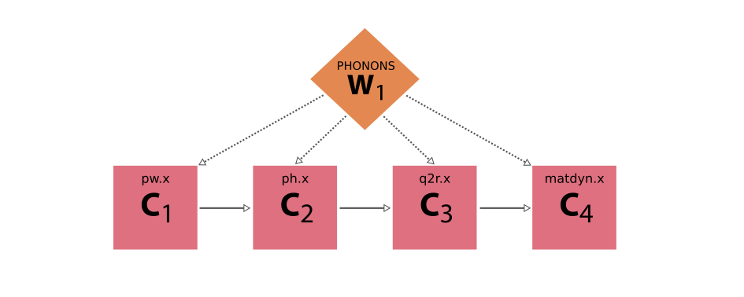
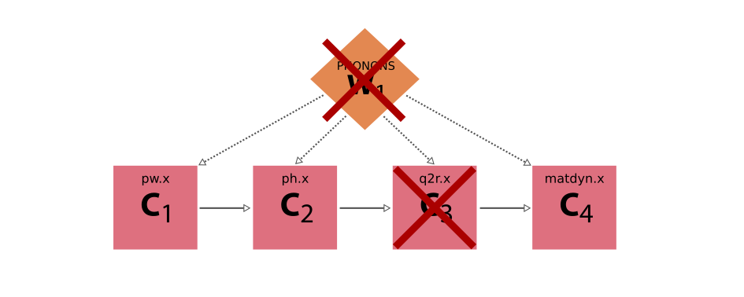
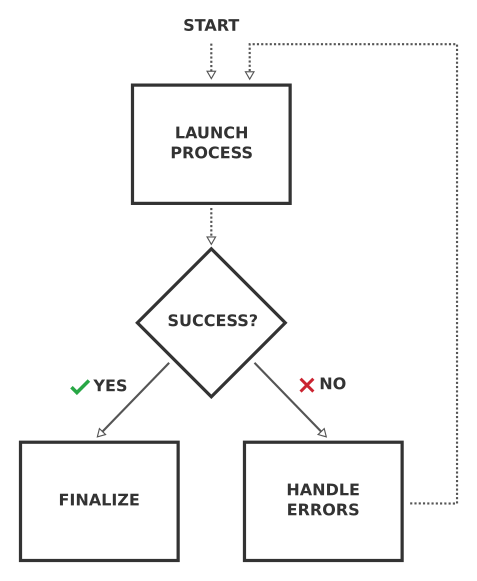

.. _how-to:restart-workchain:

**************************************
How to write error-resistant workflows
**************************************

.. admonition:: Overview

    This how-to introduces the :py:class:`~aiida.engine.processes.workchains.restart.BaseRestartWorkChain`, and how it can be sub-classed to handle known failure modes of processes and calculations.

In the :ref:`how-to on writing workflows <how-to:write-workflows>` we discussed how to write a simple multi-step workflow using work chains.
However, there is one thing that we did not consider there:

    What if a calculation step fails?

For example with the :py:class:`~aiida.workflows.arithmetic.multiply_add.MultiplyAddWorkChain`; it launches a :py:class:`~aiida.calculations.arithmetic.add.ArithmeticAddCalculation`.
If that were to fail, the work chain would except because the line ``self.ctx.addition.outputs.sum`` will raise an ``AttributeError``.
In this case, where the work chain just runs a single calculation, that is not such a big deal but for real-life work chains that run a number of calculations in sequence, having the work chain except will cause all the work up to that point to be lost.
Take as an example a workflow that computes the phonons of a crystal structure using Quantum ESPRESSO:

    Schematic diagram of a workflow that computes the phonons of a crystal structure using Quantum ESPRESSO.
    The workflow consists of four consecutive calculations using the ``pw.x``, ``ph.x``, ``q2r.x`` and ``matdyn.x`` code, respectively.

If all calculations run without problems, the workflow itself will of course also run fine and produce the desired final result.
But, now imagine the third calculation actually fails.
If the workflow does not explicitly check for this failure, but instead blindly assumes that the calculation have produced the required results, it will fail itself, losing the progress it made with the first two calculations.

    Example execution of the Quantum ESPRESSO phonon workflow where the third step, the ``q2r.x`` code, failed, and because the workflow blindly assumed it would have finished without errors also fails.

The solution seems simple then.
After each calculation, we simply add a check to verify that it finished successfully and produced the required outputs before continuing with the next calculation.
What do we do, though, when the calculation failed?
Depending on the cause of the failure, we might actually be able to fix the problem, and re-run the calculation, potentially with corrected inputs.
A common example is that the calculation ran out of wall time (requested time from the job scheduler) and was cancelled by the job scheduler.
In this case, simply restarting the calculation (if the code supports restarts), and optionally giving the job more wall time or resources, may fix the problem.

You might be tempted to add this error handling directly into the workflow.
However, this requires implementing the same error-handling code many times in other workflows that just happen to run the same codes.
For example, we could add the error handling for the ``pw.x`` code directly in our phonon workflow, but a structure optimization workflow will also have to run ``pw.x`` and will have to implement the same error-handling logic.
Is there a way that we can implement this once and easily reuse it in various workflows?

Yes! Instead of directly running a calculation in a workflow, one should rather run a work chain that is explicitly designed to run the calculation to completion.
This *base* work chain knows about the various failure modes of the calculation and can try to fix the problem and restart the calculation whenever it fails, until it finishes successfully.
This logic of such a base work chain is very generic and can be applied to any calculation, and actually any process:

    Schematic flow diagram of the logic of a *base* work chain, whose job it is to run a subprocess repeatedly, fixing any potential errors, until it finishes successfully.

The work chain runs the subprocess.
Once it has finished, it then inspects the status.
If the subprocess finished successfully, the work chain returns the results and its job is done.
If, instead, the subprocess failed, the work chain should inspect the cause of failure, and attempt to fix the problem and restart the subprocess.
This cycle is repeated until either the subprocess finishes successfully or a maximum number of iterations is reached.

Since this is such a common logical flow for a base work chain that wraps another :py:class:`~aiida.engine.processes.process.Process` and restarts it until it is finished successfully, we have implemented it as an abstract base class in ``aiida-core``.
The :py:class:`~aiida.engine.processes.workchains.restart.BaseRestartWorkChain` implements the logic of the flow diagram shown above.
Although the ``BaseRestartWorkChain`` is a subclass of :py:class:`~aiida.engine.processes.workchains.workchain.WorkChain` itself, you cannot launch it.
The reason is that it is completely general and so does not know which :py:class:`~aiida.engine.processes.process.Process` class it should run.
Instead, to make use of the base restart work chain, you should subclass it for the process class that you want to wrap.

Running a ``BaseRestartWorkChain``
==================================

Many plugin packages have already implemented a ``BaseRestartWorkChain`` for the codes they support, such as the ``PwBaseWorkChain`` in ``aiida-quantumespresso`` or the ``Cp2kBaseWorkChain`` in ``aiida-cp2k``.
The inputs will depend on the calculation and choices of the developer, but there are several default inputs you can configure to control the behavior of any ``BaseRestartWorkChain``.

Specifying the maximum number of iterations
--------------------------------------------

To prevent a work chain from entering an infinite loop if it never manages to fix the problem, the ``BaseRestartWorkChain`` limits the maximum number of times the subprocess can be restarted.
This is controlled by the ``max_iterations`` input, which defaults to ``5``:

.. code-block:: python

    from aiida.orm import Int

    inputs = {
        'process_inputs': {
            'input_1': value_1,
            'input_2': value_2
        },
        'max_iterations': Int(10)
    }
    submit(SomeBaseWorkChain, **inputs)

If the subprocess fails and is restarted repeatedly until ``max_iterations`` is reached without succeeding, the work chain will abort with exit code ``401`` (``ERROR_MAXIMUM_ITERATIONS_EXCEEDED``).

Handler overrides
-----------------

It is possible to change the priority of handlers and enable/disable them without changing the source code of the work chain.
These properties of the handlers can be controlled through the ``handler_overrides`` input of the work chain.
This input takes a ``Dict`` node, that has the following form:

.. code-block:: python

    handler_overrides = Dict({
        'handler_negative_sum': {   # Insert the name of the process handler here
            'enabled': True,
            'priority': 10000
        }
    })

As you can see, the keys are the name of the handler to affect and the value is a dictionary that can take two keys: ``enabled`` and ``priority``.
To enable or disable a handler, set ``enabled`` to ``True`` or ``False``, respectively.
The ``priority`` key takes an integer and determines the priority of the handler.
Note that the values of the ``handler_overrides`` are fully optional and will override the values configured by the process handler decorator in the source code of the work chain.
The changes also only affect the work chain instance that receives the ``handler_overrides`` input, all other instances of the work chain that will be launched will be unaffected.

Configuring unhandled failure behavior
--------------------------------------

.. versionadded:: 2.8

    Before v2.8, a ``BaseRestartWorkChain`` would always restart once for an unhandled failure.

There may be cases where a process experience a failure that has no corresponding error handler, but you still want to restart the process.
A typical example here is a node failure, where you simply want to restart the process without any changes to the input.
By default, a ``BaseRestartWorkChain`` will abort when it encounters a failure it cannot handle, but this behaviour can be changed through the ``on_unhandled_failure`` input.
The options are:

``abort`` (default)
    The work chain immediately aborts with exit code ``402`` (``ERROR_UNHANDLED_FAILURE``).
    This is the most conservative option and prevents wasting computational resources by rerunning calculations that will likely fail again with the same inputs.

``pause``
    The work chain pauses for user inspection.
    This allows you to examine the failed subprocess and decide whether to continue or abort.
    When paused, you can:

    - Use ``verdi process report <PK>`` to inspect the work chain's progress and error messages.
    - Use ``verdi process play <PK>`` to resume the work chain (e.g., if the failure was due to a transient issue like a node failure).
    - Use ``verdi process kill <PK>`` to abort the work chain if the problem cannot be resolved.

``restart_once``
    The work chain will automatically restart the subprocess once.
    If the subprocess fails again with another unhandled failure, the work chain aborts with ``ERROR_UNHANDLED_FAILURE``.

``restart_and_pause``
    The work chain combines the previous two strategies: it restarts the subprocess once, and if that also results in an unhandled failure, it pauses for user inspection rather than aborting.
    This provides a balance between automatic recovery and user control.

.. seealso::

    You may be wondering if it's also possible to change the inputs and restart after inspecting the failure of a paused ``BaseRestartWorkChain``.
    This is currently not yet possible, but we're exploring this possibility, see `the following blog post <https://aiida.net/news/posts/2025-11-21-human-in-the-loop.html>`_.

Writing a base restart work chain
=================================

In this how-to, we will show how to implement the ``BaseRestartWorkChain`` for the :py:class:`~aiida.calculations.arithmetic.add.ArithmeticAddCalculation`.
We start by importing the relevant base classes and create a subclass:

.. code-block:: python

    from aiida.engine import BaseRestartWorkChain
    from aiida.plugins import CalculationFactory

    ArithmeticAddCalculation = CalculationFactory('core.arithmetic.add')

    class ArithmeticAddBaseWorkChain(BaseRestartWorkChain):

        _process_class = ArithmeticAddCalculation

As you can see, all we had to do is create a subclass of the ``BaseRestartWorkChain`` class, which we called ``ArithmeticAddBaseWorkChain``, and set the ``_process_class`` class attribute to ``ArithmeticAddCalculation``.
The latter instructs the work chain what type of process it should launch.
Next, as with all work chains, we should *define* its process specification:

.. code-block:: python

    from aiida import orm
    from aiida.engine import while_

    @classmethod
    def define(cls, spec):
        """Define the process specification."""
        super().define(spec)
        spec.input('x', valid_type=(orm.Int, orm.Float), help='The left operand.')
        spec.input('y', valid_type=(orm.Int, orm.Float), help='The right operand.')
        spec.input('code', valid_type=orm.AbstractCode, help='The code to use to perform the summation.')
        spec.output('sum', valid_type=(orm.Int, orm.Float), help='The sum of the left and right operand.')
        spec.outline(
            cls.setup,
            while_(cls.should_run_process)(
                cls.run_process,
                cls.inspect_process,
            ),
            cls.results,
        )

The inputs and output that we define are essentially determined by the sub process that the work chain will be running.
Since the ``ArithmeticAddCalculation`` requires the inputs ``x`` and ``y``, and produces the ``sum`` as output, we `mirror` those in the specification of the work chain, otherwise we wouldn't be able to pass the necessary inputs.
Finally, we define the logical outline.
We start by *setting up* the work chain and then enter a loop: *while* the subprocess has not yet finished successfully *and* we haven't exceeded the maximum number of iterations, we *run* another instance of the process and then *inspect* the results.
The while conditions are implemented in the ``should_run_process`` outline step.
When the process finishes successfully or we have to abandon, we report the *results*.
Now unlike with normal work chain implementations, we *do not* have to implement these outline steps ourselves.
They have already been implemented by the ``BaseRestartWorkChain`` so that we don't have to.
This is why the base restart work chain is so useful, as it saves us from writing and repeating a lot of `boilerplate code <https://en.wikipedia.org/wiki/Boilerplate_code>`__.

.. warning::

    This minimal outline definition is required for the work chain to work properly.
    If you change the logic, the names of the steps or omit some steps, the work chain will not run.
    Adding extra outline steps to add custom functionality, however, is fine and actually encouraged if it makes sense.

The last part of the puzzle is to define in the setup what inputs the work chain should pass to the subprocess.
You might wonder why this is necessary, because we already define the inputs in the specification, but those are not the only inputs that will be passed.
The ``BaseRestartWorkChain`` also defines some inputs of its own, such as ``max_iterations`` as you can see in its :py:meth:`~aiida.engine.processes.workchains.restart.BaseRestartWorkChain.define` method.
To make it absolutely clear what inputs are intended for the subprocess, we define them as a dictionary in the context under the key ``inputs``.
One way of doing this is to reuse the :py:meth:`~aiida.engine.processes.workchains.restart.BaseRestartWorkChain.setup` method:

.. code-block:: python

    def setup(self):
        """Call the `setup` of the `BaseRestartWorkChain` and then create the inputs dictionary in `self.ctx.inputs`.

        This `self.ctx.inputs` dictionary will be used by the `BaseRestartWorkChain` to submit the process in the
        internal loop.
        """
        super().setup()
        self.ctx.inputs = {'x': self.inputs.x, 'y': self.inputs.y, 'code': self.inputs.code}

Note that, as explained before, the ``setup`` step forms a crucial part of the logical outline of any base restart work chain.
Omitting it from the outline will break the work chain, but so will overriding it completely, except as long as we call the ``super``.

This is all the code we have to write to have a functional work chain.
We can now launch it like any other work chain and the ``BaseRestartWorkChain`` will work its magic:

.. code-block:: python

    submit(ArithmeticAddBaseWorkChain, x=Int(3), y=Int(4), code=load_code('add@tutor'))

Once the work chain finished, we can inspect what has happened with, for example, ``verdi process status``:

.. code-block:: console

    $ verdi process status 1909
    ArithmeticAddBaseWorkChain<1909> Finished [0] [2:results]
        └── ArithmeticAddCalculation<1910> Finished [0]

As you can see the work chain launched a single instance of the ``ArithmeticAddCalculation`` which finished successfully, so the job of the work chain was done as well.

.. note::

    If the work chain excepted, make sure the directory containing the WorkChain definition is in the ``PYTHONPATH``.

    You can add the folder in which you have your Python file defining the WorkChain to the ``PYTHONPATH`` through:

    .. code-block:: bash

        $ export PYTHONPATH=/path/to/workchain/directory/:$PYTHONPATH

    After this, it is **very important** to restart the daemon:

    .. code-block:: bash

        $ verdi daemon restart

    Indeed, when updating an existing work chain file or adding a new one, it is **necessary** to restart the daemon **every time** after all changes have taken place.

Exposing inputs and outputs
---------------------------

Any base restart work chain *needs* to *expose* the inputs of the subprocess it wraps, and most likely *wants* to do the same for the outputs it produces, although the latter is not necessary.
For the simple example presented in the previous section, simply copy-pasting the input and output port definitions of the subprocess ``ArithmeticAddCalculation`` was not too troublesome.
However, this quickly becomes tedious, and more importantly, error-prone once you start to wrap processes with quite a few more inputs.
To prevent the copy-pasting of input and output specifications, the :class:`~aiida.engine.processes.process_spec.ProcessSpec` class provides the :meth:`~plumpy.ProcessSpec.expose_inputs` and :meth:`~plumpy.ProcessSpec.expose_outputs` methods:

.. code-block:: python

    @classmethod
    def define(cls, spec):
        """Define the process specification."""
        super().define(spec)
        spec.expose_inputs(ArithmeticAddCalculation, namespace='add')
        spec.expose_outputs(ArithmeticAddCalculation)
        ...

.. seealso::

    For more detail on exposing inputs and outputs, see the basic :ref:`Workchain usage section <topics:workflows:usage:workchains:expose_inputs_outputs>`.

That takes care of exposing the port specification of the wrapped process class in a very efficient way.
To efficiently retrieve the inputs that have been passed to the process, one can use the :meth:`~aiida.engine.processes.process.Process.exposed_inputs` method.
Note the past tense of the method name.
The method takes a process class and an optional namespace as arguments, and will return the inputs that have been passed into that namespace when it was launched.
This utility now allows us to simplify the ``setup`` outline step that we have shown before:

.. code-block:: python

    def setup(self):
        """Call the `setup` of the `BaseRestartWorkChain` and then create the inputs dictionary in `self.ctx.inputs`.

        This `self.ctx.inputs` dictionary will be used by the `BaseRestartWorkChain` to submit the process in the
        internal loop.
        """
        super().setup()
        self.ctx.inputs = self.exposed_inputs(ArithmeticAddCalculation, 'add')

This way we don't have to manually fish out all the individual inputs from the ``self.inputs`` but have to just call this single method, saving a lot of time and lines of code.

When submitting or running the work chain using namespaced inputs (``add`` in the example above), it is important to use the namespace:

.. code-block:: python

    inputs = {
        'add': {
            'x': Int(3),
            'y': Int(4),
            'code': load_code('add@tutor')
        }
    }
    submit(ArithmeticAddBaseWorkChain, **inputs)

.. important::

    Every time you make changes to the ``ArithmeticAddBaseWorkChain``, don't forget to restart the daemon with:

    .. code-block:: bash

        $ verdi daemon restart

Customizing outputs
-------------------

By default, the ``BaseRestartWorkChain`` will attach the exposed outputs of the last completed calculation job.
In most cases this is the correct behavior, but there might be use-cases where one wants to modify exactly what outputs are attached to the work chain.
This can be achieved by overriding the :meth:`aiida.engine.processes.workchains.restart.BaseRestartWorkChain.get_outputs` method.
For example, if you want to remove a particular output from being attached, you can do the following:

.. code-block:: python

    def get_outputs(self, node) -> Mapping[str, orm.Node]:
        """Return a mapping of the outputs that should be attached as outputs to the work chain."""
        outputs = super().get_outputs(node)
        outputs.pop('some_output', None)
        return outputs

It is also possible to update the contents of one of the outputs returned by the last completed calculation job.
In this case, it is important to go through a ``calcfunction``, as always, as to not lose any provenance.

Attaching outputs
-----------------

In a normal run, the ``results`` method is the last step in the outline of the ``BaseRestartWorkChain``.
In this step, the outputs of the last completed calculation job are "attached" to the work chain itself.
The attaching of the outputs is implemented by the :meth:`~aiida.engine.processes.workchains.restart.BaseRestartWorkChain._attach_outputs` method.
If the outputs need to be attached at a point in the workflow other then the ``results`` step, this method can be called manually.
An example would be to call it in a process handler that will abort the work chain.
In this case the work chain will be stopped immediately and the ``results`` step would no longer be called.

Error handling
--------------

So far you have seen how easy it is to get a work chain up and running that will run a subprocess using the ``BaseRestartWorkChain``.
However, the whole point of this exercise, as described in the introduction, was for the work chain to be able to deal with *failing* processes, yet in the previous example it finished without any problems.

    What would have happened if the subprocess had failed?

If the computed sum of the inputs ``x`` and ``y`` is negative, the ``ArithmeticAddCalculation`` fails with exit code ``410`` which corresponds to ``ERROR_NEGATIVE_NUMBER``.

.. seealso::

    The :ref:`exit code usage section<topics:processes:usage:exit_codes>`, for a more detailed explanation of exit codes.

Let's launch the work chain with inputs that will cause the calculation to fail, e.g. by making one of the operands negative, and see what happens:

.. code-block:: python

    submit(ArithmeticAddBaseWorkChain, add={'x': Int(3), 'y': Int(-4), 'code': load_code('add@tutor')})

This time we will see that the work chain takes quite a different path:

.. code-block:: console

    $ verdi process status 1930
    ArithmeticAddBaseWorkChain<1930> Finished [402] [1:while_(should_run_process)(1:inspect_process)]
        └── ArithmeticAddCalculation<1931> Finished [410]

As expected, the ``ArithmeticAddCalculation`` failed with a ``410``.
The work chain noticed the failure when inspecting the result of the subprocess in ``inspect_process``, but since no process handler dealt with this error (we haven't written any yet), it is considered an *unhandled failure*.
By default, when encountering an unhandled failure, the work chain will abort immediately and return the exit code ``402`` (``ERROR_UNHANDLED_FAILURE``).
The obvious question now of course is: "How exactly can we instruct the base work chain to handle certain problems?"

Since the problems are necessarily dependent on the subprocess that the work chain will run, it cannot be implemented by the ``BaseRestartWorkChain`` class itself, but rather will have to be implemented by the subclass.
If the subprocess fails, the ``BaseRestartWorkChain`` calls a set of *process handlers* in the ``inspect_process`` step.
Each process handler gets passed the node of the subprocess that was just run, such that it can inspect the results and potentially fix any problems that it finds.
To "register" a process handler for a base restart work chain implementation, you simply define a method that takes a node as its single argument and decorate it with the :func:`~aiida.engine.processes.workchains.utils.process_handler` decorator:

.. code-block:: python

    from aiida.engine import process_handler, ProcessHandlerReport

    class ArithmeticAddBaseWorkChain(BaseRestartWorkChain):

        _process_class = ArithmeticAddCalculation

        ...

        @process_handler
        def handle_negative_sum(self, node):
            """Check if the calculation failed with `ERROR_NEGATIVE_NUMBER`.

            If this is the case, simply make the inputs positive by taking the absolute value.

            :param node: the node of the subprocess that was ran in the current iteration.
            :return: optional :class:`~aiida.engine.processes.workchains.utils.ProcessHandlerReport` instance to signal
                that a problem was detected and potentially handled.
            """
            if node.exit_status == ArithmeticAddCalculation.exit_codes.ERROR_NEGATIVE_NUMBER.status:
                self.ctx.inputs['x'] = orm.Int(abs(node.inputs.x.value))
                self.ctx.inputs['y'] = orm.Int(abs(node.inputs.y.value))
                return ProcessHandlerReport()

The method name can be anything as long as it is a valid Python method name and does not overlap with one of the base work chain's methods.
For better readability, it is, however, recommended to have the method name start with ``handle_``.
In this example, we want to specifically check for a particular failure mode of the ``ArithmeticAddCalculation``, so we compare the :meth:`~aiida.orm.nodes.process.process.ProcessNode.exit_status` of the node with that of the spec of the process.
If the exit code matches, we know that the problem was due to the sum being negative.
Fixing this fictitious problem for this example is as simple as making sure that the inputs are all positive, which we can do by taking the absolute value of them.
We assign the new values to the ``self.ctx.inputs`` just as where we defined the original inputs in the ``setup`` step.
Finally, to indicate that we have handled the problem, we return an instance of :class:`~aiida.engine.processes.workchains.utils.ProcessHandlerReport`.
This will instruct the work chain to restart the subprocess, taking the updated inputs from the context.
With this simple addition, we can now launch the work chain again:

.. code-block:: console

    $ verdi process status 1941
    ArithmeticAddBaseWorkChain<1941> Finished [0] [2:results]
        ├── ArithmeticAddCalculation<1942> Finished [410]
        └── ArithmeticAddCalculation<1947> Finished [0]

This time around, although the first subprocess fails again with a ``410``, the new process handler is called.
It "fixes" the inputs, and when the work chain restarts the subprocess with the new inputs it finishes successfully.
With this simple process you can add as many process handlers as you would like to deal with any potential problem that might occur for the specific subprocess type of the work chain implementation.
To make the code even more readable, the :func:`~aiida.engine.processes.workchains.utils.process_handler` decorator comes with various syntactic sugar.
Instead of having a conditional at the start of each handler to compare the exit status of the node to a particular exit code of the subprocess, you can define it through the ``exit_codes`` keyword argument of the decorator:

.. code-block:: python

    @process_handler(exit_codes=ArithmeticAddCalculation.exit_codes.ERROR_NEGATIVE_NUMBER)
    def handle_negative_sum(self, node):
        """Handle the `ERROR_NEGATIVE_NUMBER` failure mode of the `ArithmeticAddCalculation`."""
        self.ctx.inputs['x'] = orm.Int(abs(node.inputs.x.value))
        self.ctx.inputs['y'] = orm.Int(abs(node.inputs.y.value))
        return ProcessHandlerReport()

If the ``exit_codes`` keyword is defined, which can be either a single instance of :class:`~aiida.engine.processes.exit_code.ExitCode` or a list thereof, the process handler will only be called if the exit status of the node corresponds to one of those exit codes, otherwise it will simply be skipped.

Multiple process handlers
-------------------------

Since typically a base restart work chain implementation will have more than one process handler, one might want to control the order in which they are called.
This can be done through the ``priority`` keyword:

.. code-block:: python

    @process_handler(priority=400, exit_codes=ArithmeticAddCalculation.exit_codes.ERROR_NEGATIVE_NUMBER)
    def handle_negative_sum(self, node):
        """Handle the `ERROR_NEGATIVE_NUMBER` failure mode of the `ArithmeticAddCalculation`."""
        self.ctx.inputs['x'] = orm.Int(abs(node.inputs.x.value))
        self.ctx.inputs['y'] = orm.Int(abs(node.inputs.y.value))
        return ProcessHandlerReport()

The process handlers with a higher priority will be called first.
In this scenario, in addition to controlling the order with which the handlers are called, you may also want to stop the process handling once you have determined the problem.
This can be achieved by setting the ``do_break`` argument of the ``ProcessHandler`` to ``True``:

.. code-block:: python

    @process_handler(priority=400, exit_codes=ArithmeticAddCalculation.exit_codes.ERROR_NEGATIVE_NUMBER)
    def handle_negative_sum(self, node):
        """Handle the `ERROR_NEGATIVE_NUMBER` failure mode of the `ArithmeticAddCalculation`."""
        self.ctx.inputs['x'] = orm.Int(abs(node.inputs.x.value))
        self.ctx.inputs['y'] = orm.Int(abs(node.inputs.y.value))
        return ProcessHandlerReport(do_break=True)

Finally, sometimes one detects a problem that simply cannot or should not be corrected by the work chain.
In this case, the handler can signal that the work chain should abort by setting an :class:`~aiida.engine.processes.exit_code.ExitCode` instance on the ``exit_code`` argument of the ``ProcessHandler``:

.. code-block:: python

    from aiida.engine import ExitCode

    @process_handler(priority=400, exit_codes=ArithmeticAddCalculation.exit_codes.ERROR_NEGATIVE_NUMBER)
    def handle_negative_sum(self, node):
        """Handle the `ERROR_NEGATIVE_NUMBER` failure mode of the `ArithmeticAddCalculation`."""
        return ProcessHandlerReport(exit_code=ExitCode(450, 'Inputs lead to a negative sum but I will not correct them'))

The base restart work chain will detect this exit code and abort the work chain, setting the corresponding status and message on the node as usual:

.. code-block:: console

    $ verdi process status 1951
    ArithmeticAddBaseWorkChain<1951> Finished [450] [1:while_(should_run_process)(1:inspect_process)]
    └── ArithmeticAddCalculation<1952> Finished [410]

With these basic tools, a broad range of use-cases can be addressed while preventing a lot of boilerplate code.
