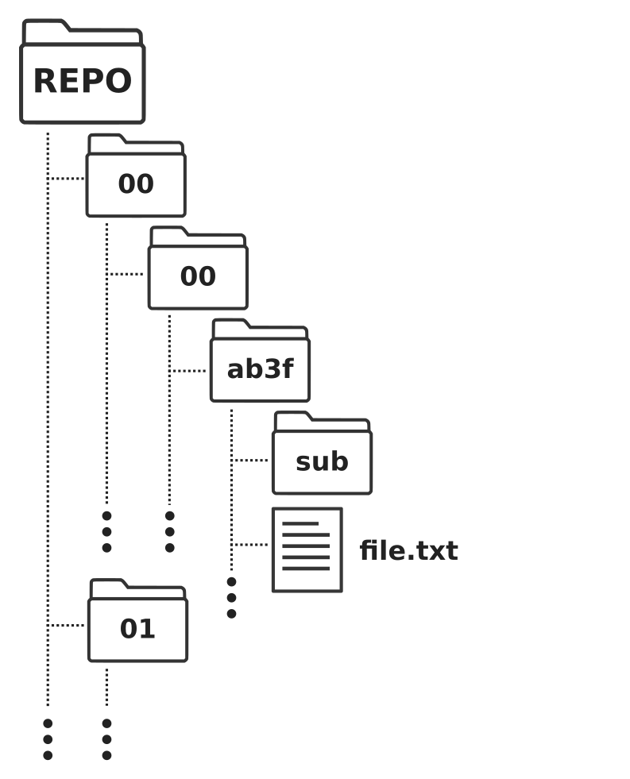
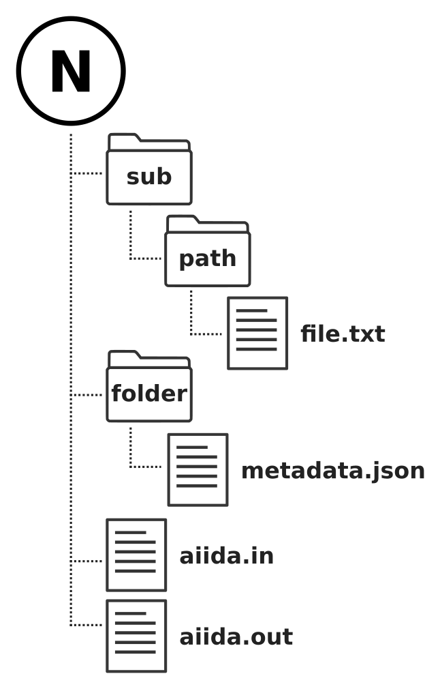
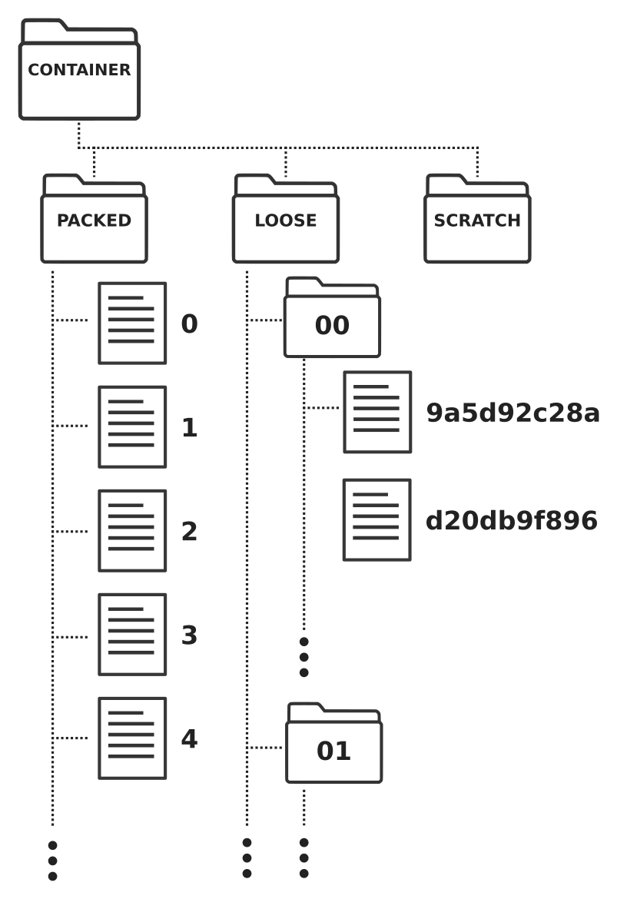
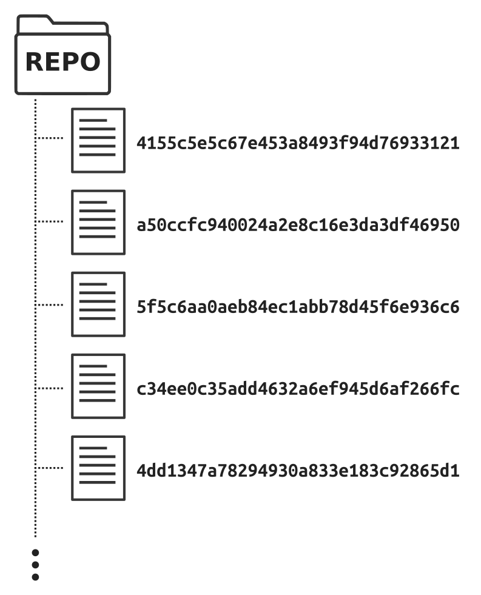
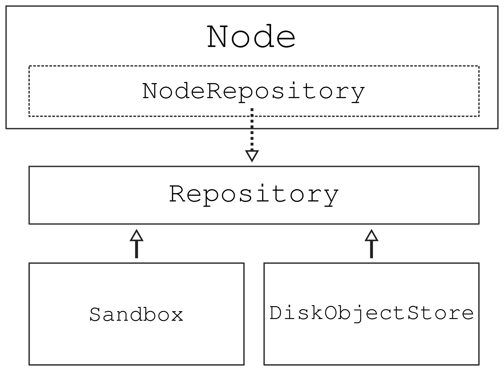

.. _internal-architecture:repository:

**********
Repository
**********

The file repository in AiiDA, often referred to simply as the repository, is the data store where all the files are persisted that belong to the nodes in the provenance graph.
In this chapter, the current design and implementation is described.
The current architecture is heavily influenced by lessons learned from the original design of the file repository in the earliest version of AiiDA that had difficulty scaling to large numbers of files.
For that reason, the chapter first starts with a description of the original design and its limitations.
This will be instructive in understanding the design of the current solution.

.. _internal-architecture:repository:original-design:

The original design
*******************

The original file repository in AiiDA was implemented as a simple directory on the local file system.
The files that belong to a node would be written *as is* to a subdirectory within that repository directory, without any compression or packing.
The name of the directory was equal to the UUID of the node, guaranteeing that each subdirectory was unique, and the files of different nodes would not overwrite one another, even if they have identical names.

In anticipation of databases containing many nodes leading to many subdirectories, which would slow down the operation of finding the directory of a particular node, the repository was `sharded <https://en.wikipedia.org/wiki/Shard_(database_architecture)>`_.
In the context of a file system, this means that instead of a flat structure of the file repository, the node directories are stored in a (nested) subdirectory.
Which subdirectory is once again determined by the UUID: the first and second subdirectories are given by the first and second two characters, respectively.
The remaining characters of the UUID form the name of the final subdirectory.
For example, given the UUID ``4802585e-18da-42e1-b063-7504585ea9af``, the relative path of the subdirectory would be ``48/02/585e-18da-42e1-b063-7504585ea9af``.
With this structure, the file repository would contain at most 256 directories, ``00`` through ``ff``, with the same applying to each one of those.
Starting from the third level, however, the file hierarchy would once again be flat.
A schematic overview of the resulting file hierarcy is shown in :numref:`fig:internal-architecture:repository:design-original`.

.. _fig:internal-architecture:repository:design-original:

    Schematic representation of the original structure of the file repository.
    The files of each node are stored in a directory that is exclusive to that node, whose path is determined by the UUID of the node.
    The directory is sharded twice, using two consecutive characters of the start of the UUID to create two levels of subdirectories.
    This is done to limit the number of directories in any one level in order to make the looking up of a directory for a given node more efficient.

Limitations
-----------

While a simple and robust design, the original architecture of the file repository had various limitations, many of which would start to play a significant role for larger project that contain many files.
The main limitation of the original design is that all files were stored as is, which eventually leads to a large number of files stored in a large number of subdirectories.
On a file system, each file or directory requires an *inode*, which is label that the file system to be able to map the filepath to the actual location on disk.
The number of available inodes on a file system are limited, and certain AiiDA projects were hitting these limits, making it impossible to write more files to disk, even though there might have been plenty of raw storage space left.

In addition, backing up a file repository with the original design was practically impossible.
Due to the sheer number of files, even just determining the difference between the original and backup of a repository, for example using `rsync <https://en.wikipedia.org/wiki/Rsync>`_ could take days.
And that is just computing the difference, let alone the time it would take to perform the actual backup.

However, it wasn't merely the number of files that was problematic, but even the number of directories that typical repositories would contain, would already significantly slow down backup operations.
Since the database kept no reference of which files and directories were stored in the file repository for any given node, the original design would always create a subdirectory in the file repository for any node, even if it contained no files whatsoever.
Otherwise, it would have been impossible to know whether a node *really* did not contain any files, or if the directory in the file repository was accidentally mistaken.
This approach did, however, lead to a large number of empty directories, as many nodes often contain no files at all, for example, base type data nodes.

The current design
******************

With scalability being the biggest limitation of the original design of the file repository, this was the focus point of the new solution.
However, being able to scale is not the only requirement that a successful implementation would have to satisfy.

.. _internal-architecture:repository:current-design:requirements:

Requirements
------------

The following requirements were considered during the design of the current file repository implementation:

 * Scalability: the repository should be able to store millions of files, all the while permitting efficient backups.
 * Heterogeneity: the repository should operate efficiently for data that is hetereogenous in size, with object of size ranging from a few bytes to multiple gigabytes.
 * Simplicity: the solution should not require an actively running server to operate.
 * Concurrency: the repository should support multiple concurrent reading and writing processes.
 * Efficiency: the repository should automatically deduplicate file content in an effort to reduce the total amount of required storage space.

These are merely the requirements for the data store that persists the content of the files, or the *backend* file repository.
The frontend interface that is employed by users to store files has another set of requirements altogether.
Users are used to think about file storage in terms of a file hierarchy, as they would on a normal file system, where files are stored in (nested) directories.
Moreover, in the context of AiiDA, a node is expected to have their own subset of files with their own hierarchy, an example of which is shown in :numref:`fig:internal-architecture:repository:design-node-repository`.
The frontend interface therefore needs to allows users to store and address files with such a hierarchy on a per node basis, even if only virtually.
With that guarantee, the backend implementation is free to store the files in any way imaginable in order to meet the requirements specified above.

.. _fig:internal-architecture:repository:design-node-repository:

    Schematic representation of a possible virtual file hierarchy of a node in the provenance graph.
    From a user's perspective, each node can contain an arbitrary number of files and directories with a certain file hierarchy.
    The hierarchy is completely virtual, however, in the sense that the hierarchy is not necessarily maintained literally in the data store containing the file content.

To satisfy the requirements of the frontend interface and the actual data store at the same time, the file repository solution in AiiDA is divided into two components: a *backend* and a *frontend*.
In the following, the current backend implementation, the disk object store, is described.

The disk object store
---------------------

The disk object store was designed from scratch in order to satisfy the technical requirements of the file repository described in the previous section.
The concept is simple: the file repository is represented by a *container* which is a directory on the local file system and contains all the file content.
When a file is written to the container, it is first written to the *scratch* directory.
Once this operation has finished successfully, the file is moved atomically to the *loose* directory.
It is called *loose* because each file in this directory is stored as an individual or *loose* object.
The name of the object is given by the hash computed from its content, currently using the `sha256 algorithm <https://en.wikipedia.org/wiki/SHA-2>`_.
The *loose* directory applies one level of sharding based on the first two characters of the object hashes, in order to make the lookup of objects more performant as described in :ref:`internal-architecture:repository:original-design`.
A schematic overview of the folder structure of a disk object store *container* is shown in :numref:`fig:internal-architecture:repository:design-dos`.

.. _fig:internal-architecture:repository:design-dos:

    Schematic representation of the file hierarchy in a *container* of the `disk object store <https://pypi.org/project/disk-objectstore/>`_ package.
    When writing files to the container, they are first written to a *scratch* sandbox folder and then moved atomically to the *loose* directory.
    During maintenance operations, *loose* files can be concatenated to pack files that are stored in the *packed* directory.

The approach of creating new files in the repository by first writing them to the scratch sandbox folder before atomically moving them to the *loose* object directory, directly addresses the requirement of *concurrency*.
By relying on the *atomic* file move operation of the operating system, all *loose* objects are guaranteed to be protected from data corruptions, within the limits of the atomicity guarantess of the local file system.
The usage of the file content's hash checksum as the filename automatically fulfills the *efficiency* requirement.
Assuming that the hashing algorithm used has no collisions, two objects with the same hash are guaranteed to have the same content and so therefore can be stored as a single object.
Although the computation of a file's hash before storing it incurs a non-negligible overhead, the chosen hashing algorithm is fast enough that it justifies that cost given that it gives a significant reduction in required storage space due to the automatic and implicit data deduplication.

While the approach of the *scratch* and *loose* directories address the criteria of *concurrency* and *efficiency*, the solution is not *scalable*.
Just as the :ref:`original design <internal-architecture:repository:original-design>`, this solution does not scale to file repositories of multiple millions of nodes, since every object is stored as an individual file on disk.
As described before, this makes the repository impractical to backup since merely constructing the list of files present is an expensive operation.
To tackle this problem, the disk object store implements the concept of packing.
In this maintenance operation, the contents of all loose objects stored in the *loose* directory are concatenated into single files that are stored in the *packed* folder.
The pack files have a configurable maximum size and once it is reached the next pack file is created, whose filenames are named by consecutive integers.

A `sqlite <https://sqlite.org/index.html>`_ database is used to track in which pack file each object is stored, the byte offset at which it starts and its total byte length.
Such an index file is necessary once individual objects are packed into a smaller number of files, and to respect the *simplicity* requirement, a sqlite database was chosen, since it is serverless and efficient.
The loose objects are concatenated in a random order, which is to say that the disk object store undertakes no effort to order objects according to their content size in any way, such as to align them with blocks on the file system, unlike some other key-value store solutions.
Files of any size are treated equally and as such there is no optimization towards storing smaller files nor larger files.
This is done intentionally because the disk object store is expected to be able to store files that are strongly hetereogenous in size and as such can not make optimizations for a particular range of file sizes.

Currently, the packing operation is seen as a maintenance operation, and therefore, unlike the writing of new *loose* objects, cannot be operated concurrently by multiple processes.
Despite this current limitation, the packing mechanism satisfies the final *scalability* requirement.
By reducing the total number of files and the packing strategy, the pack files can be copied to a backup copy very efficiently.
Since new objects are concatenated to the end of existing pack files and existing pack files are in principle never touched after they have reached their maximum size (unless the pack files are forcefully repacked), backup up tools, such as `rsync <https://en.wikipedia.org/wiki/Rsync>`_, can reduce the transfer of content to the bare minimum.

.. _internal-architecture:repository:current-design:repository-backend:

The file repository backend
---------------------------

To be able to respect the divergent requirements (as layed out in :ref:`internal-architecture:repository:current-design:requirements`) of the file repository regarding itse user interface and the actual data store, the implementation is divided into a backend and frontend interface.
In a clear separation of responsibilities, the backend is solely tasked with storing the content of files and returning them upon request as efficiently as possible, both when retrieving files individuall as well as in bulk.
For simplicity, the repository backend only deals with raw byte streams and does not maintain any sort of file hierarchy.
The interface that any backend file repository should implement is defined by the :class:`~aiida.repository.backend.abstract.AbstractRepositoryBackend` abstract class.

.. literalinclude:: ../../../aiida/repository/backend/abstract.py
    :language: python
    :pyobject: AbstractRepositoryBackend

The :meth:`~aiida.repository.backend.abstract.AbstractRepositoryBackend.put_object_from_filelike` is the main method that, given a stream or filelike-object of bytes, will write it as an object to the repository and return a key.
The :meth:`~aiida.repository.backend.abstract.AbstractRepositoryBackend.put_object_from_file` is a convenience method that allows to store a file object directly from a file on the local file system, and simply calls through to :meth:`~aiida.repository.backend.abstract.AbstractRepositoryBackend.put_object_from_filelike`.
The key returned by the *put*-methods, which could be any type of string, should uniquely identifiy the stored object.
Using the key, :meth:`~aiida.repository.backend.abstract.AbstractRepositoryBackend.open` and :meth:`~aiida.repository.backend.abstract.AbstractRepositoryBackend.get_object_content` can be used to obtain a handle to the object or its entire content read into memory, respectively.
Finally, the :meth:`~aiida.repository.backend.abstract.AbstractRepositoryBackend.has_object` and :meth:`~aiida.repository.backend.abstract.AbstractRepositoryBackend.delete_object` can be used to determine whether the repository contains an object with a certain key, or delete it, respectively.

The abstract repository backend interface is implemented for the `disk object store`_ (:class:`~aiida.repository.backend.disk_object_store.DiskObjectStoreRepositoryBackend`) as well as a scratch sandbox (:class:`~aiida.repository.backend.sandbox.SandboxRepositoryBackend`).
The latter implementation simply implements the interface using a temporary scratch folder on the local file system to store the file content.
File objects are stored in a flat manner where the filename, that functions as the unique key, is based on a randomly generated UUID, as shown in :numref:`fig:internal-architecture:repository:design-sandbox`.

.. _fig:internal-architecture:repository:design-sandbox:

    The file structure created by the :class:`~aiida.repository.backend.sandbox.SandboxRepositoryBackend` implementation of the file repository backend.
    Files are stored in a completely flat structure with the name determined by a randomly generated UUID.
    This is the most efficient method for writing and reading files on a local file system.
    Since these sandbox repositories are intended to have very short lifetimes and contain relatively few objects, the typical drawbacks of a flat file store do not apply.

The simple flat structure of this sandbox implementation should not be a limitation since this backend should only be used for short-lived temporary file repositories.
The use case is to provide a file repository for unstored nodes.
New node instances that created in interactive shell sessions are often discarded before being stored, so it is important that not only the creation of new files, but also their deletion once the node is deleted, is as efficient as possible.
The disk object store is not optimized for efficient ad-hoc object deletion, but rather, object deletion is implemented as a soft-delete and the actual deletion should be peformed during maintenance operations, such as the packing of loose objects.
That is why a new node instance upon instantiation gets an instance of the class:`~aiida.repository.backend.sandbox.SandboxRepositoryBackend` repository.
Only when the node gets stored, are the files copied to the permanent :class:`~aiida.repository.backend.disk_object_store.DiskObjectStoreRepositoryBackend` file repository.

.. _internal-architecture:repository:current-design:repository-front:

The file repository frontend
----------------------------

To understand how the file repository frontend integrates the ORM and the file repository backend, consider the following class diagram:

.. _fig:internal-architecture:repository:class-hierarchy:

    The file repository backend is interfaced through the :class:`~aiida.repository.repository.Repository` class.
    It maintains a reference of an instance of one of the available file repository backend implementations, be it the sandbox or disk object store variant, to store file objects and to retrieve the content for stored objects.
    Internally, it keeps a virtual file hierarchy, which allows clients to address files by their path in the file hierarchy as opposed to have the unique key identifiers created by the backend.
    Finally, the :class:`~aiida.orm.nodes.node.Node` class, which is the main point of interaction of users with the entire API, mixes in the :class:`~aiida.orm.nodes.repository.NodeRepositoryMixin` class.
    The latter keeps an instance of the :class:`~aiida.repository.repository.Repository` class to which all repository operations are forwarded, after the check of node mutability is performed.

As opposed to the backend interface, the frontend :class:`~aiida.repository.repository.Repository` *does* understand the concept of a file hierarchy and keeps it fully in memory.
This allows clients to interact with this interface as if the files were stored with the indicated hierarchy and address them by their relative filepaths, as opposed to the unique string identifiers that are generated by the backend.
It is important to note, however, that this virtual hierarchy is not initialized based on the actual contents of the file repository backend.
In fact it *cannot* be, because the backend has no notion of a file hierarchy and so cannot provide its hierarchy to the :class:`~aiida.repository.repository.Repository` when it is constructed.
This means that the :class:`~aiida.repository.repository.Repository` only exposes a *subset* of the files that are contained within a file repository backend.

To persist the virtual hierarchy of the files stored for any particular node, it is stored in the database.
The node database model has a JSONB column called ``repository_metadata`` that contains the virtual file hierarchy in a serialized form.
This serialized form is generated by the :meth:`~aiida.repository.repository.Repository.serialize` method, and the :meth:`~aiida.repository.repository.Repository.from_serialized` classmethod can be used to reconstruct a repository instance with a pre-existing file hierarchy.
Note that upon constructing from a serialized file hierarchy, the :class:`~aiida.repository.repository.Repository` will not actually validate that the file objects contained within the hierarchy are *actually* contained in the backend.

The final integration of the :class:`~aiida.repository.repository.Repository` class with the ORM is through the :class:`~aiida.orm.nodes.repository.NodeRepositoryMixin` class, which is mixed into the :class:`~aiida.orm.nodes.node.Node` class.
This layer serves a couple of functions:

 * It implements the mutability rules of nodes
 * It serves as a translation layer between string and byte streams.

The first is necessary because after a node has been stored, its content is considered immutable, which includes the content of its file repository.
The :class:`~aiida.orm.utils.mixins.Sealable` mixin overrides the :class:`~aiida.repository.repository.Repository` methods that mutate repository content, to ensure that process nodes *can* mutate their content, as long as they are not sealed.

The second *raison-d'être* of the :class:`~aiida.orm.nodes.repository.NodeRepositoryMixin` is to allow clients to work with string streams instead of byte streams.
As explained in the section on the :ref:`file repository backend <internal-architecture:repository:current-design:repository-backend>`, it only works with byte streams.
However, users of the frontend API are often more used to working with strings and files with a given encoding.
The :class:`~aiida.orm.nodes.repository.NodeRepositoryMixin` overrides the *put*-methods and accepts string streams, and enables returning file handles to existing file objects that automatically decode the byte content.
The only additional requirement for operating with strings instead of bytes is that the client specifies the encoding.
Since the file repository backend does not store any sort of metadata, it is impossible to deduce the file encoding and automatically decode it.
Likewise, using the default file encoding of the system may yield the wrong result since the file could have been imported and actually have been originally written on another system with a different encoding.
Encoding and decoding of file objects is therefore the responsibility of the frontend user.

The lifetime of a node
----------------------

Now that all the compontents are described, here we describe how they are employed throughout the lifetime of a node.
When a new node instance is constructed, it will not yet have an instance of the :class:`~aiida.repository.repository.Repository`.
Instead, this is done lazily as soon as an operation on the file repository is executed.
This is crucial for performance since node instances may often be initialized without their repository contents ever needing to be accesssed and constructing the repository interface instances will have a non-negligible overhead.
If the node is unstored the :class:`~aiida.repository.repository.Repository` will be constructed with an instance of the :class:`~aiida.repository.backend.sandbox.SandboxRepositoryBackend` implementation.
The advantage is that if the node object does out of scope before it has been stored, the contents that may have been created in the repository will be automatically cleaned from the local file system.

When a node gets stored, :class:`~aiida.repository.repository.Repository` instance is replaced with a new instance, this time with the backend set to the :class:`~aiida.repository.backend.disk_object_store.DiskObjectStoreRepositoryBackend` that is initialized to point to the *container* of the current profile.
The contents of the sandbox repository are copied over to the disk object store through the :class:`~aiida.repository.repository.Repository` interface and at the end its contents are serialized.
The serialized file hierarchy is then stored on the node itself in the ``repository_metadata`` column.
This allows to reconstruct the :class:`~aiida.repository.repository.Repository` instance correctly once the node is reloaded from the database, by calling the :meth:`~aiida.repository.repository.Repository.from_serialized` classmethod while passing the stored ``repository_metadata``.
