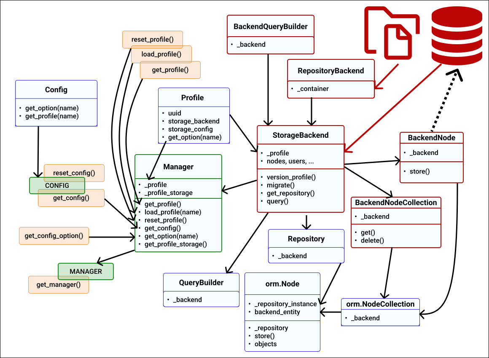

.. _internal_architecture:storage:architecture:

General architecture
====================

The storage of data is an important aspect of the AiiDA system.
The design for this subsystem is illustrated below.

   UML diagram of the storage architecture.

   Blue indicates frontend classes, red indicates backend classes, and green indicates singletons.

Separate data is stored per ``Profile``, forming a single provenance graph.
A :py:class:`~aiida.manage.configuration.profile.Profile` instance represents a dictionary that includes the configuration details for accessing the storage for that profile, such as a database URI, etc.
Multiple ``Profile`` can be stored in a :py:class:`~aiida.manage.configuration.config.Config` instance, which is stored in the configuration file (``config.json``).

Within a single Python process, a single :py:class:`~aiida.manage.manager.Manager` instance can be loaded, to manage access to a globally loaded ``Profile`` and its :py:class:`~aiida.orm.implementation.storage_backend.StorageBackend` instance.

The storage API subsystem is based on an Object Relational Mapper (ORM) and is divided into two main parts: the frontend and the backend.
The frontend is responsible for the user interface, and is agnostic of any particular storage technologies,
and the backend is responsible for implementing interfaces with specific technologies (such as SQL databases).

.. _internal_architecture:storage:architecture:frontend:

Frontend ORM
------------

The frontend ORM comprises of a number of :py:class:`~aiida.orm.entities.Collection` and :py:class:`~aiida.orm.entities.Entity` subclasses, representing access to a single ORM type.

:py:class:`~aiida.orm.User`
   Represents the author of a particular entity.
:py:class:`~aiida.orm.Node`
   Represents a node in a provenance graph, containing data for a particular process (:py:class:`~aiida.orm.ProcessNode`) or process input/output (:py:class:`~aiida.orm.Data`).
   Nodes are connected by links, that form an acyclic graph.
   Nodes also have a :py:class:`~aiida.repository.repository.Repository` instance, which is used to store binary data of the node (see also :ref:`internal-architecture:repository`).
:py:class:`~aiida.orm.Comment`
   Represents a comment on a node, by a particular user.
:py:class:`~aiida.orm.Log`
   Represents a log message on a :py:class:`~aiida.orm.ProcessNode`, by a particular user.
:py:class:`~aiida.orm.Group`
   Represents a group of nodes.
   A single node can be part of multiple groups (i.e. a one-to-many relationship).
:py:class:`~aiida.orm.Computer`
   Represents a compute resource on which a process is executed.
   A single computer can be attached to multiple :py:class:`~aiida.orm.ProcessNode` (i.e. a one-to-many relationship).
:py:class:`~aiida.orm.AuthInfo`
   Represents a authentication information for a particular computer and user.

The :py:class:`~aiida.orm.QueryBuilder` allows for querying of specific entities and their associated data.

Backend Implementations
-----------------------

Backend implementations must implement the classes outlines in :py:mod:`aiida.orm.implementation`.

There are currently two core backend implementations:

- ``psql_dos`` is implemented as the primary storage backend, see :ref:`internal_architecture:storage:psql_dos`.
- ``sqlite_zip`` is implemented as a storage backend for the AiiDA archive, see :ref:`internal_architecture:storage:sqlite_zip`.

Storage maintenance and profile locking
---------------------------------------

The :py:meth:`~aiida.orm.implementation.storage_backend.StorageBackend.maintain` method is allows for maintenance operations on the storage (for example, to optimise memory usage), and is called by `verdi storage maintain`.

During "full" maintenance, to guarantee the safety of its procedures, it may be necessary that the storage is not accessed by other processes.
The :py:class`~aiida.manage.profile_access.ProfileAccessManager` allows for profile access requests, and locking of profiles during such procedures.
:py:meth:`~aiida.manage.profile_access.ProfileAccessManager.request_access` is called within :py:meth:`~aiida.manage.manager.Manager.get_profile_storage`.
