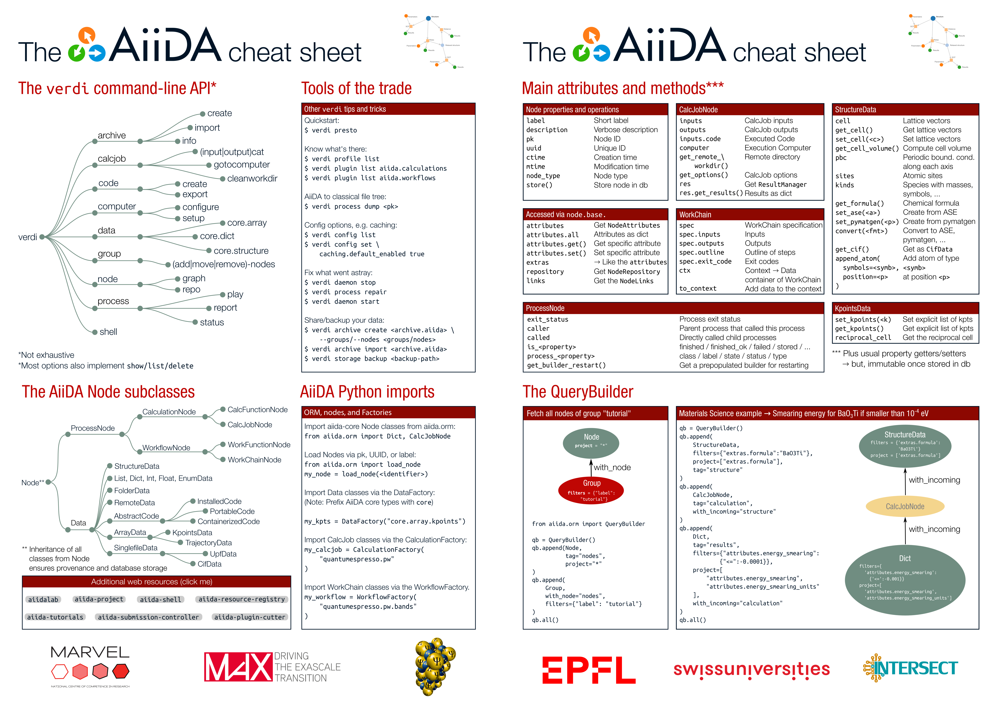

.. _intro:cheatsheet:

=====================
The AiiDA cheat sheet
=====================

The AiiDA cheat sheet gives a broad overview of the most commonly used `verdi` commands, the inheritance hierarchy of the main AiiDA classes, their attributes and methods, as well as a showcase of the `QueryBuilder`.

When clicking on the embedded image, the pdf version will be opened in the browser. Where applicable, text elements contain hyperlinks to the relevant sections of the documentation.

The file can also be :download:`downloaded <_cheatsheet/cheatsheet_v.pdf>` in two-page layout for printing.

Happy exploring!

