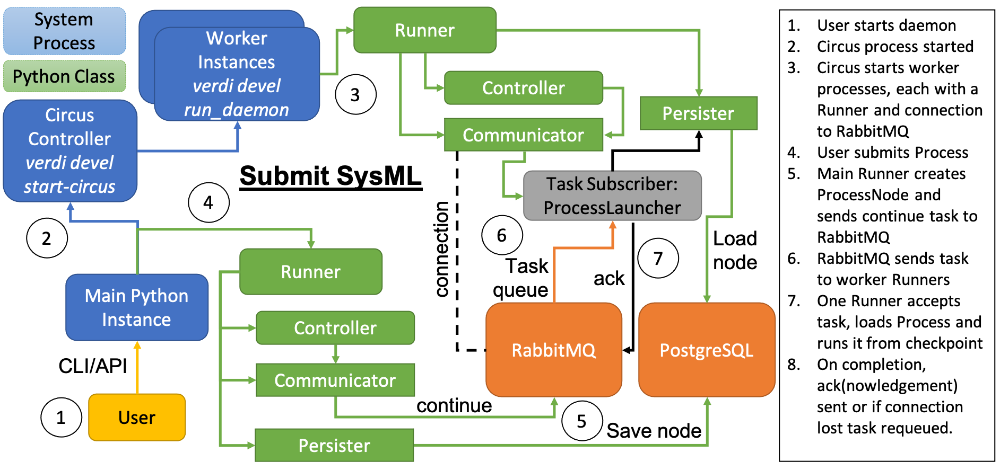

.. _topics:processes:concepts:

========
Concepts
========

Anything that runs in AiiDA is an instance of the :py:class:`~aiida.engine.processes.process.Process` class.
The ``Process`` class contains all the information and logic to tell, whoever is handling it, how to run it to completion.
Typically the one responsible for running the processes is an instance of a :py:class:`~aiida.engine.runners.Runner`.
This can be a local runner or one of the daemon runners in case of the daemon running the process.

In addition to those run instructions, any ``Process`` that has been executed needs some sort of record in the database to store what happened during its execution.
For example it needs to record what its exact inputs were, the log messages that were reported and what the final outputs were.
For this purpose, every process will utilize an instance of a sub class of the :py:class:`~aiida.orm.ProcessNode` class.
This ``ProcessNode`` class is a sub class of :py:class:`~aiida.orm.Node` and serves as the record of the process' execution in the database and by extension the provenance graph.

It is very important to understand this division of labor.
A ``Process`` describes how something should be run, and the ``ProcessNode`` serves as a mere record in the database of what actually happened during execution.
A good thing to remember is that while it is running, we are dealing with the ``Process`` and when it is finished we interact with the ``ProcessNode``.

.. _topics:processes:concepts:types:

Process types
=============

In AiiDA, all processes are conceptually divided into two main types:

* Calculation-like processes: These are processes that create data. Their role is to perform well-defined computations or transformations that produce new ``Data`` nodes, which are recorded as outputs (of type ``CREATE`` in the provenance graph).

* Workflow-like processes: These are processes that orchestrate other processes, defining how multiple calculations or sub-workflows are executed in sequence or in parallel. Conceptually, workflows do not directly generate data, but rather return data produced by the calculations they run.

Again, this is a distinction that plays a big role in AiiDA and is crucial to understand.
For this reason, these different types of processes also get a different sub class of the ``ProcessNode`` class.
The hierarchy of these node classes and the link types that are allowed between them and ``Data`` nodes, is explained in detail in the :ref:`provenance implementation<topics:provenance:implementation>` documentation.

.. note:: Technically, a workflow is able to create new ``Data`` nodes directly (for example, by instantiating and storing a ``Dict`` or ``StructureData`` node inside its code). However, this will *not* show up as a node created by the workflow in the provenance graph, and the ``Data`` node will appear as having no creator (similar to a ``Data`` node created in the shell).

  In practice, this scenario is supported and actually turns out to be a good practice when the purpose is to prepare inputs for a subprocess (a sub-calculation or sub-workflow) that the workflow will launch. In fact, in such cases, the provenance remains interpretable: these Data nodes will have no creator (i.e. no ``CREATE`` link from a calculation-like process) but will typically appear as inputs to a process that is called by the workflow. From the combination of data provenance (no creator) and logical provenance (the call link from the parent workflow), it becomes clear that the workflow either created the ``Data`` node to pass it as input, or picked an existing node in the database (e.g. some input data created manually by the user) and passed it as input. Knowing the goal of the calling workflow (or inspecting its source code) will often be enough to understand what happened exactly. Furthermore, this approach helps keep the provenance graph readable and avoids introducing extra ``calcfunctions`` (see below), whose only role would be trivial data assembly.

  However, we stress that instead workflows *should not* create data that are meant to represent final results, and just store them as outputs. In such cases, the data should instead be produced by a calculation-like process (e.g. a ``calcfunction`` or ``CalcJob``, see below), so that the provenance clearly records how and why the output was generated.

Currently, there are four types of processes in ``aiida-core`` and the following table shows with which node class it is represented in the provenance graph and what the process is used for.

===================================================================   ==============================================================================  ===============================================================
Process class                                                         Node class                                                                      Used for
===================================================================   ==============================================================================  ===============================================================
:py:class:`~aiida.engine.processes.calcjobs.calcjob.CalcJob`          :py:class:`~aiida.orm.nodes.process.calculation.calcjob.CalcJobNode`            Calculations performed by external codes
:py:class:`~aiida.engine.processes.workchains.workchain.WorkChain`    :py:class:`~aiida.orm.nodes.process.workflow.workchain.WorkChainNode`           Workflows that run multiple calculations
:py:class:`~aiida.engine.processes.functions.FunctionProcess`         :py:class:`~aiida.orm.nodes.process.calculation.calcfunction.CalcFunctionNode`  Python functions decorated with the ``@calcfunction`` decorator
:py:class:`~aiida.engine.processes.functions.FunctionProcess`         :py:class:`~aiida.orm.nodes.process.workflow.workfunction.WorkFunctionNode`     Python functions decorated with the ``@workfunction`` decorator
===================================================================   ==============================================================================  ===============================================================

For basic information on the concept of a ``CalcJob`` or ``calcfunction``, refer to the :ref:`calculations concept<topics:calculations:concepts>`
The ``WorkChain`` and ``workfunction`` are described in the :ref:`workflows concept<topics:workflows:concepts>`.
After having read and understood the basic concept of calculation and workflow processes, detailed information on how to implement and use them can be found in the dedicated developing sections for :ref:`calculations<topics:calculations:usage>` and :ref:`workflows<topics:workflows:usage>`, respectively.

.. note:: A ``FunctionProcess`` is never explicitly implemented but will be generated dynamically by the engine when a python function decorated with a :py:func:`~aiida.engine.processes.functions.calcfunction` or :py:func:`~aiida.engine.processes.functions.workfunction` is run.

.. _topics:processes:concepts:state:

Process state
=============
Each instance of a ``Process`` class that is being executed has a process state.
This property tells you about the current status of the process.
It is stored in the instance of the ``Process`` itself and the workflow engine, the ``plumpy`` library, operates only on that value.
However, the ``Process`` instance 'dies' as soon as it is terminated, therefore the process state is also written to the calculation node that the process uses as its database record, under the ``process_state`` attribute.
The process can be in one of six states:

========  ============
*Active*  *Terminated*
========  ============
Created   Killed
Running   Excepted
Waiting   Finished
========  ============

The three states in the left column are 'active' states, whereas the right column displays the three 'terminal' states.
Once a process reaches a terminal state, it will never leave it; its execution is permanently terminated.
When a process is first created, it is put in the ``Created`` state.
As soon as it is picked up by a runner and it is active, it will be in the ``Running`` state.
If the process is waiting for another process, that it called, to be finished, it will be in the ``Waiting`` state.
If a process is in the ``Killed`` state, it means the user issued a command to kill it, or its parent process was killed.
The ``Excepted`` state indicates that during execution an exception occurred that was not caught and the process was unexpectedly terminated.
The final option is the ``Finished`` state, which means that the process was successfully executed, and the execution was nominal.
Note that this does not automatically mean that the result of the process can also be considered to be successful, it was just executed without any problems.

To distinguish between a successful and a failed execution, there is the :ref:`exit status<topics:processes:concepts:exit_codes>`.
This is another attribute that is stored in the node of the process and is an integer that can be set by the process.
A ``0`` (zero) means that the result of the process was successful, and a non-zero value indicates a failure.
All the process nodes used by the various processes are sub-classes of :py:class:`~aiida.orm.ProcessNode`, which defines handy properties to query the process state and exit status.

===================   ============================================================================================
Property              Meaning
===================   ============================================================================================
``process_state``     Returns the current process state
``exit_status``       Returns the exit status, or None if not set
``exit_message``      Returns the exit message, or None if not set
``is_terminated``     Returns ``True`` if the process was either ``Killed``, ``Excepted``, or ``Finished``
``is_killed``         Returns ``True`` if the process is ``Killed``
``is_excepted``       Returns ``True`` if the process is ``Excepted``
``is_finished``       Returns ``True`` if the process is ``Finished``
``is_finished_ok``    Returns ``True`` if the process is ``Finished`` and the ``exit_status`` is equal to zero
``is_failed``         Returns ``True`` if the process is ``Finished`` and the ``exit_status`` is non-zero
===================   ============================================================================================

When you load a calculation node from the database, you can use these property methods to inquire about its state and exit status.

.. _topics:processes:concepts:exit_codes:

Process exit codes
==================

The previous section about the process state showed that a process that is ``Finished`` does not say anything about whether the result is 'successful' or 'failed'.
The ``Finished`` state means nothing more than that the engine succeeded in running the process to the end of execution, without it encountering exceptions or being killed.
To distinguish between a 'successful' and 'failed' process, an 'exit status' can be defined.
The `exit status is a common concept in programming <https://en.wikipedia.org/wiki/Exit_status>`_ and is a small integer, where zero means that the result of the process was successful, and a non-zero value indicates a failure.
By default a process that terminates nominally will get a ``0`` (zero) exit status.
To mark a process as failed, one can return an instance of the :py:class:`~aiida.engine.processes.exit_code.ExitCode` named tuple, which allows to set an integer ``exit_status`` and a string message as ``exit_message``.
When the engine receives such an ``ExitCode`` as the return value from a process, it will set the exit status and message on the corresponding attributes of the process node representing the process in the provenance graph.

.. seealso::

    For how exit codes can be defined and returned see the :ref:`exit code usage section <topics:processes:usage:exit_codes>`.

.. _topics:processes:concepts:lifetime:

Process lifetime
================

The lifetime of a process is defined as the time from the moment it is launched until it reaches a :ref:`terminal state<topics:processes:concepts:state>`.

.. _topics:processes:concepts:node_distinction:

Process and node distinction
----------------------------
As explained in the :ref:`introduction of this section<topics:processes:concepts>`, there is a clear and important distinction between the 'process' and the 'node' that represents its execution in the provenance graph.
When a process is launched, an instance of the ``Process`` class is created in memory which will be propagated to completion by the responsible runner.
This 'process' instance only exists in the memory of the python interpreter that it is running in, for example that of a daemon runner, and so we cannot directly inspect its state.
That is why the process will write any of its state changes to the corresponding node representing it in the provenance graph.
In this way, the node acts as a 'proxy' or a mirror image that reflects the state of the process in memory.
This means that the output of many of the ``verdi`` commands, such as ``verdi process list``, do not actually show the state of the process instances, but rather the state of the node to which they have last written their state.

Process tasks
-------------
The previous section explained how launching a process means creating an instance of the ``Process`` class in memory.
When the process is being 'run' (see the section on :ref:`launching processes<topics:processes:usage:launch>` for more details) that is to say in a local interpreter, the particular process instance will die as soon as the interpreter dies.
This is what often makes 'submitting' the preferred method of launching a process.
When a process is 'submitted', an instance of the ``Process`` is created, along with the node that represents it in the database, and its state is then persisted (stored) in the database.
This is called a 'process checkpoint', more information on which :ref:`will follow later<topics:processes:concepts:checkpoints>`.
Subsequently, the process instance is shut down and a 'continuation task' is sent to the process queue of RabbitMQ.
This task is simply a small message that just contains an identifier for the process.
In order to reconstruct the process from a `checkpoint`, the process needs to be importable in the daemon environment by a) giving it an :ref:`associated entry point<how-to:plugin-codes:entry-points>` or b) :ref:`including its module path<how-to:faq:process-not-importable-daemon>` in the ``PYTHONPATH`` that the daemon workers will have.

All the daemon runners, when they are launched, subscribe to the process queue and RabbitMQ will distribute the continuation tasks to them as they come in, making sure that each task is only sent to one runner at a time.
The receiving daemon runner can restore the process instance in memory from the checkpoint that was stored in the database and continue the execution.
As soon as the process reaches a terminal state, the daemon runner will acknowledge to RabbitMQ that the task has been completed.
Until the runner has confirmed that a task is completed, RabbitMQ will consider the task as incomplete.
If a daemon runner is shut down or dies before it got the chance to finish running a process, the task will automatically be requeued by RabbitMQ and sent to another daemon runner.
Together with the fact that all the tasks in the process queue are persisted to disk by RabbitMQ, guarantees that once a continuation task has been sent to RabbitMQ, it will at some point be finished, while allowing the machine to be shut down.

Each daemon runner has a maximum number of tasks that it can run concurrently, which means that if there are more active tasks than available slots, some of the tasks will remain queued.
Processes, whose task is in the queue and not with any runner, though technically 'active' as they are not terminated, are not actually being run at the moment.
While a process is not actually being run, i.e. it is not in memory with a runner, one cannot interact with it.
Similarly, as soon as the task disappears, either because the process was intentionally terminated (or unintentionally), the process will never continue running again.

    A systems modelling representation of submitting a process.

.. _topics:processes:concepts:checkpoints:

Process checkpoints
-------------------
A process checkpoint is a complete representation of a ``Process`` instance in memory that can be stored in the database.
Since it is a complete representation, the ``Process`` instance can also be fully reconstructed from such a checkpoint.
At any state transition of a process, a checkpoint will be created, by serializing the process instance and storing it as an attribute on the corresponding process node.
This mechanism is the final cog in the machine, together with the persisted process queue of RabbitMQ as explained in the previous section, that allows processes to continue after the machine they were running on, has been shut down and restarted.

.. _topics:processes:concepts:sealing:

Process sealing
===============
One of the cardinal rules of AiiDA is that once a node is *stored*, it is immutable, which means that its attributes can no longer be changed.
This rule is a problem for processes, however, since in order to be able to start running it, its corresponding process node first has to be stored.
However, at that point its attributes, such as the process state or other mutable attributes, can no longer be changed by the engine throughout the lifetime of the corresponding process.
To overcome this limitation, the concept of *updatable* attributes is introduced.
These are special attributes that are allowed to be changed *even* when the process node is already stored *and* the corresponding process is still active.
To mark the point where a process is terminated and even the updatable attributes on the process node are to be considered immutable, the node is *sealed*.
A sealed process node behaves exactly like a normal stored node, as in *all* of its attributes are immutable.
In addition, once a process node is sealed, no more incoming or outgoing links can be attached to it.
Unsealed process nodes can also not be exported, because they belong to processes that are still active.
Note that the sealing concept does not apply to data nodes and they are exportable as soon as they are stored.
To determine whether a process node is sealed, one can use the property :py:attr:`~aiida.orm.utils.mixins.Sealable.is_sealed`.
