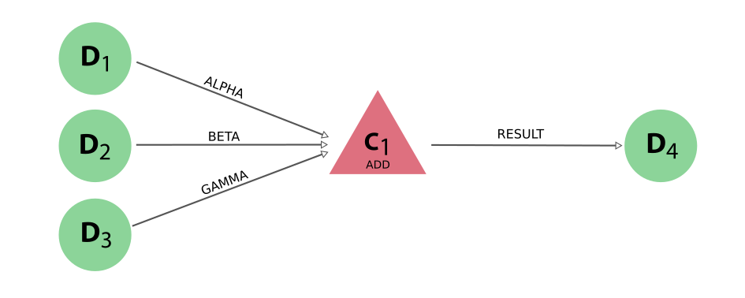

.. _topics:processes:functions:

=================
Process functions
=================

A process function is a process (see the :ref:`concepts<topics:processes:concepts>` for a definition and explanation) that is implemented as a decorated python function.
Currently, there are two types of process functions:

* :ref:`calculation function<topics:calculations:concepts:calcfunctions>`
* :ref:`work function<topics:workflows:concepts:workfunctions>`

The former can *create* new data, whereas the latter can orchestrate other processes and *return* their results.
This section will provide detailed information and best practices on how to implement these two process types.
Since the calculation function and work function are both process functions and have the same implementation, all the rules explained below apply to both process types.

The simple example in the :ref:`introductory section on calculation functions<topics:calculations:concepts:calcfunctions>` showed how a simple python function can be turned into a calculation function simply by adorning it with the :py:func:`~aiida.engine.processes.functions.calcfunction` decorator.
When the function is run, AiiDA will dynamically generate a :py:class:`~aiida.engine.processes.functions.FunctionProcess` and build its :ref:`process specification<topics:processes:usage:spec>` based on the function signature.
Here we will explain how this is accomplished and what features of the python function signature standard are supported.

Function signatures
===================
To explain what features of python function definitions and calls are supported we first need to be clear about some terminology.
When dealing with functions, there are two distinct parts:

* `function definitions <https://docs.python.org/3/reference/compound_stmts.html#function-definitions>`_
* `function calls <https://docs.python.org/3/reference/expressions.html#calls>`_

Consider the following code snippet that defines a simple python function:

.. include:: include/snippets/functions/signature_plain_python_definition.py
    :code: python

The function takes three 'parameters', named ``x``, ``y`` and ``z``.
In addition, the function ``plain_function`` is said to have default values, because one or more parameters (``z`` in this case) have the form `parameter = expression`.
When *calling* a function, the terminology changes slightly and values for parameters can be passed as either 'positional' or 'keyword'.
In the example below, the function is called with 'positional' arguments:

.. include:: include/snippets/functions/signature_plain_python_call_positional.py
    :code: python

They are called positional, because the arguments are not explicitly named and so will be matched to the corresponding parameter solely based on their position in the function call.
In this example, ``x``, ``y`` and ``z`` will have the values ``1``, ``2`` and ``3``, respectively.
Since we specified three values, the default for the third parameter ``z`` was not actually used.
However, we are allowed to only specify two arguments, in which case the default *will* be used as can be seen below:

.. include:: include/snippets/functions/signature_plain_python_call_default.py
    :code: python

By not specifying the third argument, the default will be used, so in this case ``z`` will equal ``1``.
Additionally, one can employ 'named' arguments to specifically target a parameter based on its name, instead of having to rely on its position:

.. include:: include/snippets/functions/signature_plain_python_call_keyword.py
    :code: python

Notice how the order in which we pass the arguments is irrelevant because we specify the name of each argument explicitly when assigning the value.
Now that we know the difference between positional and named arguments, it is important to realize a python requirement that **positional arguments have to come before named arguments**.
What this means is that *both* the function definition and function call below are illegal, because there are named arguments before positional ones:

.. include:: include/snippets/functions/signature_plain_python_call_illegal.py
    :code: python

Finally, python knows the concept of ``*args`` and ``**kwargs``, which allow one to define a function that accepts a variable number of positional and keyword arguments (also known as a _variadic_ function).

.. include:: include/snippets/functions/signature_plain_python_args_kwargs.py
    :code: python

The placeholder for positional arguments ``*args`` receives the positionally passed arguments as a tuple, while ``**kwargs`` receives the named arguments as a dictionary.
With the formal definitions out of the way, let's now see which of these concepts are supported by process functions.

Default arguments
=================
Default arguments are supported by calculation functions just as normal python functions as long as it is a :py:class:`~aiida.orm.nodes.node.Node` instance, just like the inputs or ``None``.
However, just as with python functions, one should only use immutable objects as function defaults because mutable objects can give unexpected results as they will be kept between function calls.
Therefore, in order to use a default value for process functions, simply use ``None`` as the default value and check for its presence in the function body settings the default value if it is ``None``.
This pattern looks like the following:

.. include:: include/snippets/functions/signature_calcfunction_default.py
    :code: python

Both function calls in the example above will have the exact same result.

Variadic arguments
==================

Keyword arguments can be used effectively if a process function should take a number of arguments that is unknown beforehand:

.. include:: include/snippets/functions/signature_calcfunction_kwargs.py
    :code: python

The provenance generated by this example looks like the following:

.. _fig_calculation_functions_kwargs:

    The link labels of the inputs are determined based on the naming of the parameters when the function is called.

Note that the inputs **have to be passed as keyword arguments** because they are used for the link labels.

.. versionadded:: 2.3

    Variadic positional arguments are now supported.

Variadic positional arguments can be used in case the function should accept a list of inputs of unknown length.
Consider the example of a calculation function that computes the average of a number of ``Int`` nodes:

.. include:: include/snippets/functions/signature_calcfunction_args.py
    :code: python

The result will be a ``Float`` node with value ``2``.
Since in this example the arguments are not explicitly declared in the function signature, nor are their values passed with a keyword in the function invocation, AiiDA needs to come up with a different way to determine the labels to link the input nodes to the calculation.
For variadic arguments, link labels are created from the variable argument declaration (``*args`` in the example), followed by an index.
The link labels for the example above will therefore be ``args_0``, ``args_1`` and ``args_2``.
If any of these labels were to overlap with the label of a positional or keyword argument, a ``RuntimeError`` will be raised.
In this case, the conflicting argument name needs to be changed to something that does not overlap with the automatically generated labels for the variadic arguments.

.. _topics:processes:functions:type-validation:

Type validation
===============

.. versionadded:: 2.3

Type hints (introduced with `PEP 484 <https://peps.python.org/pep-0484/>`_ in Python 3.5) can be used to add automatic type validation of process function arguments.
For example, the following will raise a ``ValueError`` exception:

.. include:: include/snippets/functions/typing_call_raise.py
    :code: python

When the process function is declared, the process specification (``ProcessSpec``) is built dynamically.
For each function argument, if a correct type hint is provided, it is set as the ``valid_type`` attribute of the corresponding input port.
In the example above, the ``x`` and ``y`` inputs have ``Int`` as type hint, which is why the call that passes a ``Float`` raises a ``ValueError``.

.. note::

    Type hints for return values are currently not parsed.

If an argument accepts multiple types, the ``typing.Union`` class can be used as normal:

.. include:: include/snippets/functions/typing_union.py
    :code: python

The call with an ``Int`` and a ``Float`` will now finish correctly.
Similarly, optional arguments, with ``None`` as a default, can be declared using ``typing.Optional``:

.. include:: include/snippets/functions/typing_none.py
    :code: python

The `postponed evaluation of annotations introduced by PEP 563 <https://peps.python.org/pep-0563/>`_ is also supported.
This means it is possible to use Python base types for the type hint instead of AiiDA's ``Data`` node equivalent:

.. include:: include/snippets/functions/typing_pep_563.py
    :code: python

The type hints are automatically serialized just as the actual inputs are when the function is called, :ref:`as introduced in v2.1<topics:calculations:concepts:calcfunctions:automatic-serialization>`.

The alternative syntax for union types ``X | Y`` `as introduced by PEP 604 <https://peps.python.org/pep-0604/>`_ is also supported:

.. include:: include/snippets/functions/typing_pep_604.py
    :code: python

.. warning::

    The usage of notation as defined by PEP 563 and PEP 604 are not supported for Python versions older than 3.10, even if the ``from __future__ import annotations`` statement is added.
    The reason is that the type inference uses the `inspect.get_annotations <https://docs.python.org/3/library/inspect.html#inspect.get_annotations>`_ method, which was introduced in Python 3.10.
    For older Python versions, the `get-annotations <https://pypi.org/project/get-annotations>`_ backport is used, but that does not work with PEP 563 and PEP 604, so the constructs from the ``typing`` module have to be used instead.

If a process function has invalid type hints, they will simply be ignored and a warning message is logged: ``function 'function_name' has invalid type hints``.
This ensures backwards compatibility in the case existing process functions had invalid type hints.

.. _topics:processes:functions:docstring-parsing:

Docstring parsing
=================

.. versionadded:: 2.3

If a process function provides a docstring, AiiDA will attempt to parse it.
If successful, the function argument descriptions will be set as the ``help`` attributes of the input ports of the dynamically generated process specification.
This means the descriptions of the function arguments can be retrieved programmatically from the process specification (as returned by the ``spec`` classmethod):

.. include:: include/snippets/functions/parse_docstring.py
    :code: python

This particularly useful when exposing a process function in a wrapping workchain:

.. include:: include/snippets/functions/parse_docstring_expose.py
    :code: python

The user can now access the input description directly through the spec of the work chain, without having to go to the process function itself.
For example, in an interactive shell:

.. include:: include/snippets/functions/parse_docstring_expose_ipython.py
    :code: ipython

Return values
=============
In :numref:`fig_calculation_functions_kwargs` you can see that the engine used the label ``result`` for the link connecting the calculation function node with its output node.
This is the default link label if only a single result is returned from the calculation function.
If you want to specify a label yourself, you can return the result in the form of a dictionary, where the key will be used as the link label.
By using a dictionary you can also record multiple nodes as output.
Consider the following snippet:

.. include:: include/snippets/functions/calcfunction_multiple_outputs.py
    :code: python

The provenance generated by running this calculation function will look like:

.. _fig_calculation_functions_multiple_outputs:
.. figure:: include/images/add_calcfunction_multiple_outputs.png

    If a dictionary is returned, the keys will be used as the labels for the links that connect the output nodes with the calculation node.

As always, all the values returned by a calculation function have to be storable, which means they have to be instances of the :py:class:`~aiida.orm.nodes.node.Node` class.

.. warning::
    It is very important that you **do not call** :py:meth:`~aiida.orm.nodes.node.Node.store` **yourself** on the nodes before returning them from a ``calcfunction``.
    Because of the calculation/workflow duality in AiiDA, a ``calcfunction``, which is a calculation-like process, can only *create* and not *return* data nodes.
    This means that if a node is returned from a ``calcfunction`` that *is already stored*, the engine will throw an exception.

.. versionadded:: 2.3

    Outputs can be attached with nested namespaces in the output labels:

    .. include:: include/snippets/functions/calcfunction_nested_outputs.py
        :code: python

.. _topics:processes:functions:exit_codes:

Exit codes
==========
So far we have only seen examples of calculation functions where everything works out just fine.
However, the real world is different, and often we will encounter situations where problems arise.
A calculation function may receive incorrect or incoherent inputs, or the code it executes may throw an exception.
Of course we could throw an input validation exception or not even catch the exceptions that the code we call throws, but that will lead the function process to be put in the ``Excepted`` terminal state.
As explained in the :ref:`process state<topics:processes:concepts:state>` section, this state is indeed reserved for processes that incurred an exception during execution.
Consider the following calculation function definition and call:

.. include:: include/snippets/functions/calcfunction_exception.py
    :code: python

Because the value for ``y`` that is being passed is zero, the engine will encounter a ``ZeroDivisionError`` exception when the calculation function is run.
The output of ``verdi process list`` will confirm that the process has excepted:

.. code-block:: bash

      PK  Created    State             Process label    Process status
    ----  ---------  ----------------  ---------------  ----------------
      10  2m ago     ⨯ Excepted        divide

    Total results: 1

Exceptions that occur during the execution of a process are recorded as a log message on the corresponding process node.
To show these log messages, one can use ``verdi process report``.
In the case of the example above, it would look something like the following:

.. code-block:: bash

    2019-03-21 15:12:25 [19]: [10|divide|on_except]: Traceback (most recent call last):
      File "/home/sphuber/code/aiida/env/dev/plumpy/plumpy/process_states.py", line 220, in execute
        result = self.run_fn(*self.args, **self.kwargs)
      File "/home/sphuber/code/aiida/env/dev/aiida-core/aiida/engine/processes/functions.py", line 319, in run
        result = self._func(*args, **kwargs)
      File "docs/source/working/include/snippets/functions/calcfunction_exception.py", line 6, in divide
        return x / y
      File "/home/sphuber/code/aiida/env/dev/aiida-core/aiida/orm/nodes/data/numeric.py", line 30, in inner
        return to_aiida_type(func(left, right))
      File "/home/sphuber/code/aiida/env/dev/aiida-core/aiida/orm/nodes/data/numeric.py", line 75, in __div__
        return self / other
    ZeroDivisionError: division by zero

However, in this particular example the exception is not so much an unexpected error, but one we could have considered and have seen coming, so it might be more applicable to simply mark the process as failed.
To accomplish this, there is the concept of an :ref:`exit status<topics:processes:concepts:exit_codes>` that can be set on the process, which is an integer that, when non-zero, marks a process in the ``Finished`` state as 'failed'.
Since the exit status is set as an attribute on the process node, it also makes it very easy to query for failed processes.
To set a non-zero exit status on a calculation function to indicate it as failed, simply return an instance of the :py:class:`~aiida.engine.processes.exit_code.ExitCode` class.
Time for a demonstration:

.. include:: include/snippets/functions/calcfunction_exit_code.py
    :code: python

When we run the calculation function now, with the same inputs, instead of excepting, the process will successfully terminate and its exit status will be set to the value stored in the ``ExitCode``.
The exit status is also displayed by ``verdi process list``:

.. code-block:: bash

      PK  Created    State             Process label    Process status
    ----  ---------  ----------------  ---------------  ----------------
      10  2m ago     ⨯ Excepted        divide
     773  21s ago    ⏹ Finished [100]  divide

    Total results: 2

Both approaches are valid and which one to use depends on your use case.
The question you should ask yourself is whether a potential problem merits throwing the process on the pile of 'excepted' processes.
Or maybe, as in the example above, the problem is easily foreseeable and classifiable with a well defined exit status, in which case it might make more sense to return the exit code.
At the end one should think which solution makes it easier for a workflow calling the function to respond based on the result and what makes it easier to query for these specific failure modes.

As class member methods
=======================

.. versionadded:: 2.3

Process functions can also be declared as class member methods, for example as part of a :class:`~aiida.engine.processes.workchains.workchain.WorkChain`:

.. code-block:: python

    class CalcFunctionWorkChain(WorkChain):

    @classmethod
    def define(cls, spec):
        super().define(spec)
        spec.input('x')
        spec.input('y')
        spec.output('sum')
        spec.outline(
            cls.run_compute_sum,
        )

    @staticmethod
    @calcfunction
    def compute_sum(x, y):
        return x + y

    def run_compute_sum(self):
        self.out('sum', self.compute_sum(self.inputs.x, self.inputs.y))

In this example, the work chain declares a class method called ``compute_sum`` which is decorated with the ``calcfunction`` decorator to turn it into a calculation function.
It is important that the method is also decorated with the ``staticmethod`` (see the `Python documentation <https://docs.python.org/3/library/functions.html#staticmethod>`_) such that the work chain instance is not passed when the method is invoked.
The calcfunction can be called from a work chain step like any other class method, as is shown in the last line.

Provenance
==========
In addition to the basic attributes that are stored for all processes such as the process state and label, the process functions automatically store additional information that relates to the source code of the function they represent:

* Function name
* Function namespace
* Function starting line number
* Function source file

The first three are retrieved by inspecting the python source code as soon as the process function is executed and are stored as attributes on the process node.
They can be accessed through the corresponding properties on the process node as follows:

.. include:: include/snippets/functions/process_function_attributes.py
    :code: python

The source code of the file in which the function is defined is also stored, but since it can be quite big, it is stored as a raw file in the repository of the process node.
It can be retrieved through the :py:meth:`~aiida.orm.utils.mixins.FunctionCalculationMixin.get_function_source_code` method.

The attributes give some querability to the process functions stored in the provenance graph and by storing the source code of the function that was executed, there will be some reference in the future to track how the function created its output nodes.
Note, however, that just storing the source file of the function does not guarantee that one can reproduce the exact result.
For example, one can 'leak' data into the function by reading a file or loading an existing node from the database that was not explicitly passed as an input.
Alternatively, external code can be imported and called, the source code of which will not be recorded.

Reproducibility guidelines
--------------------------
Due to the nature of the way process functions are implemented, it is impossible to guarantee 100% reproducibility, but by following the following guidelines, one can come as close as possible.

* Do not leak data into functions
* Limit importing of external code
* Keep functions self-consistent and in separate files

Leaking data into functions is accomplished for example by reading a file on the local file system in the function body and using its contents for the creation of the outputs.
Even if you store the source code, if you don't possess the file that was read, it is impossible to reproduce the results.
Likewise, you should not load any existing data from the database through the API, but rather they should be direct inputs of the process function.

A similar problem occurs when importing other python code.
Practically, it is almost impossible to never import code into process functions, as this would force massive code duplication.
However, there is still a difference between importing code from the ``aiida-core`` library or the repository in which the process function is hosted, and the importing of a local python file.
Even though for both cases there can no be guarantee of reproducibility, the former stands a better chance by far, as the version number of the plugin package should be recorded.
The rule of thumb then is to keep the importing of code to a minimum, but if you have to, make sure to make it part of a plugin package with a well-defined version number.

Finally, as mentioned in the introduction, the source file of a process function is stored as a file in the repository for *each execution*.
Currently there is no automatic deduplication for identical files by the engine, so these files may occupy quite a bit of space.
For this reason it is advisable to keep each process function in its own separate file.
This not only improves readability, but it also minimizes the impact on the size of the file repository.
