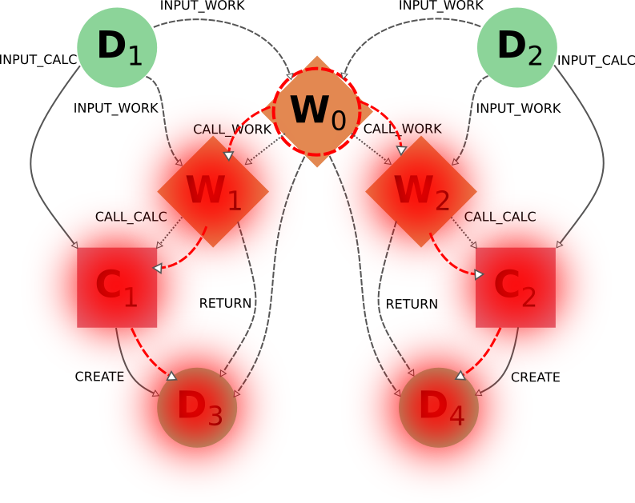

.. _topics:provenance:consistency:

===========
Consistency
===========

Because of the very nature of scientific research, it becomes indispensable to be able to both delete parts of a database (e.g., if errors are made, inputs are misspelled, or useless calculations are performed) or export it (for collaboration or publication purposes).
Both these features, which are provided by AiiDA, have one aspect in common: they can easily lead to a provenance graph with incomplete information.
To better understand why, let's take a look at the following basic provenance graph:

.. _delexp_example01a:
.. figure:: include/images/delexp_example01a.png

Even in this simple case, if we were to export only the calculation node and the output data node (or, equivalently, delete just the input data node), then we would have lost part of the critical information needed to run the calculation (the |D_1| node), thus losing the reproducibility of the calculation |C_1|.
In this simple case, therefore, in order to have a consistent provenance, whenever you export a calculation node you must also import *all* of its input nodes (or, symmetrically, whenever you delete a data node you must also delete all calculations that used it as an input).

This is just one of the many rules that must be considered when trying to manually edit a provenance database.
The key message to remember is that AiiDA will not only delete or export the nodes explicitly targeted by the user, but will also include any other nodes that are needed for keeping a consistent provenance in the resulting database.

It is also worth noting that if you do successive exports of partial information, AiiDA will be able to reconstruct links that might have been broken when dividing the data for export.
So if you first where to export the previous graph, and then you exported the next section of your full database:

.. _delexp_example01b:

Then AiiDA will be able to automatically identify the shared node |D_2| and connect both sections back together during the import process.
For this kind of recognition it doesn't matter which sub-graph was exported first.

In the following section we will explain in more detail the criteria for including other nodes and the corresponding traversal rules.

.. _topics:provenance:consistency:traversal-rules:

Traversal Rules
===============

When you run ``verdi node delete [NODE_IDS]`` or ``verdi archive create -N [NODE_IDS]``, AiiDA will look at the links incoming or outgoing from the nodes that you specified and decide if there are other nodes that are critical to keep.

For this decision, it is not only important to consider the type of link, but also if we are following it along its direction (we will call this ``forward`` direction) or in the reversed direction (``backward`` direction).
To clarify this, in the example above, when deleting data node |D_1|, AiiDA will follow the ``input_calc`` link in the ``forward`` direction (in this case, it will decide that the linked node (|C_1|) must then also be deleted).
If the initial target node was, instead, |C_1| the ``input_calc`` link would be followed in the ``backward`` direction (and in this case the node |D_1| will not be deleted, as we will explain below).

This process will be repeated recursively for every node that has just been included for deletion or export, until no more nodes need to be added.
The rules defining whether a linked node should be added or not to the delete/export list (based on the kind and direction of the link) are called *traversal rules*.
In the following section we will describe these rules both for the export and delete procedures.

The tables below are grouped according to the type of nodes and links involved.
We also provide illustrations of the cases considered, where the encircled node is the one being targeted, and the other node (to which the red arrow is pointing) is the one that is being considered for addition into the delete/export list.

Data and Calculation Nodes
--------------------------

The first example above already discusses the case of deleting an input node: in this case, it is necessary to also delete any calculation that uses it as an input.

In AiiDA, we apply the same criterion also when deleting an output: in this case, we follow the ``create`` link in the ``backward`` direction and we mark for deletion also the calculation that created it.
The reason for this is that a calculation with missing outputs could be misleading. For instance, some calculations produce optional outputs depending on the combination of input flags that are used.
A missing output might be interpreted as if that piece of information was not computed by the calculation.
In the case of export, the rules are typically the reverse of those used for deletion.
Therefore, in this case, the following rule applies: when exporting a calculation node, all its input data nodes and created output nodes must be exported as well.

On the other hand, when exporting a data node, users typically do not need to also export all the calculations that used it as an input.
These may represent further work that, by default, does not need to be exported as well (unless explicitly specified by the user in the list of nodes).
Equivalently, when deleting a calculation, one typically wants to keep its inputs, as they might be used by other unrelated calculations.

What should happen instead for the outputs of a calculation to be deleted?
Often, one might want to delete (recursively) all the outputs generated by it.
However, we leave the option to users to just delete the calculation, keeping its outputs in the database.
While we emphasize that this operation removes all provenance information for the output nodes, there are cases in which this is useful or even needed (removal of inputs that are protected by copyright, or creating a smaller archive file to transfer to collaborators who want to work with the output data).

+----------------------------------------------------------+-------------------------+-----------------------------------------------------+----------------------------------------------------+
| Illustrative diagram (explicitly targeted                | Name of Rule            | Behavior when exporting target node                 | Behavior when deleting target node                 |
| node is encircled)                                       |                         |                                                     |                                                    |
+==========================================================+=========================+=====================================================+====================================================+
| .. image:: include/images/delexp_caseDC1.png             | ``input_calc_forward``  | - Default Value: ``False``                          | - Fixed Value: ``True``                            |
|    :scale: 60%                                           |                         | - Linked node **won't** be exported **by default**. | - Linked node **will always** be deleted.          |
+----------------------------------------------------------+-------------------------+-----------------------------------------------------+----------------------------------------------------+
| .. image:: include/images/delexp_caseDC2.png             | ``input_calc_backward`` | - Fixed Value: ``True``                             | - Fixed Value: ``False`` [#f01]_                   |
|    :scale: 60%                                           |                         | - Linked node **will always** be exported.          | - Linked node **will never** be deleted.           |
+----------------------------------------------------------+-------------------------+-----------------------------------------------------+----------------------------------------------------+
| .. image:: include/images/delexp_caseCD1.png             | ``create_forward``      | - Fixed Value: ``True``                             | - Default Value: ``True``                          |
|    :scale: 60%                                           |                         | - Linked node **will always** be exported.          | - Linked node **will** be deleted **by default**.  |
+----------------------------------------------------------+-------------------------+-----------------------------------------------------+----------------------------------------------------+
| .. image:: include/images/delexp_caseCD2.png             | ``create_backward``     | - Default Value: ``True``.                          | - Fixed Value: ``True``                            |
|    :scale: 60%                                           |                         | - Linked node **will** be exported **by default**.  | - Linked node **will always** be deleted.          |
+----------------------------------------------------------+-------------------------+-----------------------------------------------------+----------------------------------------------------+

.. [#f01]
   Although we provide the option to automatically export all calculations that use as input any targeted data node (by specifying ``input_calc_forward=True``) we *currently* do not provide the reciprocal option to delete all the data node inputs when targeting calculation nodes.
   This is mainly for the potential danger that would imply automatically enabling upwards traversal of the data provenance when deleting, which would make it extremely hard to predict or control the nodes that will be ultimately affected.

Data and Workflow Nodes
-----------------------

The behavior when considering ``input_work`` links is exactly the same as when considering ``input_calc`` links for the same reasons.
The case for ``return`` links is partially similar to the one for ``create`` one.
Indeed, it isn't desirable to have a resulting database with missing outputs, so when exporting a workflow the returned data nodes will also be included (and when deleting a data node, the returning workflow will also be removed).
However, when exporting a returned node, the default behavior is *not* to traverse backwards through the ``return`` links, since a data node might be returned by several unrelated workflows (representing selection procedures for other studies, for example) that are unrelated to its creation.
The workflow responsible for coordinating its creation will be included in the export, not directly, but through the chain effect of including the creating calculation (through ``create_backward``) and then including its calling workflows (through ``call_calc_backward`` and ``call_work_backward``, see next sections).

+----------------------------------------------------------+-------------------------+-----------------------------------------------------+----------------------------------------------------+
| Illustrative diagram (explicitly targeted                | Name of Rule            | Behavior when exporting target node                 | Behavior when deleting target node                 |
| node is encircled)                                       |                         |                                                     |                                                    |
+==========================================================+=========================+=====================================================+====================================================+
| .. image:: include/images/delexp_caseDW1.png             | ``input_work_forward``  | - Default Value: ``False``                          | - Fixed Value: ``True``                            |
|    :scale: 60%                                           |                         | - Linked node **won't** be exported **by default**. | - Linked node **will always** be deleted.          |
+----------------------------------------------------------+-------------------------+-----------------------------------------------------+----------------------------------------------------+
| .. image:: include/images/delexp_caseDW2.png             | ``input_work_backward`` | - Fixed Value: ``True``                             | - Fixed Value: ``False``                           |
|    :scale: 60%                                           |                         | - Linked node **will always** be exported.          | - Linked node **will never** be deleted.           |
+----------------------------------------------------------+-------------------------+-----------------------------------------------------+----------------------------------------------------+
| .. image:: include/images/delexp_caseWD1.png             | ``return_forward``      | - Fixed Value: ``True``                             | - Fixed Value: ``False`` [#f02]_                   |
|    :scale: 60%                                           |                         | - Linked node **will always** be exported.          | - Linked node **will never** be deleted.           |
+----------------------------------------------------------+-------------------------+-----------------------------------------------------+----------------------------------------------------+
| .. image:: include/images/delexp_caseWD2.png             | ``return_backward``     | - Default Value: ``False``.                         | - Fixed Value: ``True``                            |
|    :scale: 60%                                           |                         | - Linked node **won't** be exported **by default**. | - Linked node **will always** be deleted.          |
+----------------------------------------------------------+-------------------------+-----------------------------------------------------+----------------------------------------------------+

.. [#f02]
   The reason to prevent the deletion of returned data nodes is that, since the logical provenance can be cyclical, this might end up deleting inputs and thus propagating the deletion process to other unrelated parts of the database.
   In most cases where you will want to delete a returned data node, you will be able to do so by setting ``call_calc_forward=True`` (see below) and ``create_forward=True`` (which is the default value).

Workflows and Calculation Nodes
-------------------------------

Finally, we will consider the possible (call) links between processes.
The results of a parent workflow depend critically on the sub-workflows or calculations launched by it.
When exporting a workflow node, we therefore always traverse its ``call`` links (both ``call_calc`` and ``call_work``) in the ``forward`` direction to include all children processes (i.e. processes directly called by it).
Since the traversal rules are applied recursively, this means that also the children processes of any workflow that was a child of the targeted one will be exported as well, and so on.
Analogously, when deleting a process the same applies but in the opposite direction (``backward``), including the parent workflow of the targeted node (if there is one), and the parent of that parent, etc.

Since ``call`` links are followed backward by default, targeting one process for either export or deletion results in selecting not only all of its child processes but also all children of any of its parent processes.
As a result of all ``call`` links being traversed in both directions, targeting any of the process nodes in a workflow will mean the inclusion of the other processes of that workflow as well.
Users can disable the traversal of ``call`` links in one of the directions (``forward`` for deletion, ``backward`` for export) for fine-grained control (see examples below).

+----------------------------------------------------------+-------------------------+-----------------------------------------------------+----------------------------------------------------+
| Illustrative diagram (explicitly targeted                | Name of Rule            | Behavior when exporting target node                 | Behavior when deleting target node                 |
| node is encircled)                                       |                         |                                                     |                                                    |
+==========================================================+=========================+=====================================================+====================================================+
| .. image:: include/images/delexp_caseWC1.png             | ``call_calc_forward``   | - Fixed Value: ``True``                             | - Default Value: ``True``                          |
|    :scale: 60%                                           |                         | - Linked node **will always** be exported.          | - Linked node **will** be deleted **by default**.  |
+----------------------------------------------------------+-------------------------+-----------------------------------------------------+----------------------------------------------------+
| .. image:: include/images/delexp_caseWC2.png             | ``call_calc_backward``  | - Default Value: ``True``                           | - Fixed Value: ``True``                            |
|    :scale: 60%                                           |                         | - Linked node **will** be exported **by default**.  | - Linked node **will always** be deleted.          |
+----------------------------------------------------------+-------------------------+-----------------------------------------------------+----------------------------------------------------+
| .. image:: include/images/delexp_caseWW1.png             | ``call_work_forward``   | - Fixed Value: ``True``                             | - Default Value: ``True``                          |
|    :scale: 60%                                           |                         | - Linked node **will always** be exported.          | - Linked node **will** be deleted **by default**.  |
+----------------------------------------------------------+-------------------------+-----------------------------------------------------+----------------------------------------------------+
| .. image:: include/images/delexp_caseWW2.png             | ``call_work_backward``  | - Default Value: ``True``.                          | - Fixed Value: ``True``                            |
|    :scale: 60%                                           |                         | - Linked node **will** be exported **by default**.  | - Linked node **will always** be deleted.          |
+----------------------------------------------------------+-------------------------+-----------------------------------------------------+----------------------------------------------------+

Cascading rules: an example
===========================

In the previous sections we have described the basic rules used by AiiDA to decide which nodes should also be included from an initial list of nodes to delete or export.
These rules are applied recursively: as new nodes are included in the deletion (or export)list, the rules are applied to them as well until no new nodes are included.
Therefore, the consequence of using these features on a given set of nodes may not always be straightforward, and the final set might include more nodes than naively expected.

Let us first focus on the data provenance only (i.e., only ``input_calc`` and ``create`` links). The following two rules apply when going in the ``forward`` direction:

* If you delete a data node, any calculation that uses it as input will *always* be deleted as well (``input_calc_forward=True``).
* If you delete a calculation node, any output data node will be deleted *by default* (``create_forward=True``).

The consequence of these two together is a "chain reaction" in which every node that can be traced back through the data provenance to any of the initial targeted nodes will end up being deleted as well.
The reciprocal is true for the export: the default behavior is that every ancestor will also be exported by default (because ``create_backward`` is ``True`` by default and ``input_calc_backward`` is always ``True``).

In regards to the connection between data provenance and logical provenance, the most important thing to understand is how the default behavior of the program treats the highest-level workflows as the units to be handled.
The logic behind this is the assumption that the typical user of the program will be dealing with it mostly in an interactive way, running pre-defined workflows through the verdi command line without needing a detailed knowledge of their internal procedures.
The default behavior then was designed to reproduce the most intuitive outcomes for this type of usage.

This behavior is basically the result of the settings of ``call_calc_forward=True`` and ``call_work_forward=True``, which makes that the inclusion of a process node will also imply the inclusion of any child or parent process node as well.
Following these rules in a recursive way leads to the command affecting all the processes within any given workflow: in this way, nodes that are sub-processes of a given highest-level workflow will end up grouped together, in the sense that (by default) they will all be affected in the same way when deleting or exporting.

More freedom to further customize the selection of sections to export or delete is available through the specific switchable flags for each functionality (although the final sections must always comply with the non-switchable rules, see above).
However, this usually requires a deeper understanding of the traversal rules and may imply a more thorough analysis of the particular graph.
To better illustrate this, we will now consider the application of the deletion procedure to the following graph:

.. _delexp_example02:
.. image:: include/images/delexp_example02.png
   :scale: 80%

As you can see, |W_1| and |W_2| describe two similar but independent procedures that were launched by a single parent workflow |W_0|.
A typical user would have obtained this by directly running this workflow |W_0| to obtain the results |D_3| and |D_4| from the inputs |D_1| and |D_2|, and may even be unaware of the internal division of |W_0| into two sub-Workflows |W_1| and |W_2|.
Hence, if the user considers the workflow (meaning, the whole set of nodes produced by it) no longer necessary, the intuitive thing to do in order to remove it from its database would be by targeting the workflow node |W_0| for deletion.
Indeed, this would produce the desired result:

.. _delexp_example02-a01:

The nodes |W_1| and |W_2| would be included because |W_0| is being targeted (``call_work_forward=True``), then the nodes |C_1| and |C_2| would also be included (``call_calc_forward=True``), and finally the nodes |D_3| and |D_4| would end up being included as well (``create_forward=True``).
In the end, only the inputs |D_1| and |D_2| remain (since ``input_work_backward=False`` always and ``input_calc_backward=False`` by default).

The same result would occur if the user were to target the output nodes instead (intending to delete everything associated with the obtention of those results).
It is important to notice that even if the user deletes only one of the outputs, the whole set of nodes generated by the workflow would be deleted, and not just the ones associated to the targeted data node.
As the results |D_3| and |D_4| where obtained from the same high-level process |W_0|, then the default behavior has the underlying assumption that they are interconnected and not independent from one another (as if they were two different outputs of a single calculation).

.. _delexp_example02-a03:

In this case, the node |C_1| would first be included because the data node |D_3| is being targeted (``create_reverse=True``), and this in turn would include the node |W_1| (``call_calc_reverse=True``) and then its parent workflow |W_0| (``call_work_reverse=True``).
Then nodes |W_2|, |C_2| and |D_4| will be included because |W_0| was included, for the same reasons that were explained in the paragraphs above.

Customizing the graph traversal (for deletion or export)
--------------------------------------------------------

This dependency between nodes becomes particularly relevant when, for example, a user with more knowledge of the internal procedures of the parent workflow |W_0| wants to only delete the calculations and results associated to workflow |W_1|.
The intuitive action of targeting |W_1| does not produce the desired outcome:

.. _delexp_example02-b01:
.. image:: include/images/delexp_example02-b01.png
   :scale: 80%

Indeed |C_1| and |D_4| will be deleted (through ``call_calc_forward`` from |W_1| to |C_1| and ``create_forward`` from |C_1| to |D_3|), but so will |W_0| (through ``call_work_reverse`` from |W_1|), |W_2| (``call_work_forward`` from |W_0|), |C_2| (``call_calc_forward`` from |W_2|) and |D_4| (``create_forward`` from |C_2|).
The way to achieve the desired outcome is not trivial, although in some situations like this, one could propose case-specific solutions such as targeting |W_1| with the switchable flag ``call_work_forward=False`` (preventing the traversal from |W_0| to |W_2|):

.. _delexp_example02-b02:
.. image:: include/images/delexp_example02-b02.png
   :scale: 80%

However, this approach is not generally applicable, and wouldn't work if |W_1| had sub-workflows that needed to be deleted as well.
A more general approach is to first sever the connection to |W_2| by deleting node |W_0| with all switchable traversal rules turned off.
Then, once the independence of |W_1| and |W_2| is explicitly reflected in the graph, node |W_1| can be deleted with the default settings.

.. _delexp_example02-b03:
.. image:: include/images/delexp_example02-b03.png
   :scale: 80%

It is worth noting that if the workflow |W_0| was itself part of a higher-level workflow, all that higher-level logic would be deleted due to the non-switchable rule ``call_work_reverse=True``.
This is an inevitable outcome of deleting part of a workflow, since due to the loss of that information it has become incomplete and it makes no sense to keep it.

.. |W_0| replace:: W\ :sub:`0`
.. |W_1| replace:: W\ :sub:`1`
.. |W_2| replace:: W\ :sub:`2`
.. |C_1| replace:: C\ :sub:`1`
.. |C_2| replace:: C\ :sub:`2`
.. |D_1| replace:: D\ :sub:`1`
.. |D_2| replace:: D\ :sub:`2`
.. |D_3| replace:: D\ :sub:`3`
.. |D_4| replace:: D\ :sub:`4`
