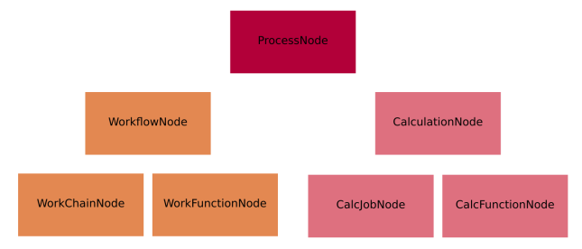
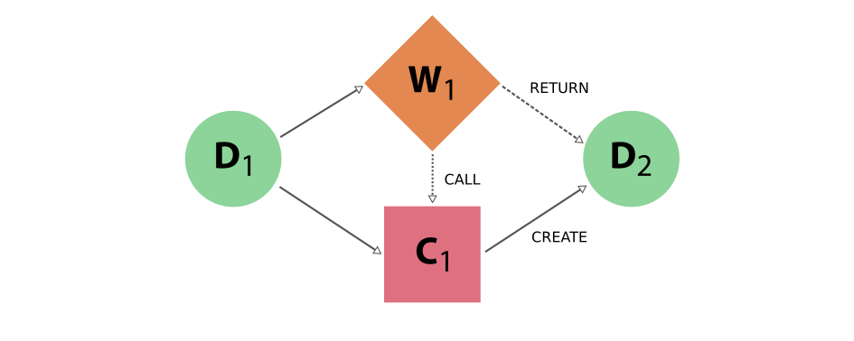
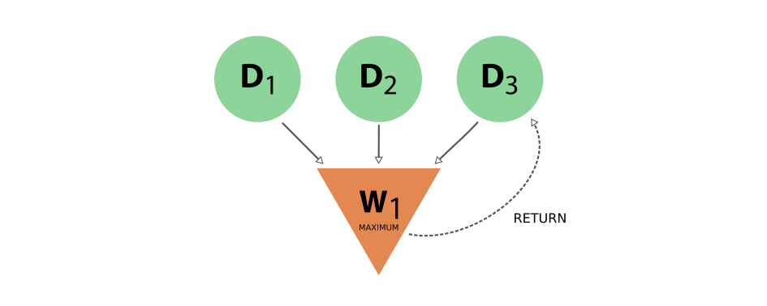
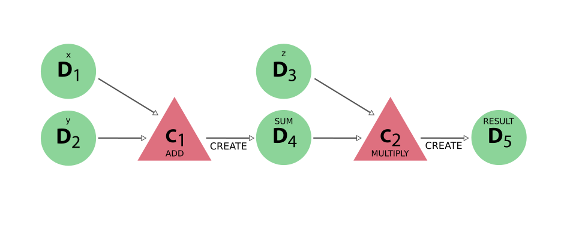
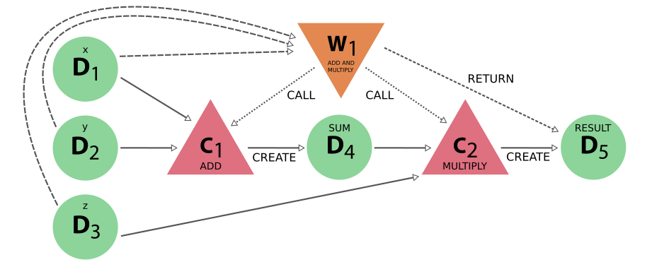

.. _topics:provenance:implementation:

==============
Implementation
==============

Graph nodes
===========

The **nodes** of the AiiDA provenance graph can be grouped into two main **types**: **process nodes** (``ProcessNode``), that represent the execution of calculations or workflows, and **data nodes** (``Data``), that represent pieces of data.

In particular, **process nodes** are divided into two sub categories:

    - **calculation nodes** (``CalculationNode``): Represent code execution that creates new data. These are further subdivided in two subclasses:

        - :py:class:`~aiida.orm.nodes.process.calculation.calcjob.CalcJobNode`: Represents the execution of a calculation external to AiiDA, typically via a job batch scheduler (see the concept of :ref:`calculation jobs<topics:calculations:concepts:calcjobs>`).
        - :py:class:`~aiida.orm.nodes.process.calculation.calcfunction.CalcFunctionNode`: Represents the execution of a python function (see the concept of :ref:`calculation functions<topics:calculations:concepts:calcfunctions>`).

    - **workflow nodes** (``WorkflowNode``): Represent python code that orchestrates the execution of other workflows and calculations, that optionally return the data created by the processes they called. These are further subdivided in two subclasses:

        - :py:class:`~aiida.orm.nodes.process.workflow.workchain.WorkChainNode`: Represents the execution of a python class instance with built-in checkpoints, such that the process may be paused/stopped/resumed (see the concept of :ref:`work chains<topics:workflows:concepts:workchains>`).
        - :py:class:`~aiida.orm.nodes.process.workflow.workfunction.WorkFunctionNode`: Represents the execution of a python function calling other processes (see the concept of :ref:`work functions<topics:workflows:concepts:workfunctions>`).

The class hierarchy of the process nodes is shown in the figure below.

.. _fig_provenance_class_hierarchy:

    The hierarchy of the ORM classes for the process nodes. Only instances of the lowest level of classes will actually enter into the provenance graph. The two upper levels have a mostly taxonomical purpose as they allow us to refer to multiple classes at once when reasoning about the graph as well as a place to define common functionality (see section on :ref:`processes <topics:processes:concepts>`).

For what concerns data nodes, the base class (``Data``) is subclassed to provide functionalities specific to the data type and python methods to operate on it.
Often, the name of the subclass contains the word “Data” appended to it, but this is not a requirement. A few examples:

* :py:class:`~aiida.orm.nodes.data.float.Float`, :py:class:`~aiida.orm.nodes.data.int.Int`, :py:class:`~aiida.orm.nodes.data.bool.Bool`, :py:class:`~aiida.orm.nodes.data.str.Str`, :py:class:`~aiida.orm.nodes.data.list.List`, ...
* :py:class:`~aiida.orm.nodes.data.dict.Dict`: represents a dictionary of key-value pairs - these are parameters of a general nature that do not need to belong to more specific data sub-classes
* :py:class:`~aiida.orm.nodes.data.structure.StructureData`: represents crystal structure data (containing chemical symbols, atomic positions of the atoms, periodic cell for periodic structures, …)
* :py:class:`~aiida.orm.nodes.data.array.array.ArrayData`: represents generic numerical arrays of data (python numpy arrays)
* :py:class:`~aiida.orm.nodes.data.array.kpoints.KpointsData`: represents a numerical array of k-points data, is a sub-class of ``ArrayData``

For more detailed information see :ref:`AiiDA data types <DataTypes>`.

In the next section we introduce the links between nodes, creating the AiiDA graph, and then we show some examples to clarify what we introduced up to now.

Graph links
===========

Process nodes are connected to their input and output data nodes through directed links.
Calculation processes can *create* data, while workflow processes can *call* calculations and *return* their outputs.
Consider the following graph example, where we represent **data nodes** with circles, **calculation nodes** with squares and **workflow nodes** with diamond shapes.

.. _fig_provenance_simple_workflow:

    Simple provenance graph for a workflow (W\ :sub:`1`) *calling* a calculation (C\ :sub:`1`). The workflow takes a single **data node** (D\ :sub:`1`\) as input, and passes it to the calculation when *calling* it. The calculation *creates* a new **data node** (D\ :sub:`2`\) that is also *returned* by the **workflow node**.

Notice that the different style and names for the two links coming into D\ :sub:`2` is intentional, because it was the calculation that *created* the new data, whereas the workflow merely *returned* it.
This subtle distinction has big consequences.
By allowing workflow processes to *return* data, it can also *return* data that was among its inputs.

.. _fig_provenance_cycle:

    Provenance graph example of a **workflow node** that receives three **data nodes** as input and *returns* one of those inputs. The input link from D\ :sub:`3` to W\ :sub:`1` and the return link from W\ :sub:`1` to D\ :sub:`3` introduce a cycle in the graph.

A scenario like this, represented in :numref:`fig_provenance_cycle`, would create a cycle in the provenance graph, breaking the “acyclicity” of the DAG.
To restore the directed acyclic graph, we separate the entire provenance graph into two planes as described above: the **data provenance** and the **logical provenance**.
With this division, the acyclicity of the graph is restored in the data provenance plane.

An additional benefit of thinking of the provenance graph in these two planes, is that it allows you to inspect it with different layers of granularity.
Imagine a high level workflow that calls a large number of calculations and sub-workflows, that each may also call more sub-processes, to finally produce and return one or more data nodes as its result.

Graph examples
==============

With these basic definitions of AiiDA’s provenance graph in place, let’s take a look at some examples.
Consider the sequence of computations that adds two numbers `x` and `y`, and then multiplies the result with a third number `z`.
This sequence as represented in the provenance graph would look something like what is shown in :numref:`fig_provenance_add_multiply_data`.

.. _fig_provenance_add_multiply_data:

    The DAG for computing `(x+y)*z`. We have two simple calculations: C\ :sub:`1` represents the addition and C\ :sub:`2` the multiplication.
    The two data nodes D\ :sub:`1` and D\ :sub:`2` are the inputs of C\ :sub:`1`, which *creates* the data node D\ :sub:`4`\.
    Together with D\ :sub:`3`, D\ :sub:`4` then forms the input of C\ :sub:`2`, which multiplies their values that *creates* the product, represented by D\ :sub:`5`.

In this simple example, there was no external process that controlled the exact sequence of these operations.
This may be imagined however, by adding a workflow that calls the two calculations in succession, as shown in :numref:`fig_provenance_add_multiply_full`.

.. _fig_provenance_add_multiply_full:

    The same calculation `(x+y)*z` is performed using a workflow. Here the data nodes D\ :sub:`1`, D\ :sub:`2`, and D\ :sub:`3` are the inputs of the workflow W\ :sub:`1`, which *calls* calculation C\ :sub:`1` with inputs D\ :sub:`1` and D\ :sub:`2`.
    It then *calls* calculation C\ :sub:`2`, using as inputs D\ :sub:`3` and D\ :sub:`4` (which was *created* by C\ :sub:`2`\).
    Calculation C\ :sub:`2` *creates* data node D\ :sub:`5`, which is finally *returned* by workflow W\ :sub:`1`\.

Notice that if we were to omit the workflow nodes and all its links from the provenance graph in :numref:`fig_provenance_add_multiply_full`, one would end up with the exact same graph as shown in :numref:`fig_provenance_add_multiply_data` (the **data provenance** graph).
