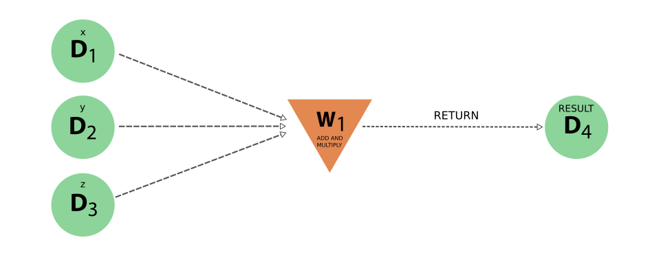
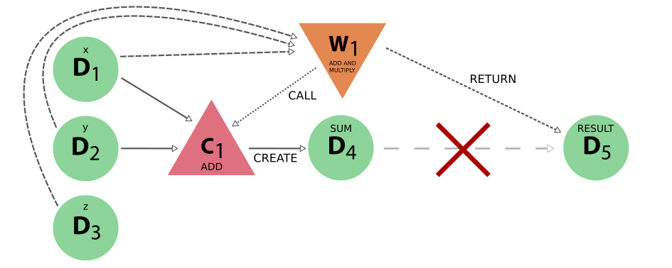

.. _topics:workflows:usage:

=====
Usage
=====

.. note:: This chapter assumes knowledge of the :ref:`basic concept<topics:workflows:concepts>` and difference between work functions and work chains is known and when one should use on or the other.

A workflow in AiiDA is a process (see the :ref:`process section<topics:processes:concepts>` for details) that calls other workflows and calculations and optionally *returns* data and as such can encode the logic of a typical scientific workflow.
Currently, there are two ways of implementing a workflow process:

* :ref:`work function<topics:workflows:usage:workfunctions>`
* :ref:`work chain<topics:workflows:usage:workchains>`

This section will provide detailed information and best practices on how to implement these two workflow types.

.. _topics:workflows:usage:workfunctions:

Work functions
==============

The concept of work functions and the basic rules of implementation are documented in detail elsewhere:

* :ref:`concept of work functions<topics:workflows:concepts:workfunctions>`
* :ref:`implementation of process functions<topics:processes:functions>`

Since work functions are a sub type of process functions, just like calculation functions, their implementation rules are as good as identical.
However, their intended aim and heuristics are very different.
Where :ref:`calculation functions<topics:calculations:usage:calcfunctions>` are 'calculation'-like processes that *create* new data, work functions behave like 'workflow'-like processes and can only *return* data.
What this entails in terms of intended usage and limitations for work functions is the scope of this section.

.. _topics:workflows:usage:workfunctions:returning_data:

Returning data
--------------
It has been said many times before: work functions, like all 'workflow'-like processes, `return` data, but what does `return` mean exactly?
In this context, the term 'return' is not intended to refer to a piece of python code returning a value.
Instead it refers to a workflow process recording a data node as one of its outputs, that *it itself did not create*, but which rather was created by some other process, that was called by the workflow.
The calculation process was responsable for *creating* the data node and the workflow is merely *returning* it as one of its outputs.

This is then exactly what the workfunction function does.
It takes one or more data nodes as inputs, calls other processes to which it passes those inputs and optionally returns some or all of the outputs created by the calculation processes it called.
As explained in the :ref:`technical section<topics:processes:functions>`, outputs are recorded as 'returned' nodes simply by returning the nodes from the function.
The engine will inspect the return value from the function and attach the output nodes to the node that represents the work function.
To verify that the output nodes are in fact not 'created', the engine will check that the nodes are stored.
Therefore, it is very important that you **do not store the nodes you create yourself**, or the engine will raise an exception, as shown in the following example:

.. include:: include/snippets/workfunctions/workfunction_store.py
    :code: python

Because the returned node is a newly created node and not stored, the engine will raise the following exception:

.. code:: bash

    ValueError: Workflow<illegal_workfunction> tried returning an unstored `Data` node.
    This likely means new `Data` is being created inside the workflow.
    In order to preserve data provenance, use a `calcfunction` to create this node and return its output from the workflow

Note that you could of course circumvent this check by calling ``store`` yourself on the node, but that misses the point.
The problem with using a ``workfunction`` to 'create' new data, is that the provenance is lost.
To illustrate this problem, let's go back to the simple problem of implementing a workflow to add two integer and multiply the result with a third.
The :ref:`correct implementation<topics:workflows:concepts:workfunctions>` has a resulting provenance graph that clearly captures the addition and the multiplication as separate calculation nodes, as shown in :numref:`fig_work_functions_provenance_add_multiply_full`.
To illustrate what would happen if one does does not call calculation functions to perform the computations, but instead directly perform them in the work function itself and return the result, consider the following example:

.. include:: include/snippets/workfunctions/workfunction_add_multiply_internal.py
    :code: python

.. warning:: For the documentation skimmers: this is an explicit example on **how not to use** work functions. The :ref:`correct implementation<topics:workflows:concepts:workfunctions>` calls calculation functions to perform the computation

Note that in this example implementation we explicitly had to call ``store`` on the result before returning it to avoid the exception thrown by the engine.
The resulting provenance would look like the following:

.. _fig_work_functions_provenance_add_multiply_internal:

    The provenance generated by the incorrect work function implementation. Note how the addition and multiplication are not explicitly represented, but are implicitly hidden inside the workflow node. Moreover, the result node does not have a 'create' link, because a work function cannot create new data.

However, looking at the generated provenance shows exactly why we shouldn't.
This faulty implementation loses provenance as it has no explicit representations of the addition and the multiplication and the `result` node does not have a `create` link, which means that if only the data provenance is followed, it is as if it appears out of thin air!
Compare this to the provenance graph of :numref:`fig_work_functions_provenance_add_multiply_full`, which was generated by a solution that correctly uses calculation functions to perform the computations.
In this trivial example, one may think that this loss of information is not so important, because it is implicitly captured by the workflow node.
But a halfway solution may make the problem more apparent, as demonstrated by the following snippet where the addition is properly done by calling a calculation function, but the final product is still performed by the work function itself:

.. include:: include/snippets/workfunctions/workfunction_add_multiply_halfway.py
    :code: python

.. warning:: For the documentation skimmers: this is an explicit example on **how not to use** work functions. The :ref:`correct implementation<topics:workflows:concepts:workfunctions>` calls calculation functions to perform the computation

This time around the addition is correctly performed by a calculation function as it should, however, its result is multiplied by the work function itself and returned.
Note that once again ``store`` had to be called explicitly on ``product`` to avoid the engine throwing a ``ValueError``, which is only for the purpose of this example **and should not be done in practice**.
The resulting provenance would look like the following:

.. _fig_work_functions_provenance_add_multiply_halfway:

    The provenance generated by the incorrect work function implementation that uses only a calculation function for the addition but performs the multiplication itself.
    The red cross is there to indicate that there is no actual connection between the intermediate sum `D4` and the final result `D5`, even though the latter in reality derives from the former.

The generated provenance shows, that although the addition is explicitly represented because the work function called the calculation function, there is no connection between the sum and the final result.
That is to say, there is no direct link between the sum `D4` and the final result `D5`, as indicated by the red cross, even though we know that the final answer was based on the intermediate sum.
This is a direct cause of the work function 'creating' new data and illustrates how, in doing so, the provenance of data creation is lost.

.. _topics:workflows:usage:workfunctions:exit_codes:

Exit codes
----------

To terminate the execution of a work function and mark it as failed, one simply has to return an :ref:`exit code<topics:processes:usage:exit_codes>`.
The :py:class:`~aiida.engine.processes.exit_code.ExitCode` class is constructed with an integer, to denote the desired exit status and an optional message
When such as exit code is returned, the engine will mark the node of the work function as ``Finished`` and set the exit status and message to the value of the exit code.
Consider the following example:

.. code:: python

    @workfunction
    def exiting_workfunction():
        from aiida.engine import ExitCode
        return ExitCode(418, 'I am a teapot')

The execution of the work function will be immediately terminated as soon as the exit code is returned, and the exit status and message will be set to ``418`` and ``I am a teapot``, respectively.
Since no output nodes are returned, the ``WorkFunctionNode`` node will have no outputs and the value returned from the function call will be an empty dictionary.

.. _topics:workflows:usage:workchains:

Work chains
===========

The :ref:`basic concept of the work chain<topics:workflows:concepts:workchains>` has been explained elsewhere.
This section will provide details on how a work chain can and should be implemented.
A work chain is implemented by the :py:class:`~aiida.engine.processes.workchains.workchain.WorkChain` class.
Since it is a sub class of the :py:class:`~aiida.engine.processes.process.Process` class, it shares all its properties.
It will be very valuable to have read the section on working with :ref:`generic processes<topics:processes:usage>` before continuing, because all the concepts explained there will apply also to work chains.

Let's continue with the example presented in the section on the :ref:`concept of workchains<topics:workflows:concepts:workchains>`, where we sum two integers and multiply the result with a third.
We provided a very simple implementation in a code snippet, whose generated provenance graph, when executed, is shown in :numref:`fig_work_chains_provenance_add_multiply_workchain_full`.
For convenience we copy the snippet here once more:

.. include:: include/snippets/workchains/add_multiply_workchain_external_computation.py
    :code: python

We will now got through the implementation step-by-step and go into more detail on the interface and best practices.

.. _topics:workflows:usage:workchains:define:

Define
------
To implement a new work chain, simply create a new class that sub classes :py:class:`~aiida.engine.processes.workchains.workchain.WorkChain`.
You can give the new class any valid python class name, but the convention is to have it end in ``WorkChain`` so that it is always immediately clear what it references.
After having created a new work chain class, the first and most important method to implement is the :py:meth:`~aiida.engine.processes.process.Process.define` method.
This is a class method that allows the developer to define the characteristics of the work chain, such as what inputs it takes, what outputs it can generate, what potential exit codes it can return and the logical outline through which it will accomplish all this.

To implement the ``define`` method, you have to start with the following three lines:

.. code:: python

    @classmethod
    def define(cls, spec):
        super().define(spec)

where you replace ``AddAndMultiplyWorkChain`` with the actual name of your work chain.
The ``@classmethod`` decorator indicates that this method is a class method  [#f1]_ and not an instance method.
The second line is the method signature and specified that it will receive the class itself ``cls`` and ``spec`` which will be an instance of the :py:class:`~aiida.engine.processes.process_spec.ProcessSpec`.
This is the object that we will use to define our inputs, outputs and other relevant properties of the work chain.
The third and final line is extremely important, as it will call the ``define`` method of the parent class, in this case the :py:class:`~aiida.engine.processes.workchains.workchain.WorkChain` class.

.. warning::

    If you forget to call ``super`` in the ``define`` method, your work chain will fail miserably!

.. _topics:workflows:usage:workchains:define_inputs_outputs:

Inputs and outputs
------------------
With those formalities out of the way, you can start defining the interesting properties of the work chain through the ``spec``.
In the example you can see how the method :py:meth:`~plumpy.ProcessSpec.input` is used to define multiple input ports, which document exactly which inputs the work chain expects.
Similarly, :py:meth:`~plumpy.ProcessSpec.output` is called to instruct that the work chain will produce an output with the label ``result``.
These two port creation methods support a lot more functionality, such as adding help string, validation and more, all of which is documented in detail in the section on :ref:`ports and port namespace<topics:processes:usage:ports_portnamespaces>`.

.. _topics:workflows:usage:workchains:define_outline:

Outline
-------
The outline is what sets the work chain apart from other processes.
It is a way of defining the higher-level logic that encodes the workflow that the work chain takes.
The outline is defined in the ``define`` method through the :py:meth:`~plumpy.WorkChainSpec.outline`.
It takes a sequence of instructions that the work chain will execute, each of which is implemented as a method of the work chain class.
In the simple example above, the outline consists of three simple instructions: ``add``, ``multiply``, ``results``.
Since these are implemented as instance methods, they are prefixed with ``cls.`` to indicate that they are in fact methods of the work chain class.
For that same reason, their implementation should take ``self`` as its one and only argument, as demonstrated in the example snippet.

The outline in this simple example is not particular interesting as it consists of three simple instructions that will be executed sequentially.
However, the outline also supports various logical constructs, such as while-loops, conditionals and return statements.
As usual, the best way to illustrate these constructs is by example.
The currently available logical constructs for the work chain outline are:

* ``if``, ``elif``, ``else``
* ``while``
* ``return``

To distinguish these constructs from the python builtins, they are suffixed with an underscore, like so ``while_``.
To use these in your work chain design, you will have to import them:

.. code:: python

    from aiida.engine import if_, while_, return_

The following example shows how to use these logical constructs to define the outline of a work chain:

.. code:: python

    spec.outline(
        cls.initialize_to_zero,
        while_(cls.n_is_less_than_hundred)(
            if_(cls.n_is_multiple_of_three_and_five)(
                cls.report_fizz_buzz,
            ).elif_(cls.n_is_multiple_of_three)(
                cls.report_fizz,
            ).elif_(cls.n_is_multiple_of_five)(
                cls.report_buzz,
            ).else_(
                cls.report_n,
            ),
            cls.increment_n_by_one,
        ),
    )

This is an implementation (and an extremely contrived one at that) of the well known FizzBuzz [#f2]_ problem.
The idea is that the program is supposed to print in sequence the numbers from zero to some limit, except when the number is a multiple of three ``Fizz`` is printed, for a multiple of five ``Buzz`` and when it is a multiple of both, the program should print ``FizzBuzz``.
Note how the syntax looks very much like that of normal python syntax.
The methods that are used in the conditionals (between the parentheses of the ``while_`` and ``if_`` constructs) for example should return a boolean; ``True`` when the condition holds and ``False`` otherwise.
The actual implementation of the outline steps themselves is now trivial:

.. code:: python

    def initialize_to_zero(self):
        self.ctx.n = 1

    def n_is_less_than_hundred(self):
        return self.ctx.n < 100

    def n_is_multiple_of_three(self):
        return self.ctx.n % 3 == 0

    def n_is_multiple_of_five(self):
        return self.ctx.n % 5 == 0

    def n_is_multiple_of_three_and_five(self):
        return self.ctx.n % 3 == 0 and self.ctx.n % 5 == 0

    def increment_n_by_one(self):
        self.ctx.n += 1

The intention of this example is to show that with a well designed outline, a user only has to look at the outline to have a good idea *what* the work chain does and *how* it does it.
One should not have to look at the implementation of the outline steps as all the important information is captured by the outline itself.
Since the goal of a work chain should be to execute a very well defined task, it is the goal of the outline to capture the required logic to achieve that goal, in a clear and short yet not overly succint manner.
The outline supports various logical flow constructs, such as conditionals and while loops, so where possible this logic should be expressed in the outline and not in the body of the outline functions.
However, one can also go overboard and put too finely grained logical blocks into the outline, causing it to become bulky and difficult to understand.

A good rule of thumb in designing the outline is the following: before you start designing a work chain, define very clearly the task that it should carry out.
Once the goal is clear, draw a schematic block diagram of the necessary steps and logical decisions that connect them, in order to accomplish that goal.
Converting the resulting flow diagram in a one-to-one fashion into an outline, often results in very reasonable outline designs.

.. _topics:workflows:usage:workchains:define_exit_codes:

Exit codes
----------
There is one more property of a work chain that is specified through its process specification, in addition to its inputs, outputs and outline.
Any work chain may have one to multiple failure modes, which are modelled by :ref:`exit codes<topics:processes:usage:exit_codes>`.
A work chain can be stopped at any time, simply by returning an exit code from an outline method.
To retrieve an exit code that is defined on the spec, one can use the :py:meth:`~aiida.engine.processes.process.Process.exit_codes` property.
This returns an attribute dictionary where the exit code labels map to their corresponding exit code.
For example, with the following process spec:

.. code:: python

    spec = ProcessSpec()
    spec.exit_code(418, 'ERROR_I_AM_A_TEAPOT', 'the process had an identity crisis')

To see how exit codes can be used to terminate the execution of work chains gracefully, refer to the section :ref:`topics:workflows:usage:workchains:aborting_and_exit_codes`.

.. _topics:workflows:usage:workchains:launching_workchains:

Launching work chains
---------------------

The rules for launching work chains are the same as those for any other process, which are detailed in :ref:`this section<topics:processes:usage:launching>`.
On top of those basic rules, there is one peculiarity in the case of work chains when submitting to the daemon.
When you submit a ``WorkChain`` over the daemon, or any other process for that matter, you need to make sure that the daemon can find the class when it needs to load it.
Registering your class through the plugin system with a designated entry point is one way to make sure that the daemon will be able to find it.
If, however, you simply have a test class and do not want to go through the effort of creating an entry point for it, you should make sure that the module where you define the class is in the python path.
Additionally, make sure that the definition of the work chain **is not in the same file from which you submit it**, or the engine won't be able to load it.

.. _topics:workflows:usage:workchains:context:

Context
-------
In the simplest work chain example presented in the introductory section, we already saw how the context can be used to persist information during the execution of a work chain and pass it between outline steps.
The context is essentially a data container, very similar to a dictionary that can hold all sorts of data.
The engine will ensure that its contents are saved and persisted in between steps and when the daemon shuts down or restarts.
A trivial example of this would be the following:

.. code:: python

    def step_one(self):
        self.ctx.some_variable = 'store me in the context'

    def step_two(self):
        assert self.ctx.some_variable == 'store me in the context'

In the ``step_one`` outline step we store the string ``'store me in the context'`` in the context, which can be addressed as ``self.ctx``, under the key ``some_variable``.
Note that for the key you can use anything that would be a valid key for a normal python dictionary.
In the second outline step ``step_two``, we can verify that the string was successfully persisted, by checking the value stored in the context ``self.ctx.some_variable``.

.. warning::

    Any data that is stored in the context **has** to be serializable.

This was just a simple example to introduce the concept of the context, however, it really is one of the more important parts of the work chain.
The context really becomes crucial when you want to submit a calculation or another work chain from within the work chain.
How this is accomplished, we will show in the next section.

.. _topics:workflows:usage:workchains:submitting_sub_processes:

Submitting sub processes
------------------------
One of the main tasks of a ``WorkChain`` will be to launch other processes, such as a ``CalcJob`` or another ``WorkChain``.
How to submit processes was explained in :ref:`another section<topics:processes:usage:launch>` and is accomplished by using the :py:func:`~aiida.engine.launch.submit` launch function.
However, when submitting a sub process from within a work chain, **this should not be used**.
Instead, the :py:class:`~aiida.engine.processes.process.Process` class provides its own :py:meth:`~aiida.engine.processes.process.Process.submit` method.
If you do, you will be greeted with the exception:

.. code:: python

    InvalidOperation: 'Cannot use top-level `submit` from within another process, use `self.submit` instead'

The only change you have to make is to replace the top-level ``submit`` method with the built-in method of the process class:

.. code:: python

    def submit_sub_process(self)
        node = self.submit(SomeProcess, **inputs)  # Here we use `self.submit` and not `submit` from `aiida.engine`
        return ToContext(sub_process=node)

The ``self.submit`` method has the exact same interface as the global ``aiida.engine.launch.submit`` launcher.
When the ``submit`` method is called, the process is created and submitted to the daemon, but at that point it is not yet done.
So the value that is returned by the ``submit`` call is not the result of the submitted process, but rather it is the process node that represents the execution of the process in the provenance graph and acts as a *future*.
We somehow need to tell the work chain that it should wait for the sub process to be finished, and the future to resolve, before it continues.
To do so, however, control has to be returned to the engine, which can then, when the process is completed, call the next step in the outline, where we can analyse the results.
The snippet above already revealed that this is accomplished by returning an instance of the ``ToContext`` class.

To context
^^^^^^^^^^
In order to store the future of the submitted process, we can store it in the context with a special construct that will tell the engine that it should wait for that process to finish before continuing the work chain.
To illustrate how this works, consider the following minimal example:

.. include:: include/snippets/workchains/run_workchain_submit_complete.py
    :code: python

As explained in the previous section, calling ``self.submit`` for a given process that you want to submit, will return a future.
To add this future to the context, we can not access the context directly as explained in the :ref:`context section<topics:workflows:usage:workchains:context>`, but rather we need to use the class :py:class:`~aiida.engine.processes.workchains.context.ToContext`.
This class has to be imported from the ``aiida.engine`` module.
To add the future to the context, simply construct an instance of ``ToContext``, passing the future as a keyword argument, and returning it from the outline step.
The keyword used, ``workchain`` in this example, will be the key used under which to store the node in the context once its execution has terminated.
Returning an instance of ``ToContext`` signals to the engine that it has to wait for the futures contained within it to finish execution, store their nodes in the context under the specified keys and then continue to the next step in the outline.
In this example, that is the ``inspect_workchain`` method.
At this point we are sure that the process, a work chain in this case, has terminated its execution, although not necessarily successful, and we can continue the logic of the work chain.

.. warning::

    Using the ``ToContext`` construct alone is not enough to tell the engine that it should wait for the sub process to finish.
    There **needs** to be at least another step in the outline to follow the step that added the awaitables.
    If there is no more step to follow, according to the outline, the engine interprets this as the work chain being done and so it will not wait for the sub process to finish.
    Think about it like this: if there is not even a single step to follow, there is also nothing the work chain could do with the results of the sub process, so there is no point in waiting.

Sometimes one wants to launch not just one, but multiple processes at the same time that can run in parallel.
With the mechanism described above, this will not be possible since after submitting a single process and returning the ``ToContext`` instance, the work chain has to wait for the process to be finished before it can continue.
To solve this problem, there is another way to add futures to the context:

.. include:: include/snippets/workchains/run_workchain_submit_parallel.py
    :code: python

Here we submit three work chains in a for loop in a single outline step, but instead of returning an instance of ``ToContext``, we call the :meth:`~aiida.engine.processes.workchains.workchain.WorkChain.to_context` method.
This method has exactly the same syntax as the ``ToContext`` class, except it is not necessary to return its value, so we can call it multiple times in one outline step.
Under the hood the functionality is also the same as the ``ToContext`` class.
At the end of the ``submit_workchains`` outline step, the engine will find the futures that were added by calling ``to_context`` and will wait for all of them to be finished.
The good thing here is that these three sub work chains can be run in parallel and once all of them are done, the parent work chain will go to the next step, which is ``inspect_workchains``.
There we can find the nodes of the work chains in the context under the key that was used as the keyword argument in the ``to_context`` call in the previous step.

Since we do not want the subsequent calls of ``to_context`` to override the previous future, we had to create unique keys to store them under.
In this example, we chose to use the index of the for-loop.
The name carries no meaning and is just required to guarantee unique key names.
This pattern will occur often where you will want to launch multiple work chains or calculations in parallel and will have to come up with unique names.
In essence, however, you are really just creating a list and it would be better to be able to create a list in the context and simply append the future to that list as you submit them.
How this can be achieved is explained in the next section.

Appending
^^^^^^^^^
When you want to add a future of a submitted sub process to the context, but append it to a list rather than assign it to a key, you can use the :func:`~aiida.engine.processes.workchains.context.append_` function.
Consider the example from the previous section, but now we will use the ``append_`` function instead:

.. include:: include/snippets/workchains/run_workchain_submit_append.py
    :code: python

Notice that in the ``submit_workchains`` step we no longer have to generate a unique key based on the index but we simply wrap the future in the ``append_`` function and assign it to the generic key ``workchains``.
The engine will see the ``append_`` function and instead of assigning the node corresponding to the future to the key ``workchains``, it will append it to the list stored under that key.
If the list did not yet exist, it will automatically be created.
The ``self.ctx.workchains`` now contains a list with the nodes of the completed work chains, with the same order as they had been inserted, and so in the ``inspect_workchains`` step we can simply iterate over it to access all of them.
Note that the use of ``append_`` is not just limited to the ``to_context`` method.
You can also use it in exactly the same way with ``ToContext`` to append a process to a list in the context in multiple outline steps.

Nested context keys
^^^^^^^^^^^^^^^^^^^

To simplify the organization of the context, the keys may contain dots ``.``, transparently creating namespaces in the process.
As an example compare the following to the parallel submission example above:

.. include:: include/snippets/workchains/run_workchain_submit_parallel_nested.py
    :code: python

This allows to create intuitively grouped and easily accessible structures of child calculations or workchains.

.. _topics:workflows:usage:workchains:reporting:

Reporting
---------
During the execution of a ``WorkChain``, we may want to keep the user abreast of its progress and what is happening.
For this purpose, the ``WorkChain`` implements the :py:meth:`~aiida.engine.processes.process.Process.report` method, which functions as a logger of sorts.
It takes a single argument, a string, that is the message that needs to be reported:

.. code:: python

    def submit_calculation(self):
        self.report('here we will submit a calculation')

This will send that message to the internal logger of python, which will cause it to be picked up by the default AiiDA logger, but it will also trigger the database log handler, which will store the message in the database and link it to the node of the work chain.
This allows the ``verdi process report`` command to retrieve all those messages that were fired using the ``report`` method for a specific process.
Note that the report method, in addition to the pk of the work chain, will also automatically record the name of the work chain and the name of the outline step in which the report message was fired.
This information will show up in the output of ``verdi process report``, so you never have to explicitly reference the work chain name, outline step name or date and time in the message itself.

It is important to note that the report system is a form of logging and as such has been designed to be read by humans only.
That is to say, the report system is not designed to pass information programmatically by parsing the log messages.

Logging from calculation functions and work functions
^^^^^^^^^^^^^^^^^^^^^^^^^^^^^^^^^^^^^^^^^^^^^^^^^^^^^

Unlike work chains and calc jobs, calculation functions and work functions do not have a direct ``self.report()`` method available since they are plain Python functions decorated with ``@calcfunction`` or ``@workfunction``, respectively.
However, it is still possible to generate persistent log messages that will be stored in the database and retrievable via ``verdi process report``.

To persistently log messages from within a calculation function or work function, use the :py:func:`~aiida.common.log.get_process_logger` function:

.. code:: python

    from aiida.engine import calcfunction, get_process_logger
    from aiida.orm import Int

    @calcfunction
    def add(x, y):
        logger = get_process_logger()
        if logger:
            logger.report(f'Adding {x.value} and {y.value}')
        return x + y

The :py:func:`~aiida.common.log.get_process_logger` function returns a logger that is configured to automatically write log messages to the database, linked to the process node.
All messages will be stored in the database as :py:class:`~aiida.orm.logs.Log` entries and can be retrieved using ``verdi process report <PK>``.
The same approach works for work functions, and the logger supports all standard Python logging levels (``debug``, ``info``, ``warning``, ``error``, ``critical``), as well as the AiiDA-specific ``report`` level.

.. note::

    Using the standard Python ``logging`` module (e.g., ``logging.getLogger(__name__).report(...)``) will print messages to the terminal but will **not** store them in the database.
    Only messages logged through the logger returned by :py:func:`~aiida.common.log.get_process_logger` are persisted and will appear in ``verdi process report``.

.. _topics:workflows:usage:workchains:aborting_and_exit_codes:

Aborting and exit codes
-----------------------
At the end of every outline step, the return value will be inspected by the engine.
If a non-zero integer value is detected, the engine will interpret this as an exit code and will stop the execution of the work chain, while setting its process state to ``Finished``.
In addition, the integer return value will be set as the ``exit_status`` of the work chain, which combined with the ``Finished`` process state will denote that the worchain is considered to be ``Failed``, as explained in the section on the :ref:`process state <topics:processes:concepts:state>`.
This is useful because it allows a workflow designer to easily exit from a work chain and use the return value to communicate programmatically the reason for the work chain stopping.

We assume that you have read the :ref:`section on how to define exit codes <topics:workflows:usage:workchains:define_exit_codes>` through the process specification of the work chain.
Consider the following example work chain that defines such an exit code:

.. code:: python

    spec.exit_code(400, 'ERROR_CALCULATION_FAILED', 'the child calculation did not finish successfully')

Now imagine that in the outline, we launch a calculation and in the next step check whether it finished successfully.
In the event that the calculation did not finish successfully, the following snippet shows how you can retrieve the corresponding exit code and abort the ``WorkChain`` by returning it:

.. code:: python

    def submit_calculation(self):
        inputs = {'code': code}
        future = self.submit(SomeCalcJob, **inputs)
        return ToContext(calculation=future)

    def inspect_calculation(self):
        if not self.ctx.calculation.is_finished_ok:
            self.report('the calculation did not finish successfully, there is nothing we can do')
            return self.exit_codes.ERROR_CALCULATION_FAILED

        self.report('the calculation finished successfully')

In the ``inspect_calculation`` outline, we retrieve the calculation that was submitted and added to the context in the previous step and check if it finished successfully through the property ``is_finished_ok``.
If this returns ``False``, in this example we simply fire a report message and return the exit code corresponding to the label ``ERROR_CALCULATION_FAILED``.
Note that the specific exit code can be retrieved through the ``WorkChain`` property ``exit_codes``.
This will return a collection of exit codes that have been defined for that ``WorkChain`` and any specific exit code can then be retrieved by accessing it as an attribute.
Returning this exit code, which will be an instance of the :py:class:`~aiida.engine.processes.exit_code.ExitCode` class, will cause the work chain to be aborted and the ``exit_status`` and ``exit_message`` to be set on the node, which were defined in the spec.

.. note::

    The notation ``self.exit_codes.ERROR_CALCULATION_FAILED`` is just syntactic sugar to retrieve the ``ExitCode`` instance that was defined in the spec with that error label.
    Constructing your own ``ExitCode`` directly and returning that from the outline step will have exactly the same effect in terms of aborting the work chain execution and setting the exit status and message.
    However, it is strongly advised to define the exit code through the spec and retrieve it through the ``self.exit_codes`` collection, as that makes it easily retrievable through the spec by the caller of the work chain.

The ``message`` attribute of an ``ExitCode`` can also be a string that contains placeholders.
This is useful when the exit code's message is generic enough to a host of situations, but one would just like to parameterize the exit message.
To concretize the template message of an exit code, simply call the :meth:`~aiida.engine.processes.exit_code.ExitCode.format` method and pass the parameters as keyword arguments:

.. code:: python

    exit_code_template = ExitCode(450, 'the parameter {parameter} is invalid.')
    exit_code_concrete = exit_code_template.format(parameter='some_specific_key')

This concept can also be applied within the scope of a process.
In the process spec, we can declare a generic exit code whose exact message should depend on one or multiple parameters:

.. code:: python

    spec.exit_code(450, 'ERROR_INVALID_PARAMETER, 'the parameter {parameter} is invalid.')

Through the ``self.exit_codes`` collection of a ``WorkChain``, this generic can be easily customized as follows:

.. code:: python

    def inspect_calculation(self):
        return self.exit_codes.ERROR_INVALID_PARAMETER.format(parameter='some_specific_key')

This is no different than the example before, because ``self.exit_codes.ERROR_INVALID_PARAMETER`` simply returns an instance of ``ExitCode``, which we then call ``format`` on with the substitution parameters.

In conclusion, the best part about using exit codes to abort a work chain's execution, is that the exit status can now be used programmatically, by for example a parent work chain.
Imagine that a parent work chain submitted this work chain.
After it has terminated its execution, the parent work chain will want to know what happened to the child work chain.
As already noted in the :ref:`report<topics:workflows:usage:workchains:reporting>` section, the report messages of the work chain should not be used.
The exit status, however, is a perfect way.
The parent work chain can easily request the exit status of the child work chain through the ``exit_status`` property, and based on its value determine how to proceed.

Modular workflow design
-----------------------
When creating complex workflows, it is a good idea to split them up into smaller, modular parts.
At the lowest level, each workflow should perform exactly one task.
These workflows can then be wrapped together by a "parent" workflow to create a larger logical unit.

In order to make this approach manageable, it needs to be as simple as possible to glue together multiple workflows in a larger parent workflow.
One of the tools that AiiDA provides to simplify this is the ability to *expose* the ports of another process class.
This can be another ``WorkChain`` implementation, a ``CalcJob`` or even a process function (a ``calcfunction`` or ``workfunction``).

.. _topics:workflows:usage:workchains:expose_inputs_outputs:

Exposing inputs and outputs
^^^^^^^^^^^^^^^^^^^^^^^^^^^
Consider the following example work chain, which simply takes a few inputs and returns them again as outputs:

.. include:: include/snippets/expose_inputs/child.py
    :code: python

As a first example, we will implement a thin wrapper workflow, which simply forwards its inputs to ``ChildWorkChain``, and forwards the outputs of the child to its outputs:

.. include:: include/snippets/expose_inputs/simple_parent.py
    :code: python

In the ``define`` method of this simple parent work chain, we use the :meth:`~plumpy.process_spec.ProcessSpec.expose_inputs` and :meth:`~plumpy.process_spec.ProcessSpec.expose_outputs`.
This creates the corresponding input and output ports in the parent work chain.
Additionally, AiiDA remembers which inputs and outputs were exposed from that particular work chain class.
This is used when calling the child in the ``run_child`` method.
The :meth:`~aiida.engine.processes.process.Process.exposed_inputs` method returns a dictionary of inputs that the parent received which were exposed from the child, and so it can be used to pass these on to the child.
Finally, in the ``finalize`` method, we use :meth:`~aiida.engine.processes.process.Process.exposed_outputs` to retrieve the outputs of the child which were exposed to the parent.
Using :meth:`~aiida.engine.processes.process.Process.out_many`, these outputs are added to the outputs of the parent work chain.
This work chain can now be run in exactly the same way as the child itself:

.. include:: include/snippets/expose_inputs/run_simple.py
    :code: python

Next, we will see how a more complex parent work chain can be created by using the additional features of the expose functionality.
The following work chain launches two children.
These children share the input ``a``, but have different ``b`` and ``c``.
The output ``e`` will be taken only from the first child, whereas ``d`` and ``f`` are taken from both children.
In order to avoid name conflicts, we need to create a *namespace* for each of the two children, where the inputs and outputs which are not shared are stored.
Our goal is that the workflow can be called as follows:

.. include:: include/snippets/expose_inputs/run_complex.py
    :code: python

This is achieved by the following workflow.
In the next section, we will explain each of the steps.

.. include:: include/snippets/expose_inputs/complex_parent.py
    :code: python

First of all, we want to expose the ``a`` input and the ``e`` output at the top-level.
For this, we again use :meth:`~plumpy.process_spec.ProcessSpec.expose_inputs` and :meth:`~plumpy.process_spec.ProcessSpec.expose_outputs`, but with the optional keyword ``include``.
This specifies a list of keys, and only inputs or outputs which are in that list will be exposed.
So by passing ``include=['a']`` to :meth:`~plumpy.process_spec.ProcessSpec.expose_inputs`, only the input ``a`` is exposed.

Additionally, we want to expose the inputs ``b`` and ``c`` (outputs ``d`` and ``f``), but in a namespace specific for each of the two children.
For this purpose, we pass the ``namespace`` parameter to the expose functions.
However, since we now shouldn't expose ``a`` (``e``) again, we use the ``exclude`` keyword, which specifies a list of keys that will not be exposed.

When calling the children, we again use the :meth:`~aiida.engine.processes.process.Process.exposed_inputs` method to forward the exposed inputs.
Since the inputs ``b`` and ``c`` are now in a specific namespace, we need to pass this namespace as an additional parameter.
By default, :meth:`~aiida.engine.processes.process.Process.exposed_inputs` will search through all the parent namespaces of the given namespace to search for input, as shown in the call for ``child_1``.
If the same input key exists in multiple namespaces, the input in the lowest namespace takes precedence.
It's also possible to disable this behavior, and instead search only in the explicit namespace that was passed.
This is done by setting ``agglomerate=False``, as shown in the call to ``child_2``.
Of course, we then need to explicitly pass the input ``a``.

Finally, we use :meth:`~aiida.engine.processes.process.Process.exposed_outputs` and :meth:`~aiida.engine.processes.process.Process.out_many` to forward the outputs of the children to the outputs of the parent.
Again, the ``namespace`` and ``agglomerate`` options can be used to select which outputs are returned by the :meth:`~aiida.engine.processes.process.Process.exposed_outputs` method.

.. seealso::

    For further practical examples of creating workflows, see the :ref:`how to write workflows<how-to:write-workflows>` and :ref:`how to write error resistant workflows <how-to:restart-workchain>` sections.

.. rubric:: Footnotes

.. [#f1] https://docs.python.org/3.5/library/functions.html#classmethod
.. [#f2] https://en.wikipedia.org/wiki/Fizz_buzz
