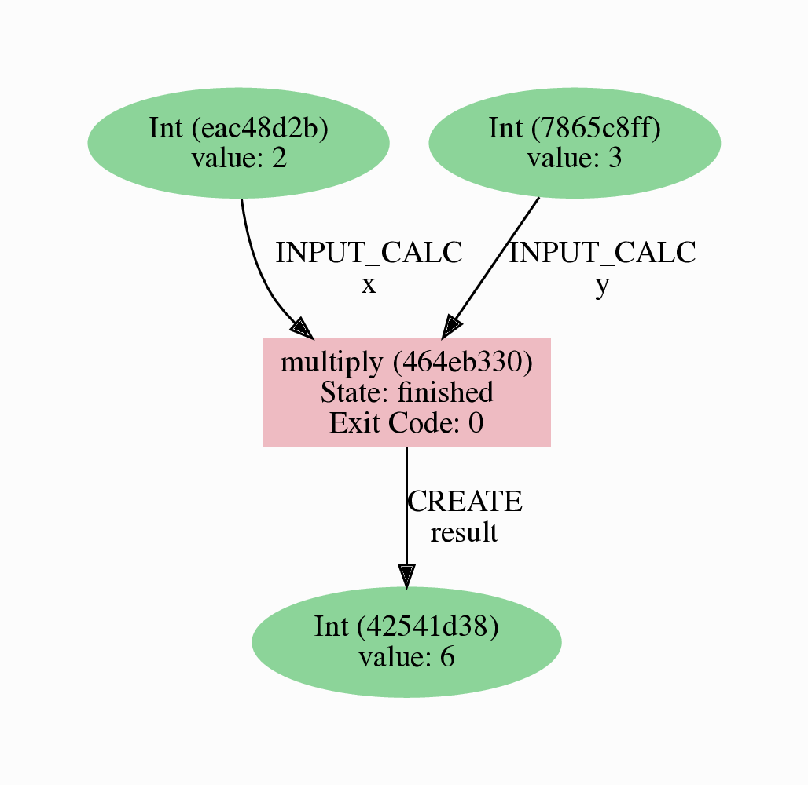
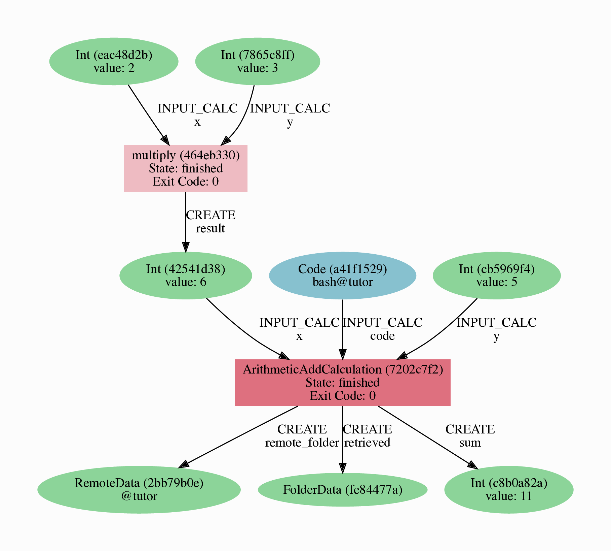

.. _tutorial:

.. _tutorial:basic:

.. For reference:

.. * The `tutorial guidelines <https://github.com/aiidateam/aiida-core/wiki/Writing-documentation#tutorial>`_.
.. * See `issue #3981 <https://github.com/aiidateam/aiida-core/issues/3981>`_.

**************
Basic tutorial
**************

Welcome to the AiiDA tutorial!
The goal of this tutorial is to give you a basic idea of the tools that AiiDA provides for executing typical scientific workflows.
At the end of this tutorial you will be able to:

* Initialize a data node and store it in the database.
* Decorate a Python function to add it to the provenance.
* Set up and run processes, as well as submit them to the daemon.
* Monitor the status of processes.
* Explore and visualize the provenance.

.. important::

    If you are working on your own machine, note that tutorial assumes that you have a working AiiDA installation, and have set up your AiiDA profile in the current Python environment.
    If this is not the case, consult the :ref:`getting started page<intro/get_started>`.

Provenance
==========

One of the most important concepts in AiiDA is *provenance*.
An AiiDA database does not only contain the results of your calculations, but also their inputs and each step that was executed to obtain them.
All of this information is stored in the form of a *directed acyclic graph* (DAG).
As an example, :numref:`fig_intro_workchain_graph` shows the provenance of the calculations of this tutorial.

.. _fig_intro_workchain_graph:
.. figure:: include/workchain_graph.png
    :scale: 30
    :align: center

    Provenance Graph of a basic AiiDA WorkChain.

In the provenance graph, you can see different types of *nodes*, represented by different shapes.
The green ellipses are ``Data`` nodes, the blue ellipse is a ``Code`` node.
The rectangles represent *processes*, i.e. the calculations performed in your *workflow*.
During this tutorial we will be using AiiDA to generate the provenance graph in :numref:`fig_intro_workchain_graph` step by step.

Data nodes
==========

Before running any calculations, let's create and store a *data node*.
AiiDA ships with an interactive IPython shell that has many basic AiiDA classes pre-loaded.
To start the IPython shell, simply type in the terminal:

.. code-block:: bash

    $ verdi shell

There are many types of data nodes already implemented in AiiDA.
For this tutorial, we'll keep it very simple, and start by initializing an ``Int`` node and assigning it to the `node` variable:

.. code-block:: python

    In [1]: node = Int(2)

If we check the contents of the ``node`` variable:

.. code-block:: python

    In [2]: node
    Out[2]: <Int: uuid: eac48d2b-ae20-438b-aeab-2d02b69eb6a8 (unstored) value: 2>

Quite a bit of information on our freshly created node is returned:

* The data node is of the type ``Int``
* The node has the *universally unique identifier* (**UUID**) ``eac48d2b-ae20-438b-aeab-2d02b69eb6a8``
* The node is currently not stored in the database ``(unstored)``
* The integer value of the node is ``2``

Let's store the node in the database:

.. code-block:: python

    In [3]: node.store()
    Out[3]: <Int: uuid: eac48d2b-ae20-438b-aeab-2d02b69eb6a8 (pk: 1) value: 2>

As you can see, the data node has now been assigned a *primary key* (**PK**), a number that identifies the node in your database ``(pk: 1)``.
The difference between the PK and UUID is that the PK is a quick reference to a node that is unique for *one* database only, whereas the UUID is a hexadecimal string that is globally unique between *different* databases.

.. important::

    The PK numbers shown throughout this tutorial assume that you start from a completely empty database.
    It is likely that the node PK's will be different for your database!

Next, let's leave the IPython shell by typing ``exit()`` and then enter.
Back in the terminal, use the ``verdi`` command line interface (CLI) to check data node we have just created:

.. code:: bash

    $ verdi node show 1

This prints something like the following:

.. code-block:: bash

    Property     Value
    -----------  ------------------------------------
    type         Int
    pk           1
    uuid         eac48d2b-ae20-438b-aeab-2d02b69eb6a8
    label
    description
    ctime        2020-05-13 08:58:15.193421+00:00
    mtime        2020-05-13 08:58:40.976821+00:00

Once again, we can see that the node is of type ``Int``, as PK = 1, and UUID = ``eac48d2b-ae20-438b-aeab-2d02b69eb6a8``. Besides this information, the ``verdi node show`` command also shows the (empty) ``label`` and ``description``, as well as the time the node was created (``ctime``) and last modified (``mtime``).

.. note:: Although AiiDA already provides many data types, you can also :ref:`create your own<how-to:data:plugin>`.

Calculation functions
=====================

Once your data is stored in the database, it is ready to be used for some computational task.
For example, let's say you want to multiply two ``Int`` data nodes.
The following Python function:

.. code-block:: python

    def multiply(x, y):
        return x * y

will give the desired result when applied to two ``Int`` nodes, but the calculation will not be stored in the provenance.
However, AiiDA ships with a handy ``decorator`` that you can add to any Python function so its execution will be stored in the provenance.
Start up the AiiDA IPython shell again using ``verdi shell`` and execute the following code snippet:

.. code-block:: python

    from aiida.engine import calcfunction

    @calcfunction
    def multiply(x, y):
        return x * y

This defines the most basic process in AiiDA: the *calculation function*.
Next, load the ``Int`` node you have created in the previous section using the ``load_node`` function and the PK of the data node:

.. code-block:: python

    In [2]: x = load_node(pk=1)

Of course, we need another integer to multiply with the first one.
Let's create a new ``Int`` data node and assign it to the variable ``y``:

.. code-block:: python

    In [3]: y = Int(3)

Now it's time to multiply the two numbers!

.. code-block:: python

    In [4]: multiply(x, y)
    Out[4]: <Int: uuid: 42541d38-1fb3-4f60-8122-ab8b3e723c2e (pk: 4) value: 6>

Success! The ``calcfunction``-decorated ``multiply`` function has multiplied the two ``Int`` data nodes and returned a new ``Int`` data node whose value is the product of the two input nodes.
Note that by executing the ``multiply`` function, all input and output nodes are automatically stored in the database:

.. code-block:: python

    In [5]:  y
    Out[5]: <Int: uuid: 7865c8ff-f243-4443-9233-dd303a9be3c5 (pk: 2) value: 3>

We hadn't stored data node assigned to the ``y`` variable yet, but by providing it as an input argument to ``multiply`` function, it was automatically stored with PK = 2.
Similarly, the returned ``Int`` node with value 6 has been stored with PK = 4.

Let's once again leave the IPython shell with ``exit()`` and look for the process we have just run using the ``verdi`` CLI:

.. code:: bash

    $ verdi process list

The returned list will be empty, but don't worry! By default, ``verdi process list`` only returns the *active* processes.
If you want to see *all* processes (i.e. also the processes that are *terminated*), simply add the ``-a`` option:

.. code:: bash

    $ verdi process list -a

You should now see something like the following output:

.. code-block:: bash

      PK  Created    Process label    Process State    Process status
    ----  ---------  ---------------  ---------------  ----------------
       3  1m ago     multiply         ⏹ Finished [0]

    Total results: 1

    Info: last time an entry changed state: 1m ago (at 09:01:05 on 2020-05-13)

We can see that our ``multiply`` calcfunction was created 1 minute ago, assigned the PK 3, and has ``Finished``.

As a final step, let's have a look at the provenance of this simply calculation.
The provenance graph can be automatically generated using the verdi CLI.
Let's generate the provenance graph for the ``multiply`` calculation function we have just run with PK = 3:

.. code-block:: bash

  $ verdi node graph generate 3

The command will write the provenance graph to a ``.pdf`` file. Use your favorite PDF viewer to have a look. It should look something like the graph shown in :numref:`fig_calcfun_graph`.

.. _fig_calcfun_graph:

    Provenance graph of the ``multiply`` calculation function.

.. note:: Remember that the PK of the ``CalcJob`` is most likely different for your database.

CalcJobs
========

When running calculations that take require an external code or run on a remote machine, a simple calculation function is no longer sufficient.
For this purpose, AiiDA has implemented the ``CalcJob`` process.

To run a ``CalcJob``, you need to set up two things: a ``computer`` for the calculation to run on, and the ``code`` that you want the ``CalcJob`` to run.
If you're running this tutorial in the Quantum Mobile VM or on Binder, these have been pre-configured for you. If you're running on your own machine, you can follow the instructions in the panel below:

.. accordion:: Install localhost computer and code

    Let's begin by setting up the computer using the ``verdi computer`` subcommand:

    .. code-block:: bash

        $ verdi computer setup -L tutor -H localhost -T local -S direct -w `echo $PWD/work` -n
        $ verdi computer configure local tutor --safe-interval 5 -n

    The first commands sets up the computer with the following options:

    * *label* (``-L``): tutor
    * *hostname* (``-H``): localhost
    * *transport* (``-T``): local
    * *scheduler* (``-S``): direct
    * *work-dir* (``-w``): The ``work`` subdirectory of the current directory

    The second command *configures* the computer with a minimum interval between connections (``--safe-interval``) of 5 seconds.
    For both commands, the *non-interactive* option (``-n``) is added to not prompt for extra input.

    Next, let's set up the code we're going to use for the tutorial:

    .. code-block:: bash

        $ verdi code setup -L add --on-computer --computer=tutor -P arithmetic.add --remote-abs-path=/bin/bash -n

    This command sets up a code with *label* ``add`` on the *computer* ``tutor``, using the *plugin* ``arithmetic.add``.

.. note::
    A typical real-world example of a computer is a remote supercomputing facility.
    Codes can be anything from a Python script to powerful *ab initio* codes such as Quantum Espresso or machine learning tools like Tensorflow.

Let's have a look at the codes we have available:

.. code:: bash

    $ verdi code list

You can see a single code ``add@tutor``, with PK = 5, in the printed list.
This powerful code allows us to add two integers together.
The ``add@tutor`` identifier indicates that the code with label ``add`` is run on the computer with label ``tutor``.
To see more details about the computer, you can use the following ``verdi`` command:

.. code:: bash

    $ verdi computer show tutor

Note that the *Work directory* has been set up as the ``work`` subdirectory of the current directory.
This is the directory in which the calculations running on the ``tutor`` computer will be executed.

Let's now start up the ``verdi shell`` again and load the ``add@tutor`` code using its label:

.. code-block:: python

    code = load_code(label='add')

Every code has a convenient tool for setting up the required input, called the builder.
It can be obtain by using the ``get_buider`` method:

.. code-block:: python

    builder = code.get_builder()

Using the builder, you can easily set up the calculation by providing the input arguments.
Let's use the ``Int`` node that was created by our previous ``calcfunction`` as one of the inputs:

.. code-block:: python

    builder.x = load_node(pk=4)
    builder.y = Int(5)

.. note::

    One handy feature of the builder is the ability to use tab completion for the inputs. Try it out by typing ``builder.`` + ``<TAB>`` in the verdi shell.

To run the ``CalcJob``, simply use the ``run`` function from the AiiDA engine:

.. code-block:: python

    from aiida.engine import run
    run(builder)

Wait for the process to complete.
Once it is done, it will return a dictionary with the output nodes.
Exit the IPython shell and once again check for *all* processes:

.. code-block:: bash

    $ verdi process list -a

You should now see two processes in the list. One is the ``multiply`` calcfunction you ran earlier, the second is the ``ArithmeticAddCalculation`` CalcJob that you have just run.
Grab the PK of the ``ArithmeticAddCalculation``, and once again generate the provenance graph. The result should look like the graph shown in :numref:`fig_calcjob_graph`.

.. code-block:: bash

    $ verdi node graph generate 7

.. _fig_calcjob_graph:

    Provenance graph of the ``ArithmeticAddCalculation`` CalcJob, with one input provided by the output of the ``multiply`` calculation function.

Finally, note that you can also see more details on any process, including its inputs and outputs, using the verdi shell:

.. code:: bash

    $ verdi process show 7

Submitting to the daemon
========================

When we used the ``run`` command in the previous section, the IPython shell was blocked while it was waiting for the ``CalcJob`` to finish.
This isn't too bad when we're simply adding two number together, but if we want to run multiple calculations that take hours or days, this is no longer practical.
Instead, we are going to *submit* the ``CalcJob`` to the *daemon*.
The daemon is a program that runs in the background and manages submitted calculations until they are *terminated*.
Let's first check the status of the daemon using the ``verdi`` CLI:

.. code-block:: bash

  $ verdi daemon status

If the daemon is running, let's stop it for now:

.. code-block:: bash

  $ verdi daemon stop

Next, let's *submit* the ``CalcJob`` we ran previously.
Start the ``verdi shell`` and execute the Python code snippet below.
This follows all the steps we did previously, but now uses the ``submit`` function instead of ``run``:

.. code-block:: python

    from aiida.engine import submit

    code = load_code(label='add')
    builder = code.get_builder()
    builder.x = load_node(pk=4)
    builder.y = Int(5)

    submit(builder)

Note that the submission finishes very quickly, and that it returns the ``CalcJob`` that was just submitted:

.. code-block:: python

    Out[1]: <CalcJobNode: uuid: e221cf69-5027-4bb4-a3c9-e649b435393b (pk: 12) (aiida.calculations:arithmetic.add)>

Let's exit the IPython shell and have a look at the process list:

.. code-block:: bash

  $ verdi process list

You should see the ``CalcJob`` you have just submitted, with the state ``Created``:

.. code-block:: bash

      PK  Created    Process label             Process State    Process status
    ----  ---------  ------------------------  ---------------  ----------------
      12  13s ago    ArithmeticAddCalculation  ⏹ Created

    Total results: 1

    Info: last time an entry changed state: 13s ago (at 09:06:57 on 2020-05-13)

The ``CalcJob`` process is now waiting to be picked up by a daemon runner, but the daemon is currently disabled.
Let's start it up (again):

.. code-block:: bash

    $ verdi daemon start

Now you can either use ``verdi process list`` to follow the execution of the ``CalcJob``, or ``watch`` its progress:

.. code-block:: bash

    $ verdi process watch 12

Once the ``CalcJob`` is completed you can once again use ``verdi process list -a`` to see all processes we have run so far:

.. code-block:: bash

      PK  Created    Process label             Process State    Process status
    ----  ---------  ------------------------  ---------------  ----------------
       3  6m ago     multiply                  ⏹ Finished [0]
       7  2m ago     ArithmeticAddCalculation  ⏹ Finished [0]
      12  1m ago     ArithmeticAddCalculation  ⏹ Finished [0]

    Total results: 3

    Info: last time an entry changed state: 14s ago (at 09:07:45 on 2020-05-13)

Workflows
=========

So far we have executed each process manually.
Of course, the purpose of AiiDA is to automate these steps by linking them together in a *workflow*, whose provenance is stored to ensure reproducability.
For this tutorial we have prepared a basic ``WorkChain`` that is already implemented in ``aiida-core``.
You can see the code below:

.. accordion:: MultiplyAddWorkChain code

    .. code-block:: python

        from aiida.orm import Code, Int
        from aiida.engine import calcfunction, WorkChain, ToContext

        @calcfunction
        def multiply(x, y):
            return x * y

        class MultiplyAddWorkChain(WorkChain):
            """WorkChain to perform basic arithmetic for testing and demonstration purposes."""

            @classmethod
            def define(cls, spec):
                """Specify inputs and outputs."""
                super(MultiplyAddWorkChain, cls).define(spec)
                spec.input('x', valid_type=Int)
                spec.input('y', valid_type=Int)
                spec.input('z', valid_type=Int)
                spec.input('code', valid_type=Code)
                spec.outline(cls.multiply, cls.add, cls.result)
                spec.output('result', valid_type=Int)

            def multiply(self):
                """Multiply two integers."""
                self.ctx.multiple = multiply(self.inputs.x, self.inputs.y)

            def add(self):
                """Add two numbers with the ArithmeticAddCalculation process."""

                builder = self.inputs.code.get_builder()

                builder.x = self.ctx.multiple
                builder.y = self.inputs.z

                future = self.submit(builder)

                return ToContext({'addition': future})

            def result(self):
                self.out('result', self.ctx['addition'].get_outgoing().get_node_by_label('sum'))

    First, we recognize the ``multiply`` function we have used earlier, decorated as a ``calcfunction``.
    The ``define`` class method specifies the ``input`` and ``output`` of the ``WorkChain``, as well as the ``outline``, which are the steps of the workflow.
    These steps are provided as methods of the ``MultiplyAddWorkChain`` class.

.. note::

    Besides WorkChain's, workflows can also be implemented as *work functions*.
    These are ideal for workflows that are not very computationally intensive and can be easily implemented in a Python function.

Let's run the ``WorkChain`` above! Start up the ``verdi shell`` and import the ``MultiplyAddWorkChain``:

.. code-block:: python

    from aiida.workflows.multiplyadd import MultiplyAddWorkChain

Similar to a ``CalcJob``, the ``WorkChain`` input can be set up using a builder:

.. code-block:: python

    builder = MultiplyAddWorkChain.get_builder()
    builder.code = load_code(label='add')
    builder.x = Int(2)
    builder.y = Int(3)
    builder.z = Int(5)

Once the ``WorkChain`` input has been set up, we submit it to the daemon using the ``submit`` function from the AiiDA engine:

.. code-block:: python

    from aiida.engine import submit
    submit(builder)

Now quickly leave the IPython shell and check the process list:

.. code-block:: bash

    $ verdi process list -a

Depending on which step the workflow is running, you should get something like the following:

.. code-block:: bash

      PK  Created    Process label             Process State    Process status
    ----  ---------  ------------------------  ---------------  ------------------------------------
       3  7m ago     multiply                  ⏹ Finished [0]
       7  3m ago     ArithmeticAddCalculation  ⏹ Finished [0]
      12  2m ago     ArithmeticAddCalculation  ⏹ Finished [0]
      19  16s ago    MultiplyAddWorkChain      ⏵ Waiting        Waiting for child processes: 22
      20  16s ago    multiply                  ⏹ Finished [0]
      22  15s ago    ArithmeticAddCalculation  ⏵ Waiting        Waiting for transport task: retrieve

    Total results: 6

    Info: last time an entry changed state: 0s ago (at 09:08:59 on 2020-05-13)

We can see that the ``MultiplyAddWorkChain`` is currently waiting for its *child process*, the ``ArithmeticAddCalculation``, to finish.
Check the process list again for *all* processes (You should know how by now!).
Now all the processes should be in the ``Finished`` state.

Let's finish the tutorial by once again using ``verdi node graph generate`` to show the ``WorkChain`` provenance:

.. code-block:: bash

    $ verdi node graph generate 19

The provenance graph now looks like the one we showed at the start of this tutorial (:numref:`fig_workchain_graph`).

.. _fig_workchain_graph:
.. figure:: include/workchain_graph.png
    :scale: 30
    :align: center

    Final provenance Graph of the basic AiiDA tutorial.

.. _tutorial:next-steps:

*************************
How to continue from here
*************************

Congratulations! You have completed the first step to becoming an AiiDA master.

TODO: A list of how-to sections that might be most relevant as a continuation, after having completed the tutorial. This will be split into a few 'user types'.

See `issue #3982 <https://github.com/aiidateam/aiida-core/issues/3982>`_.

.. You can do more with AiiDA than basic arithmetic! Check out some cool real-world examples of AiiDA in action on the `demo page <LINK HERE>