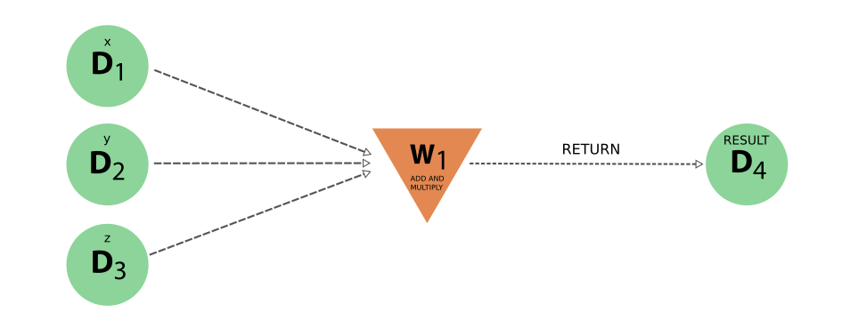
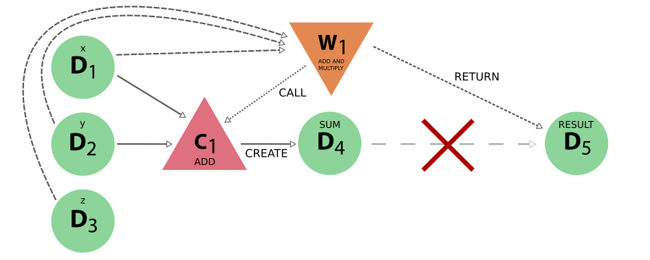

.. _working_workflows:

*********
Workflows
*********

A workflow in AiiDA is a process (see the :ref:`process section<concepts_processes>` for details) that calls other workflows and calculations and optionally *returns* data and as such can encode the logic of a typical scientific workflow.
Currently, there are two ways of implementing a workflow process:

 * :ref:`work function<working_workfunctions>`
 * :ref:`work chain<working_workchains>`

This section will provide detailed information and best practices on how to implement these two workflow types.

.. warning::
    This chapter assumes that the basic concept and difference between work functions and work chains is known and when one should use on or the other.
    It is therefore crucial that, before you continue, you have read and understood the basic concept of :ref:`workflow processes<concepts_workflows>`.

.. _working_workfunctions:

Work functions
==============

The concept of work functions and the basic rules of implementation are documented in detail elsewhere:

  * :ref:`concept of work functions<concepts_workfunctions>`
  * :ref:`implementation of process functions<working_process_functions>`

Since work functions are a sub type of process functions, just like calculation functions, their implementation rules are as good as identical.
However, their intended aim and heuristics are very different.
Where :ref:`calculation functions<working_calcfunctions>` are 'calculation'-like processes that *create* new data, work functions behave like 'workflow'-like processes and can only *return* data.
What this entails in terms of intended usage and limitations for work functions is the scope of this section.

Returning data
--------------
It has been said many times before: work functions, like all 'workflow'-like processes, `return` data, but what does `return` mean exactly?
In this context, the term 'return' is not intended to refer to a piece of python code returning a value.
Instead it refers to a workflow process recording a data node as one of its outputs, that *it itself did not create*, but which rather was created by some other process, that was called by the workflow.
The calculation process was responsable for *creating* the data node and the workflow is merely *returning* it as one of its outputs.

This is then exactly what the workfunction function does.
It takes one or more data nodes as inputs, calls other processes to which it passes those inputs and optionally returns some or all of the outputs created by the calculation processes it called.
As explained in the :ref:`technical section<working_process_functions>`, outputs are recorded as 'returned' nodes simply by returning the nodes from the function.
The engine will inspect the return value from the function and attach the output nodes to the node that represents the work function.
To verify that the output nodes are in fact not 'created', the engine will check that the nodes are stored.
Therefore, it is very important that you **do not store the nodes you create yourself**, or the engine will raise an exception, as shown in the following example:

.. include:: include/snippets/workflows/workfunctions/workfunction_store.py
    :code: python

Because the returned node is a newly created node and not stored, the engine will raise the following exception:

.. code:: bash

    ValueError: Workflow<illegal_workfunction> tried returning an unstored `Data` node.
    This likely means new `Data` is being created inside the workflow.
    In order to preserve data provenance, use a `calcfunction` to create this node and return its output from the workflow

Note that you could of course circumvent this check by calling ``store`` yourself on the node, but that misses the point.
The problem with using a ``workfunction`` to 'create' new data, is that the provenance is lost.
To illustrate this problem, let's go back to the simple problem of implementing a workflow to add two integer and multiply the result with a third.
The :ref:`correct implementation<concepts_workfunctions>` has a resulting provenance graph that clearly captures the addition and the multiplication as separate calculation nodes, as shown in :numref:`fig_work_functions_provenance_add_multiply_full`.
To illustrate what would happen if one does does not call calculation functions to perform the computations, but instead directly perform them in the work function itself and return the result, consider the following example:

.. include:: include/snippets/workflows/workfunctions/workfunction_add_multiply_internal.py
    :code: python

.. warning:: For the documentation skimmers: this is an explicit example on **how not to use** work functions. The :ref:`correct implementation<concepts_workfunctions>` calls calculation functions to perform the computation

Note that in this example implementation we explicitly had to call ``store`` on the result before returning it to avoid the exception thrown by the engine.
The resulting provenance would look like the following:

.. _fig_work_functions_provenance_add_multiply_internal:

    The provenance generated by the incorrect work function implementation. Note how the addition and multiplication are not explicitly represented, but are implicitly hidden inside the workflow node. Moreover, the result node does not have a 'create' link, because a work function cannot create new data.

However, looking at the generated provenance shows exactly why we shouldn't.
This faulty implementation loses provenance as it has no explicit representations of the addition and the multiplication and the `result` node does not have a `create` link, which means that if only the data provenance is followed, it is as if it appears out of thin air!
Compare this to the provenance graph of :numref:`fig_work_functions_provenance_add_multiply_full`, which was generated by a solution that correctly uses calculation functions to perform the computations.
In this trivial example, one may think that this loss of information is not so important, because it is implicitly captured by the workflow node.
But a halfway solution may make the problem more apparent, as demonstrated by the following snippet where the addition is properly done by calling a calculation function, but the final product is still performed by the work function itself:

.. include:: include/snippets/workflows/workfunctions/workfunction_add_multiply_halfway.py
    :code: python

.. warning:: For the documentation skimmers: this is an explicit example on **how not to use** work functions. The :ref:`correct implementation<concepts_workfunctions>` calls calculation functions to perform the computation

This time around the addition is correctly performed by a calculation function as it should, however, its result is multiplied by the work function itself and returned.
Note that once again ``store`` had to be called explicitly on ``product`` to avoid the engine throwing a ``ValueError``, which is only for the purpose of this example **and should not be done in practice**.
The resulting provenance would look like the following:

.. _fig_work_functions_provenance_add_multiply_halfway:

    The provenance generated by the incorrect work function implementation that uses only a calculation function for the addition but performs the multiplication itself.
    The red cross is there to indicate that there is no actual connection between the intermediate sum `D4` and the final result `D5`, even though the latter in reality derives from the former.

The generated provenance shows, that although the addition is explicitly represented because the work function called the calculation function, there is no connection between the sum and the final result.
That is to say, there is no direct link between the sum `D4` and the final result `D5`, as indicated by the red cross, even though we know that the final answer was based on the intermediate sum.
This is a direct cause of the work function 'creating' new data and illustrates how, in doing so, the provenance of data creation is lost.

.. _working_workchains:

Work chains
===========

`Issue [#2630] <https://github.com/aiidateam/aiida_core/issues/2630>`_

.. But fret not!
.. To tackle this problem, AiiDA defines the concept of the work chain.
.. As the name suggests, this construct is a way to chain multiple logical steps of a workflow together in a way that allows to save the progress between those steps as soon as they are successfully completed.
.. The work chain is therefore the preferred solution for parts of the workflow that involve more expensive and complex calculations.
.. To define a work chain, AiiDA implements the ``WorkChain`` class.

.. If we were to reimplement our work function solution of the simple example problem of the previous section, but this time using a work chain, it would look something like the following:

.. .. include:: include/snippets/workflows/workchains/example_problem_workchain.py
..     :code: python

.. There is a lot going on in this snippet, so let's tackle it line by line.
.. Firstly, a ``WorkChain`` is a class and to create your own work chain, you subclass it and give it your own name, like ``AddAndMultiplyWorkChain`` in the example.
.. You can pick any name that is a valid python class name.
.. The most important method of the ``WorkChain`` class, is the ``define`` class method.
.. Here you define, what inputs it takes, what outputs it will generate and the 'logic' that will be executed.
.. The class method takes two arguments:

..  * ``cls`` this is the reference of the class itself and is mandatory for any class method
..  * ``spec`` which is the 'specification'

.. .. warning::
..     Do not forget to add the line ``super(AddAndMultiplyWorkChain, self).define(spec)`` as the first line of the ``define`` method, where you replace the class name with the name of your work chain.
..     This will call the ``define`` method of the parent class, which is necessary for the work chain to work properly

.. As the name suggests, the ``spec`` can be used to specify the properties of the work chain.
.. For example, it can be used to define inputs that the work chain takes.
.. In our example, we need to be able to pass three integers as input, so we define those in the spec by calling ``spec.input()``.
.. The first argument is the name of the input.
.. Additionally, as we have done here, you can specify which types are valid for that particular input.
.. Since we expect integers, we specify that the valid type is the database storable ``Int`` class.
.. Input validation is just one of the advantages of the ``WorkChain`` over the work function that we can already see here.

.. The outputs are defined in a similar manner, calling ``spec.output()`` you can declare a particular output that the work chain will or is expected to have.
.. Be wary that if you define an output, but do not actually add it during the exection, at the end of the work chain, the validation will fail as by default all defined outputs are assumed to be required.
.. If you want to specify an output that is optional, you can pass the keyword argument ``required=False``.
.. The final part of the spec definition is the ``outline``.
.. This is where you specify the 'logic' of the work chain.
.. Since this example is rather contrived, in this case it is just a list of three functions calls ``add``, ``multiply`` and ``results``.
.. However, the outline also supports logical constructs, like ``if`` conditionals ``while`` loops and ``return`` statements.
.. Refer to the advanced :ref:`work chain section <process_spec>` to see all the possibilities the ``outline`` provides.

.. The only thing that remains, is to implement the methods that we added to the ``outline``.
.. Since they are class instance methods, they only take one argument ``self``.
.. Besides that rule, you can add any valid python code in the method that you want.
.. The goal of the ``add`` method is to take the inputs ``a`` and ``b`` that are passed to the work chain and sum them.
.. The inputs passed to the work chain are stored in the ``inputs`` attribute as an attribute dictionary.
.. Therefore, to get the ``a`` input for example, you can call ``self.inputs.a``.

.. After we summed ``a`` and ``b``, we need to be able to store the temporary result and pass it to the next step in the ``outline``, in this case the ``multiply`` method.
.. For this purpose, each work chain has a context, which can be addressed at ``self.ctx``.
.. It is an attribute dictionary that is persisted between work chain steps and can therefore be used to pass information and data between outline steps.
.. Since it is a dictionary, we can store the sum of ``a`` and ``b`` by assigning it to a key of our choice.
.. Again, any valid python key name, as long as it does do not contain a period, is fair game.
.. To retrieve data from the context, one can use the key ``self.ctx['a']`` or attribute ``self.ctx.a`` notation.
.. Note that we do not have to return anything, as soon as the function ends, the work chain will save its state, including the result we just stored in the context and go to the next step, the ``multiply`` method.
.. By now you should be familiar with what you see.
.. We retrieve the sum we computed in the ``add`` method, multiply it by the ``c`` input integer and store it under the ``product`` key in the context.

.. The final step ``results`` adds the product as an official output of the work chain by calling ``self.out()``.
.. The first argument is the name of the output, which will also be used for the linkname in the provenance graph and the second argument is the actual value.
.. Note that since it again has to be database storable, we wrap the product in the ``Int`` class.

.. .. _concepts_running_workflows:

.. Running workflows
.. =================

.. Given that work functions and work chains are sub classes of :py:class:`~aiida.engine.processes.process.Process` class, they can be launched like any other processes.
.. For the basic rules about launching processes, please refer to the :ref:`process launch<concepts_process_launch>` section.
.. On top of those basic rules, there are a few peculiarities in the case of work chains that will be further explained in the following sections.

.. Run
.. ---
.. Without realizing it, in the :ref:`introductory section on work functions and work chains <concepts_workflows_workfunctions>`, we already saw how a work function can be ran.
.. We can run a work function in exactly the same manner as you would run any other python function.
.. Simply call the function with the desired inputs and it will be executed, while AiiDA makes sure to store the provenance automatically in the background.
.. You can run work functions from anywhere, also inside an outline step of a work chain.

.. Running a ``WorkChain`` on the other hand, is slightly different.
.. Since it is a class, it cannot be 'run' directly like a function.
.. Instead, we have to 'launch' it.
.. This is done by passing it to the ``run`` function:

.. .. include:: include/snippets/workflows/workchains/run_workchain_keyword.py
..     :code: python

.. As you can see, the ``run`` function can be imported from the :py:mod:`~aiida.engine.launch` module.
.. To launch the work chain (in this example we use the ``AddAndMultiplyWorkChain`` from the previous section), we simply call the ``run`` function with the work chain as the first argument, followed by the inputs as keyword arguments.
.. Note that the keys used for each input have to correspond to the name of the inputs defined in the spec of the work chain.
.. One can also define the inputs in a dictionary and then use the standard python expansion method to automatically unwrap the dictionary into keyword arguments, as is shown here:

.. .. include:: include/snippets/workflows/workchains/run_workchain_expand.py
..     :code: python

.. After the work chain's execution is finished, the result is returned, which is a dictionary of its outputs.
.. In this example the variable ``result`` will therefore be equal to ``{'result': 9}``.
.. If you would also like to get a reference of the node that represents the ``WorkChain`` in the database, one can use the ``run_get_node`` or ``run_get_pk`` functions:

.. .. include:: include/snippets/workflows/workchains/run_workchain_get_node_pk.py
..     :code: python

.. For the former, the ``node`` will be the ``WorkChainNode`` node that is used to represent the work chain in the database, whereas for the latter, the ``pk`` is the pk of that same node.
.. The ``run`` based functions can actually also be used for ``workfunctions``.
.. Calling ``run`` with a work function, does exactly the same as running the work function directly as a normal python function and so doesn't gain anything new.
.. However, if you are interested in also getting the calculation node or the pk of the process, in addition to the result of the function, calling the work function through ``run_get_node`` or ``run_get_pk`` is the correct solution.
.. Note that for work functions you can pass the inputs both as arguments as well as keyword arguments:

.. .. include:: include/snippets/workflows/workfunctions/example_problem_workfunction_run.py
..     :code: python

.. Submit
.. ------
.. The launch functions, ``run``, ``run_get_node`` and ``run_get_pk``, described in the previous section, will execute the process in a blocking manner.
.. That is to say that the interpreter in which you launch the process will be blocked until that process is completed.
.. This might not necessarily be what you want.
.. Imagine for example that you are launching a work chain that will take a long time to complete.
.. The interpreter will be blocked the whole time and cannot do anything else.
.. To circumvent this problem, you can also ``submit`` a process, for example a work chain:

.. .. include:: include/snippets/workflows/workchains/run_workchain_submit.py
..     :code: python

.. .. note::
..     Workfunctions, like all process functions, cannot be submitted but can only be run

.. The ``submit`` function will launch the process and send it to the daemon, who will take care of running it to the end.
.. This way the interpreter is freed and regains control immediately.
.. The return value of the ``submit`` call is the node that represents the process in the database.
.. Note that besides the change in behavior, the syntax for passing the inputs to ``submit`` is exactly the same as for the ``run`` launch function and its siblings.

.. There is one limitation to the use of the ``run`` and ``submit`` launchers.
.. They cannot be used within the steps of a ``WorkChain`` itself.
.. Instead, the ``WorkChain`` class has its own ``submit`` method that should be used.

.. .. include:: include/snippets/workflows/workchains/run_workchain_submit_internal.py
..     :code: python

.. In this example, we launch another instance of the ``AddAndMultiplyWorkChain`` from within the ``AddAndMultiplyWorkChain`` itself.
.. The only difference is that, instead of using the free function ``submit``, we use the class instance method ``self.submit``.
.. Note that this example is oversimplified and additional steps are required to be able to continue the work chain after submitting the child work chain.
.. For more details, please refer to the advanced section on :ref:`submitting calculations and work chains<submitting_calculations_workchains>`.

.. .. warning::
..     When you submit a ``WorkChain`` or any other process over the daemon, you need to make sure that the daemon can find the class when it needs to load it.
..     Registering your class through the plugin system with a designated entry point is one way to make sure that the daemon will be able to find it.
..     If, however, you simply have a test class and do not want to go through the effort of creating an entry point for it, you should make sure that the module where you define the class is in the python path.
..     Additionally, make sure that the definition of the work chain **is not in the same file from which you submit it**, or the engine won't be able to load it.

.. .. _workflow_development:

.. Workflow development
.. ====================

.. This section will be a more in-depth guide of all the features and tools that the workflow system of AiiDA provides.
.. Along the way, we will also highlight how one can use these tools to write maintanable, robust and modular workflows.
.. Just like the definition of a ``WorkChain``, we will start with the process specification.

.. .. _process_spec:

.. Process specification
.. ---------------------
.. The process specification of a work chain, implemented by the :py:class:`~aiida.engine.processes.process_spec.ProcessSpec`, is the construct that is used to define the inputs, outputs and the logical outline of the work chain.
.. Defining this specification is therefore one of the more important steps of designing a workflow.
.. A very simple example of the definition of a work chain specification, in the :meth:`~aiida.engine.processes.workchains.workchain.WorkChain.define` method, was demonstrated in the :ref:`introductory section on work chains <workflows_workchains>`.
.. In this section we will describe all the features of the process spec in more detail.

.. .. _ports_portnamespaces:

.. Ports and Portnamespaces
.. ^^^^^^^^^^^^^^^^^^^^^^^^
.. Two core concepts and components of the ``ProcessSpec`` that have remained hidden so far, but are crucial to understanding the functionality of the ``ProcessSpec``, are that of the ``Port`` and the ``PortNamespace``.
.. In the work chain introduction, we already saw how an input could be defined for the process spec:

.. .. code:: python

..     spec.input('a')

.. What this directive really accomplishes, is that an :py:class:`~aiida.engine.processes.ports.InputPort` is added to the ``inputs`` attribute of the :py:class:`~aiida.engine.processes.process_spec.ProcessSpec`, which is a :py:class:`~aiida.engine.processes.ports.PortNamespace`.
.. This ``PortNamespace`` is a simple namespace that contains all the ``InputPorts`` and can even have nested ``PortNamespaces``.
.. This allows the designer of a work chain to create any nested structure for the input ports.
.. Creating a new namespace in the inputs namespace is as simple as:

.. .. code:: python

..     spec.input_namespace('namespace')

.. This will create a new ``PortNamespace`` named ``namespace`` in the ``inputs`` namespace of the spec.
.. You can create arbitrarily nested namespaces in one statement, by separating them with a ``.`` as shown here:

.. .. code:: python

..     spec.input_namespace('nested.namespace')

.. This command will result in the ``PortNamespace`` name ``namespace`` to be nested inside another ``PortNamespace`` called ``nested``.

.. .. note::

..     Because the period is reserved to denote different nested namespaces, it cannot be used in the name of terminal input and output ports as that could be misinterpreted later as a port nested in a namespace.

.. Graphically, this can be visualized as a nested dictionary and will look like the following:

.. .. code:: python

..     'inputs': {
..         'nested': {
..             'namespace': {}
..         }
..     }

.. The ``outputs`` attribute of the ``ProcessSpec`` is also a ``PortNamespace`` just as the ``inputs``, with the only different that it will create ``OutputPort`` instead of ``InputPort`` instances.
.. Therefore the same concept of nesting through ``PortNamespaces`` applies to the outputs of a ``ProcessSpec``.

.. Validation and defaults
.. ^^^^^^^^^^^^^^^^^^^^^^^
.. In the previous section, we saw that the ``ProcessSpec`` uses the ``PortNamespace``, ``InputPort`` and ``OutputPort`` to define the inputs and outputs structure of the ``Process``.
.. The underlying concept that allows this nesting of ports is that the ``PortNamespace``, ``InputPort`` and ``OutputPort``, are all a subclass of :py:class:`~plumpy.ports.Port`.
.. And as different subclasses of the same class, they have more properties and attributes in common, for example related to the concept of validation and default values.
.. All three have the following attributes (with the exception of the ``OutputPort`` not having a ``default`` attribute):

..     * ``default``
..     * ``required``
..     * ``valid_type``
..     * ``validator``

.. These attributes can all be set upon construction of the port or after the fact, as long as the spec has not been sealed, which means that they can be altered without limit as long as it is within the ``define`` method of the corresponding ``Process``.
.. An example input port that explicitly sets all these attributes is the following:

.. .. code:: python

..     spec.input('positive_number', required=False, default=Int(1), valid_type=(Int, Float), validator=is_number_positive)

.. Here we define an input named ``positive_number`` that is not required, if a value is not explicitly passed, the default ``Int(1)`` will be used and if a value *is* passed, it should be of type ``Int`` or ``Float`` and it should be valid according to the ``is_number_positive`` validator.
.. Note that the validator is nothing more than a free function which takes a single argument, being the value that is to be validated and should return ``True`` if that value is valid or ``False`` otherwise.
.. The ``valid_type`` can define a single type, or a tuple of valid types.
.. Note that by default all ports are required, but specifying a default value implies that the input is not required and as such specifying ``required=False`` is not necessary in that case.
.. It was added to this example simply for clarity.

.. The validation of input or output values with respect to the specification of the corresponding port, happens at the instantiation of the process and when it is finalized, respectively.
.. If the inputs are invalid, a corresponding exception will be thrown and the process instantiation will fail.
.. When the outputs fail to be validated, likewise an exception will be thrown and the process state will be set to ``Excepted``.

.. Dynamic namespaces
.. ^^^^^^^^^^^^^^^^^^
.. In the previous section we described the various attributes related to validation and claimed that all the port variants share those attributes, yet we only discussed the ``InputPort`` and ``OutputPort``.
.. The statement, however, is still correct and the ``PortNamespace`` has the same attributes.
.. You might then wonder what the meaning is of a ``valid_type`` or ``default`` for a ``PortNamespace`` if all it does is contain ``InputPorts``, ``OutputPorts`` or other ``PortNamespaces``.
.. The answer to this question lies in the ``PortNamespace`` attribute ``dynamic``.

.. Often when designing the specification of a ``Process``, we cannot know exactly which inputs we want to be able to pass to the process.
.. However, with the concept of the ``InputPort`` and ``OutputPort`` one *does* need to know exactly, how many value one expects at least, as they do have to be defined.
.. This is where the ``dynamic`` attribute of the ``PortNamespace`` comes in.
.. By default this is set to ``False``, but by setting it to ``True``, one indicates that that namespace can take a number of values that is unknown at the time of definition of the specification.
.. This now explains the meaning of the ``valid_type``, ``validator`` and ``default`` attributes in the context of the ``PortNamespace``.
.. If you do mark a namespace as dynamic, you may still want to limit the set of values that are acceptable, which you can do by specifying the valid type and or validator.
.. The values that will eventually be passed to the port namespace will then be validated according to these rules exactly as a value for a regular input port would be.

.. Non storable inputs
.. ^^^^^^^^^^^^^^^^^^^
.. In the introduction of this section on workflows, we mentioned that valid types for inputs and outputs should be AiiDA data types, as they can be stored in the database and that is the only way the provenance can be kept.
.. However, there are cases where you might want to pass an input to a work chain, whose provenance you do not care about and therefore would want to pass a non-database storable type anyway.

.. .. note::

..     AiiDA allows you to break the provenance as to be not too restrictive, but always tries to urge you and guide you in a direction to keep the provenance.
..     There are legitimate reasons to break it regardless, but make sure you think about the implications and whether you are really willing to lose the information.

.. For this situation, the ``InputPort`` has the attribute ``non_db``.
.. By default this is set to ``False``, but by setting it to ``True`` the port is marked that the values that are passed to it should not be stored as a node in the provenance graph and linked to the calculation node.
.. This allows one to pass any normal value that one would also be able to pass to a normal function.

.. Outline
.. ^^^^^^^
.. After the ports, both input and output, have been specified, it is time to define the *outline* of the work chain.
.. The outline describes the logical flow of the work chain, which makes it an extremely important part of the work chain design process.
.. Since the goal of a work chain should be to execute a very well defined task, it is the goal of the outline to capture the required logic to achieve that goal, in a clear and short yet not overly succint manner.
.. The outline supports various logical flow constructs, such as conditionals and while loops, so where possible this logic should be expressed in the outline and not in the body of the outline functions.
.. However, one can also go overboard and put too finely grained logical blocks into the outline, causing it to become bulky and difficult to understand.

.. A good rule of thumb in designing the outline is the following: before you start designing a work chain, define very clearly the task that it should carry out.
.. Once the goal is clear, draw a schematic block diagram of the necessary steps and logical decisions that connect them, in order to accomplish that goal.
.. Converting the resulting flow diagram in a one-to-one fashion into an outline, often results in very reasonable outline designs.

.. The currently available logical constructs for the work chain outline are:

..     * ``if``, ``elif``, ``else``
..     * ``while``
..     * ``return``

.. To distinguish these constructs from the python builtins, they are suffixed with an underscore, like so ``while_``.
.. To use these in your work chain design, you will have to import them:

.. .. code:: python

..     from aiida.engine import if_, while_, return_

.. The following example shows how to use these logical constructs to define the outline of a work chain:

.. .. code:: python

..     spec.outline(
..         cls.intialize_to_zero,
..         while_(cls.n_is_less_than_hundred)(
..             if_(cls.n_is_multitple_of_three)(
..                 cls.report_fizz,
..             ).elif_(cls.n_is_multiple_of_five)(
..                 cls.report_buzz,
..             ).elif_(cls.n_is_multiple_of_three_and_five)(
..                 cls.report_fizz_buzz,
..             ).else_(
..                 cls.report_n,
..             )
..         ),
..         cls.increment_n_by_one,
..     )

.. This is an implementation (and an extremely contrived one at that) of the well known FizzBuzz problem.
.. The idea is that the program is supposed to print in sequence the numbers from zero to some limit, except when the number is a multiple of three ``Fizz`` is printed, for a multiple of five ``Buzz`` and when it is a multiple of both, the program should print ``FizzBuzz``.
.. The actual implementation of the outline steps themselves is now trivial:

.. .. code:: python

..     def initialize_to_zero(self):
..         self.ctx.n = 0

..     def n_is_less_than_hundred(self):
..         return self.ctx.n < 100

..     def n_is_multiple_of_three(self):
..         return self.ctx.n % 3 == 0

..     def n_is_multiple_of_five(self):
..         return self.ctx.n % 5 == 0

..     def n_is_multiple_of_three_and_five(self):
..         return self.ctx.n % 3 == 0 and self.ctx.n % 5 == 0

..     def increment_n_by_one(self):
..         self.ctx.n += 1

.. The intention of this example is to show that with a well designed outline, a user only has to look at the outline to have a good idea *what* the work chain does and *how* it does it.
.. One should not have to look at the implementation of the outline steps as all the important information is captured by the outline itself.

.. .. _exit_codes:

.. Exit codes
.. ^^^^^^^^^^
.. Any ``WorkChain`` most likely will have one or multiple expected failure modes.
.. To clearly communicate to the caller what went wrong, the ``WorkChain`` supports setting its ``exit_status``.
.. This ``exit_status``, a positive integer, is an attribute of the calculation node and by convention, when it is zero means the process was successful, whereas any other value indicates failure.
.. This concept of an exit code, with a positive integer as the exit status, `is a common concept in programming <https://shapeshed.com/unix-exit-codes/>`_ and a standard way for programs to communicate the result of their execution.

.. Potential exit codes for the ``WorkChain`` can be defined through the ``ProcessSpec``, just like inputs and ouputs.
.. Any exit code consists of a positive non-zero integer, a string label to reference it and a more detailed description of the problem that triggers the exit code.
.. Consider the following example:

.. .. code:: python

..     spec.exit_code(418, 'ERROR_I_AM_A_TEAPOT', 'the work chain had an identity crisis')

.. This defines an exit code for the ``WorkChain`` with exit status ``418`` and exit message ``the work chain had an identity crisis``.
.. The string ``ERROR_I_AM_A_TEAPOT`` is a label that the developer can use to reference this particular exit code somewhere in the ``WorkChain`` code itself.
.. A detailed explanation of how this is accomplished `will be explained in a later section <aborting_and_exit_codes>`_.

.. Whenever a ``WorkChain`` exits through a particular error code, the caller will be able to introspect it through the ``exit_status`` and ``exit_message`` attributes of the node.
.. Assume for example that we ran a ``WorkChain`` that threw the exit code described above, the caller would be able to do the following:

.. .. code:: python

..     in[1] node = load_node(<pk>)
..     in[2] node.exit_status
..     out[2] 418
..     in[2] node.exit_message
..     out[2] 'the work chain had an identity crisis'

.. This is useful, because the caller can now programmatically, based on the ``exit_status``, decide how to proceed.
.. This is an infinitely more robust way of communcating specific errors to a non-human then parsing text based logs or reports (see the section on :ref:`reporting <reporting>`).

.. .. _reporting:

.. Reporting
.. ---------
.. During the execution of a ``WorkChain``, we may want to keep the user abreast of its progress and what is happening.
.. For this purpose, the ``WorkChain`` implements the :meth:`~aiida.engine.processes.process.Process.report` method, which functions as a logger of sorts.
.. It takes a single argument, a string, that is the message that needs to be reported:

.. .. code:: python

..     def submit_calculation(self):
..         self.report('here we will submit a calculation')

.. This will send that message to the internal logger of python, which will cause it to be picked up by the default AiiDA logger, but it will also trigger the database log handler, which will store the message in the database and link it to the node of the work chain.
.. This allows the ``verdi work report`` command to retrieve all those messages that were fired using the ``report`` method for a specific ``WorkflowNode``.
.. Note that the report method, in addition to the pk of the work chain, will also automatically record the name of the work chain and the name of the outline step in which the report message was fired.
.. This information will show up in the output of ``verdi work report``, so you never have to explicitly reference the work chain name, outline step name or date and time in the message itself.

.. It is important to note that the report system is a form of logging and as such has been designed to be read by humans only.
.. That is to say, the report system is not designed to pass information programmatically by parsing the log messages.

.. _working_workchain_context:

Context
-------
.. In the simplest work chain example presented in the introductory section, we already saw how the context can be used to persist information during the execution of a work chain and pass it between outline steps.
.. The context is essentially a data container, very similar to a dictionary that can hold all sorts of data.
.. The workflow engine will ensure that its contents are saved and persisted in between steps and when the daemon shuts down or restarts.
.. A trivial example of this would be the following:

.. .. code:: python

..     def step_one(self):
..         self.ctx.some_variable = 'store me in the context'

..     def step_two(self):
..         assert self.ctx.some_variable == 'store me in the context'

.. In the ``step_one`` outline step we store the string ``store me in the context`` in the context, which can be addressed as ``self.ctx``, under the key ``some_variable``.
.. Note that for the key you can use anything that would be a valid key for a normal python dictionary.
.. In the second outline step ``step_two``, we can verify that the string was successfully persisted, by checking the value stored in the context ``self.ctx.some_variable``.
.. This was just a simple example to introduce the concept of the context, however, it really is one of the more important parts of the work chain.
.. The context really becomes crucial when you want to submit a calculation or another work chain from within the work chain.
.. How this is accomplished, we will show in the next section.

.. .. _submitting_calculations_workchains:

.. Submitting calculations and work chains
.. ---------------------------------------
.. One of the main tasks of a ``WorkChain`` will be to launch a ``CalcJob`` or even another ``WorkChain``.
.. An example in the section on :ref:`running workflows<running_workflows>` already showed that the ``WorkChain`` class provides the :meth:`~aiida.engine.processes.process.Process.submit` method, to submit another ``WorkChain`` or ``CalcJob`` to the daemon.
.. However, that is not enough to complete the process.
.. When the ``submit`` method is called, the process is created and submitted to the daemon, but at that point it is not yet done.
.. So the value that is returned by the ``submit`` call is not the result of the submitted process, but rather it is a *future*.
.. When the process is terminated, this future will then be transformed into the results of the process, however, until this happens, the work chain cannot continue: it has to wait for the process to be finished.
.. To do this, control has to be returned to the workflow engine, which can then, when the process is completed, call the next step in the outline, where we can analyse the results.

.. To context
.. ^^^^^^^^^^
.. In order to store the future of the submitted process, we can store it in the context with a special construct that will tell the workflow engine that it should wait for that process to finish before continuing the work chain.
.. To illustrate how this works, consider the following minimal example:

.. .. include:: include/snippets/workflows/workchains/run_workchain_submit_complete.py
..     :code: python

.. As explained in the previous section, calling ``self.submit`` for a given process that you want to submit, will return a future.
.. To add this future to the context, we can not access the context directly as explained in the :ref:`context section<workchain_context>`, but rather we need to use the class :py:class:`~aiida.engine.processes.workchains.context.ToContext`.
.. This class has to be imported from the ``aiida.engine`` module.
.. To add the future to the context, simply construct an instance of ``ToContext``, passing the future as a keyword argument, and returning it from the outline step.
.. The keyword used, ``workchain`` in this example, will be the key used under which to store the node in the context once its execution has terminated.
.. Returning an instance of ``ToContext`` signals to the workflow engine that it has to wait for the futures contained within it to finish execution, store their nodes in the context under the specified keys and then continue to the next step in the outline.
.. In this example, that is the ``inspect_workchain`` method.
.. At this point we are sure that the process, a work chain in this case, has terminated its execution, although not necessarily successful, and we can continue the logic of the work chain.

.. Sometimes one wants to launch not just one, but multiple processes at the same time that can run in parallel.
.. With the mechanism described above, this will not be possible since after submitting a single process and returning the ``ToContext`` instance, the work chain has to wait for the process to be finished before it can continue.
.. To solve this problem, there is another way to add futures to the context:

.. .. include:: include/snippets/workflows/workchains/run_workchain_submit_parallel.py
..     :code: python

.. Here we submit three work chains in a for loop in a single outline step, but instead of returning an instance of ``ToContext``, we call the :meth:`~aiida.engine.processes.workchains.workchain.WorkChain.to_context` method.
.. This method has exactly the same syntax as the ``ToContext`` class, except it is not necessary to return its value, so we can call it multiple times in one outline step.
.. Under the hood the functionality is also the same as the ``ToContext`` class.
.. At the end of the ``submit_workchains`` outline step, the workflow engine will find the futures that were added by calling ``to_context`` and will wait for all of them to be finished.
.. The good thing here is that these three sub work chains can be run in parallel and once all of them are done, the parent work chain will go to the next step, which is ``inspect_workchains``.
.. There we can find the nodes of the work chains in the context under the key that was used as the keyword argument in the ``to_context`` call in the previous step.

.. Since we do not want the subsequent calls of ``to_context`` to override the previous future, we had to create unique keys to store them under.
.. In this example, we chose to use the index of the for-loop.
.. The name carries no meaning and is just required to guarantee unique key names.
.. This pattern will occur often where you will want to launch multiple work chains or calculations in parallel and will have to come up with unique names.
.. In essence, however, you are really just creating a list and it would be better to be able to create a list in the context and simply append the future to that list as you submit them.
.. How this can be achieved is explained in the next section.

.. Appending
.. ^^^^^^^^^
.. When you want to add a future of a submitted sub process to the context, but append it to a list rather than assign it to a key, you can use the :func:`~aiida.engine.processes.workchains.context.append_` function.
.. Consider the example from the previous section, but now we will use the ``append_`` function instead:

.. .. include:: include/snippets/workflows/workchains/run_workchain_submit_append.py
..     :code: python

.. Notice that in the ``submit_workchains`` step we no longer have to generate a unique key based on the index but we simply wrap the future in the ``append_`` function and assign it to the generic key ``workchains``.
.. The workflow engine will see the ``append_`` function and instead of assigning the node corresponding to the future to the key ``workchains``, it will append it to the list stored under that key.
.. If the list did not yet exist, it will automatically be created.
.. The ``self.ctx.workchains`` now contains a list with the nodes of the completed work chains and so in the ``inspect_workchains`` step we can simply iterate over it to access all of them in order.

.. Note that the use of ``append_`` is not just limited to the ``to_context`` method.
.. You can also use it in exactly the same way with ``ToContext`` to append a process to a list in the context in multiple outline steps.

.. .. _aborting_and_exit_codes:

.. Aborting and exit codes
.. -----------------------
.. At the end of every outline step, the return value will be inspected by the workflow engine.
.. If a non-zero integer value is detected, the workflow engine will interpret this as an exit code and will stop the execution of the work chain, while setting its process state to ``Finished``.
.. In addition, the integer return value will be set as the ``exit_status`` of the work chain, which combined with the ``Finished`` process state will denote that the worchain is considered to be ``Failed``, as explained in the section on the :ref:`process state <process_state>`.
.. This is useful because it allows a workflow designer to easily exit from a work chain and use the return value to communicate programmatically the reason for the work chain stopping.

.. We assume that you have read the `section on how to define exit code <exit_codes>`_ through the process specification of the work chain.
.. Consider the following example work chain that defines such an exit code:

.. .. code:: python

..     spec.exit_code(400, 'ERROR_CALCULATION_FAILED', 'the child calculation did not finish successfully')

.. Now imagine that in the outline, we launch a calculation and in the next step check whether it finished successfully.
.. In the event that the calculation did not finish successfully, the following snippet shows how you can retrieve the corresponding exit code and abort the ``WorkChain`` by returning it:

.. .. code:: python

..     def submit_calculation(self):
..         inputs = {'code': code}
..         future = self.submit(SomeCalcJob, **inputs)
..         return ToContext(calculation=future)

..     def inspect_calculation(self):
..         if not self.ctx.calculation.is_finished_ok:
..             self.report('the calculation did not finish successfully, there is nothing we can do')
..             return self.exit_codes.ERROR_CALCULATION_FAILED

..         self.report('the calculation finished successfully')

.. In the ``inspect_calculation`` outline, we retrieve the calculation that was submitted and added to the context in the previous step and check if it finished successfully through the property ``is_finished_ok``.
.. If this returns ``False``, in this example we simply fire a report message and return the exit code corresponding to the label ``ERROR_CALCULATION_FAILED``.
.. Note that the specific exit code can be retrieved through the ``WorkChain`` property ``exit_codes``.
.. This will return a collection of exit codes that have been defined for that ``WorkChain`` and any specific exit code can then be retrieved by accessing it as an attribute.
.. Returning this exit code, which will be an instance of the :py:class:`~aiida.engine.processes.exit_code.ExitCode` named tuple, will cause the work chain to be aborted and the ``exit_status`` and ``exit_message`` to be set on the node, which were defined in the spec.

.. .. note:: The notation ``self.exit_codes.ERROR_CALCULATION_FAILED`` is just syntactic sugar to retrieve the ``ExitCode`` tuple that was defined in the spec with that error label.
..     Constructing your own ``ExitCode`` directly and returning that from the outline step will have exactly the same effect in terms of aborting the work chain execution and setting the exit status and message.
..     However, it is strongly advised to define the exit code through the spec and retrieve it through the ``self.exit_codes`` collection, as that makes it easily retrievable through the spec by the caller of the work chain.

.. The best part about this method of aborting a work chains execution, is that the exit status can now be used programmatically, by for example a parent work chain.
.. Imagine that a parent work chain submitted this work chain.
.. After it has terminated its execution, the parent work chain will want to know what happened to the child work chain.
.. As already noted in the :ref:`report<reporting>` section, the report messages of the work chain should not be used.
.. The exit status, however, is a perfect way.
.. The parent work chain can easily request the exit status of the child work chain through the ``exit_status`` property, and based on its value determine how to proceed.

.. Workfunction exit codes
.. ^^^^^^^^^^^^^^^^^^^^^^^
.. The method of setting the exit status for a ``WorkChain`` by returning an ``ExitCode``, as explained in the previous section, works almost exactly the same for ``workfunctions``.
.. The only difference is that for a work function, we do not have access to the convenience ``exit_codes`` property of the ``WorkChain``, but rather we have to import and return an ``ExitCode`` ourselves.
.. This named tuple can be constructed with an integer, to denote the desired exit status and an optional message, and when returned, the workflow engine will mark the node of the work function as ``Finished`` and set the exit status and message to the value of the tuple.
.. Consider the following example:

.. .. code:: python

..     @workfunction
..     def exiting_workfunction():
..         from aiida.engine import ExitCode
..         return ExitCode(418, 'I am a teapot')

.. The execution of the work function will be immediately terminated as soon as the tuple is returned, and the exit status and message will be set to ``418`` and ``I am a teapot``, respectively.
.. Since no output nodes are returned, the ``WorkFunctionNode`` node will have no outputs and the value returned from the function call will be an empty dictionary.

.. Modular workflow design
.. -----------------------
.. When creating complex workflows, it is a good idea to split them up into smaller, modular parts.
.. At the lowest level, each workflow should perform exactly one task.
.. These workflows can then be wrapped together by a "parent" workflow to create a larger logical unit.

.. In order to make this approach manageable, it needs to be as simple as possible to glue together multiple workflows in a larger parent workflow.
.. One of the tools that AiiDA provides to simplify this is the ability to *expose* the ports of another work chain.

.. .. _expose_inputs_outputs:

.. Exposing inputs and outputs
.. ^^^^^^^^^^^^^^^^^^^^^^^^^^^
.. Consider the following example work chain, which simply takes a few inputs and returns them again as outputs:

.. .. include:: include/snippets/workflows/expose_inputs/child.py
..     :code: python

.. As a first example, we will implement a thin wrapper workflow, which simply forwards its inputs to ``ChildWorkChain``, and forwards the outputs of the child to its outputs:

.. .. include:: include/snippets/workflows/expose_inputs/simple_parent.py
..     :code: python

.. In the ``define`` method of this simple parent work chain, we use the :meth:`~plumpy.process_spec.ProcessSpec.expose_inputs` and :meth:`~plumpy.process_spec.ProcessSpec.expose_outputs`.
.. This creates the corresponding input and output ports in the parent work chain.
.. Additionally, AiiDA remembers which inputs and outputs were exposed from that particular work chain class.
.. This is used when calling the child in the ``run_child`` method.
.. The :meth:`~aiida.engine.processes.process.Process.exposed_inputs` method returns a dictionary of inputs that the parent received which were exposed from the child, and so it can be used to pass these on to the child.
.. Finally, in the ``finalize`` method, we use :meth:`~aiida.engine.processes.process.Process.exposed_outputs` to retrieve the outputs of the child which were exposed to the parent.
.. Using :meth:`~aiida.engine.processes.process.Process.out_many`, these outputs are added to the outputs of the parent work chain.
.. This work chain can now be run in exactly the same way as the child itself:

.. .. include:: include/snippets/workflows/expose_inputs/run_simple.py
..     :code: python

.. Next, we will see how a more complex parent work chain can be created by using the additional features of the expose functionality.
.. The following work chain launches two children.
.. These children share the input ``a``, but have different ``b`` and ``c``.
.. The output ``e`` will be taken only from the first child, whereas ``d`` and ``f`` are taken from both children.
.. In order to avoid name conflicts, we need to create a *namespace* for each of the two children, where the inputs and outputs which are not shared are stored.
.. Our goal is that the workflow can be called as follows:

.. .. include:: include/snippets/workflows/expose_inputs/run_complex.py
..     :code: python

.. This is achieved by the following workflow.
.. In the next section, we will explain each of the steps.

.. .. include:: include/snippets/workflows/expose_inputs/complex_parent.py
..     :code: python

.. First of all, we want to expose the ``a`` input and the ``e`` output at the top-level.
.. For this, we again use :meth:`~plumpy.process_spec.ProcessSpec.expose_inputs` and :meth:`~plumpy.process_spec.ProcessSpec.expose_outputs`, but with the optional keyword ``include``.
.. This specifies a list of keys, and only inputs or outputs which are in that list will be exposed.
.. So by passing ``include=['a']`` to :meth:`~plumpy.process_spec.ProcessSpec.expose_inputs`, only the input ``a`` is exposed.

.. Additionally, we want to expose the inputs ``b`` and ``c`` (outputs ``d`` and ``f``), but in a namespace specific for each of the two children.
.. For this purpose, we pass the ``namespace`` parameter to the expose functions.
.. However, since we now shouldn't expose ``a`` (``e``) again, we use the ``exclude`` keyword, which specifies a list of keys that will not be exposed.

.. When calling the children, we again use the :meth:`~aiida.engine.processes.process.Process.exposed_inputs` method to forward the exposed inputs.
.. Since the inputs ``b`` and ``c`` are now in a specific namespace, we need to pass this namespace as an additional parameter.
.. By default, :meth:`~aiida.engine.processes.process.Process.exposed_inputs` will search through all the parent namespaces of the given namespace to search for input, as shown in the call for ``child_1``.
.. If the same input key exists in multiple namespaces, the input in the lowest namespace takes precedence.
.. It's also possible to disable this behavior, and instead search only in the explicit namespace that was passed.
.. This is done by setting ``agglomerate=False``, as shown in the call to ``child_2``.
.. Of course, we then need to explicitly pass the input ``a``.

.. Finally, we use :meth:`~aiida.engine.processes.process.Process.exposed_outputs` and :meth:`~aiida.engine.processes.process.Process.out_many` to forward the outputs of the children to the outputs of the parent.
.. Again, the ``namespace`` and ``agglomerate`` options can be used to select which outputs are returned by the :meth:`~aiida.engine.processes.process.Process.exposed_outputs` method.

.. .. _serialize_inputs:

.. Automatic input serialization
.. -----------------------------

.. Quite often, inputs which are given as Python data types need to be cast to the corresponding AiiDA type before passing them to a workflow. Doing this manually can be cumbersome, so you can define a function which does this automatically when defining the input spec. This function, passed as ``serializer`` parameter to ``spec.input``, is invoked if the given input is *not* already an AiiDA type.

.. For inputs which are stored in the database (``non_db=False``), the serialization function should return an AiiDA data type. For ``non_db`` inputs, the function must be idempotent because it might be applied more than once.

.. The following example work chain takes three inputs ``a``, ``b``, ``c``, and simply returns the given inputs. The :func:`aiida.orm.nodes.data.base.to_aiida_type` function is used as serialization function.

.. .. include:: include/snippets/workflows/workchains/workchain_serialize.py
..     :code: python

.. This work chain can now be called with native Python types, which will automatically converted to AiiDA types by the :func:`aiida.orm.nodes.data.base.to_aiida_type` function. Note that the module which defines the corresponding AiiDA type must be loaded for it to be recognized by :func:`aiida.orm.nodes.data.base.to_aiida_type`.

.. .. include:: include/snippets/workflows/workchains/run_workchain_serialize.py
..     :code: python

.. Of course, you can also use the serialization feature to perform a more complex serialization of the inputs.

.. .. _upgrading_workchains_beta_release:

.. Upgrading work chains from pre ``v1.0.0``
.. -----------------------------------------
.. The release of version ``1.0.0`` of ``aiida-core`` saw some major changes to the workflow engine to improve its robustness and userfriendliness.
.. In doing so a few minor changes were introduced that break work chains that were written before that release.
.. However, these work chains can be updated with just a few minor updates that we will list here:

.. * The free function ``submit`` in any ``WorkChain`` should be replaced with ``self.submit``.
.. * The ``_options`` input for ``CalcJob`` is now ``options``, simply removed the leading underscore.
.. * The ``label`` and ``description`` inputs for ``CalcJob`` or a ``WorkChain`` have also lost the underscore.
.. * The free functions from ``aiida.work.launch`` and ``aiida.work.run`` have been moved to ``aiida.engine.launch``.
.. * The future returned by ``submit`` no longer has the ``pid`` attribute but rather ``pk``.
.. * The ``get_inputs_template class`` method has been replaced by ``get_builder``. See the section on the :ref:`process builder<process_builder>` on how to use it.
.. * The import ``aiida.work.workfunction`` has been moved to ``aiida.engine.processes.functions.workfunction``.
.. * The ``input_group`` has been deprecated and been replaced by namespaces. See the section on :ref:`port namespaces<ports_portnamespaces>` on how to use them.
.. * The use of a ``.`` (period) in output keys is not supported in ``Process.out`` because that is now reserved to indicate namespaces.
.. * The method ``ArrayData.iterarrayas()`` has been renamed to ``ArrayData.get_iterarrays()``.
.. * The method ``TrajectoryData._get_cif()`` has been renamed to ``TrajectoryData.get_cif()``.
.. * The method ``TrajectoryData._get_aiida_structure()`` has been renamed to ``TrajectoryData.get_structure()``.
.. * The method ``StructureData._get_cif()`` has been renamed to ``StructureData.get_cif()``.
.. * The method ``Code.full_text_info()`` has been renamed to ``Code.get_full_text_info()``.
.. * The method ``Code.is_hidden()`` has been changed and is now accessed through the ``Code.hidden`` property.
.. * The method ``RemoteData.is_empty()`` has been changes and is now accessed through the ``RemoteData.is_empty``.
.. * The method ``.is_alloy()`` for classes ``StructureData`` and ``Kind`` is now accessed through the ``.is_alloy`` property.
.. * The method ``.has_vacancies()`` for classes ``StructureData`` and ``Kind`` is now accessed through the ``.has_vacancies`` property.
.. * The arguments ``stepids`` and ``cells`` of the :meth:`TrajectoryData.set_trajectory()<aiida.orm.nodes.data.array.trajectory.TrajectoryData.set_trajectory>` method are made optional
..   which has implications on the ordering of the arguments passed to this method.
.. * The list of atomic symbols for trajectories is no longer stored as array data but is now accessible through the ``TrajectoryData.symbols`` attribute.
