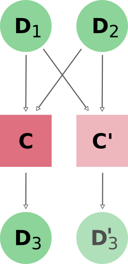

.. _caching:

*******
Caching
*******

Enabling caching
----------------

There are numerous reasons why you may need to re-run calculations you’ve already done before.
Since AiiDA stores the full provenance of each calculation, it can *detect* whether a calculation has been run before and reuse its outputs without wasting computational resources.
This is what we mean by **caching** in AiiDA.

This feature is not enabled by default. In order to enable caching:

 1. Place the following ``cache_config.yml`` file in your ``.aiida`` configuration folder
    in order to enable caching for your AiiDA profile (here called ``aiida2``):

    .. code:: yaml

        aiida2:
          default: True

 2. Run ``verdi -p aiida2 rehash`` in order to compute hashes of all nodes in your existing database.

From this point onwards, when you launch a new calculation, AiiDA will compute its hash (depending both on the type of calculation and its inputs, see :ref:`caching_matches`).
If another calculation with the same hash is found to be already present in the database, AiiDA will reuse its results without repeating the actual calculation.

.. _fig_caching:

  When reusing a cached calculation, AiiDA links up to the input nodes as usual, and copies both the calculation node **C** and its outputs **D3**.
  Note that AiiDA uses the *hashes* of the input nodes to match the calculation **C'**  will reuse a calculation **C** whenever the *contents* of the input notes even if the While this sketch shows **C'** reuse the input nodes of **C**, it is only the *content* of the input nodes (their hash) that matters.
  For calculation C' to be matched to the already completed calculation C one does not have to pass the exact same input nodes D1 and D2 when launching the calculation. Even completely "new" input nodes (D3 and D4 let's say) will work, as long as their computed hashed match those of D1 and D2 exactly.

In order to ensure that the provenance graph with and without caching is the same,
AiiDA creates both a new calculation node and a copy of the output data nodes as shown in :numref:`fig_caching`.

.. note:: Caching is **not** implemented at the WorkChain/workfunction level (see :ref:`caching_limitations` for details).

.. _caching_matches:

How are nodes hashed?
---------------------

By default (see also :ref:`devel_controlling_caching`), the hash of a Data node is computed from:

* all attributes of the node, except the ``_updatable_attributes`` and ``_hash_ignored_attributes``
* the ``__version__`` of the package which defined the node class
* the content of the repository folder of the node
* the UUID of the computer, if the node is associated with one

The hash of a :class:`~aiida.orm.ProcessNode` will, on top of this, include the hashes of any of its input ``Data`` nodes.

Once a node is stored in the database, its hash is stored in the ``_aiida_hash`` extra, and this extra is used to find matching nodes.
If a node of the same class with the same hash already exists in the database, this is considered a cache match.

Use the :meth:`~aiida.orm.nodes.Node.get_hash` method to check the hash of any node.

In order to figure out why a calculation is *not* being reused, the :meth:`~aiida.orm.nodes.Node._get_objects_to_hash` may be useful:

.. ipython::
    :verbatim:

    In [5]: calc=load_node(1234)

    In [6]: calc.get_hash()
    Out[6]: '62eca804967c9428bdbc11c692b7b27a59bde258d9971668e19ccf13a5685eb8'

    In [7]: calc._get_objects_to_hash()
    Out[7]:
    ['1.0.0b4',
     {'resources': {'num_machines': 2, 'default_mpiprocs_per_machine': 28},
      'parser_name': 'cp2k',
      'linkname_retrieved': 'retrieved'},
     <aiida.common.folders.Folder at 0x1171b9a20>,
     '6850dc88-0949-482e-bba6-8b11205aec11',
     {'code': 'f6bd65b9ca3a5f0cf7d299d9cfc3f403d32e361aa9bb8aaa5822472790eae432',
      'parameters': '2c20fdc49672c3505cebabacfb9b1258e71e7baae5940a80d25837bee0032b59',
      'structure': 'c0f1c1d1bbcfc7746dcf7d0d675904c62a5b1759d37db77b564948fa5a788769',
      'parent_calc_folder': 'e375178ceeffcde086546d3ddbce513e0527b5fa99993091b2837201ad96569c'}]

Configuration
-------------

Class level
...........

Besides an on/off switch per profile, the ``.aiida/cache_config.yml`` provides control over caching at the level of specific calculation or data classes:

.. code:: yaml

    profile-name:
      default: False
      enabled:
        - aiida.calculations.plugins.templatereplacer.TemplatereplacerCalculation
        - aiida.orm.nodes.data.str.Str
      disabled:
        - aiida.orm.nodes.data.float.Float

In this example, caching is enabled for ``TemplatereplacerCalculation`` and ``Str``, and disabled for all other classes.
Note that the fully qualified class import name (e.g., ``aiida.orm.nodes.data.str.Str``) must be provided, consisting of the module name and the class name.
You can construct it by hand or (usually) get it directly from the string representation of the class
(it is **not** the same as the type string stored in the database):

.. ipython::
    :verbatim:

    In [1]: Str.__module__ + '.' + Str.__name__
    Out[1]: 'aiida.orm.nodes.data.str.Str'

    In [2]: str(Str)
    Out[2]: "<class 'aiida.orm.nodes.data.str.Str'>"

Node level
...........

Even when caching is turned off for a given node type, you can manually enable caching by passing ``use_cache=True`` to the ``store`` method.

.. ipython::
    :verbatim:

    In [1]: from __future__ import print_function

    In [2]: from aiida.orm import Str

    In [3]: n1 = Str('test string')

    In [4]: n1.store()
    Out[4]: u'test string'

    In [5]: n2 = Str('test string')

    In [6]: n2.store(use_cache=True)
    Out[6]: u'test string'

    In [7]: print('UUID of n1:', n1.uuid)
    UUID of n1: 956109e1-4382-4240-a711-2a4f3b522122

    In [8]: print('n2 is cached from:', n2.get_cache_source())
    n2 is cached from: 956109e1-4382-4240-a711-2a4f3b522122

When running a :class:`~aiida.engine.processes.CalcJob` through the :meth:`~aiida.engine.run` or :meth:`~aiida.engine.submit` functions, you can achieve the same effect using the :class:`~aiida.manage.caching.enable_caching` context manager:

.. code:: python

    from aiida.manage.caching import enable_caching
    from aiida.engine import run
    from aiida.orm import CalcJobNode
    with enable_caching(node_class=CalcJobNode):
       run(...)

If you suspect a node is being reused in error (e.g. during development),
it is also possible to manually *prevent* a specific node from being reused:

1. Load one of the nodes you suspect to be a clone.
   Check that :meth:`~aiida.orm.nodes.Node.get_cache_source` returns a UUID.
   If it returns `None`, the node was not cloned.
2. Clear the hashes of all nodes that are considered identical to this node:

    .. code:: python

        for n in node.get_all_same_nodes():
            n.clear_hash()
3. Run your calculation again. The node in question should no longer be reused.

.. _caching_limitations:

Limitations
-----------

#. Workflow nodes are not cached. In the current design this follows from the requirement that the provenance graph be independent of whether caching is enabled or not:

   * **Calculation nodes:** Calculation nodes can have data inputs and create new data nodes as outputs.
     In order to make it look as if a cloned calculation produced its own outputs, the output nodes are copied and linked as well.
   * **Workflow nodes:** Workflows differ from calculations in that they can *return* an input node or an output node created by a calculation.
     Since caching does not care about the *identity* of input nodes but only their *content*, it is not straightforward to figure out which node to return in a cached workflow.

   For the moment, this limitation is acceptable since the runtime of AiiDA WorkChains is usually dominated by expensive calculations, which are covered by the current caching mechanism.

#. The caching mechanism for calculations *should* trigger only when the inputs and the calculation to be performed are exactly the same.
   Edge cases where this assumption might be violated include cases where the calculation parser is in a different python module than the calculation and the developer made changes without updating the version number of the plugin.

#. While caching saves unnecessary computations, the current implementation does not yet save disk space:
   The output nodes of the cached calculation are full copies of the original outputs.
   The plan is to add data deduplication as a global feature at the repository and database level (independent of caching).
