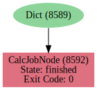
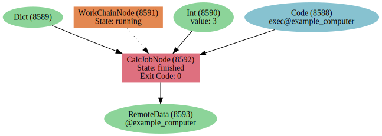
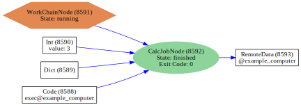

.. this document was created by ipypublish -f sphinx_ipypublish_all

.. _VisualizingGraphs:

Visualizing Provenance Graphs
=============================

.. note::

    This tutorial can be downloaded and run as a Jupyter Notebook:
    :download:`visualising_graphs.ipynb`

The provenance graph of a database can be visually inspected, *via*
`graphviz <https://www.graphviz.org/>`__, using both the python API and
command-line interface.

.. seealso::

    ``verdi graph generate -h``

We first load the database and required modules:

.. code:: python

    from aiida import load_profile
    profile = load_profile()

    from aiida.common import LinkType
    from aiida.orm.utils.links import LinkPair
    from aiida.backends.tests.utils.archives import get_archive_file
    from aiida.tools.visualization import Graph, pstate_node_styles

The example provenance graph, used in this tutorial, can then be
imported into the database:

.. code:: ipython

    archive_path = get_archive_file('graph1.aiida', 'graphs')
    !verdi import -n {archive_path}

.. code:: python

    dict1_uuid = '0ea79a16-501f-408a-8c84-a2704a778e4b'
    calc1_uuid = 'b23e692e-4e01-48dd-b515-4c63877d73a4'

The :py:class:`~aiida.tools.visualization.graph.Graph` class is used to
store visual representations of the nodes and edges, which can be added
separately or cumulatively by one of the graph traversal methods. The
:py:attr:`~aiida.tools.visualization.graph.Graph.graphviz` attribute
returns a
`graphviz.Digraph <https://graphviz.readthedocs.io/en/stable/>`__
instance, which will auto-magically render the graph in the notebook, or
can be used to save the graph to file.

.. code:: python

    graph = Graph()
    graph.add_node(dict1_uuid)
    graph.add_node(calc1_uuid)
    graph.graphviz

.. figure:: visualising_graphs_files/output_9_0.svg
    :alt: output_9_0
    :align: center

.. code:: python

    graph.add_edge(
        dict1_uuid, calc1_uuid,
        link_pair=LinkPair(LinkType.INPUT_CALC, "input1"))
    graph.graphviz

.. code:: python

    graph.add_incoming(calc1_uuid)
    graph.add_outgoing(calc1_uuid)
    graph.graphviz

The :py:class:`~aiida.tools.visualization.graph.Graph` can also be
initialized with global style attributes, as outlined in the `graphviz
attributes table <https://www.graphviz.org/doc/info/attrs.html>`__.

.. code:: python

    graph = Graph(node_id_type="uuid",
                  global_node_style={"penwidth": 1},
                  global_edge_style={"color": "blue"},
                  graph_attr={"size": "6,6!", "rankdir": "LR"})
    graph.add_incoming(calc1_uuid)
    graph.add_outgoing(calc1_uuid)
    graph.graphviz

.. figure:: visualising_graphs_files/output_13_0.svg
    :alt: output_13_0
    :align: center

Additionally functions can be parsed to the
:py:class:`~aiida.tools.visualization.graph.Graph` initializer, to specify
exactly how each node will be represented. For example, the
:py:func:`~aiida.tools.visualization.graph.pstate_node_styles` function
colors process nodes by their process state.

.. code:: python

    def link_style(link_pair, **kwargs):
        return {"color": "blue"}

    graph = Graph(node_style_fn=pstate_node_styles,
                  link_style_fn=link_style,
                  graph_attr={"size": "6,6!", "rankdir": "LR"})
    graph.add_incoming(calc1_uuid)
    graph.add_outgoing(calc1_uuid)
    graph.graphviz

Edges can be annotated by one or both of their edge label and link type.

.. code:: python

    graph = Graph(graph_attr={"size": "6,6!", "rankdir": "LR"})
    graph.add_incoming(calc1_uuid,
                       annotate_links="both")
    graph.add_outgoing(calc1_uuid,
                       annotate_links="both")
    graph.graphviz

The :meth:`~aiida.tools.visualization.graph.Graph.recurse_descendants`
and :meth:`~aiida.tools.visualization.graph.Graph.recurse_ancestors`
methods can be used to construct a full provenance graph.

.. code:: python

    graph = Graph(graph_attr={"size": "8,8!", "rankdir": "LR"})
    graph.recurse_descendants(
        dict1_uuid,
        include_process_inputs=True,
        annotate_links="both"
    )
    graph.graphviz

.. figure:: visualising_graphs_files/output_19_0.svg
    :alt: output_19_0
    :align: center

The link types can also be filtered, to view only the ‘data’ or
‘logical’ provenance.

.. code:: python

    graph = Graph(graph_attr={"size": "8,8!", "rankdir": "LR"})
    graph.recurse_descendants(
        dict1_uuid,
        include_process_inputs=True,
        annotate_links="both",
        link_types=("input_calc", "create")
    )
    graph.graphviz

.. figure:: visualising_graphs_files/output_21_0.svg
    :alt: output_21_0
    :align: center

.. code:: python

    graph = Graph(graph_attr={"size": "8,8!", "rankdir": "LR"})
    graph.recurse_descendants(
        dict1_uuid,
        include_process_inputs=True,
        annotate_links="both",
        link_types=("input_work", "return")
    )
    graph.graphviz

.. figure:: visualising_graphs_files/output_22_0.svg
    :alt: output_22_0
    :align: center
